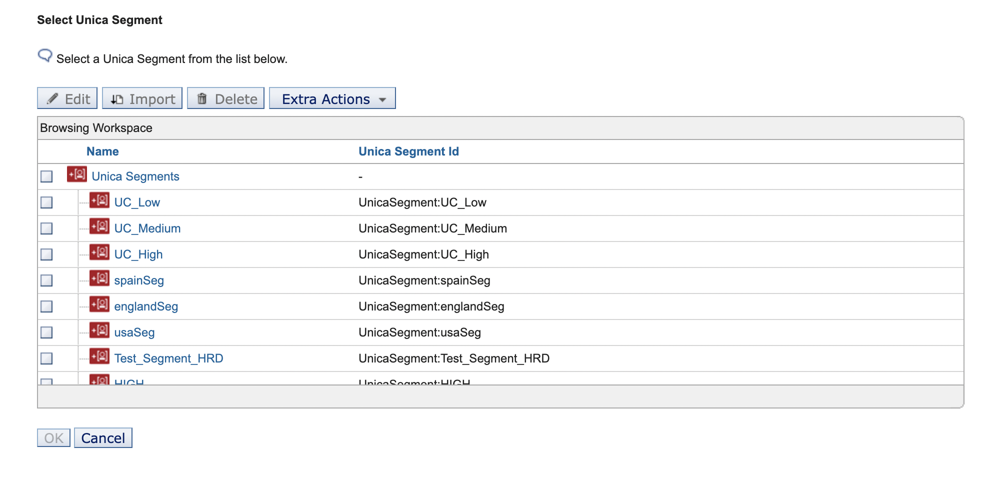
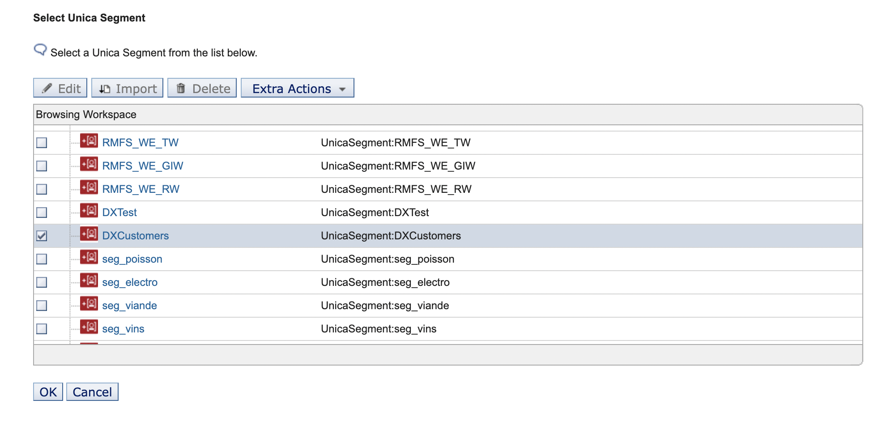

# Unica Segment Picker for leveraging segments in PZN Rules
In this document, we outline the usage of the new Unica segment picker with steps to pick Unica segments while creating PZN rules.

## Prerequisites
Use the prerequisite to configure the Unica segment picker in PZN rules [Out-of-box application object for shipping Unica with PZN](../pzn_unica_integration/out_of_box_method.md) using the ConfigEngine task.

## Unica Segment Picker
The Unica Segment Picker helps customers retrieve Unica segments directly in the PZN UI. The PZN UI shows the available segments so that customers do not have to remember the exact name of the segments.

## Leveraging the Unica segment picker while creating rules
1. Create a Rule and add the attribute of the Application Object created in the [Out-of-box application object for shipping Unica with PZN](../pzn_unica_integration/out_of_box_method.md). It shows the variable added in the loaded Application Object.

2. After selecting the attribute, click the **value** dropdown menu and click **Select Unica Segment**.

     - The **Select Unica segment** window lists all the Unica Campaign segments retrieved from Unica.
    

3. Select the Unica segment value to add against the condition in the rule and click **OK**.

     - Once the segment is selected, the value is returned to the **Personalization Editor**.
    

4. Save the rule created.

5. Preview the result in the **Preview** tab of the navigator for the rule created.

