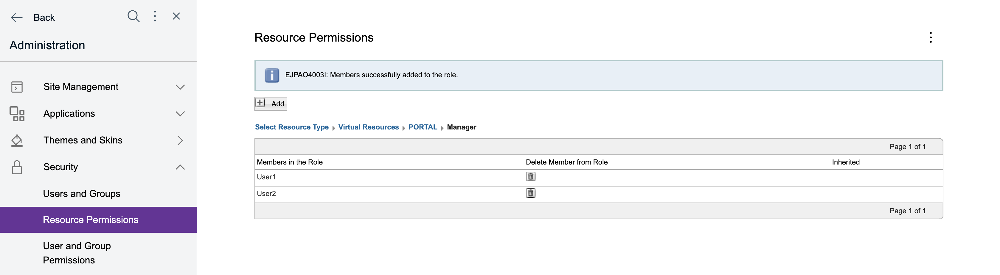
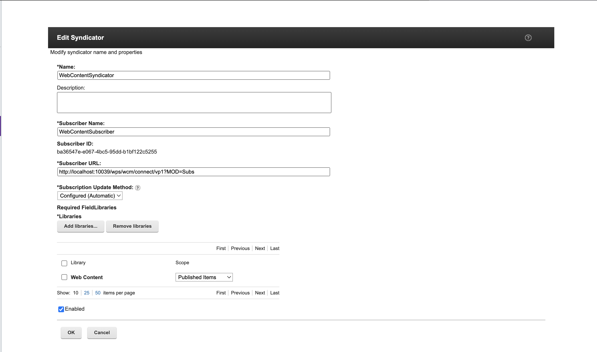
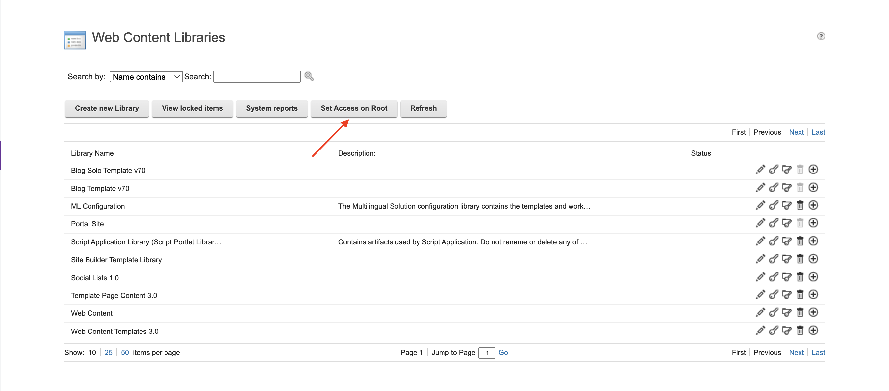

# Allowing delegated access for syndication

Business users may want the ability to administer syndicators. Until delegated access for syndication was included in the product, users had to be given an Administrator role on the WCM Libraries Content Root in order to administer syndicators, but this also gave those users access to all libraries which may be undesirable. It is now possible to assign access to individual syndicators to specific delegated users. 

If this feature is enabled, users having at least Manager access are eligible to see the syndicators they have access to and be able to test the syndicator, update the syndicator and list the pending items. In order for a user to have access to a syndicator, they must have Administrator access on all of the libraries listed in the syndicator.

In addition, the REST calls for `/wcmrest/Syndication/Syndicators` and `/wcmrest/Syndicator/{uuid}/Status` are available to the user.

## Setting up delegated access for syndication

To assign delegated access for a specific user, do the steps in the following sections.

### Assigning a user Manager access to the PORTAL Virtual Resources

Assign the user Manager access to the PORTAL Virtual Resources using the Resource Permission portlet in the Portal Administration. Navigate to Resource Type > Virtual Resources > PORTAL and edit the Manager role.

 

 In this example, User1 and User2 have been given access.

 

### Setup a resource environment provider property 

Setup a resource environment property in the WCM WCMConfigService. This property is used to indicate to the Portal that delegated access is enabled and it must be set to "true" for the function to be available (the default for the property is "false"). This property allows the function to be available for all users (it is not user specific).

1.  Log on to the WebSphere® Integrated Solutions Console.

2.  Go to **Resources > Resource Environment > Resource environment providers > WCM WCMConfigService**.

3.  Select **Custom Properties**.

4.  Select **New**.

5.  Enter a name of "enableSyndicatorFilter".

6.  Enter a value of "true". 

7.  Select **OK**.

8.  Save the changes.

9.  Restart the portal.

### Library Administrator access
 
Give the user Administrator access to ALL of the libraries in the syndicator pair they will manage. This must be done to enable the user to administer the syndicator pair.

In this example, a new syndicator, WebContentSyndicator, has been created that includes the WCM Web Content library.

To give User1 Administrator access to the library use the Web Content Libraries portlet and select the wrench to set permissions on the Web Content library.

The Resource Permissions portlet will be invoked and users can be added by editing the Administrator role.

In this example, only User1 is given Administrator access on the library.

### WCM libraries root access

Give the user Manager access on the WCM Libraries Content Root on the server you are syndicating using the "Set Access on Root" button in the Web Content Library portlet. Giving the user Manager access on the WCM Libraries Content Root gives them Manager access on all of the libraries, however, it is possible to block the Manager access on libraries that should not be administered by this user (unlike giving the user Administrator access which cannot be blocked).

The Resource Permissions portlet will be invoked and users can be added by editing the Manager role.

In this example, only User1 is given Manager access on the WCM Libraries Content Root.

## Results of setting up delegated access for syndication

In the example above, setup for delegated access was completed for User1, but not for User2. 

As a result, User1 will be able to view the syndicator.

But the syndicator will not be in the list for User2. 

<!--
**Parent topic:**[How to manage syndicators and subscribers](../panel_help/wcm_syndication.md) -->

<!-- ???+ info "Related information:"
    - [Syndication](../index.md) -->

