# Way to Publish Onesite Page Workflow 

The Onesite Page Workflow is being used in combination with the page templates to ensure pages are created within a project.
In HCL DX (Digital Experience), if a page template is used with an associated workflow that is not the default, then any page created from that template must be part of a project.

Procedure:

For a new page, create or use an existing workflow. Different workflows are used with different page templates. For example, the approval process for a page used to deploy applications are different from a pure content based page.

!!! Important
    Users with Privileged User access can personalize a page by adding content or by making other customizations to the page. Because Privileged User access is inherited by pages by default, your custom workflow can be bypassed by users with this access. If you want to ensure that users can update the page only through the workflow, disable the inheritance of Privileged User access for the page.

Create a project to for creating the page template. This project is specifically needed to assign the workflow to the page template inside the CMS. It will be published and new pages do not need to be a part of this initial project.

!!! note
    Because you can set a workflow only on draft items, you must create the template as a draft in the context of a project. After you add your custom workflow to the draft, publish the draft to make the page template available.

1. Create a new project for associating the workflow to the page template or to change the used workflow. 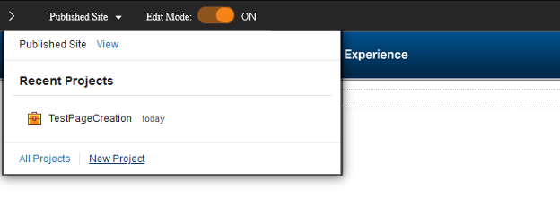
2. Open the applications menu and select **Administration**. 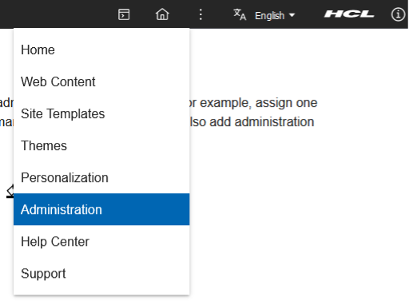
3. Make sure you are in the appropriate project. 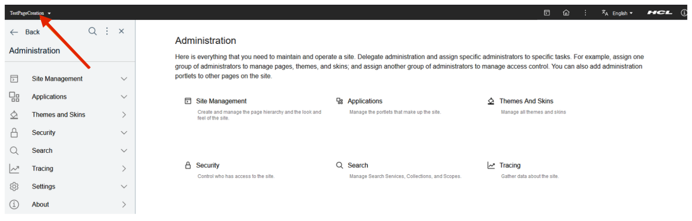
4. Go to **Administration > Site Management > Page Templates**. 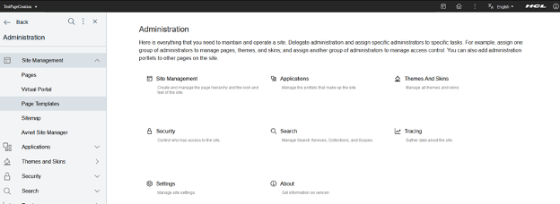
5. On the page templates page, show the site toolbar and ensure you are in edit mode. 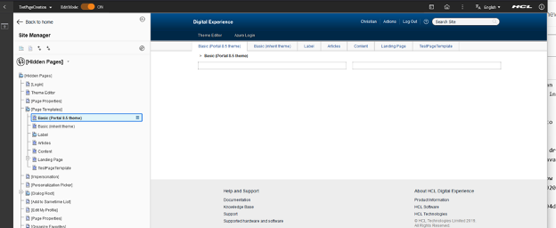
6. Click on the template you want to add a workflow on or create a new page template and access **Open Page Settings**. 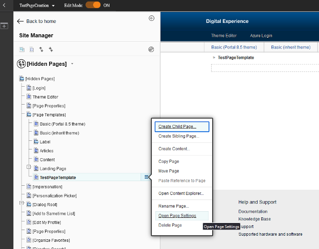
7. Click on **Edit Page Properties**. 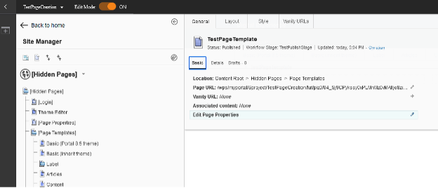
8. Select the **Security** tab and select the appropriate workflow. 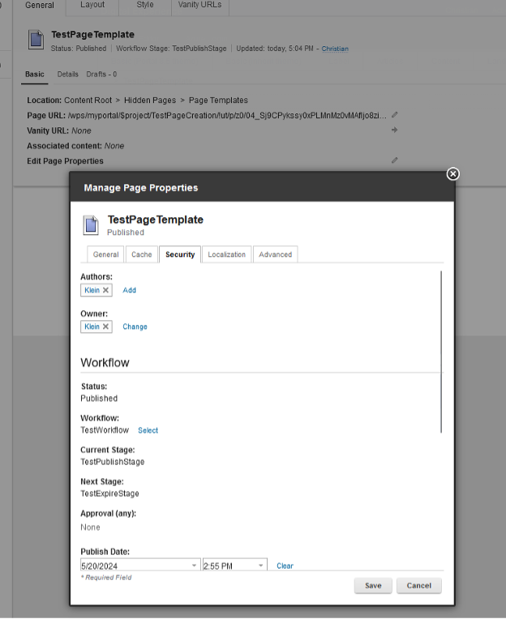
9. Publish and approve the page template and project. 
    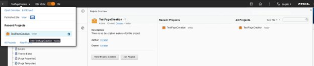
    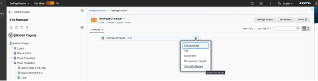
    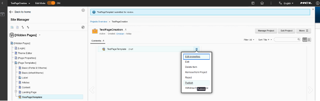
    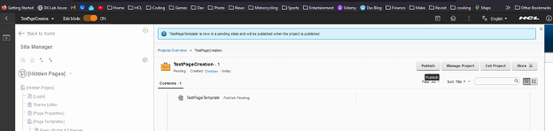
10. Now if someone tries to use the template to create a new page outside a project, the system will block the page creation and show a warning. 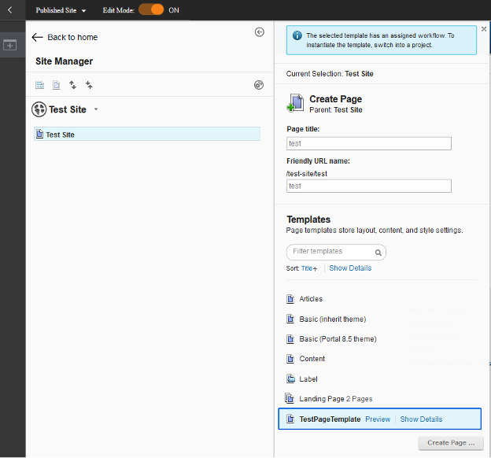