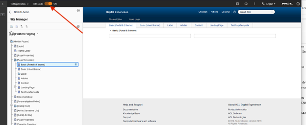

#  Prohibit a page from creating outside of a WCM project using page templates

In HCL DX (Digital Experience), if a page template is used with an associated workflow that is not the default, then any page created from that template must be part of a project.

!!! Important
    Users with Privileged User access can personalize a page by adding content or by making other customizations to the page. The Privileged User access is inherited by pages by default, your custom workflow can be bypassed by users with this access. If you want to ensure that users can update the page only through the workflow, disable the inheritance of Privileged User access for the page.

To create a new page use an existing workflow or create a new workflow. Different workflows are used with different page templates. For example, the approval process for a page used to deploy applications are different from a content based page.
Because you can set a workflow only on draft items, you must create the template as a draft in the context of a project. After you add your custom workflow to the draft, publish the draft to make the page template available.

1. Create a new project to use for associating the workflow to the page template or to change workflow being used.

    

2. Open the applications menu and select **Administration**.

    

3. Make sure you are in the appropriate project.

    

4. Go to **Administration > Site Management > Page Templates**.

    

5. On the Page Templates page, make sure you are in Edit Mode.

    

6. Click on the template you want to add a workflow on or create a new page template. Access **Open Page Settings**.

    

7. Click **Edit Page Properties**.

    

8. Go to the **Security** tab and select the appropriate workflow.

    

9. Publish and approve the page template and project.

    1. Select the created page template.

        

    2. Click on the menu bar and select "Submit for Review".

        

    3. Click on the menu bar and select "Publish".
        
        

        The newly crated page template is now in publishing state.

        
    
After publishing the new page template, if a user tries to use the template to create a new page outside a project, the system blocks the page creation and shows a notification saying that the template has an assigned workflow.

