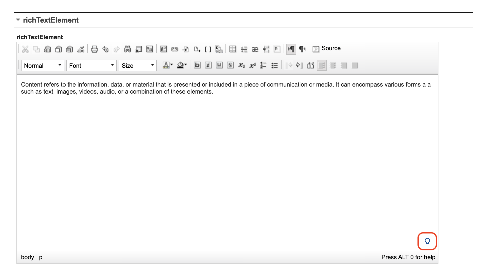
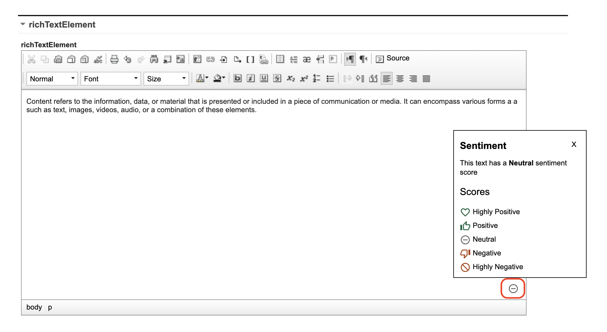
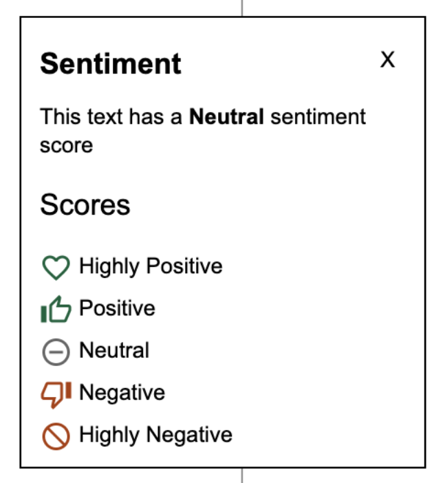
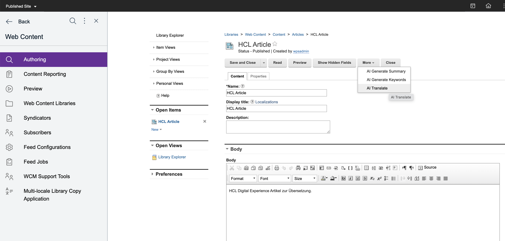
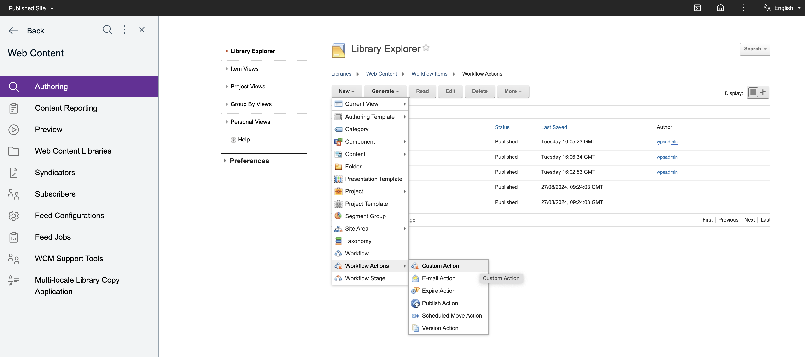
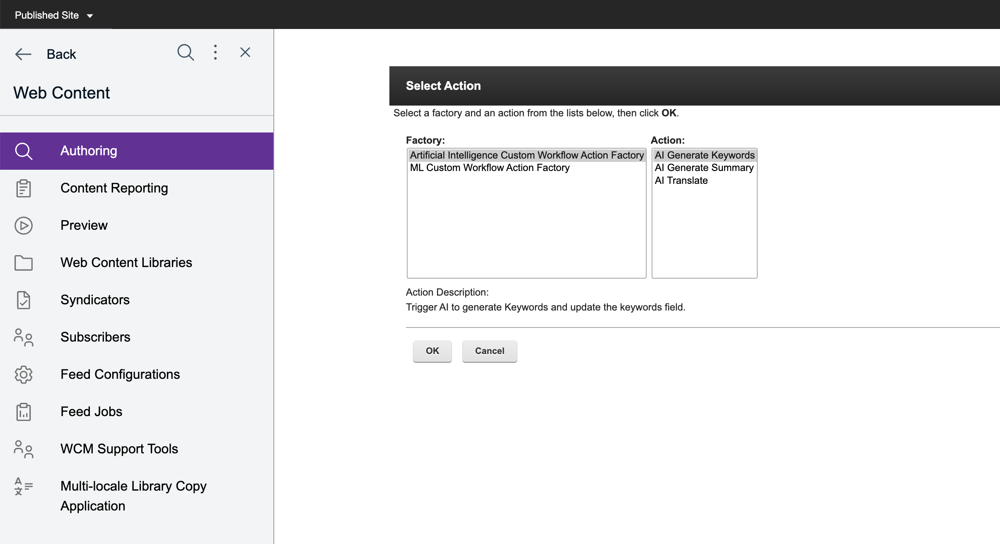
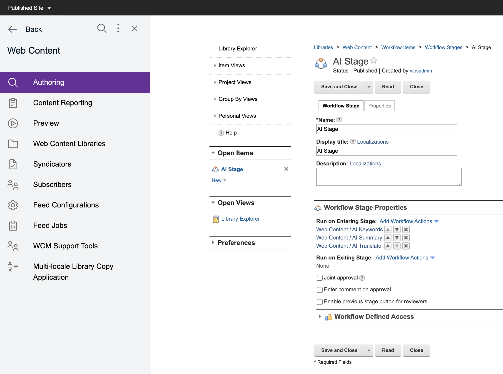

# AI assistance for descriptions, keyword generation, translation, and sentiment analysis in a content item

This section provides the steps on how to use AI assistance for generating descriptions, keywords, translation, and getting sentiment analysis on content elements.

## Prerequisite

Before you can use AI-assisted features for sentiment analysis of content, keyword extraction from content, and auto summarization of content element, refer to the following steps to enable AI Analysis:

- [Web content AI analysis for Kubernetes Deployment](../../../../../get_started/plan_deployment/container_deployment/wcm_content_ai_analysis.md)
- [Web content AI analysis for traditional deployment](../../../../../get_started/plan_deployment/traditional_deployment/wcm_env/wcm_ai_analysis.md)

## Using AI-assisted summarization of content element

1. Fill in at least one text element (for example, rich text, text, or short text) in the **Content** tab of the content item.

2. Click the **More** button in the toolbar, then click **AI Generate Summary**. The generated description is based on the content provided in the content element. The generated description replaces any existing description, if present.

    
    

3. Select **Save** or other **Save** options to save your updates.

## Using AI-assisted keyword extraction on content elements

1. Fill in at least one text element (for example, rich text, text, or short text) in the **Content** tab of the content item.

2. Click the **Show Hidden Fields** button in the toolbar.

    

3. Click the **More** button in the toolbar, then click **AI Generate Keywords**. The extracted keywords are based on the content provided in the content item. The AI-generated keywords will not overwrite the existing keywords but they will append to it.

    

4. Click the **Properties** tab then expand the **Profile** section to view the extracted keywords.

    

5. Select **Save** or other **Save** options to save your updates.

## Using AI-assisted sentiment analysis of content element

1. Fill in any of text elements (for example, rich text, text, or short text) of the content item.

2. Click the **Analyze Sentiment** icon located in the lower right corner of the text element. 

    
    
    A sentiment analysis result is returned based on the analysis of the content of the text element. The sentiment analysis result is represented by an icon on the **Body** field.
    
    

3. Click the sentiment result icon to see more details about the result.

    

## Using AI-assisted translation of content items

1. In the **Content** tab of the content item, fill in at least one text element (for example, rich text, text, or short text).

2. Click the **Show Hidden Fields** button in the toolbar.

    

3. Click the **More** button in the toolbar, then click **AI Translate**. The target language is the language configured for the library the item is in. If the item is not saved yet the default language of the installation is used.

    

5. Click **Save and Close** or select other **Save** options to save your updates.

## Using AI Workflow Actions

Starting CF224, you can use AI Workflow Actions to generate keywords, summary, or translate content.

1. To define the custom workflow action in WCM Authoring, go to **New > Workflow Action > Custom Action**.
          
2. In the **Name** field, enter a name for the custom action. 
3. Click **Select Action**.
4. Select an action from **Artificial Intelligence Custom Workflow Action Factory** and click **OK**.

               

3. Give the workflow action a name and save.

4. You can then use the workflow action (or actions) inside a workflow stage like in the sample below:

