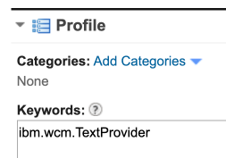
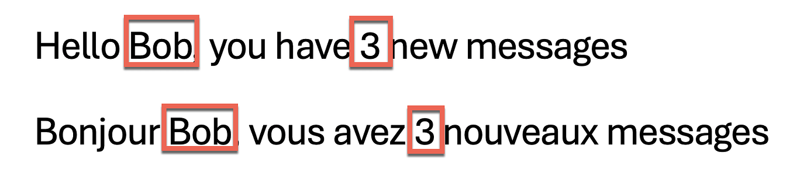

# Content plug-ins


Content plug-ins are used with the current content item.

-   **Analytics Data plug-in**

    -   This plug-in writes information suitable for active site analytics.
    -   For example: `[Plugin:AnalyticsData property="title" css-class="asa.wcm.content_item.title"]`

-   **Copy Text plug-in**

    -   This plug-in writes text once or multiple times.
    -   The syntax of the plug-in is `[Plugin:CopyText text="" count="" separator="" format="trim | tolower | toupper" escape="xml | json | none"]`.

-   **If List Index plug-in**

    -   This plug-in writes the enclosed body markup based on counting where the current item is positioned in the rendering of a Menu, Navigator, Search, Personalization, or Taxonomy component. The plug-in renders the body if the current count is between the specified numbers, subject to the value of 'by'. The first item in the list has count 1. The `from` and `to` value can be omitted if no lower or upper bound is required.

    -   For example:
        -   `[Plugin:ifListIndex is='2']` renders the body for the second item.
        -   `[Plugin:ifListIndex from='2']` renders the body for all items from the second onwards.
        -   `[Plugin:ifListIndex to='3']` renders the body for all items up to the third.
        -   `[Plugin:ifListIndex from='2' to='8']` renders the body for items from the second to the eighth.
        -   `[Plugin:ifListIndex from='1' by='2']` or `[Plugin:ifListIndex by='odd']` renders the body for all odd items.
        -   `[Plugin:ifListIndex from='2' by='2']` or `[Plugin:ifListIndex by='even']` renders the body for all even items.

-   **If Count Index plug-in**

    -   This plug-in is similar to the IfListIndex Plug-in. It writes the enclosed body markup based on counting where the current item is positioned in the rendering of a Menu, Navigator, Search, Personalization, or Taxonomy component that render the IfCountIndex plug-in. However, it only counts the items that are visible in a Menu, Navigator, Search, Personalization, or Taxonomy component. The plug-in renders the body if the current count is between the specified numbers, subject to the value of `by`. The first item in the list has count 1. The `from` and `to` value can be omitted if no lower or upper bound is required.

    -   For example:
        -   `[Plugin:ifCountIndex is='2']` renders the body for the second counted item.
        -   `[Plugin:ifCountIndex from='2']` renders the body for all counted items from the second content item onwards.
        -   `[Plugin:ifCountIndex to='3']` renders the body for all counted items up to the third counted item.
        -   `[Plugin:ifCountIndex from='2' to='8']` renders the body for counted items from the second to the eighth.
        -   `[Plugin:ifCountIndex from='1' by='2']` or `[Plugin:ifCountIndex by='odd']` renders the body for all odd counted items.
        -   `[Plugin:ifCountIndex from='2' by='2']` or `[Plugin:ifCountIndex by='even']` renders the body for all even counted items.

    |Item|IfCountIndex Tag Rendered in list|Count method used by the **If List Index Plug-in**|Count method used by the **If Content Index Plug-in**|
    |----|---------------------------------|--------------------------------------------------|------|
    |Item 1|No|1|None|
    |Item 2|Yes|2|1|
    |Item 3|Yes|3|2|
    |Item 4|No|4|2|

-   **JavaScript and XML Encode plug-in**

    -   This plug-in encodes JavaScript or XML.
    -   For example: `[Plugin:jsencode enc="js|xml|jsxml" value="myValue"]`

-   **Ratings plug-in**

    -   This plug-in provides support for rating options for content item.
    -   For example: `[Plugin:ratings]`

-   **Remote Action plug-in**

    -   Used to create a URL for a remote authoring action.
    -   For example: `[Plugin:RemoteAction action="edit" useCurrentContext="true" dialog="true"]`

-   **Tags plug-in**

    -   This plug-in provides tagging support for content items.
    -   For example: `[Plugin:tags]`

-   **Text Provider plug-in**

    -   Used to write a value from a text provider.
    -   The syntax of the plug-in is `[Plugin:TextProvider provider="" key="" defaultValue="" param.0="" param.1="" param.X=""]` where the `provider` parameter must be set to the name of the text provider, and the `key` parameter set to the key that should be retrieved.
    -   If no provider is set, the plug-in uses the text provider that is set for the title of the current content.
    -   The optional parameter `defaultValue` can be used to set a value that is written if the text provider does not return a result. Otherwise, nothing is written by this plug-in.
    -   Placeholders in the text are replaced with the values of all optional parameters that are specified in the plug-in tag.
    -   From CF09, you can also use the tag alias of `Localize` for this tag. This can be more applicable when you use this tag purely to render localized text. For example: `[Plugin:Localize provider="translated" key="title"]`.
    -   If you intend to use the TextProvider plug-in tag more than once in a component design or presentation template design, you can specify the default text provider name path in one tag:
        ```
        [Plugin:TextProvider defaultProvider="library/sitearea/contentitem"]
        ```

        You can then leave out the provider parameter in the tags that follow the default provider tag:

        ```
        [Plugin:TextProvider defaultProvider="library/sitearea/contentitem"]
        [Plugin:TextProvider key="key1"]
        [Plugin:TextProvider key="key2"]
        [Plugin:TextProvider key="key3"]
        ```

        The default provider is applied in all presentation template designs and component designs, including component designs that are included by using the tags, such as a component tag.

        To remove the default provider, use:

        ```
        [Plugin:TextProvider defaultProvider=""]
        ```

     **Use Localized Text from Text Providers**

     You can retrieve localized text using the `Localize` plugin:
     `[Plugin:Localize provider="<provider>" key="<key>" defaultValue="" param.0="" param.1="" param.X=""]` 
     

Text providers can be managed by developers using National Language Support (NLS) files or directly as web content. When managed in Web Content, business users can easily translate and maintain text. To enable this, the text provider content items or site areas must include the keyword `ibm.wcm.TextProvider`.




Next, create a set of text elements for each language used on your site, using the appropriate language code (for example, `en` for English and `fr` for French). Enter the translated text in each field using the format:
`keyname=translated-text`
Use consistent key names for each language, following the Java Properties File Format.  

Example: managing all translations for the intranet in English and French:

**When No Provider Is Specified**

     If you do not set a provider, the plugin uses the Text Provider associated with the current content item’s title.

**Set a Default Provider**

If you use the plugin multiple times, you can set a default provider and omit the `provider` parameter in later calls. For example:

`[Plugin:Localize defaultProvider="library/sitearea/contentitem"]`
`[Plugin:Localize key="keyname1"]`

---

### Using Text Providers in Your Design 

You can use the **Content plugin Localize** or the **TextProvider tag** (Localize is an alias of TextProvider):
`[Plugin:Localize provider=”” key=”” defaultValue=”” param.0=”” param.1=”” param.X=””]`
or
`[Plugin:TextProvider provider=”” key=”” defaultValue=”” param.0=”” param.1=”” param.X=””]`
- **provider**: path to the Text Provider content, site area, or UUID  
- **key**: name of the translated text key  
- **defaultValue** (optional): value if no translation is found  
- **param.X**: parameters by number, e.g., `param.0`, `param.1`

Example:
`[Plugin:Localize key=“welcome” provider=“library/sitearea/contentitem” defaultValue=“Hi”]`

Parameters example:
`[Plugin:Localize key=“welcomeUser” provider=“Global/Texts/MsgTranslations” param.0=“Bob” param.1=“3”]`
- English locale: `Hello Bob, you have 3 new messages`  
- French locale: `Bonjour Bob, vous avez 3 nouveaux messages`

---
### Managing Text Providers

HCL Digital Experience Web Content Management supports multilingual content. You can manage multilingual texts in your design, such as Presentation Templates and Components, as well as in Script Applications or external applications, using text providers.

#### How Text Providers Work

Text providers store all translation strings and support parameters. For example, you can create a welcome message:
`‘Hello, <first name>, you have <number of new messages> new messages`

- `<first name>` is replaced with the user’s first name.  
- `<number of new messages>` is replaced with the user’s unread message count.  
- The message can be translated into any language, and parameters can be reordered for each language.

{ width="500" }<br>
{ width="500" }<br>

- You can use parameters with `{}` to reference parameter numbers.
Text providers can be managed in two ways:

1. By developers using National Language Support (NLS) files.  
2. Directly in web content, where business users can translate and manage text easily.
3. To manage text providers in web content, ensure the content items or site areas include the keyword:`ibm.wcm.TextProvider`
{ width="500" }
4. Next, create text elements for each language using the correct language code (for example, `en` for English, `fr` for French). Enter translated text in each field using the format:
`keyname=translated-text`
5. Use consistent key names for each language, following the Java Properties File Format. You can also use parameters with `{}` referencing parameter numbers.

#### Using Text Providers in Your Design

You can use the **Content plugin Localize** or the **TextProvider tag** (Localize is an alias for TextProvider):

```text
[Plugin:Localize provider="" key="" defaultValue="" param.0="" param.1="" param.X=""]
[Plugin:TextProvider provider="" key="" defaultValue="" param.0="" param.1="" param.X=""]
```
### Localizing Fields

Some fields support localized text. Click the **Localizations** link next to the field title to:

- Select the content item or site area where the translated text is stored.  
- Choose the key name.

This allows content authors to automatically localize fields such as **Display Title**.


## Additional information

These topics contain additional information for some of these plug-ins.

-   **[Remote action plug-in](wcm_dev_renderplugins_remote.md)**  
Learn how to use the RemoteAction plug-in to reference remote actions from your web content. Remote actions are used to run actions, such as creating and editing items and generating views.
-   **[Using the analytics data rendering plug-in tag](sa_asa4wcm_plugin.md)**  
Learn how to use the AnalyticsData rendering plug-in tag to inject microformats for Active Site Analytics into your web content.
-   **[Tagging and rating plug-ins for web content](../content_plugins/tagging_rating_plugins/index.md)**  
Learn how to tag and rate portal resources, such as pages and portlets. You can also tag and rate content items that were generated with HCL Web Content Manager and are shown with the web content viewer. Two plug-in components are available to support the tagging and rating of content items in your web content system. You can add the `[Plugin:tags]` component and `[Plugin:ratings]` component in a presentation template to quickly integrate tagging and rating widgets into the current content item.


## HCLSoftware U learning materials

To learn more details on how to develop with HCL Digital Experience (DX) Web Content, go to the [Web Content Development lesson in the HCL Digital Experience for Developers (Intermediate)](https://hclsoftwareu.hcltechsw.com/component/axs/?view=sso_config&id=3&forward=https%3A%2F%2Fhclsoftwareu.hcltechsw.com%2Fcourses%2Flesson%2F%3Fid%3D3500){target="_blank"} course. You can try it out using the [Web Content Development Lab](https://hclsoftwareu.hcltechsw.com/images/Lc4sMQCcN5uxXmL13gSlsxClNTU3Mjc3NTc4MTc2/DS_Academy/DX/Developer/HDX-DEV-200_Web_Content_Development.pdf){target="_blank"} and corresponding [Web Content Development Lab Resources](https://hclsoftwareu.hcltechsw.com/images/Lc4sMQCcN5uxXmL13gSlsxClNTU3Mjc3NTc4MTc2/DS_Academy/DX/Developer/HDX-DEV-200_Web_Content_Development_Lab_Resources.zip){target="_blank"}.

