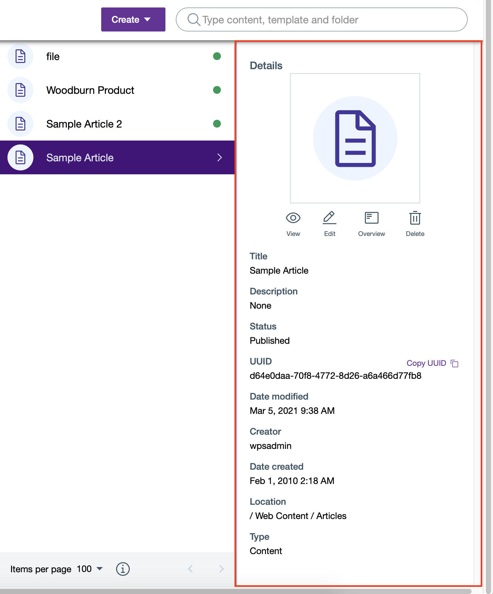

# Access and search content and content templates

This section provides the steps on how to access HCL Content Composer and use it to search, author, and manage content and content templates.

## Prerequisite

Content Composer should be installed and configured to HCL Digital Experience 9.5 container release update CF181 or higher. See instructions to install to supported container environments in the [Install HCL Digital Experience 9.5 Components](../installation/install_config_cc_dam.md) topic.

Content Composer is accessible from the Practitioner Studio interface (after image configuration to your HCL Digital Experience 9.5 CF181 and higher deployment).

## Access content and content templates with Content Composer

Follow the instructions below to access content with the HCL Digital Experience 9.5 Content Composer from the Practitioner Studio.

1.  Log in to your HCL Digital Experience 9.5 platform, and select **Web Content** from the Practitioner Studio navigator.

    

2.  Select **Content Composer** from the **Web Content** menu to access the HCL Digital Experience 9.5 Content Composer user interface (Dashboard).

    

See the [Access control levels for Content Composer authors and editors](../configuration/access_control_levels_author_editor.md) topic for more information about user role-based abilities to manage specific content create, edit, update, and delete tasks in HCL Content Composer.

## The HCL Content Composer Dashboard

The HCL Content Composer Dashboard has the following components:

-   **Main header** - This contains the HCL Content Composer **Create** content actions and content item Search Bar.
-   **Content collections column** - This shows the content collections inside the HCL Content Composer library in a cascading menu system. When you select a collection, sub-collections are displayed off to the right side when applicable.
-   **Metadata column** - This shows the details of a selected content or content template, which includes:

    -   Content title

    -   Content icon that represents the content's file type

    -   Content description

    -   Content Status

    -   Content UUID

    -   Date last modified

    -   Date created

    -   Content author

    -   Content location

    -   Content type

    

    Content users can also access view, editing and delete options of the selected content or content template in this column.

    

    -   Documentation resource: [Author and manage content items](./author_and_manage_content_items/index.md)
    -   Documentation resource: [Author and manage content templates](./author_and_manage_content_templates/index.md)

## Search content and content templates with Content Composer

Follow the instructions below to search for content with the HCL Digital Experience 9.5 Content Composer from the Practitioner Studio.

1.  Log in to your HCL Digital Experience 9.5 platform and select **Web Content > Content Composer** from the Practitioner Studio navigator.

2.  From **Content Composer**, type in and enter the content you are looking for on the Search Bar to view. Content Composer will display all search results related to the keyword or keywords you entered.

    In the example below, the Search Results page displays all content results related to the keyword “Article”. Click **X** to collapse the **Web Content** menu and view the Search Results in full.

     
    
    

3.  When you select a single content item from Search Results, the content **Edit**, **Delete** and **Overview** buttons will be displayed on the Main Header and on the right side along the selected content item.

    

    When you select a single content template from Search Results, the **Edit**, **Delete** and **Create Content** buttons for the selected content will be displayed on the Main Header.

    

    If you select more than one content item and/or content template, only the **Delete** button will be displayed on the Main Header for the selected content items.

    !!!note
        This action is not applicable for workflow items.

    

<!--
## HCL Digital Experience Solution Feedback

HCL Digital Experience is interested in your experience and feedback working with HCL Digital Experience 9.5 release software. To offer comments or issues on your findings, please access the [HCL Digital Experience 9.5 Feedback Reporting application](https://www.hclleap.com/apps/secure/org/app/158bbc7c-f357-4ef0-8023-654dd90780d4/launch/index.html?form=F_Form1){:target="_blank"}. -->

