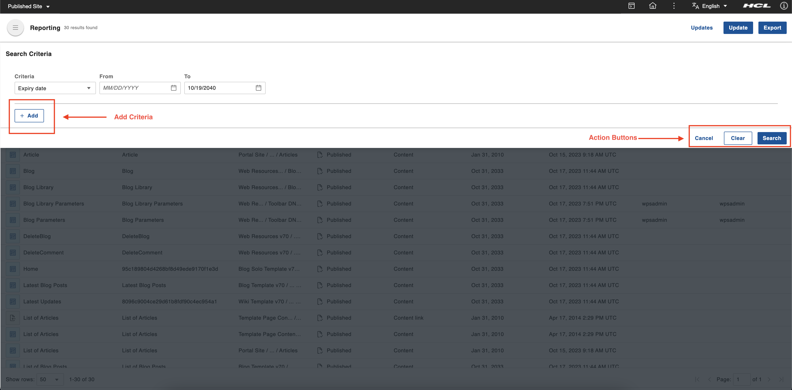

# Accessing the Content Reporting portlet
This section provides steps on how to access the HCL Content Reporting portlet and details on how each report criterion is interpreted.

## Prerequisite

Starting from HCL Digital Experience 9.5 CF214, Content Reporting is installed and deployed by default as part of the CF update process. However, for CF213, Content Reporting must be installed and configured. For instructions on installing Content Reporting manually on supported environments, see the [Install HCL Digital Experience 9.5 Content Reporting](../installation/index.md) topic.

After image configuration in your HCL Digital Experience 9.5 CF213 deployment, Content Reporting is accessible from the Practitioner Studio interface.

!!! note
    You must have **User** or **Editor** access to the following resources to use Content Reporting. The **User** role does not have access to generating a report, updating in bulk, and exporting of generated reports; this role can only view the Updates page containing bulk update history. The **Editor** role has no feature limitations.​ Refer to [Working with resource permissions](../../../../deployment/manage/security/people/authorization/controlling_access/working_with_resource_permission/index.md) for more information.

    - **Content reporting page** -  Click the **Administration menu** icon. Go to **Security** > **Resource Permissions** > **Pages** > **Content Root** > **Practitioner Studio** > **Web Content** > **Content Reporting** > Click the **Assign Access** icon to set User role.
    - **Content reporting portlet** - Click the **Administration menu** icon. Go to **Security** > **Resource Permissions** > **Portlets** > ** Content Reporting portlet** > Click **Assign Access** icon to set User role.
    - **WCM_REST_SERVICES** - Click the **Administration menu** icon. Go to **Security** > **Resource Permissions** > **Virtual Resources** > **WCM REST SERVICE** > Click **Assign Access** icon to set Editor role.
    - **WCM libraries and items** - Click the **Web Content menu**. Go to **Web Content Libraries** > Click the **Assign Access** icon to set the User or Editor role for any library as needed. A user needs at least **User** access to an item for that item to be included in a report they generate. A user needs at least **Editor** access to an item for to be successfully updated during a bulk update.

    | Features              | User              | Editor             |
    | ----------------------| ----------------  | -------------------|
    | `Report generation`   | :material-close:  | :material-check:   |
    | `Bulk update`         | :material-close:  | :material-check:   |
    | `Export`              | :material-close:  | :material-check:   |
    | `Updates`             | :material-check:  | :material-check:   |

## Accessing Content Reporting

Refer to the following instructions to access HCL Digital Experience 9.5 Content Reporting from the Practitioner Studio.

1.  Log in to your HCL Digital Experience 9.5 platform, and select **Web Content** from the Practitioner Studio navigator.

    

2.  Select **Content Reporting** from the **Web Content** menu to access the HCL Digital Experience 9.5 Content Reporting user interface.

    

## The HCL Content Reporting UI

The HCL Content Reporting UI has the following components:

-   **Main header** - This section contains the total number of results found, a link for viewing completed and pending update actions, the **Update** button to update the expiry date of the reported items, and the **Export** button to export the search results into a CSV file.
-   **Search Criteria** - This section displays a preview of all the criteria used to search for items to populate the report.
-   **Report table** - This table contains the reported items in table format. The table, by default, is sorted by title and by the date the items were last modified.
-   **View Criteria** - Click **View Criteria** to open the top drawer and display the criteria used for populating the report. You can set the criteria and generate a report in this drawer as well.

    

-   **Criteria** - There are six criteria that can be used in different combinations as the basis to generate a report. The dynamic fields of each criterion is displayed after selection. A report can be generated based on any or all of the following criteria:

    - **Expiry date**
    - **Owner**
    - **Author**
    - **Item type**
    - **Phrase**
    - **Word**

  -  **Add Criteria** - This adds another criteria line by clicking **+ Add**. Only one instance of each option can be added at a time.

       

  -  **Action buttons** - Proceed with the search by clicking the **Search** button. Clear fields by clicking the **Clear** button. Close the search criteria drawer by clicking the **Cancel** button.
