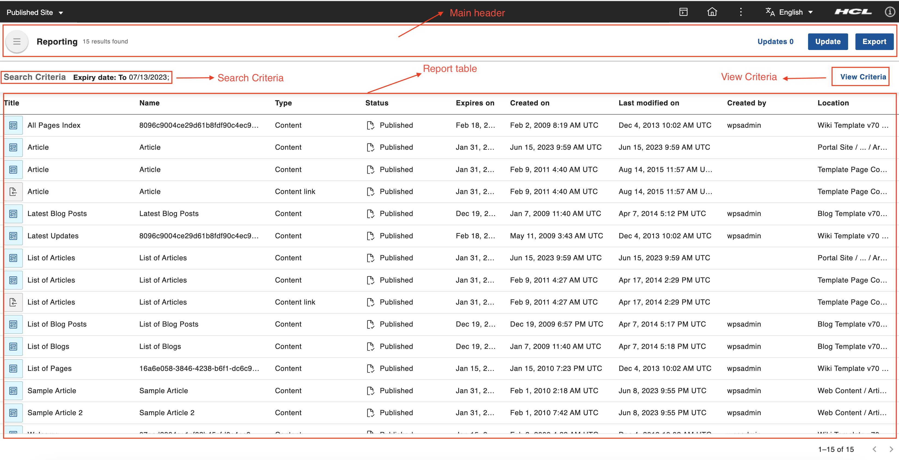
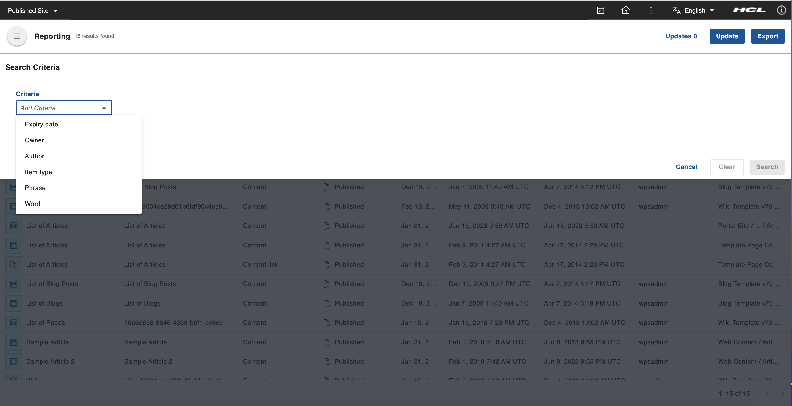

# Accessing the Content Reporting portlet
This section provides the steps on how to access the HCL Content Reporting portlet and use it to generate a report based on different criteria, export the report, and update the expiry date of the items in the report.

## Prerequisite

Content Reporting should be installed and configured in HCL Digital Experience 9.5 release update CF213 or higher. For instructions on installing supported container environments, see the [Install HCL Digital Experience 9.5 Content Reporting](../installation/index.md) topic.

After image configuration in your HCL Digital Experience 9.5 CF213 and higher deployment, Content Reporting is accessible from the Practitioner Studio interface.

## Accessing Content Reporting

Follow the instructions below to access HCL Digital Experience 9.5 Content Reporting from the Practitioner Studio.

1.  Log in to your HCL Digital Experience 9.5 platform, and select **Web Content** from the Practitioner Studio navigator.

    

2.  Select **Content Reporting** from the **Web Content** menu to access the HCL Digital Experience 9.5 Content Reporting user interface.

    

## The HCL Content Reporting UI

The HCL Content Reporting UI has the following components:

-   **Main header** - This section contains the **Update** button to update the expiry date of the reported items, the **Export** to export the search results into a CSV file, a link for pending update actions and the total number of results found (for example, Updates 42).
-   **Search Criteria** This section displays all the criteria used to search for items to populate the report.
-   **Report table** - This table contains the reported items in table format. The table is sorted by title and by the date the items were last modified.
-   **View Criteria** - Click **View Criteria** to open the top drawer and display the criteria used for populating the report. You can set the criteria and generate a report in this drawer as well.

    

-   **Criteria** - There are five criteria that can be used in different combinations as the basis to generate a report. The dynamic fields of each criterion will be displayed upon selection. A report can be generated based on any or all of the following criteria:

    -   **Expiry date** - With this criterion, the report can be scoped to include items based on their assigned expiry date. The expiry date has two date fields: **From date** and **To date**. The generated report will include items that have an expiry date that is within the dates entered in the input fields. The date range is interpreted to be open ended when one of the input fields are left open.

        !!! important "Invalid date range"
            Using an invalid date range (for example, from a future date to a past date) will cause the generated report to be empty.

    -   **Owner** - With this criterion, the report can be scoped to include items based on their owners. Multiple users can be selected for this criterion. The generated report will include an item if any of the selected users is its owner or one of its owners.

        !!! info "User suggestions"
            Typing in the input field will suggest users whose distinguished name (cn) matches the input. Only the suggested users are considered valid inputs. At least one of the suggested users must be selected to finish setting up the criteria.

    -   **Author** - With this criterion, the report can be scoped to include items based on their authors. Multiple users can be selected for this criterion. The generated report will include an item if any of those users is its author or one of its authors.

        !!! info "User suggestions"
            Typing in the input field will suggest users whose distinguished name (cn) matches the input. Only the suggested users are considered valid inputs. At least one of the suggested users must be selected to finish setting up the criteria.

    -   **Item type** - With this criterion, the report can be scoped to include items based on their included types.

        !!! info "User suggestions"
            In case you select both a grouped item type (for example, All Authoring Templates) and one or more of its sub-types (for example, Content Template), the system only fulfills the search for the sub-types. The most specific search criteria of the sub-type is recognized because searching for the grouped item type nullifies the specific search.

    -   **Phrase** - Through this criterion, the report can be scoped to include items based on their included phrase. Only one phrase can be searched per criteria line.

    -   **Word** - Through this criterion, the report can be scoped to include items based on their inclusion of words within attributes such as titles, description, name, and keywords.

  -  **Add Criteria** - This adds another criteria line by clicking **+ Add**. Only one instance of each option can be added at a time.

  -  **Action buttons** - Proceed with the search by clicking the **Search** button. Clear fields by clicking the **Clear** button. Close search criteria drawer by clicking the **Cancel** button.

