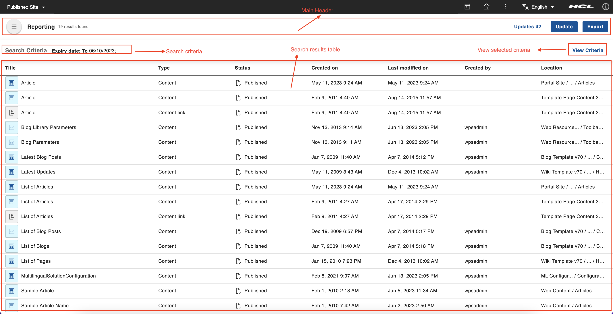

# Access content reporting portlet
This section provides the steps on how to access HCL Content Reporting portlet and use it to search by different criteria, update expiry date, and export search results.

## Prerequisite

Content Reporting should be installed and configured to HCL Digital Experience 9.5 release update CF213 or higher. See instructions to install to supported container environments to the [Install HCL Digital Experience 9.5 Content Reporting](../installation/install_content_reporting.md) topic.

Content Reporting is accessible from the Practitioner Studio interface (after image configuration to your HCL Digital Experience 9.5 CF213 and higher deployment).

## Access Content Reporting

Follow the instructions below to access HCL Digital Experience 9.5 Content Reporting from the Practitioner Studio.

1.  Log in to your HCL Digital Experience 9.5 platform, and select **Web Content** from the Practitioner Studio navigator.

    

2.  Select **Content Reporting** from the **Web Content** menu to access the HCL Digital Experience 9.5 Content Reporting user interface.

    

## The HCL Content Reporting UI

The HCL Content Reporting UI has the following components:

-   **Main header** - This contains the HCL Content Reporting **Update button** to update expiry date for search results, **Export button** to export the search results into a CSV file., Link for pending update actions **Updates** and total number of results found (gives informational feature and quality information) as **19 results found**.
-   **Search Criteria** - This sections contains information of all the search criterias for searching performed.
-   **Search results table** - This table contains search results in table format and all the search result items arranged in categorized column like - *Title*, *Type*,
*Status*, *Created on*, *Last modified on*, *Created by* and , *Location*.
-   **View Criteria** - **View Criteria** to open the top drawer and display the applied search criteria. which contains **search criteria options**, **search action buttons** and , **Add Criteria** sections as showns in below image.

    

-   **Search criteria options** - Search has been broken down into search criteria options to allow for a more flexible mix of search parameters.
e.g. Searching without defining a expiry date will simply search through all items. The respective dynamic fields of each criteria will be displayed upon selection. Content admin can perform content searching by any or all of these search criterias. which includes:

    -   **Expiry date** - This criteria will search for items are expiring from **From date** to **To date**. Filling up both date aren’t mandatory and only one is needed to proceed. Entering only the From date will search items from that date onwards. Entering only the To date will search items from on and before that date. Entering the same date in the From and To dates will search that one specific date.

    -   **Owner** - This criteria will search for items are owned by provided owner/owners in owner criteria.

    -   **Author** - This criteria will search for items are authored by provided author/authors in author criteria.

    -   **Item type** - This criteria will search for any of the types included. All solo/parent and sub types are searchable.
    In case of user input of both a main item type and one or more of its sub types, (e.g. Component + Date + Image), the system should only fulfill the search of the sub-types. In other words, the most specific search criteria of the sub-type will be searched for since searching for the main item type will nullify the specific search. Below is the list of item types and their sub types.

        

    -   **Phrase** - This criteria will search for phrase, only one phrase can be searched per criteria line.

    -   **Word** - This criteria will search for words within attributes such as titles, description, name and keywords.

  -  **Add Criteria** - Adding another criteria line by clicking +Add button.

  -  **Search action buttons** - Proceed with the search by clicking the Search button. Clear fields by clicking the Clear button. Disappear search criteria drawer by clicking cancel button.

