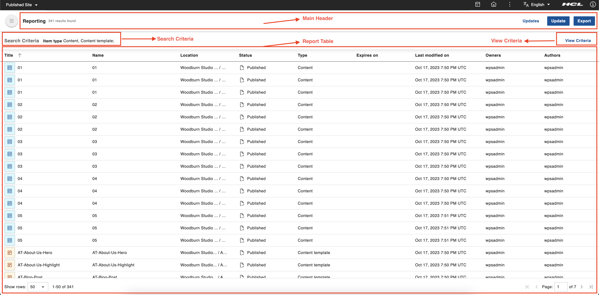
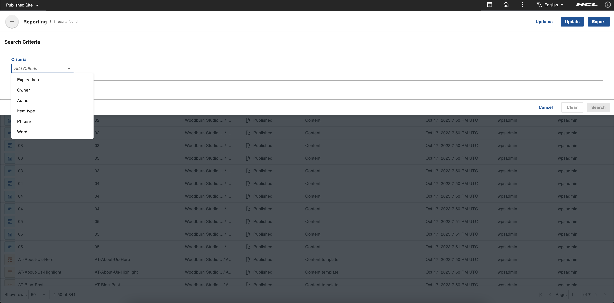

# Accessing the Content Reporting portlet
This section provides the steps on how to access the HCL Content Reporting portlet and details how each report criterion is interpreted.

## Prerequisite

Content Reporting should be installed and configured in HCL Digital Experience 9.5 release update CF213 or higher. For instructions on installing Content Reporting on supported environments, see the [Install HCL Digital Experience 9.5 Content Reporting](../installation/index.md) topic.

After image configuration in your HCL Digital Experience 9.5 CF213 and higher deployment, Content Reporting is accessible from the Practitioner Studio interface.

## Accessing Content Reporting

Follow the instructions below to access HCL Digital Experience 9.5 Content Reporting from the Practitioner Studio.

1.  Log in to your HCL Digital Experience 9.5 platform, and select **Web Content** from the Practitioner Studio navigator.

    

2.  Select **Content Reporting** from the **Web Content** menu to access the HCL Digital Experience 9.5 Content Reporting user interface.

    

## The HCL Content Reporting UI

The HCL Content Reporting UI has the following components:

-   **Main header** - This section contains the **Update** button to update the expiry date of the reported items, the **Export** to export the search results into a CSV file, a link for completed and pending update actions and the total number of results found.
-   **Search Criteria** This section displays a preview of all the criteria used to search for items to populate the report.
-   **Report table** - This table contains the reported items in table format. The table, by default, is sorted by title and by the date the items were last modified.
-   **View Criteria** - Click **View Criteria** to open the top drawer and display the criteria used for populating the report. You can set the criteria and generate a report in this drawer as well.

    

-   **Criteria** - There are six criteria that can be used in different combinations as the basis to generate a report. The dynamic fields of each criterion will be displayed upon selection. A report can be generated based on any or all of the following criteria:

    - **Expiry date**
    - **Owner**
    - **Author**
    - **Item type**
    - **Phrase**
    - **Word**

    

  -  **Add Criteria** - This adds another criteria line by clicking **+ Add**. Only one instance of each option can be added at a time.

  -  **Action buttons** - Proceed with the search by clicking the **Search** button. Clear fields by clicking the **Clear** button. Close search criteria drawer by clicking the **Cancel** button.
