# Performing a bulk update in Content Reporting

Currently, Content Reporting Bulk Update feature supports the following actions: 

- Update expiration date
- Add an owner or author
- Remove an owner or author
- Replace an owner or author

Starting CF220, you can select all or just a number of items when performing a bulk update operation.

!!!note
    Bulk updates for owners or authors can only be applied to content items, site areas, authoring templates, components, categories, folders, projects, segments, workflow actions, portal pages and items to which you have edit access. To date, adding up to 100 users and updating up to 7000 items have been tested successfully.

Starting CF218, if a bulk update process is running and the server restarts, the system pauses the update process. When the server is available again, you can resume the paused bulk update process through the **Update history** page. For more information, see [Resuming a paused bulk update process](#resuming-a-paused-bulk-update-process).

## Prerequisite

Beginning with HCL Digital Experience 9.5 release update CF214, Content Reporting is enabled by default. For HCL Digital Experience 9.5 release update CF213, Content Reporting should be installed and configured. For instructions on installing Content Reporting on supported environments, see the [Install HCL Digital Experience 9.5 Content Reporting](../installation/index.md) topic.

To update items in bulk, you must have edit access to the content items selected. If you kick off the bulk update operation without having the required access to the items, the update will fail with the error message `Unauthorized access`. 

## Using the Content Reporting Bulk Update feature

1.  Log in to your HCL Digital Experience 9.5 platform and select **Web Content**. Select **Content Reporting** from the Practitioner Studio navigator. The following image shows the Content Reporting landing page.

    

2. Generate a report on items you want to update. See [Generating a content report](../usage/generate_content_report.md) for instructions.

    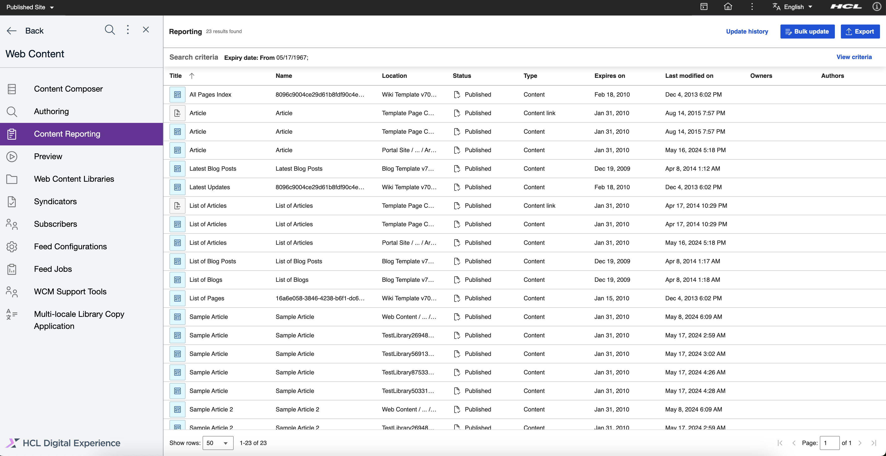

3. [Export the report](./export_content_report) or execute one of the following supported bulk update operations: [UpdateExpiry](#using-the-content-reporting-bulk-update-updateexpiry-feature) or [Update Owners/Authors](#using-the-content-reporting-bulk-update-ownersauthors-feature).

## Using the Content Reporting Bulk Update UpdateExpiry feature

Content managers can trigger bulk updates to update the expiration dates of all queried items. This section provides steps on how to update the expiration date of content items in a report generated through HCL Content Reporting.

1. After you have generated a report and if there are results, the **Bulk Update** button appears in the application header. Click the **Bulk Update** button.

    

2. Bulk update dialog box will appear.
    - Select action properties for the update.
    - The results based on the action selected are displayed.
    
    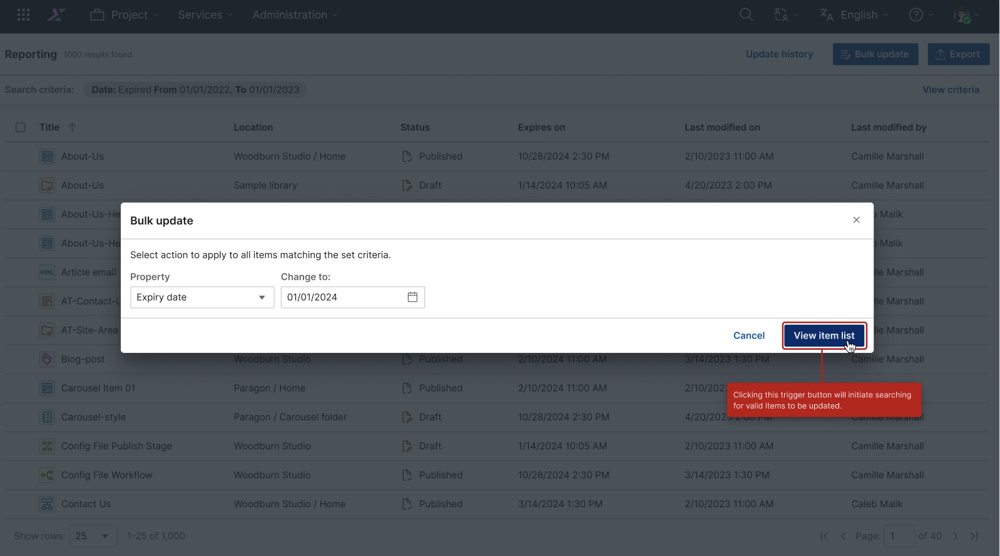

3. Displaying the results based on the update action and applying the update.

    (1) User may proceed to update all from the list.

    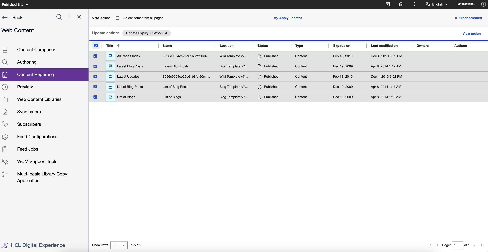

    (2) User may proceed to specifically select the items for update.

    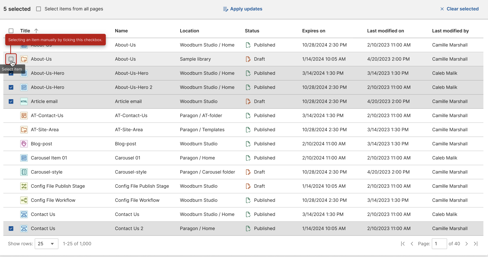

    - Click the "Apply updates" button to open the confirmation dialog.

4. Displaying the confirmation update dialog.

    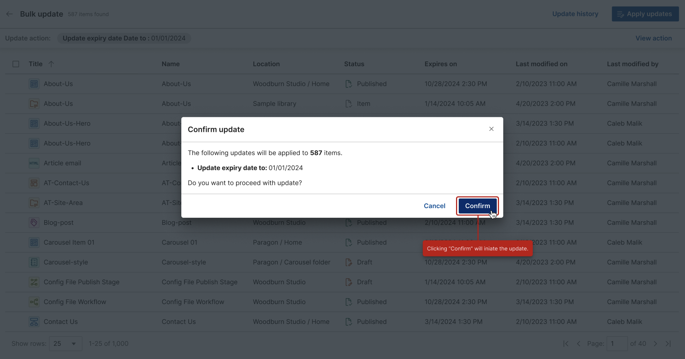

5. Send request and display progress bar while still on the bulk update page.

    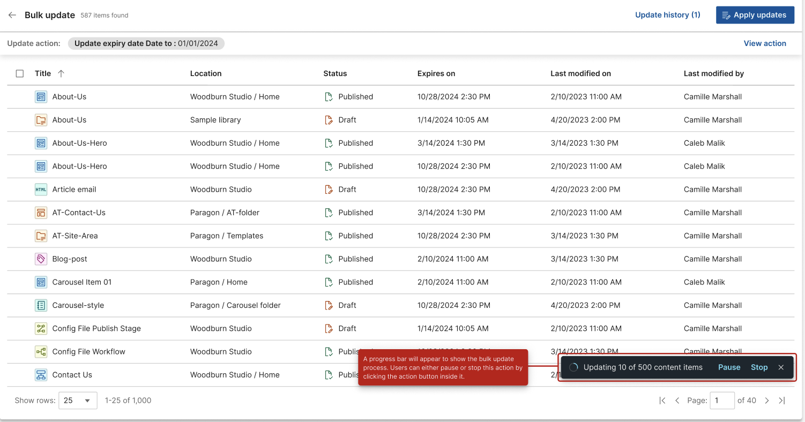

!!!note
    For CF213, there are three fields: **Action**, **Property**, and **Change to**. The **Action** and **Property** fields each have one option: **Update** and **Expiry date** respectively. Bulk updates for expiry dates can only be applied to content items, site areas, authoring templates, components, categories, and items to which you have edit access. Only items with a workflow are included.

## Using the Content Reporting Bulk Update Owners/Authors feature

Content managers can trigger bulk updates to update the owners and/or authors of all queried items. This section provides steps on how to update the owners or authors of content items in a report generated through HCL Content Reporting.

1. After you have generated a report and if there are results, the **Bulk Update** button appears in the application header. Click the **Bulk Update** button.

2.  In the **Update items** dialog box, there are six options: **Property**, **Action**, **User attribute**, **Users**, **Group attribute** and **Groups**.
    - In the **Property** field, select the property to be updated, either **Author** or **Owner**. 
    - In the **Action** field, select the action to be taken on the selected items, either **Add**, **Remove**, or **Replace**. 

            !!!note
            For the **Replace** action, there are two fields each for users and groups involved in the action: **Remove users** and **Remove groups**, **Add users** and **Add groups**. In the **Remove users** or **Remove groups** field, enter a value according to the selected attribute of the user or group you want to replace with the value you will add in the **Add users** or **Add groups** field.

    - In the **User attribute** field, select a user attribute to enable the **Users** field. In the **Users** field, enter a corresponding value for the selected attribute. For example, if you selected the **Job Title** attribute, enter a job title in the **Users** field and all users with that job title appear in the dropdown. Note that this field is a type-ahead input field that displays a list of suggested users according to the input and selected user attribute. Only suggested users are valid.
    - You can also select a **Group attribute** to enable the **Groups** field. In the **Groups** field, enter a corresponding value for the selected attribute. For example, if you selected the **Display Name** attribute, enter a display name in the **Groups** field and all groups with that display name appear in the dropdown. Note that this field is a type-ahead input field that displays a list of suggested groups according to the input and selected group attribute. Only suggested groups are valid.

3. After filling out the fields, click the **View item list** button.
    A confirmation dialog box appears. 

    

4. Note the number of items to be affected by the update and check if you entered the correct values for properties to update. If the values are correct, click the **Update** button. Otherwise, you can click **Cancel** and return to the previous dialog box where you can change the incorrect values.

    

You can track the bulk update through the snackbar or through the **Update History** page.

   

### Viewing or changing the bulk update action

After processing the of [Bulk Update UpdateExpiry feature](#using-the-content-reporting-bulk-update-updateExpiry-feature), we can view or change the bulk update action

1. Viewing the update action through the bulk update dialog.
    - Click the "View action" button to access the buld update dialog.

    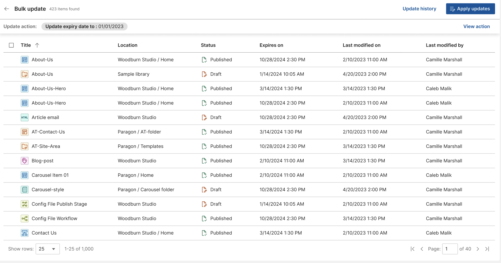

2. Displaying the bulk update dialog.
    - Upon display, the dialog has the current action displayed and the user can change the properties or action as needed.
    - Click the "View item list" to trigger the search of valid items.

    

3. Displaying the valid items to be updated.

    

4. Displaying empty results.
    - The page will display the message "No items were found" if there is no valid items.

    

### Using the snackbar

The snackbar that appears when a bulk update is triggered tracks up to five bulk update processes.

   This is the snackbar for an ongoing process.
   

   This is the snackbar if every item was successfully updated.
   

   This is the snackbar if some items were not updated.
   

   This is the snackbar if all items were not updated.
   

1. On the snackbar, there is an option to view the items that have been processed only when the bulk update process is completed. Click **View items** to check the details of each item that has been processed. A dialog box for the reports appears.

    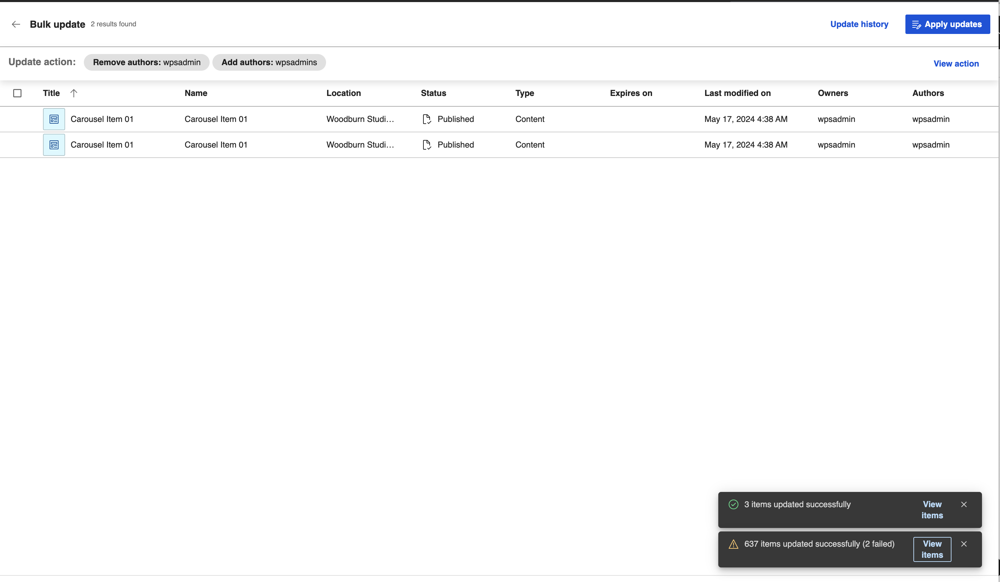

2. In the header of the dialog box, you can see the total number of items that was updated and the number of failed items. There are four columns on the dialog box:

    - **Title** - This column shows the title of the item processed.
    - **Item type** - This column shows the type of item processed.
    - **Update Status** - This column tells whether the item was successfully updated (shown as **OK**) or not (an error message containing why the update failed is displayed).
    - **Created by** - This column shows the creator of the item.

    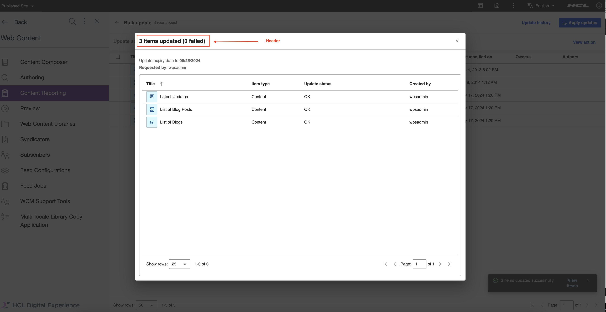

### Viewing the Update History page

1. You can access the **Update history** page through the button on the application header. Click the **Update history** button to go to the **Update history** page. The **Update history** button also contains the total number of bulk update operations triggered.

    

2. In the **Update history** page, there is a table showing the bulk updates that were triggered. This table has five columns:

    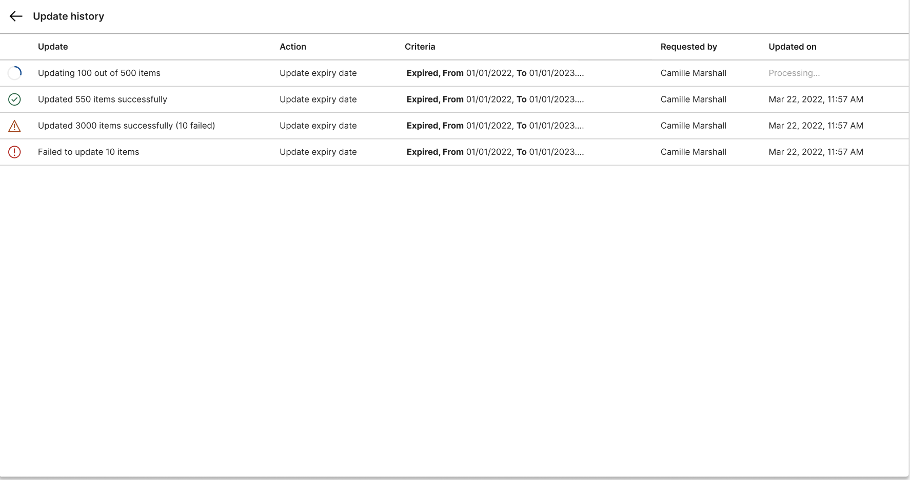

    To return to the **Content Reporting** landing page, click the back button found on the upper left corner of the **Update history** page.

3. In the **Update history** page, there is a table showing the bulk updates that were triggered. This table has five columns:

    - **Update** - This column indicates whether the bulk update is ongoing or completed. Once complete, there is a summary of items that have been processed. This summary shows how many items were updated and how many failed. This column also contains a button to show the report dialog where you can check the details of each item that has been processed.
    - **Action** - This column shows actions that were taken during the bulk update.
    - **Requested by** - This column shows who triggered the bulk update process.
    - **Updated on** - This column shows when the bulk update was triggered.
    - **Polling ID** - This column shows a unique identifier for the bulk process.

    To return to the **Content Reporting** landing page, click the back button found on the upper left corner of the **Update history** page.

4. In the **Update history** page table, hover over a row of a completed bulk update to display the view action button. Click this button to display the dialog for the list of items processed and their details.

    

5. In the header of the dialog box, the number of updated items and the number of failed items are displayed. There are four columns on the dialog box:

    - **Title** - This column shows the title of the item processed.
    - **Item type** - This column shows the type of item processed.
    - **Update Status** - This column tells whether the item was successfully updated (shown as **OK**) or not (an error message containing why the update failed is displayed).
    - **Created by** - This column shows the creator of the item.

    

#### Resuming a paused bulk update process
If a bulk update process is running and the server restarts, the system pauses the update process. When the server is available again, you can resume the paused bulk update process.

!!!note
    You can only resume a paused bulk update process for owners and authors if the update involves a limited number of users and groups. Currently, there is a size limitation in the database column that stores the action string that specifies the owners or authors used in an update. If the action string exceeds 255 characters, you cannot resume the paused bulk update process. The operation fails and you must start the bulk update process again.

    If the bulk update process for owners and authors involves a large number of users, it is recommended to create a user group instead. Add all of the users to the group and then select the new group when initiating the bulk update operation. For more information, see [Managing users and groups](../../../../deployment/manage/security/people/authorization/controlling_access/managing_users_groups/index.md).

To continue a paused bulk update process, refer to the following steps:

1. Access the **Update history** page through the button on the application header. Click the **Update history** button to go to the **Update history** page.

    

2. In the **Update history** page table, hover over a row of a paused update process to display the resume update button. Click this button to display the confirmation dialog box to resume the bulk update process.

    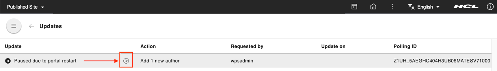

3. The **Confirm resume update** dialog box appears. Verify the items you want to update and click **Resume** to continue. Otherwise, you can click **Cancel**.

    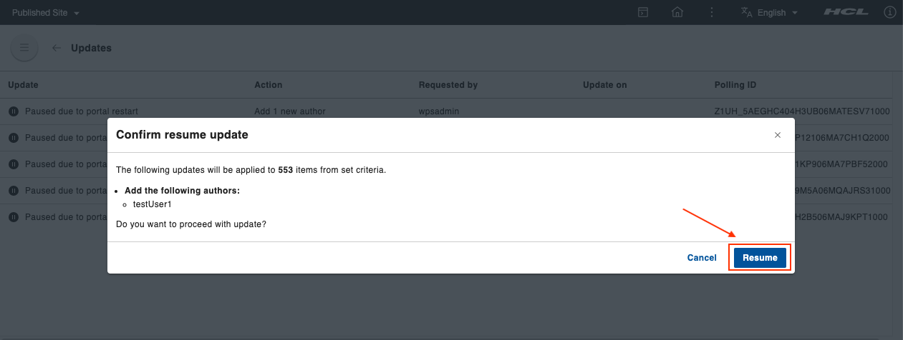

After resuming the update, you can track the progress in the **Update history** page.

## Limitation

Bookmarking the Cherry-picking route so that user may save current selections is not possible as of now because the selections and records will be huge and storing them in URL hash wouldn’t be feasible.

