# Using the Content Reporting Bulk Update feature

This section provides steps on how to update the expiration date of content items in a report generated through HCL Content Reporting.

## Prerequisite

Content Reporting should be installed and configured in HCL Digital Experience 9.5 release update CF213 or higher. For instructions on installing Content Reporting on supported environments, see the [Install HCL Digital Experience 9.5 Content Reporting](../installation/index.md) topic.

## Using the Bulk Update feature

Content managers can trigger bulk updates to update the expiration dates of all queried items.

1.  Log in to your HCL Digital Experience 9.5 platform and select **Web Content**. Select **Content Reporting** from the Practitioner Studio navigator. The following image shows the Content Reporting landing page. 

    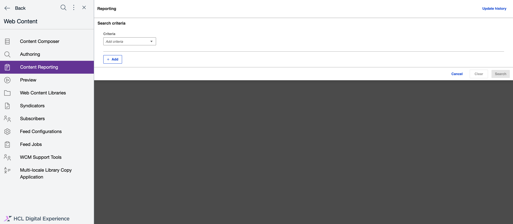

2. Generate a report on items you want to update. See [Generating a content report](../usage/generate_content_report.md) for instructions.

3. After you have generated a report and if there are results, the **Update** button appears in the application header. Click the **Update** button.

    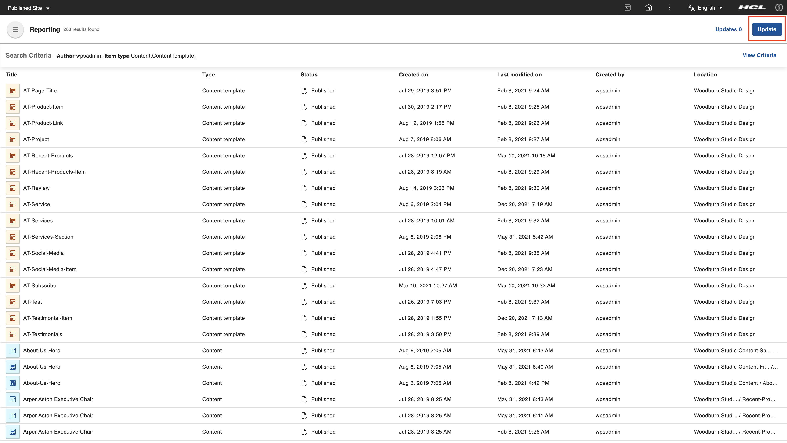

4. In the **Update items** box, there are three options: **Action**, **Property**, and **Change to**. For CF213, the **Action** and **Property** fields each has one option: **Update** and **Expiry date**, respectively. In the **Change to** field, enter the new expiry date of the selected items. After entering the date, the **Update** button is enabled. Click the **Update** button.

    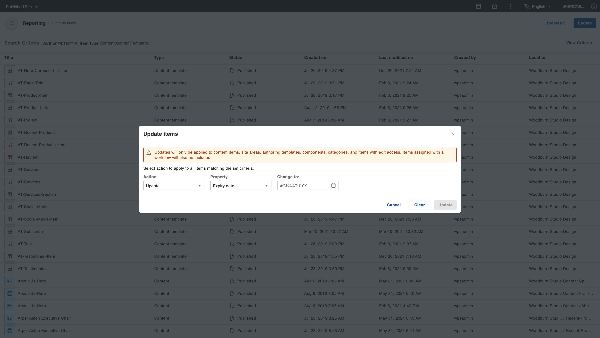

    There are also **Cancel** and **Clear** buttons in the dialog box. Click **Cancel** to close the dialog box. Click **Clear** to remove all selected options.

    !!!note
        Bulk updates for expiry dates can only be applied to content items, site areas, authoring templates, components, categories, and items to which you have edit access. Only items with a workflow are included.

5. After clicking the **Update** button, a confirmation dialog appears. Verify the number of items you want to update and if you entered the correct expiration date. If the values are correct, click the **Update** button. Otherwise, you can click **Cancel** and return to the previous dialog where you can change the incorrect values.

    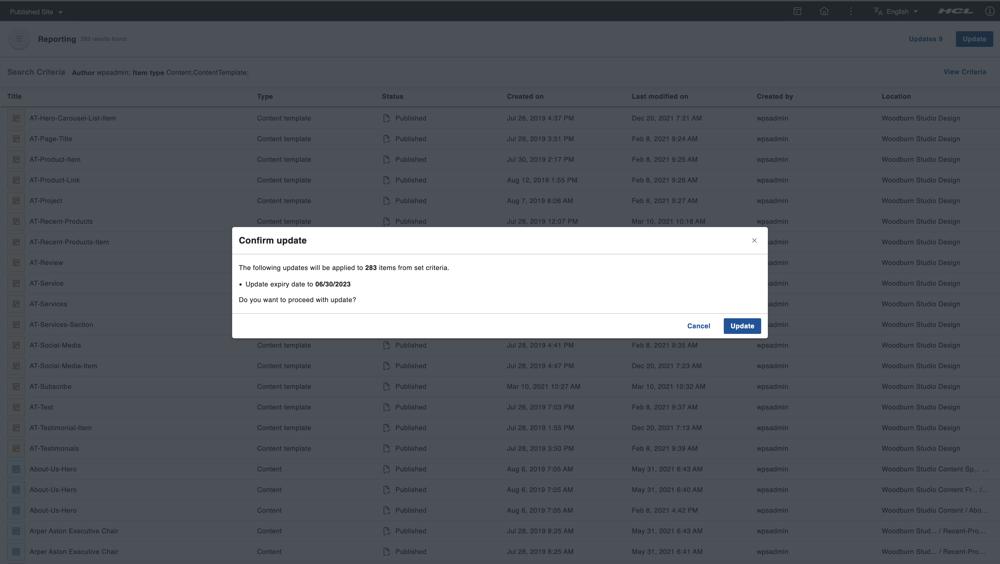

    !!!note
        If there are no items to update because their type is not supported for bulk updates or they do not have a workflow assigned to them, the **Update** button is disabled.

        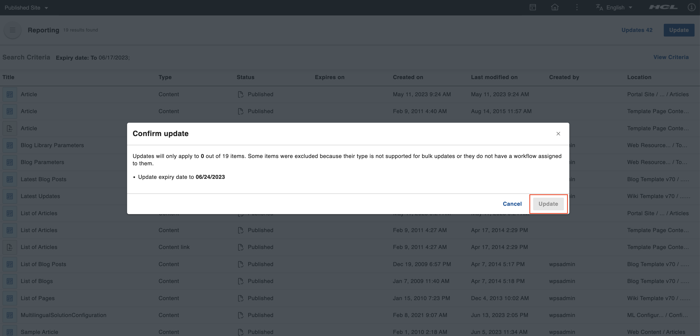

6. When a bulk update is triggered, a snackbar appears in the bottom right corner of the screen. The snackbar displays the status of the update. If the process is still ongoing, it shows how many items have already been processed against the total number of items. If the process has been completed, it shows how many items were updated and how many items were not.

    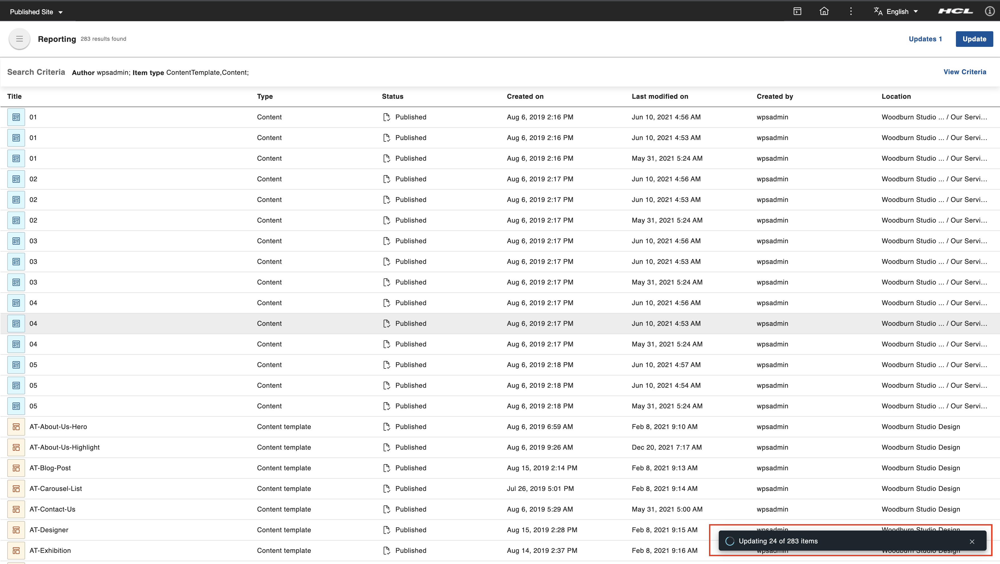

## Tracking Bulk Updates and viewing Bulk Update results

There are two ways to track the bulk update: through the snackbar and through the **Updates** page.

### Using the snackbar

The snackbar that appears when a bulk update is triggered tracks up to five bulk update processes.

   This is the snackbar for an ongoing process.
   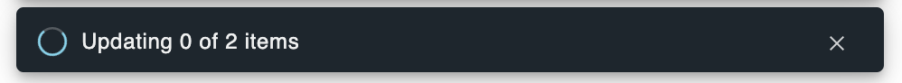

   This is the snackbar if every item was successfully updated.
   

   This is the snackbar if some items were not updated.
   

   This is the snackbar if all items were not updated.
   

1. On the snackbar, there is an option to view the items that have been processed only when the bulk update process is completed. Click **View items** to check the details of each item that has been processed. A dialog box for the reports appears.

    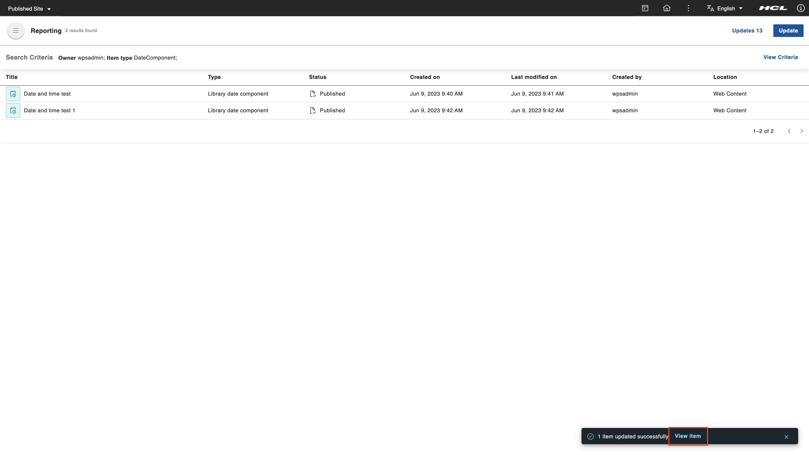

2. In the header of the dialog box, you can see the total number of items that was updated and the number of failed items. There are four columns on the dialog box:

    - **Title** - This column shows the title of the item processed.
    - **Item type** - This column shows the type of item processed.
    - **Update Status** - This column tells whether the item was successfully updated (shown as **OK**) or not (an error message containing why the update failed is displayed).
    - **Created by** - This column shows the creator of the item.

    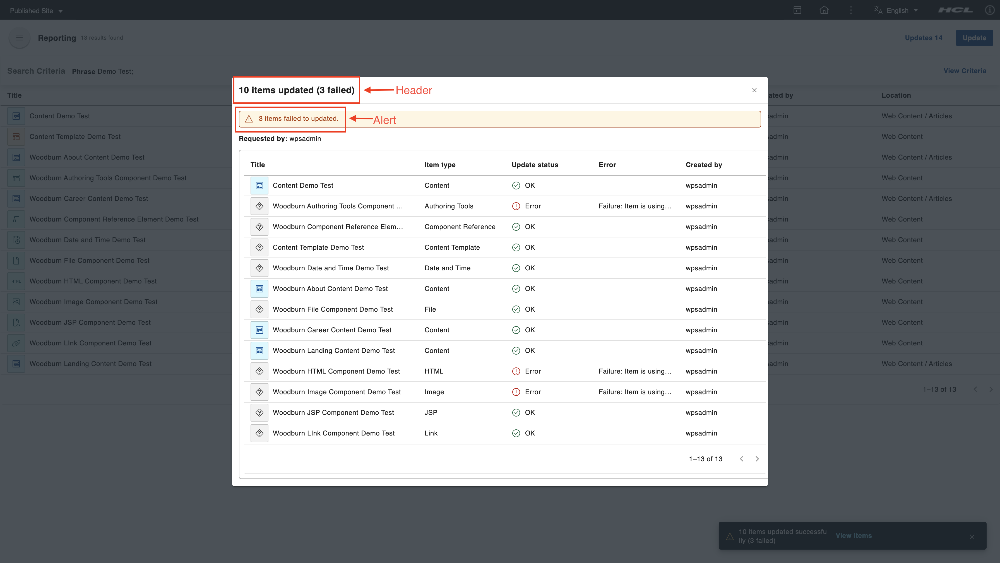
   
### Using the Updates page

1. You can access the **Updates** page through the button on the application header. Click the **Updates** button to go to the **Updates** page. The **Updates** button also contains the total number of bulk update operations triggered.

    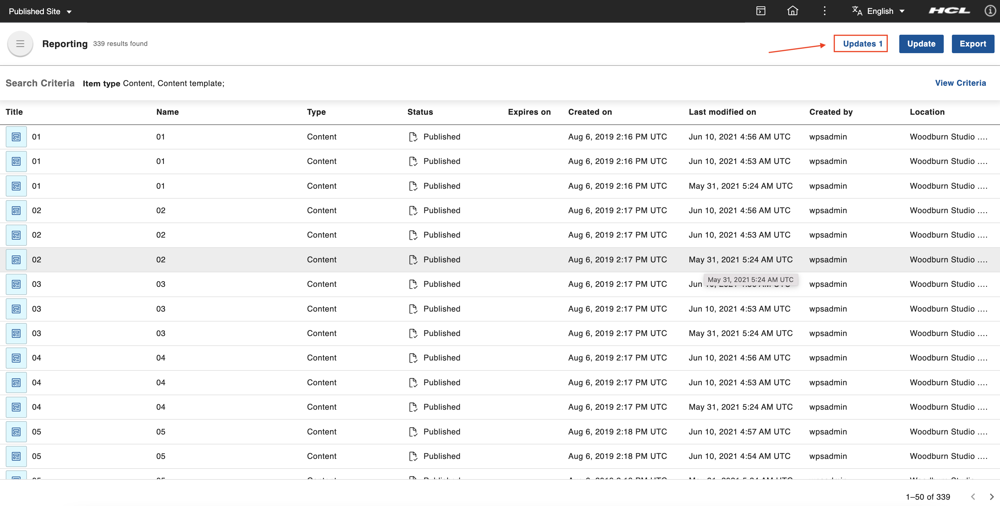

2. On the **Updates** page, there is a table showing the bulk updates that were triggered. This table has five columns:

    - **Update** - This column indicates whether the bulk update is ongoing or completed. Once complete, there is a summary of items that have been processed. This summary shows how many items were updated and how many failed. This column also contains a button to show the report dialog where you can check the details of each item that has been processed.
    - **Action** - This column shows actions that were taken during the bulk update.
    - **Requested by** - This column shows who triggered the bulk update process.
    - **Updated on** - This column shows when the bulk update was triggered.
    - **Polling ID** - This column shows a unique identifier for the bulk process.

    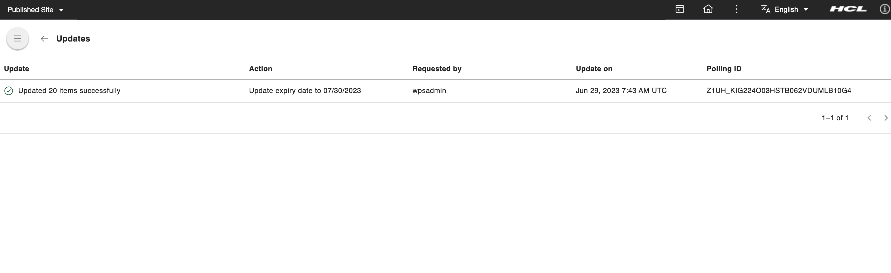

    To return to the **Content Reporting** landing page, click the back button found on the upper left corner of the **Updates** page.

3. On the **Updates** page table, hover over a row of a completed bulk update to display the view action button. Click this button to display the dialog for the list of items processed and their details.

    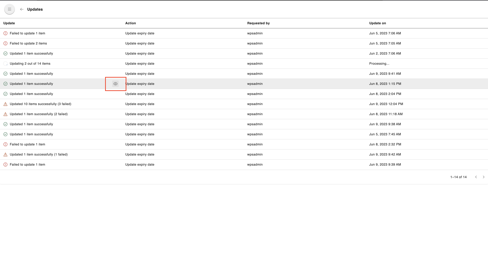

4. In the header of the dialog box, the number of updated items and the number of failed items are displayed. There are four columns on the dialog box:

    - **Title** - This column shows the title of the item processed.
    - **Item type** - This column shows the type of item processed.
    - **Update Status** - This column tells whether the item was successfully updated (shown as **OK**) or not (an error message containing why the update failed is displayed).
    - **Created by** - This column shows the creator of the item.

    
