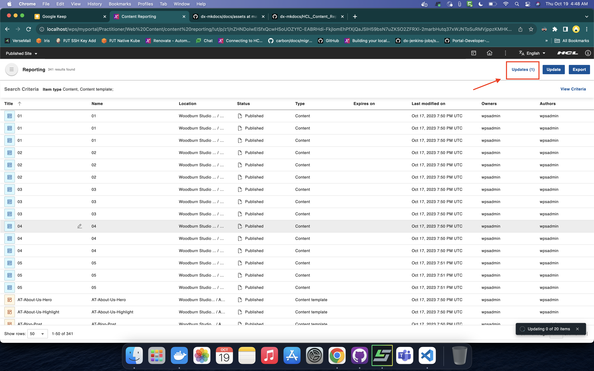

# Content Reporting Bulk Update

This section provides steps on how to update the expiration date of content items in a report generated through HCL Content Reporting.

## Prerequisite

Content Reporting should be installed and configured in HCL Digital Experience 9.5 release update CF213 or higher. For instructions on installing supported container environments, see the [Install HCL Digital Experience 9.5 Content Reporting](../installation/index.md) topic.

## Using the Bulk Update feature

Content managers can trigger bulk updates to update the expiration dates of all queried items.

1.  Log in to your HCL Digital Experience 9.5 platform and select **Web Content**. Select **Content Reporting** from the Practitioner Studio navigator.

    

2. Generate a report on items you want to update. See [Generating a content report](../usage/generate_content_report.md) for instructions.

3. After you have generated a report and if there are results, the **Update** button appears in the application header. Click the **Update** button. A dialog box appears.

    

4. On the dialog box, there are three options: **Action**, **Property**, and **Change to**. For CF213, the **Action** and **Property** have only one option, which is **Update** and **Expiry date**, respectively. In the **Change to** field, enter the expiry date on the selected items. After entering the date, the **Update** button is enabled. When you click the **Update** button, a confirmation dialog appears.

    

    There are also **Cancel** and **Clear** buttons in the dialog box. Click **Cancel** to close the dialog box. Click **Clear** to remove all selected options.

    !!!note
        Bulk updates for expiry dates are only applied to content items, site areas, authoring templates, components, categories, and items with edit access. Only items assigned with a workflow are included.

5. On the confirmation dialog, verify the number of items you want to update and if you entered the correct expiration date. If the values are correct, click the **Update** button. Otherwise, you can click **Cancel** and return to the previous dialog where you can change the incorrect values.

    

    !!!note
        If there are no items for update because their type is not supported for bulk updates or they do not have a workflow assigned to them, the **Update** button is disabled.

        

6. When a bulk update is triggered, a snackbar appear in the lower right corner of the screen. The snackbar displays the status of the bulk update. If the process is still ongoing, it shows how many items have already been processed against the total number of items. If the process has been completed, it shows how many items were successfully updated and how many items were not.

    

## Tracking Bulk Updates and viewing Bulk Update results

There are two ways to track the bulk update: the first is the snackbar described above, and the other is the **Updates** page.

### Snackbar

1. The snackbar that appears when a bulk update is triggered tracks up to five bulk update processes.

    This is the snackbar for an ongoing process.
    

    This is the snackbar if every item was successfully updated.
    

    This is the snackbar if some items were not updated.
    

    This is the snackbar if all items were not updated.
    

2. On the snackbar, there is an option to view the items that have been processed only when the bulk update process is completed. Click **View item(s)** to check the details of each item that has been processed. A dialog box for the reports should appear.

    

3. On the dialog box, in the header, you can see the total number of items that was successfully updated and the number of failed items. The alert message shows you the number of failed items. There are four columns on the table inside the body of the dialog box:

    - **Title**: This column shows the title of the item processed.
    - **Item type**: This column shows the type of item processed.
    - **Update Status**: This column tells whether the item was successfully updated (denoted as "OK") or an error message if the item was not updated.
    - **Created by**: This column shows the creator of this item.

    
   
### Using the Updates Page

1. We can access the **Updates** page through the button on the application header. Clicking the **Updates** button directs you to the **Updates** page. The **Updates** button also contains the total number of bulk update operations triggered.

    

2. On the Updates page, there is a table that contains the bulk updates that were triggered. This table has four columns, which are as follows:

    - **Update**: This column tells whether the bulk update is ongoing or completed. Once complete, there is a summary of items that have been processed. This summary how many items were successfully updated and how many failed. This column also contains a button to show the report dialog to check the details of each item that has been processed.
    - **Action**: This column shows actions that were taken on the bulk update.
    - **Requested by**: This column shows who triggered the bulk update process.
    - **Updated on**: This column shows when the bulk update was triggered.

    

    There is a *back button* on the app header to return to the landing page of Content Reporting.

3. On the table, in the **Update** column, there is a button that appears when you hover over a row whose bulk update has been completed. Clicking this button shows a dialog to check the details of each item that has been processed.

    

3. On the dialog box, in the header, we can see the total number of items that was updated and the number of failed items. The alert message shows you the number of failed items. There are four columns on the table inside the body of the dialog box:

    - **Title**: This column shows the title of the item we processed.
    - **Item type**: This column shows the type of item we processed.
    - **Update Status**: This column tells whether the item was successfully updated (denoted as "OK") or an error message if the item was not updated.
    - **Created by**: This column shows the creator of this item.

    
