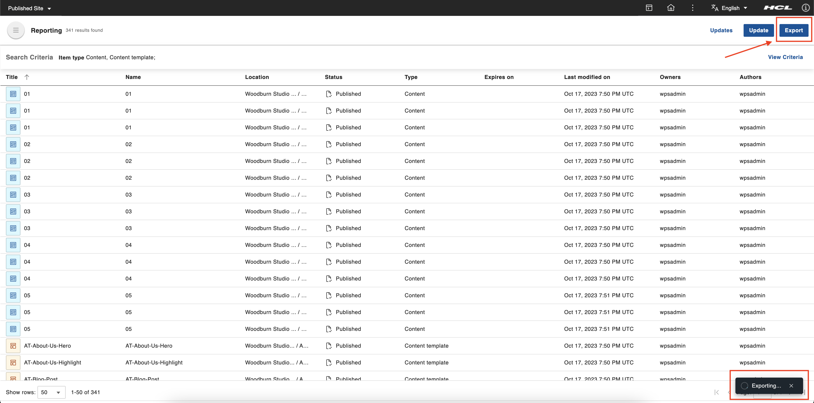
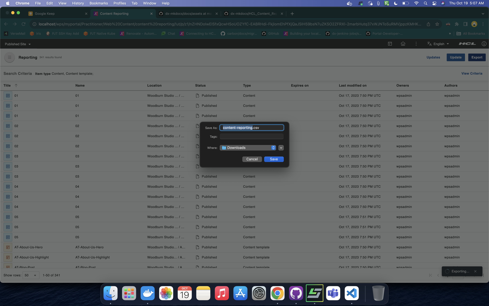

# Exporting generated reports to CSV

This section provides steps on how to export the generated report to a CSV file in HCL Content Reporting.

## Prerequisite

Beginning with HCL Digital Experience 9.5 release update CF214, Content Reporting is enabled by default. For HCL Digital Experience 9.5 release update CF213, Content Reporting should be installed and configured. For instructions on installing Content Reporting manually on supported environments, see the [Installing HCL Digital Experience 9.5 Content Reporting](../installation/index.md) topic.

## Exporting reports

Content managers can export generated reports in HCL Content Reporting.

1.  Log in to your HCL Digital Experience 9.5 platform and select **Web Content**. Select **Content Reporting** from the Practitioner Studio navigator.

2. Generate a report on the items you want to export. See [Generating a content report](../usage/generate_content_report.md) for instructions.

3. After generating a report, the **Export** button appears in the application header. Click the **Export** button. The snackbar showing the export progress appears in the bottom right corner.

    

4. When exporting is successful, you can find and check downloaded CSV file in your local filesystem where you saved it. The dialog box you see may vary depending on your browser or device.

    
