# Generating a content report

This section details how to genearte content report in HCL Content Reporting.

## Prerequisite

Content Reporting should be installed and configured in HCL Digital Experience 9.5 release update CF213 or higher. For instructions on installing supported container environments, see the [Install HCL Digital Experience 9.5 Content Reporting](../installation/index.md) topic.

## Generating a report

A report is a list of items that matches a set or combined sets of criteria. Content managers generate reports of content items that they are planning to analyze or update. They have a set of criteria that the content items have to match. In this feature, content managers can combine the required criteria into a single report to get the list of items that need updating.

1.  Log in to your HCL Digital Experience 9.5 platform and select **Web Content**, then select **Content Reporting** from the Practitioner Studio navigator.

    

2.  On the **Search Criteria** section, select a criterion to generate a report of matching contents from the **Criteria** dropdown.
    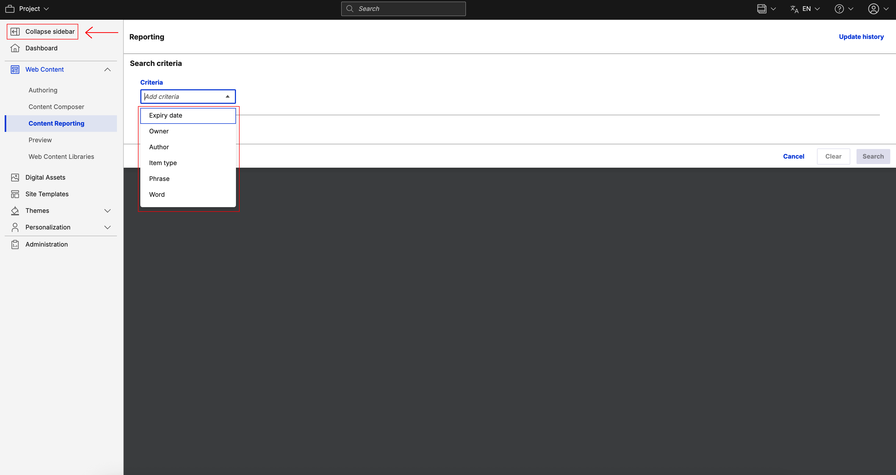

    !!!note
        The dynamic fields of each criterion are displayed upon selection. You can perform content searching by any or all of these search criterias.

3.  Select the **Expiry date** criterion from the dropdown. Two date input fields appear: **From** and **To**
    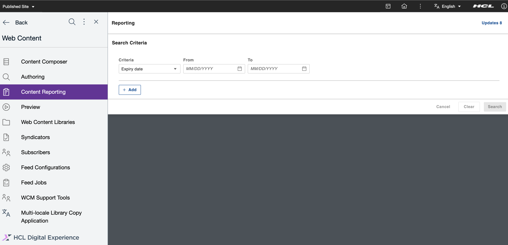

4.  Click the calendar icon in the **From** or **To** field to display the calendar. Select the **From** date and the **To** date from calendar and the click **Search**.
    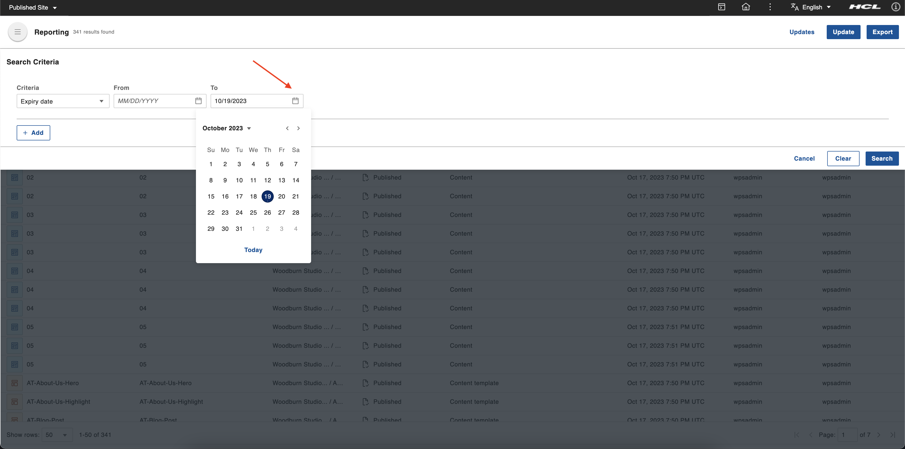

    !!!note
        Filling up both date fields are not mandatory and only one is needed to proceed. Entering only the **From** date searches items from that date onwards. Entering only the **To** date searches items on and before that date. Entering the same date in the **From** and **To** dates searches items in that one specific date.

5.  After clicking **Search**, the system displays a set of search results that fit the search criteria. The total number of results is shown at top (for example, *17 results found*). The number of matching results helps the user make more informed query reformulations. The applied search criteria information is also displayed at the **Search Criteria** bar (for example, *Expiry date: To 06/13/2023;*). On the top right corner, click **View Criteria** to open the top drawer and display the applied search criteria.
    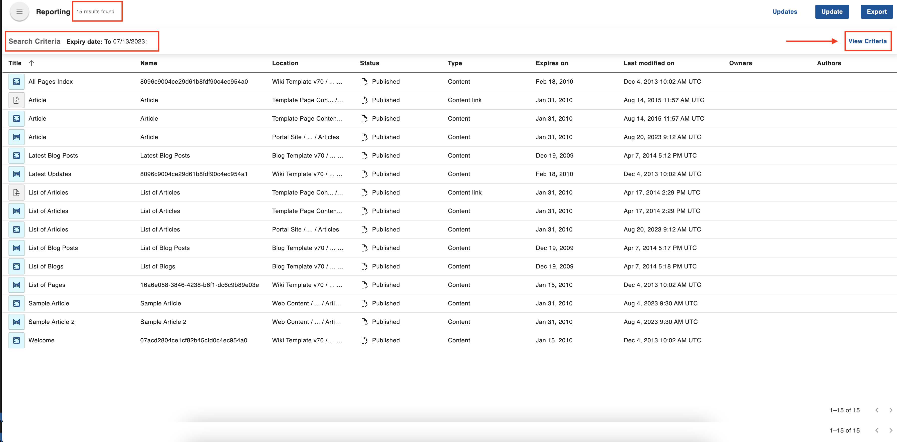

6.  The top drawer appears showing the applied search criteria. Click the ** Add** button to add another search criteria.
    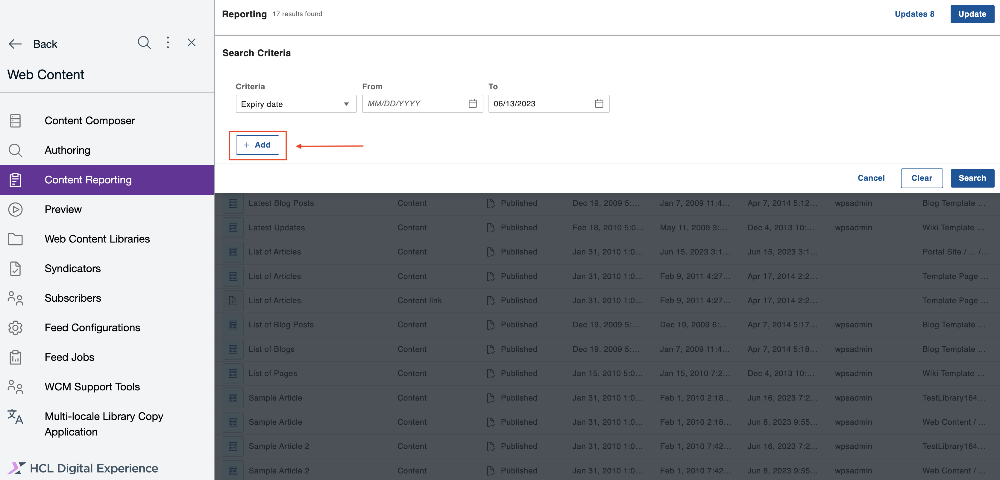

7.  The **Criteria** dropdown is added under the previously added criteria. Select another search criteria from the dropdown menu. All the other criteria are displayed as options except for the already selected criterion. 
    

8.  Select the **Owner** criteria from dropdown. This adds a typeahead input field where you can select the **User**. The list of matched users is displayed as auto-suggested options according to the input value as you type. Select the users from auto-suggested options. A checkmark appears to the left of the selected user to indicate that it has been selected. Click **Search** to apply the criteria. After clicking **Search**, the system displays a set of search results that fit the search criteria as described in Step 5.
    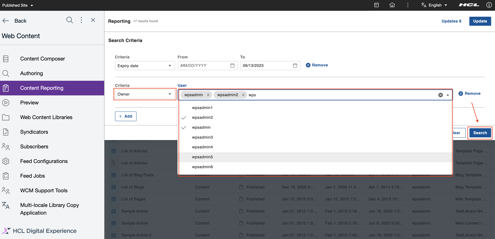

9.  For adding the **Author** search criteria, click the **View Criteria** to open the top drawer and repeat Steps 6 and 7 consecutively. Select the **Author** criteria from the dropdown menu. This adds a typeahead input field where you can select the **User**. Add users from the auto-suggested list and click **Search** to apply the criteria. After clicking **Search**, the system displays a set of search results that fit the search criteria as described in Step 5.
    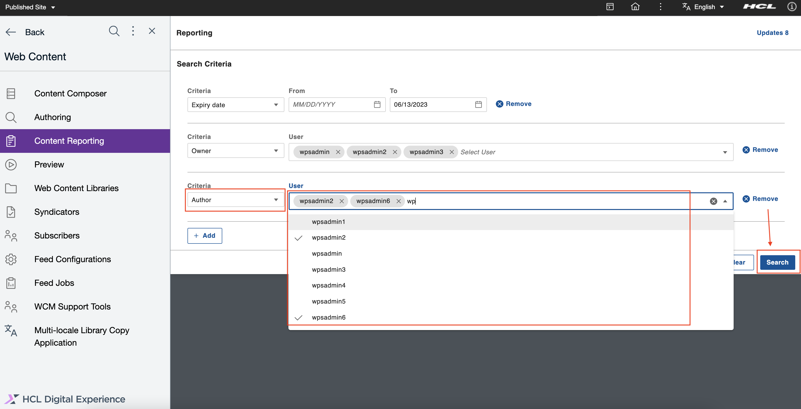

10. For adding the **Item type** search criteria, click the **View Criteria** to open the top drawer and repeat Step 6 and 7 consecutively. Select the **Item type** criteria from dropdown menu. This adds a multi-select dropdown input field for **Item type** selection.
    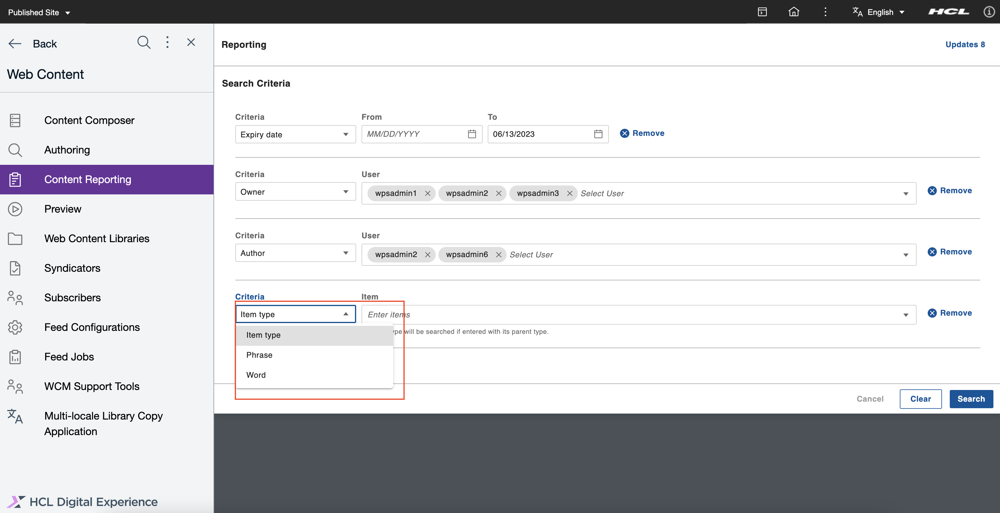

11.  Select one or more item types from **Item type** dropdown list. You can also type in the input field to get an auto-suggested list of matching item types. Click **Search** to apply the criteria. After clicking **Search**, the system displays a set of search results that fit the search criteria as described in Step 5.
    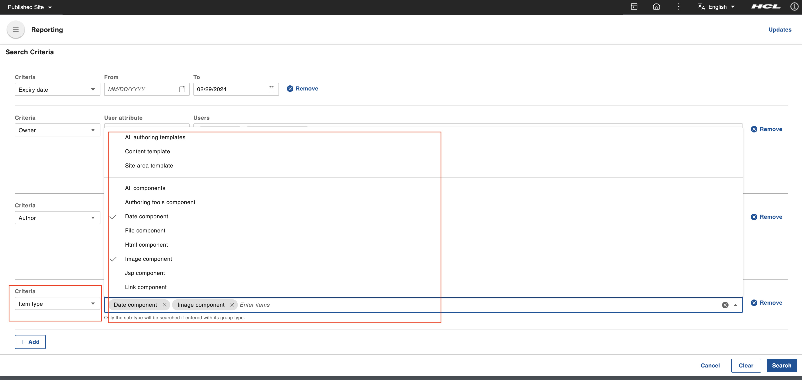

12. For adding the **Phrase** search criteria, click the **View Criteria** to open the top drawer and repeat Step 6 and 7 consecutively. Select the **Phrase** criteria from the dropdown menu. This adds a text input field for the **Phrase** criteria. Enter a phrase (for example, *Sample Article*) in the **Phrase** field. Only one phrase can be searched per criteria line. Click **Search** to apply the criteria. After clicking **Search**, the system displays a set of search results that fit the search criteria as described in Step 5.
    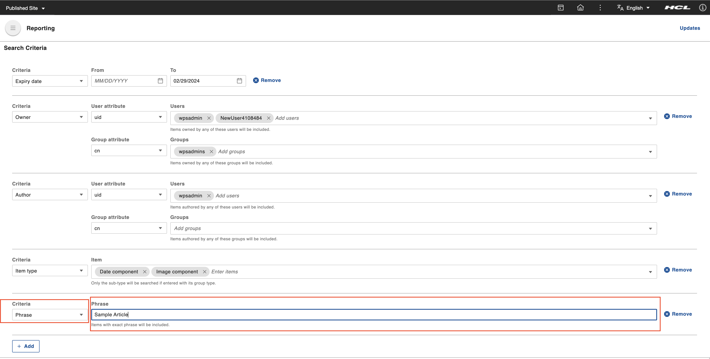

13. For adding the **Word** search criteria, click the **View Criteria** to open the top drawer and repeat Steps 6 and 7 consecutively. Select the **Word** criteria from the dropdown menu. This adds a text input field for the **Word** criteria. This criteria will search for words within attributes such as titles, description, name, and keywords. Enter a few words (for example, *wps*, *test*) in the **Words** field and click **Search** to applythe criteria. After clicking **Search**, the system displays a set of search results that fit the search criteria as described in Step 7.
    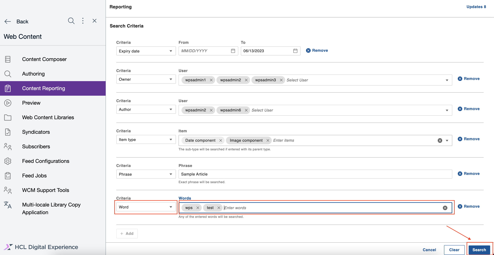

14. For removing already added search criteria, click the **Remove** button. Clicking the **Remove** button removes the criteria and makes it available in the criteria list to add again.
    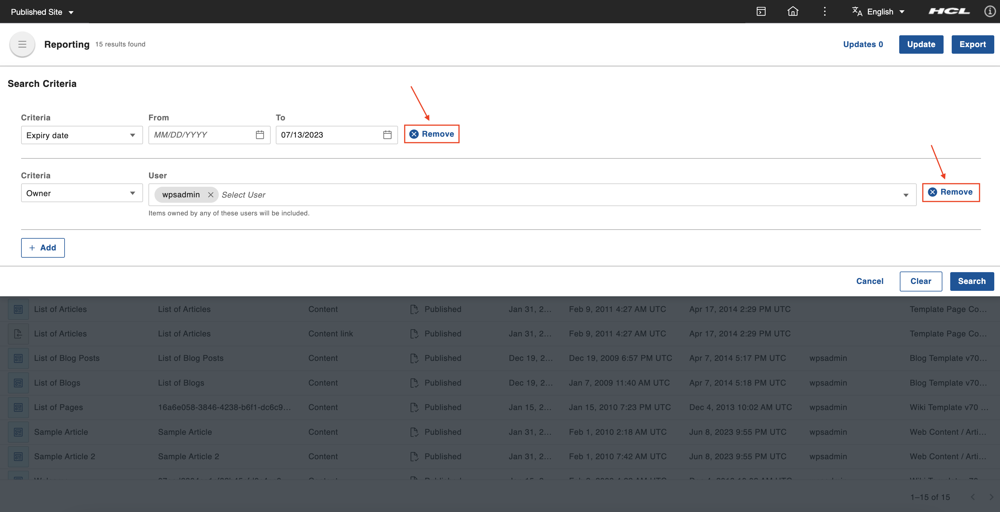

15. For removing multiple selected criteria, click the **Clear** button.
    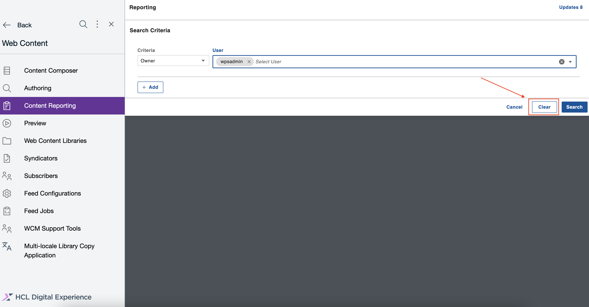
