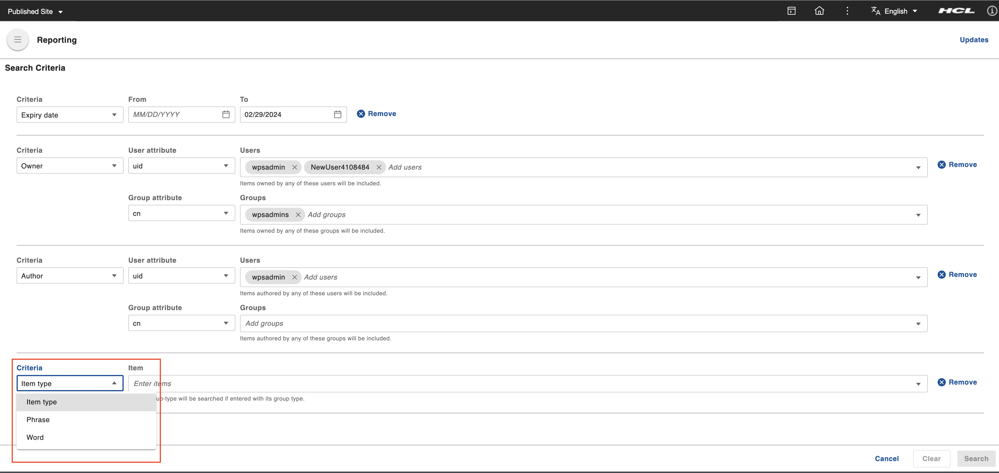
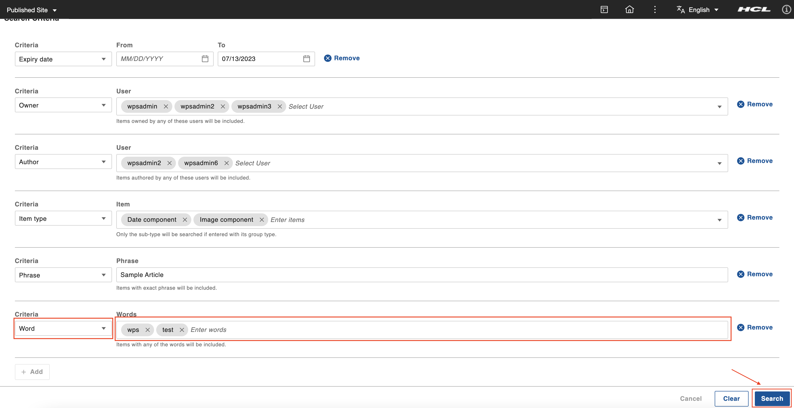

# Generate content report

This section details how to genearte content report in HCL Content Reporting.

## Prerequisite

Content Reporting should be installed and configured in HCL Digital Experience 9.5 release update CF213 or higher. See instructions to install to supported container environments to the [Install HCL Digital Experience 9.5 Content Reporting](../installation/index.md) topic.

## Generating a Report

A report, in its raw form, is simply a list of items that matches a set or combined sets of criteria.
Content managers need to generate a report of the content items that he is planning to analyze or update. He has a set of criteria that the content items has to match. He should be able to combine those criteria into a single report to get the list of items he has to update.

1.  Log in to your HCL Digital Experience 9.5 platform and select **Web Content**, then select **Content Reporting** from the Practitioner Studio navigator.

    

2.  On the search criteria section, select any of the criteria for generating report of matching contents from **Criteria** dropdown.
    

    !!!note
        The respective dynamic fields of each criteria will be displayed upon selection. User can perform content searching by any or all of these search criterias.

3.  Select **Expiry date** criteria from dropdown and this will add two date input fields for **From** date and **To** date respectively.
    

4.  Click on calender icon in **From** date or **To** date and a calendar will be opened. Select proper **From** date and **To** date from calendar and the click on **Search** button.
    

    !!!note
        Filling up both date aren’t mandatory and only one is needed to proceed. Entering only the **From** date will search items from that date onwards. Entering only the **To** date will search items from on and before that date. Entering the same date in the **From** and **To** dates will search that one specific date.

5.  Upon clicking **Search**, the system will now display a set of search results that fit the search criteria. Total number of results shown at top (In below image - 17 results found). The number of matching results helps the user make more informed query reformulations. Applied search criteria information is also displayed at top left (In below image - Expiry date: To 06/13/2023;). On top right, click on **View Criteria** to open the top drawer and display the applied search criteria.
    

6.  The top drawer would be open with earlier applied search criteria as shown in image. Click on **Add** button to add another search criteria.
    

7.  Next **Criteria** dropdown will be added under the previously added criteria. Select another search criteria from drop down (Other criteria will be displayed as options in the dropdown except the already added criteria).
    

8.  Select **Owner** criteria from dropdown and this will add a typeahead input field for **User** selection. List of matched users will be displayed as auto-suggested options according to the input value as the user types. Select the users from auto-suggested options. A checkmark will appear to the left of the selected user as an indicator. Click **Search** to apply search. Upon clicking **Search**, the system will now display a set of search results that fit the search criteria as described in step - 5.
    

9.  For adding **Author** search criteria, click on **View Criteria** to open the top drawer and repeat step - 6 and step - 7 consecutively. Select **Author** criteria from dropdown and this will add a typeahead input field for **User** selection. Add users from auto-suggested list and click **Search** to apply search. Upon clicking **Search**, the system will now display a set of search results that fit the search criteria as described in step - 5.
    

10. For adding **Item type** search criteria, click on **View Criteria** to open the top drawer and repeat step - 6 and step - 7 consecutively. Select **Item type** criteria from drop down and this will add a multi select dropdown input field for **Item type** selection
    

11.  Select one or more item types from **Item type** dropdown list. User can also type in input field to get auto-suggested list of matching item types. Click **Search** to apply search. Upon clicking **Search**, the system will now display a set of search results that fit the search criteria as described in step - 5.
    

12. For adding **Phrase** search criteria, click on **View Criteria** to open the top drawer and repeat step - 6 and step - 7 consecutively. Select **Phrase** criteria from dropdown and this will add a text input field for **Phrase** criteria. Enter a phrase (For example - Sample Article) in input text field. Only one phrase can be searched per criteria line. Click **Search** to apply search. Upon clicking **Search**, the system will now display a set of search results that fit the search criteria as described in step - 5.
    

13. For adding **Word** search criteria, click on **View Criteria** to open the top drawer and repeat step - 6 and step - 7 consecutively. Select **Word** criteria from dropdown and this will add a text input field for **Word** criteria. This criteria will search for words within attributes such as titles, description, name, and keywords. Enter a few words (For example - wps, test etc.) in input text field and click **Search** to apply search. Upon clicking **Search**, the system will now display a set of search results that fit the search criteria as described in step - 5.
    

14. For removing already added search criteria, there is a **Remove** button. Clicking on **Remove** button will remove criteria and make it visible in available criteria list to add again.
    

15. For removing multiple already selected criteria, user can click on **Clear** button.
    