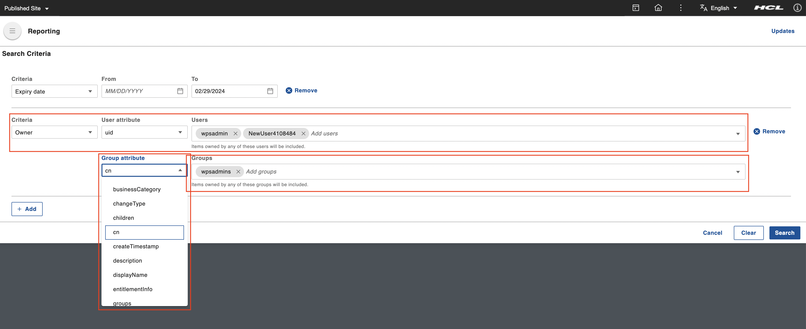
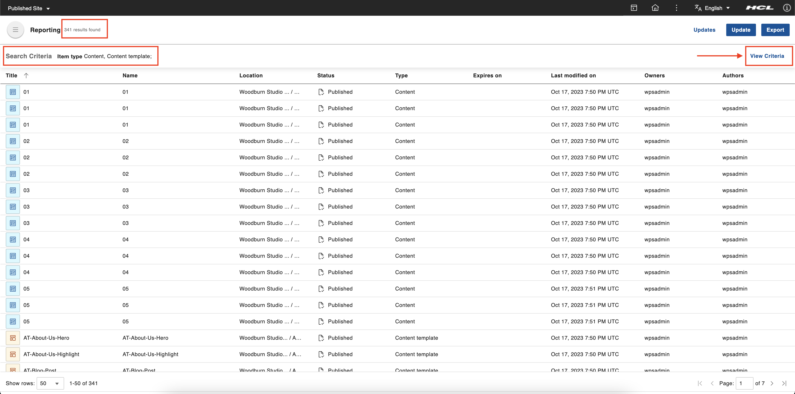
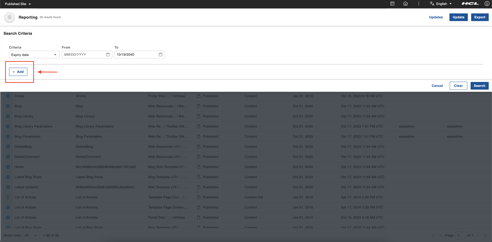
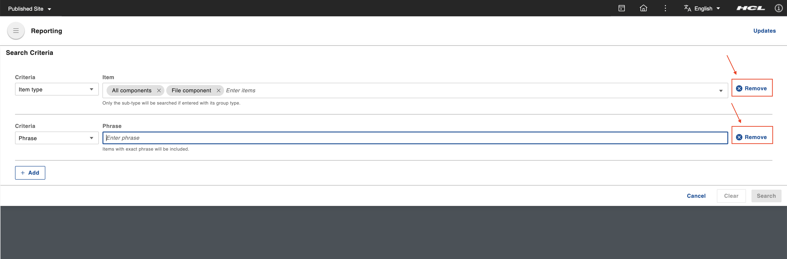
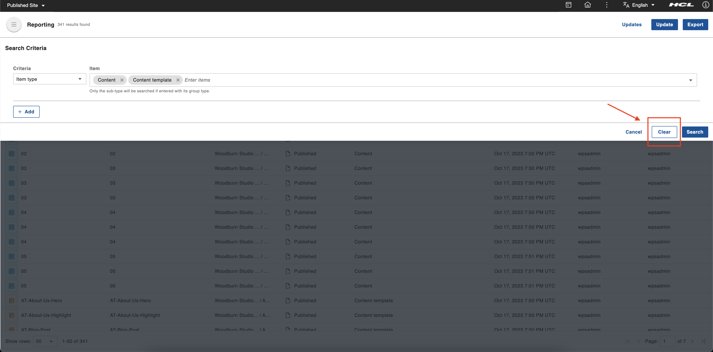

# Generating a content report

This section details how to genearte content report in HCL Content Reporting.

## Prerequisite

Content Reporting should be installed and configured in HCL Digital Experience 9.5 release update CF213 or higher. For instructions on installing supported container environments, see the [Install HCL Digital Experience 9.5 Content Reporting](../installation/index.md) topic.

## Generating a report

A report is a list of items that matches a set or combined sets of criteria. Content managers generate reports of content items that they are planning to analyze or update. They have a set of criteria that the content items have to match. In this feature, content managers can combine the required criteria into a single report to get the list of items that need updating.

1.  Log in to your HCL Digital Experience 9.5 platform and select **Web Content**, then select **Content Reporting** from the Practitioner Studio navigator.

    

2.  On the **Search Criteria** section, select a criteria to generate a report of matching contents.
    

    !!!note
        The dynamic fields of each criteria are displayed upon selection. You can perform content searching by any or all of these search criteria.

    In the **Criteria** dropdown, you can select any of the following:

    - **Expiry date**
        When you select the **Expiry date** criteria, two date input fields appear: **From** and **To**.

        

        Click the calender icon in the **From** or **To** field to display the calendar. Select the **From** date and the **To** date from calendar and the click **Search**.
        
        

        !!!note
            Filling up both date fields is not mandatory and only one is needed to proceed. Entering only the **From** date searches items from that date onwards. Entering only the **To** date searches items on and before that date. Entering the same date in the **From** and **To** dates searches items in that one specific date.

    - **Owner**
        Selecting the **Owner** criteria adds a the **User** field, a typeahead input field where you can select the owners of the items you want included in your report. The list of matched users is displayed as auto-suggested options according to the input value as you type. Select the users from auto-suggested options. A checkmark appears to the left of the selected user to indicate that it has been selected. 
        
        
    
    - **Author**
        Selecting the **Author** criteria adds the **User** field, a typeahead input field where you can select the authors of the items you want included in your report. The list of matched users is displayed as auto-suggested options according to the input value as you type. Select the users from auto-suggested options. A checkmark appears to the left of the selected user to indicate that it has been selected. 
        
        

    - **Item type**
        Selecting the **Item type** criteria adds the **Item** field, a multi-select dropdown input field where you can select the item type of the items you want included in your report. 
        
        

        Select one or more item types from the **Item** dropdown list. You can also type in the input field to get an auto-suggested list of matching item types.

        

    - **Phrase**
        Selecting the **Phrase** criteria adds the **Phrase** field, a text input field where you can enter a phrase that would match the items you want included in your report. Enter a phrase (for example, *Sample Article*) in the **Phrase** field. Only one phrase can be searched per criteria line. 
        
        

    - **Word**
        Selecting the **Word** criteria adds the **Words** field, a text input field where you can enter words that would match the items you want included in your report. Enter a few words (for example, *wps*, *test*) in the **Words** field. This searches for words within attributes such as titles, description, name, and keywords.
        
        

    !!!note
        After you select a criteria, it will not be available for selection again in the **Criteria** dropdown menu. 

3. After you have selected the search criteria, click **Search**.

    The system displays a set of search results that fit the selected criteria. The total number of results is shown at the top (for example, *17 results found*). The number of matching results helps the user make more informed query reformulations. The applied search criteria information is also displayed at the **Search Criteria** bar (for example, *Expiry date: To 06/13/2023;*).

    On the top right corner, the **View Criteria** opens the top drawer and displays the applied search criteria.

    

4. (Optional) To add more criteria to your search, click **View Criteria**. Click the **Add** button to add another search criteria.
    
    

5. (Optional) To remove already added search criteria, click the **Remove** button. Clicking the **Remove** button removes the criteria and makes it available in the **Criteria** dropdown menu again.
    
    

6. (Optional) To remove multiple selected criteria, click the **Clear** button.
    
    
