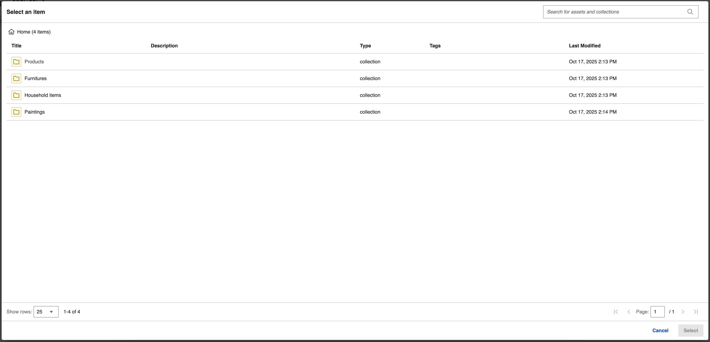
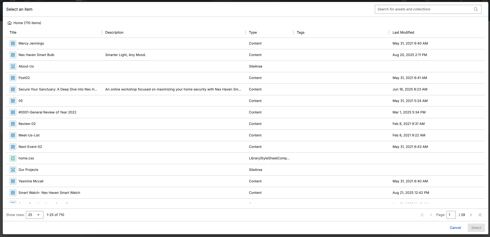
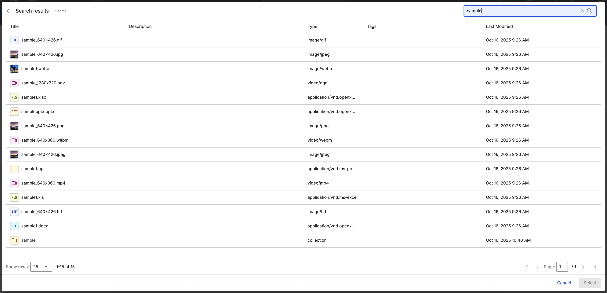

# Using DX Picker

This section describes how to use the HCL Digital Experience (DX) Picker feature.

!!! note
    You must have at least User access to use DX Picker. You must also have access to the content source to display items, unless it has anonymous access. For more information, refer to [Working with resource permissions](../../../deployment/manage/security/people/authorization/controlling_access/working_with_resource_permission/index.md).

The following content sources are available for DX Picker:

- [Digital Asset Management (DAM)](../../digital_assets/index.md)
- [Java Content Repository (JCR)](../../../build_sites/search/cfg_dx_search/search_service_params/jcr_srrcfgsrvc.md)
- [Web Content Manager (WCM)](../../../manage_content/wcm_authoring/authoring_portlet/index.md)

When DX Picker is opened for the first time using the default content source, the list of root collections from the DAM is displayed.

!!! note
    To understand how DX Picker opens with a default content source after an item has been selected, refer to [Selecting an item](#selecting-an-item).

  

When you open DX Picker with a different content source type, the list of objects from the content source is displayed.

  

The details shown are the following:

- **Title**: The title or identifier of the object
- **Description**: The text that describes the object
- **Type**: The type of object shown
- **Tags**: The tags or Keywords associated with the object
- **Last modified date**: The date the object was last updated

## Selecting an item

Clicking on an item row enables the **Select** button on the lower right corner of the screen. This button allows you to select a particular item. Any items from the content source can be selected.

  

Selecting an item triggers the [`HCL-DX-PICKER-SELECT`](./access.md#dx-picker-events) event. This action also saves the `last known location`, so that opening DX Picker again will automatically display the location of the last selected item.

!!! note
    The persisting last known location is `saved` until the session is ended or expires, after which it will reset to the default location.

## Navigating collections

Select a collection row to open the collection and view its list of items.

!!! note
    Collections must contain at least one item.

  

## Using Search

To search for an item, enter a keyword in the search textbox and select the Search button or press Enter.

The search function currently scans the following fields:

- `title`
- `description`
- `type`
- `tags` (keywords)
- `userid` (creator or owner)
- `text` (extracted content)

!!! note
    You can select items or navigate to DAM collections through the search results.

  

## Previewing an item

To open an item in **Preview** mode, hover on the row and click the eye icon beside the item title.

!!! note
    Only DAM-supported images and video files are available for preview.

  

You can perform the following actions in Preview mode:

  

1. To choose the rendition of the image you want to view, click the dropdown and select the specific rendition. For more information on renditions, refer to [Renditions](../renditions/index.md).

2. To download the previewed item, click the **Download** icon. For images with renditions, only the selected rendition is downloaded.

3. To select an item, click the **Select** button.

    - Changing the rendition will change the `selectedRendition` inside the `_source` property. For more information, refer to [Picker Events](./access.md#dx-picker-events).
    - Selecting an item from Preview triggers the [`HCL-DX-PICKER-PREVIEW-SELECT`](./access.md#dx-picker-events) event.

4. To navigate to the other supported file formats inside the collection, click the **Previous** and **Next** buttons.  

5. To inspect the image, click the **Zoom In** and **Zoom Out** buttons.

    !!! note
        This functionality is only available for images.
