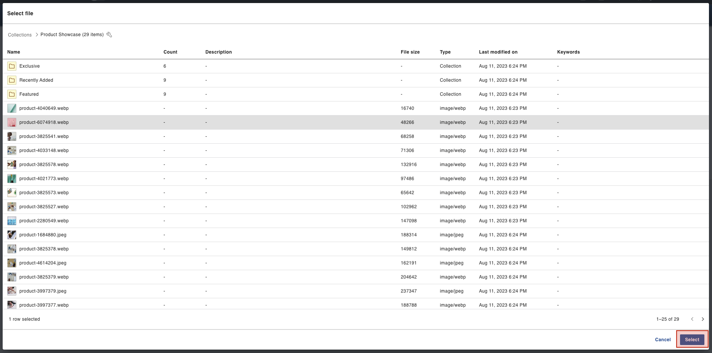
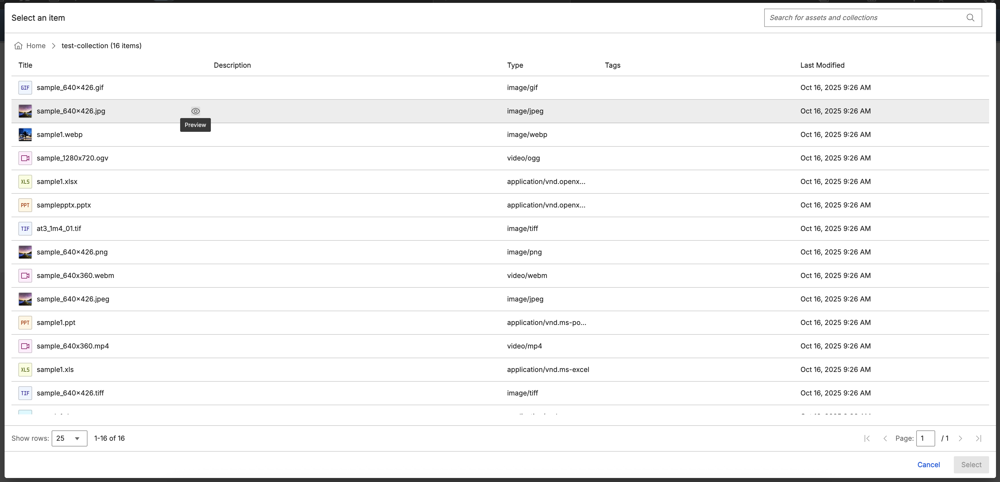
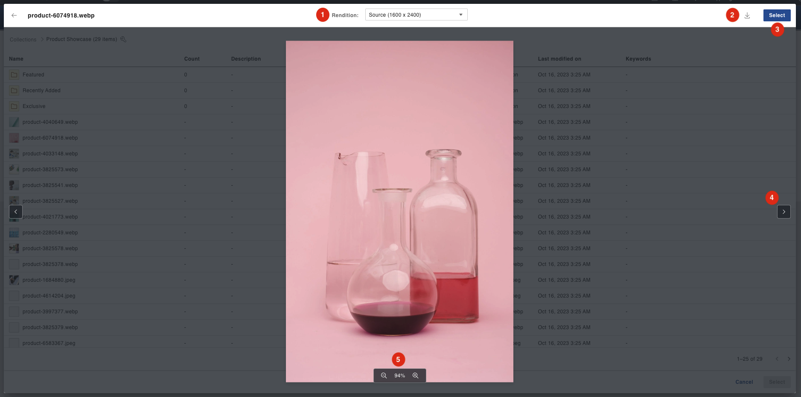

# Using DX Picker

This section details the basic usage of the HCL DX Picker.

## Prerequisite

DX Picker must be installed and configured in HCL Digital Experience 9.5 release update CF214 or higher. For instructions on installing DX Picker on supported environments, see the [DX Picker Installation](../installation/index.md) topic.

## Using DX Picker

When you open DX Picker, a list of collections from the Digital Asset Management is displayed.

  

The details shown are the following:

- **Name** - Name of the collection.
- **Count** - How many items are inside a particular collection.
- **Description** - Text describing the collection.
- **Last modified date** - Date when the collection was last updated.

### Navigating collections

Clicking on a collection row directs the user inside that collection. The list of items inside a collection is shown.

  

The following additional details are shown when inside a collection:

- **File Size** - Size of an asset.
- **Type** - Type of item shown.
- **Keywords** - Keywords associated with an asset.
 
### Selecting an asset

Clicking on an asset row enables the select button on the lower right corner of the screen. The **Select** button allows users to select a particular asset.

  

Selecting an asset triggers the following event:

    HCL-DX-PICKER-SELECT

### Display Properties

Clicking on the wrench icon next to the name of a collection/asset or in the breadcrumbs displays the Properties Panel of that item.

For the Collection:

  

For the Asset:

  

### Previewing an asset

Clicking on the eye icon next to the name of an asset will open the image in Preview mode.

!!! note
    The Preview mode can also be access inside the Properties panel.

  

The following can be done inside Preview mode:

  

1. **View image renditions**

    Users can select via a dropdown which rendition of the image they want to view.

    !!! note
        For more information on renditions, refer to [Renditions](../../renditions/index.md).

2. **Download image**

    Clicking the download icon will allow the users to download the previewed image.

    !!! important
        Renditions will not be part of the download, only the source image will be downloaded.

3. **Select image**

    Users can also trigger the selection of an asset when in Preview mode.

4. **Navigate between assets**

    Users can click the previous and next button to navigate other assets inside a collection.

5. **Image zoom in/out**

    Clicking on the zoom in/out button allows the user to inspect the image precisely.
