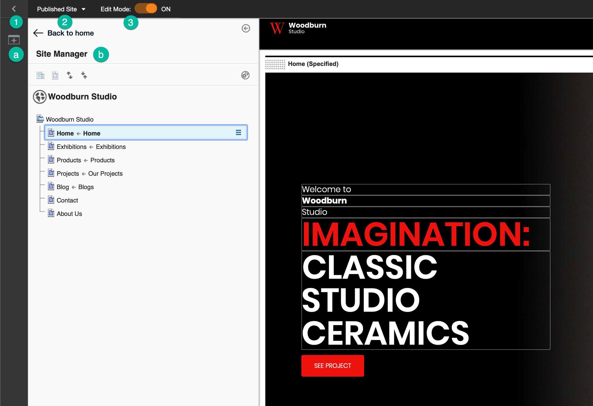
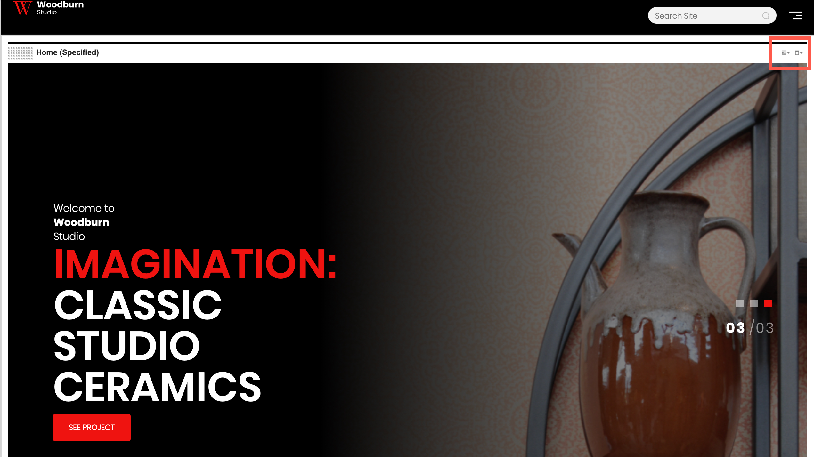

# Site Manager

The Site Manager provides access to common content authoring tools and shows a complete view of the the site’s navigation. Without leaving the context of the website, content authors can create and modify pages and content items, create vanity URLs, preview and publish changes to your website, and more. The Site Manager combines the features of both an authoring system and a delivery system.

The Site Manager has the following editing options:

- Using the site toolbar
- In-place editing
- Inline editing
- Editing using the web content viewer 

These options are further discussed in this section.

## Site toolbar

The following image shows you the different parts of the site toolbar. 

1. Use this toggle to open and close the site toolbar. By default, the toolbar provides access to page components and applications to add to your page. After clicking this icon, the following items are displayed:

    1. Click this **Add page components and applications** icon to add page components and applications. 

    2. The Site Manager shows a comprehensive view of a website's hierarchy and navigation. To view a page in your website, click the name of that page in the hierarchy. The page loads in the page view frame. 
    
        In the Site Manager, you can:

        - Show content items in the tree view.
        - Show hidden pages in the tree view.
        - Expand the tree view.
        - Collapse the tree view.
        - For every item on the tree, you can click the **Context menu** icon to open the Context menu. This menu shows you more available actions for your selected page. 

2. Click this icon to open the **Project menu**. In a project, you can group content and page edits together to make managing and publishing related changes easier. From the **Projects menu**, you can create a new project or manage existing projects. For more information, see [Projects: Organizing and coordinating changes to your site](../../../build_sites/create_sites/adding_pages_content_more/projects_organizing_coord_chgs_site/index.md).

3. Toggle this switch to go on or off Edit mode. Edit mode must be on to edit pages and content items in the website. When you turn on Edit mode, the site toolbar and Site Manager open automatically.

## In-place editing

In-place editing enables users with edit access to a content item to edit that item from within the web page itself instead of using the authoring portlet. 

The inline editing feature requires:

-   HCL Portal version 8.0.0.1 or later, or Web Content Manager version 8.0.0.1 or later.
-   A theme that supports Dojo. The themes that are included with HCL Portal are enabled for Dojo.

    If you create a custom theme, in addition to supporting Dojo, the new theme must reference the `wcm_inplaceEdit` theme module. For information about creating themes that support Dojo, see [Dojo Toolkit](../../../extend_dx/development_tools/dojo/dojo_overview.md).

-   When using inline editing with page components, users must have Editor access to the Portal Site library.

!!! important
    This feature can be enabled or disabled by enabling or disabling the content targeting feature and application objects. For more information, see *Installing content targeting features and application objects*.

!!! note
    When a user tabs between in-place editing enabled fields, users need to click each field in turn to access in-place editing for each field.
    
## Inline editing

Inline editing enables users with edit access to modify a content item through an authoring portlet as shown in the example below.

Inline item creation can be enabled for authoring tool components so that users can create a new content item without having to access the authoring interface. For more information, see [Inline Item Creation with Authoring Tool Components](../../../manage_content/wcm_authoring/authoring_portlet/content_management_artifacts/elements/authoringtools_element/wcm_dev_elements_authoring-tools_inline.md).

## Web content viewer

On the upper right corner of a page, you can find the Content menu and Portlet menu buttons:

### Editing using the Content menu

Click the **Content menu** icon to display the following actions:

- **Configure Spot** - Allows you to select the type of content to display in a web content viewer. For more information, see [Configure your content spot](../../../build_sites/create_sites/content_spot/index.md).
- **Open Read Form** - Opens a read-only form of the selected page's properties.
- **Open Edit Form** - Opens an editable form where you can modify the selected page's properties. 
- **Delete** - Deletes the page.

### Editing using the Portlet menu

Click the **Portlet menu** icon to show the following actions:

- **Edit Shared Settings** - Opens the Web Content Viewer where you can manage the page's properties, portlet settings, and several advanced options such as adding or receiving links and adding plug-ins. 
- **Maximize** - Maximizes the page.
- **Minimize** - Minimizes the page.
- **Help** - Opens a new window containing a help topic. 
- **Site Promotions** - Allows you to manage site promotions. 
- **Analytics Tags** - Allows you to manage analytics tags.
- **Delete** - Deletes the page. 
- **Hide** - Hides the page.

For examples on how to use the Site Manager, see [Examples of using the Site Manager in Woodburn Studio](site_manager_samples.md).

-   **[Examples of using the Site Manager in Woodburn Studio](site_manager_samples.md)**  
This topic provides examples of how you can use the Site Manager through the Woodburn Studio demo site. You can perform the same actions in your own site.
-   **[Updating sample template items for inline editing after an upgrade installation | HCL Web Content Manager](wcm_dev_inline_upgrade.md)**  
HCL Web Content Manager includes sample content such as web content template pages and predefined portlets that you can add to pages to render content. If you upgrade, these sample web content template items continue to use the editing method of the earlier release. To use the inline editing method with the earlier template items, you must complete several manual steps.
-   **[Enabling inline editing for content items](wcm_dev_inline_tags.md)**  
You can enable inline editing for content item fields in your site design.

<!--
## HCL Software Academy course

For an introduction and a demo on how to use the Site Manager, go to [Site Manager](https://academy.hcltechsw.com/component/axs/?view=sso_config&id=1&forward=https%3A%2F%2Facademy.hcltechsw.com%2Fcourses%2Flesson%2F%3Fid%3D291). To try it out yourself, refer to [Site Manager Lab](https://academy.hcltechsw.com/images/Lc4sMQCcN5uxXmL13gSlsxClNTU3Mjc3NTc4MTc2/DS_Academy/DX/Introduction/HCL_Digital_Experience_Getting_Started_Lab.pdf) and corresponding [Site Manager Lab Resources](https://academy.hcltechsw.com/images/Lc4sMQCcN5uxXmL13gSlsxClNTU3Mjc3NTc4MTc2/DS_Academy/DX/Introduction/HCL_Digital_Experience_Getting_Started_Lab_Resources.zip).-->

???+ info "Related information"
    - [Creating an editable property tag](../../wcm_authoring/authoring_portlet/content_management_artifacts/tags/creating_web_content_tags/wcm_dev_item-details_property_edit.md)
    - [Creating an editable element tag](../../wcm_authoring/authoring_portlet/content_management_artifacts/tags/creating_web_content_tags/wcm_dev_referencing_elements_edit.md)
    - [Creating an If Edit Mode tag](../../wcm_authoring/authoring_portlet/content_management_artifacts/tags/creating_web_content_tags/wcm_dev_tag_ifeditmode.md)
    - [Creating an authoring tools element](../../wcm_authoring/authoring_portlet/content_management_artifacts/elements/authoringtools_element/index.md)

