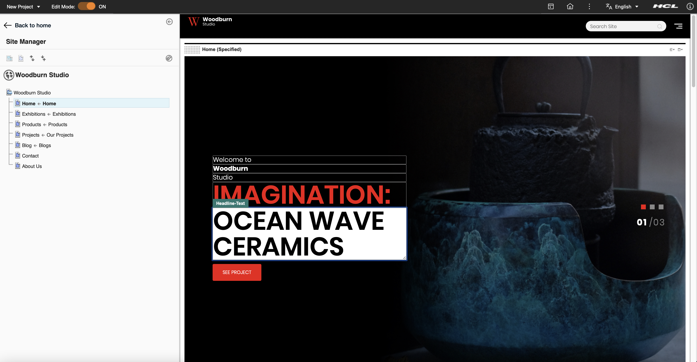

# Examples of using the Site Manager in Woodburn Studio

This topic provides examples of how you can use the Site Manager through the Woodburn Studio demo site. You can perform the same actions in your own site.

## Using the site toolbar
With the site toolbar, you can add and modify pages and content as needed. This example shows you the several actions available through the **Context menu**. 

1. In the Woodburn Studio site, switch the **Edit Mode** toggle button to **ON**. 

    Going into Edit mode opens the site toolbar and allows you to create and modify content. The left side of the screen shows the tree view of Woodburn Studio.

2. On the Woodburn Studio tree, click the menu icon of a specific page to open the Context menu. A list of actions available is displayed. You can:

    - Create a child page.
    - Create a sibling page.
    - Create content.
    - Copy or move the page.
    - Open Content Explorer.
    - Rename the page.
    - Open Page Settings.
    - Delete the page. 

## In-place editing
Through in-place editing, users with edit access can directly modify the content of a webpage. This section shows examples on how you can use this feature. 

1. In the Woodburn Studio site, switch the **Edit Mode** toggle button to **ON**. 

    Going into Edit mode allows you to create and modify content.

2. Make your changes directly on the page view frame.

    With in-place editing, you can:

    - Change the content of text boxes. You can click on a text box and it switches to an editable text box. In this example, you can change the content of the **Headline-Text** box.
        

    - Use buttons to follow links to other pages. 

    - Change images. Click on an image and a window appears. You can upload or remove an image, modify the image attributes, and control the different renditions of an image. Click **Save** to save your changes.
        

## Inline editing

Unlike in-place editing where you can directly edit content items on the page review frame, inline editing is done through authoring portals. The example below shows you how to add an article in your demo site. 

1. In the Woodburn Studio site, switch the **Edit Mode** toggle button to **ON**. 

    Going into Edit mode opens the site toolbar and allows you to create and modify content. 

2. Click the **Add page components and applications** icon to add components to the demo site. 

    The toolbar expands to display the Page Components and Applications you can add to your site. 

3. Select **Web Content**. 

4. Hover over **List of Articles** and click the plus icon to add this content.

    The newly added content can be found in the bottom part of your site.

5. Click **Create New Article**.

    This opens a new window where you can edit add the name, display title, and the body of your article. 

6. Click **Show Hidden Fields** to display fields that are not visible in the user interface.

7. Click **Save and Close** to save your changes.

## Editing using the Content menu

In this example, you can edit page properties such as the Site Area properties, CSS, and the Multilingual System Text. 

1. Go to the page you want to edit and click the **Content menu** icon on the upper right corner. 

2. Click **Open Edit Form**. A new window appears where you can modify the properties of the page you are working on. 
    
    

3. Click **Save and Close** to save your changes. 

## Editing using the Portlet menu

In this example, you can modify the various settings of a specific page.

1. Go to the page you want to edit and click the **Portlet menu** icon on the upper right corner.

2. Click **Edit Shared Settings**.

    The **Default Link Content Web Viewer** appears. In this window, you can modify the following aspects of your page:
    
    - Content (for example, content behavior and appearance)
    - Profile (for example, site areas and authoring templates)
    - Portlet Settings (for example, portlet display settings and cache options)
    - Advanced Options (for example, links and plug-ins)

3. Click **Apply** to save your changes.

???+ info "Related information"
    - [Adding pages, content, and more](../../../build_sites/create_sites/adding_pages_content_more/index.md)
    - [The Woodburn Studio demo site](../../../build_sites/woodburn_studio/index.md)
    

