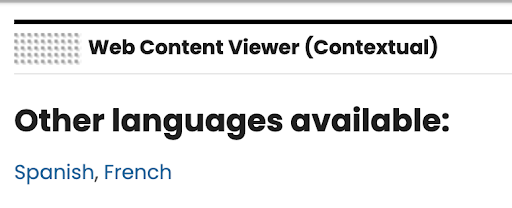

# Servlet render-time navigation extension

This extension enables navigation between equivalent published content in different locales within a presentation template at render time. You may use a few ready to use components in the ML Configuration web content library: 

- **HTML – ServletPath** provides a simple way to access the servlet path. You can also retrieve it using `[PathCmpnt type="servlet"]`.  

- **ItemPathReadLink** lets you open items quickly. It is managed by an authoring component configured with the read action `<a href='[Placeholder tag="href"]'>[Placeholder tag="sitepath"]</a>`.  

- **JSP: ML Portal Locale Switcher** lets you switch the current locale in DX.  
- **JSP: ML Locale Nav** displays links to other multilingual versions of the current document.

To add localized rendering links to content items, reference the JSP component ML Configuration/JSP – ML Locale Nav either in the associated presentation template or in a component or element that is also referenced in the template.

    
## How it works

- Every time you render a page that includes the ML Configuration/JSP - ML Locale Nav component, all libraries that are configured in the multilingual configuration file are searched for all items that match the current content item.
- To be matching, the content must be located under an equivalent site path and have the same name.
- A link is created for each matching localized content item that is displayed in the language of the current user.
- This extension works for both servlet-rendering and portlet-rendering, in portlet-rendering it add links only for content displayed in the current portlet.

!!! note
    If you use ML Configuration/JSP – he ML Portal Locale Switcher enables localized navigation across the entire portal, not just within the current portlet. For example, when English, Spanish, and French are configured, the portal displays English as the current language. Clicking Spanish updates your locale to Spanish, and the site displays content in Spanish: 
    
    {target="_blank"}

