# Accessing Presentation Designer

This section provides steps on how to access the Presentation Designer and navigate its user interface workspace.

## Prerequisites

Presentation Designer is installed and deployed by default as part of the CF update process. You can access Presentation Designer from the Practitioner Studio interface.

!!! note
    Presentation Designer is automatically included when you create a virtual portal with Practitioner Studio enabled and web content configured.

To use Presentation Designer, you must have the following minimum set of roles. Note that the roles listed are the minimum; if you have a Manager or Administrator role, you can still access Presentation Designer.

=== "Presentation Designer page"
    The Presentation Designer page requires at least a **User** role to access. Follow the steps below to set this role:

    1. Click the **Administration menu** icon.
    2. Go to **Security** > **Resource Permissions** > **Pages** > **Content Root** > **Practitioner Studio** > **Web Content**.
    3. In the  **Presentation Designer** row, click the **Assign Access** icon to set the **User** role.

=== "Presentation Designer portlet"
    The Presentation Designer portlet requires at least a **User** role to access. Follow the steps below to set this role:

    1. Click the **Administration menu** icon.
    2. Go to **Security** > **Resource Permissions** > **Portlets**.
    3. In the **Presentation Designer portlet** row, click the **Assign Access** icon to set the **User** role.

=== "WCM page"
    The WCM page requires at least a **User** role to access. Follow the steps below to set this role:

    1. Click the **Administration menu** icon.
    2. Go to **Security** > **Resource Permissions** > **Pages** > **Content Root** > **Practitioner Studio**.
    3. In the **Web Content** row, click the **Assign Access** icon to set the **User** role.

=== "WCM Authoring portlet"
    The WCM Authoring portlet requires at least a **User** role to access. Follow the steps below to set this role:

    1. Click the **Administration menu** icon.
    2. Go to **Security** > **Resource Permissions** > **Portlets**.
    3. In the **Web Content Authoring** row, click the **Assign Access** icon to set the **User** role.

=== "WCM_REST_SERVICES"
    WCM_REST_SERVICES requires at least an **Editor** role to access. Follow the steps below to set this role:

    1. Click the **Administration menu** icon.
    2. Go to **Security** > **Resource Permissions** > **Virtual Resources**.
    3. In the **WCM REST SERVICE** row, click the  **Assign Access** icon to set the **Editor** role.

=== "WCM libraries and items"
    WCM libraries and items require at least an **Editor** role to access. Follow the steps below to set this role:

    1. Click the **Web Content menu**.
    2. Go to **Web Content Libraries**.
    3. Click the **Set permissions** icon to set the **Editor** role for any library as needed.

(Optional) To select a library where you are an Editor and display it on the Library Explorer, set the **Privileged User** role on the **WCM Authoring page**. While **Privileged User** access is not needed to use Presentation Designer, this access is still recommended so users can view and edit presentation templates in specific libraries where they hold Editor permissions.

To set the **Privileged User** role:

1. Navigate to the **Administration menu**.
2. Go to **Security** > **Resource Permissions** > **Pages** > **Content Root** > **Practitioner Studio** > **Web Content** > **Authoring**.
3. Click the **Assign Access** icon to set the **Privileged User** role.

Refer to [Working with resource permissions](../../../deployment/manage/security/people/authorization/controlling_access/working_with_resource_permission/index.md) for more information.

## Accessing Presentation Designer

To access the Presentation Designer, follow these steps:

1. Log in to your HCL Digital Experience 9.5 platform, and select **Web Content** from the Practitioner Studio navigator.

    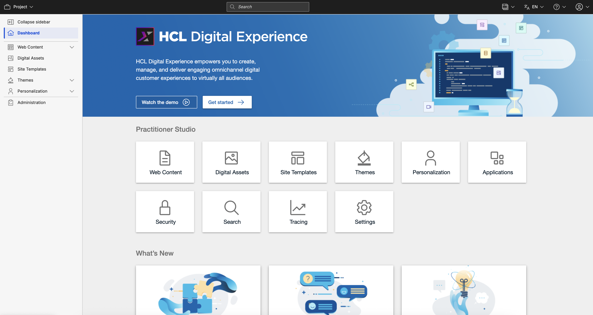

2. In the **Web Content** menu, select **Authoring**.

    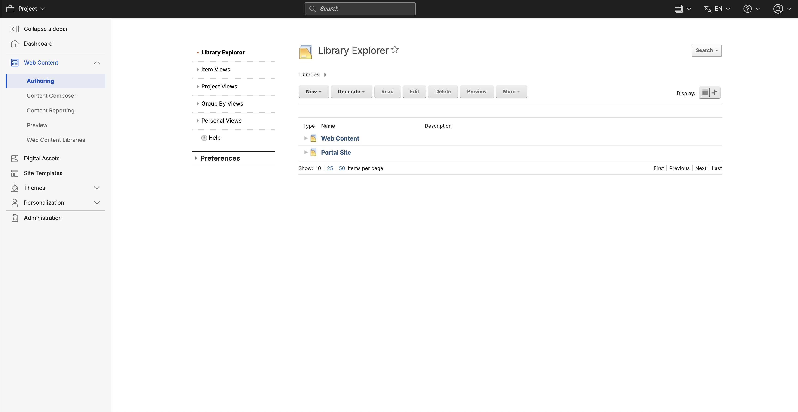

3. In the Authoring portlet, select your library and navigate to the **Presentation Templates**.

    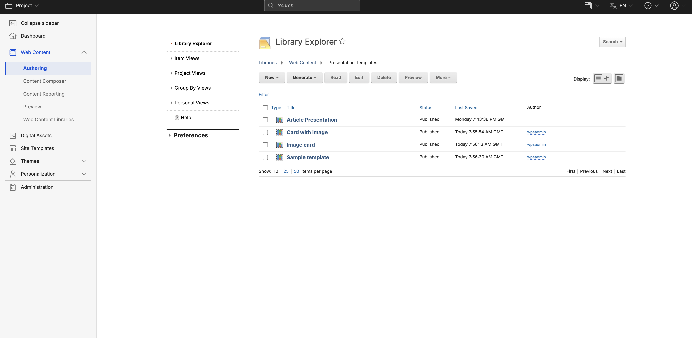

4. Create a new presentation template by clicking **New** > **Presentation Template**.

    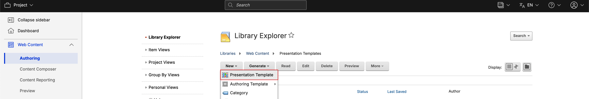

5. In the Presentation Template, leave the markup blank. This way, you can start with a blank canvas in Presentation Designer. Click **Save and Close**.

    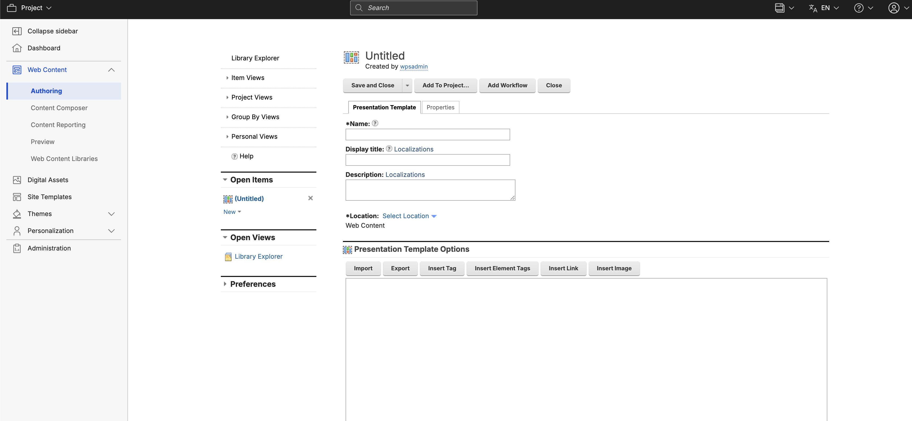

6. Select the presentation template you want to access by checking the box next to its title.

    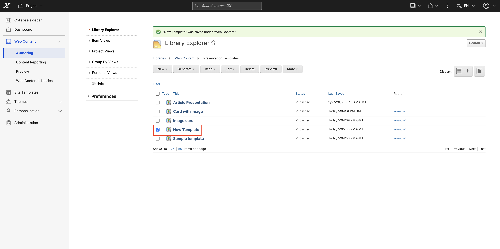

7. Choose how you want to open the presentation template using the action buttons located in the toolbar:

    - **To edit the template in Presentation Designer:** Click the **Edit** dropdown menu and select **Edit in Presentation Designer**. This opens the template in the Presentation Designer with the toggle button set to **Edit mode**.

        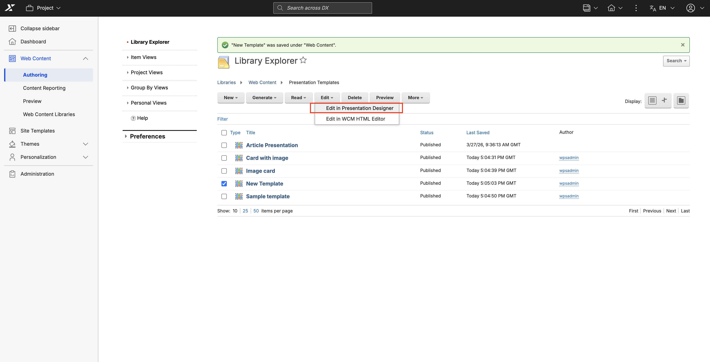

    - **To view the template in Presentation Designer:** Click the **Read** dropdown menu and select **Read in Presentation Designer**. This opens the template in the Presentation Designer with the toggle button set to **Read only**.

        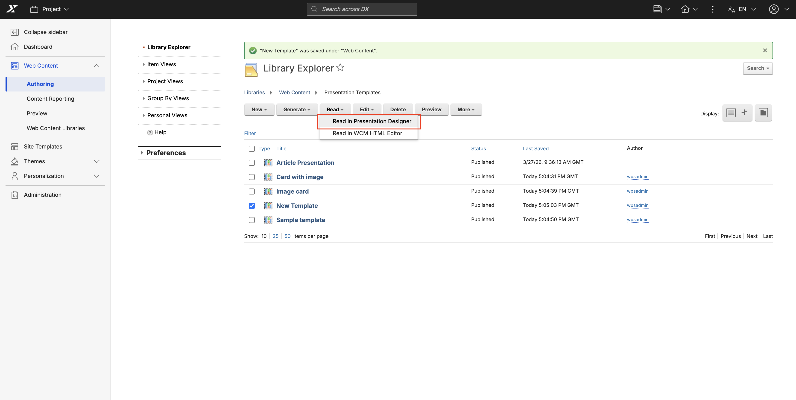

    !!! note
        You can also choose to open the template in the standard WCM HTML Editor by selecting **Edit in WCM HTML Editor** or **Read in WCM HTML Editor** from these same dropdown menus.

8. You can also switch to the Presentation Designer while working within the standard WCM HTML Editor:

    - If you are already viewing a template in the WCM HTML Editor (Read mode), click **Edit > Edit in Presentation Designer** in the action bar to switch to Presentation Designer in edit mode.

        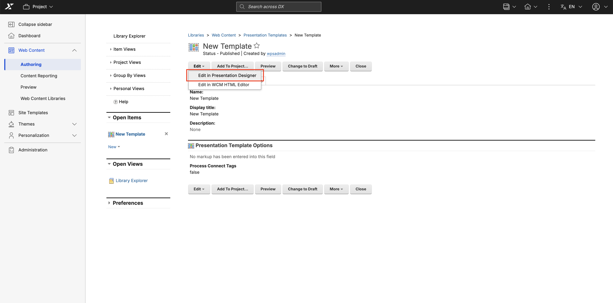

    - If you are already editing a template in the WCM HTML Editor (Edit mode), click **Read > Read in Presentation Designer** in the action bar to switch to Presentation Designer in read-only mode.

        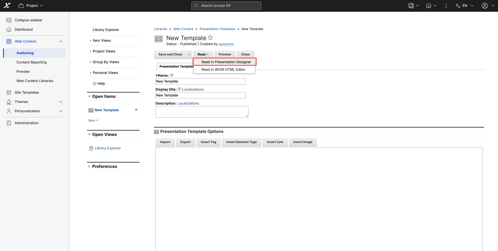

The Presentation Designer user interface appears. You can also use steps 6 to 8 to access any existing presentation template.

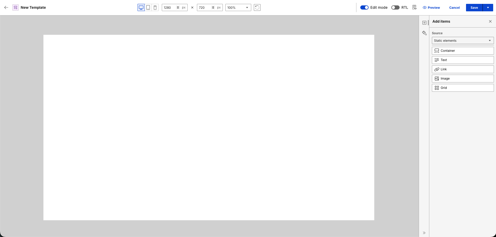

### Presentation Template Locking

To prevent data loss and content collisions in multi-author environments, Presentation Designer automatically locks presentation templates during active editing sessions.

**How presentation template locking works**

- **Lock Acquisition:** Opening a presentation template in **Edit** mode or toggling from Read to Edit mode automatically acquires an editing lock on the presentation template item.
- **Forced Read Mode:** If you attempt to edit a template currently locked by another user, Presentation Designer automatically switches to **Read only** mode and displays a notification identifying the current lock owner (for example, `"{Title}" is locked by {username}`).
- **Lock Persistence during Save:** Clicking **Save** updates the template content while maintaining your active lock so you can continue editing without interruption.
- **Automatic Lock Release:** The lock is automatically released whenever you:
    - Toggle from **Edit** to **Read** mode.
    - Click **Save and Close**.
    - Click **Cancel** or navigate back to the Authoring portlet.

For more information on locked items, refer to **[Locked items](../../../../manage_content/wcm_authoring/authoring_portlet/change_management/item_locks#locked-items)**.

!!! note
    **Lock indicator visibility:** The lock indicator is currently only visible on the Authoring page. No lock indicator is visible on the Presentation Designer's interface.

## The Presentation Designer UI

The Presentation Designer user interface is composed of three main sections:

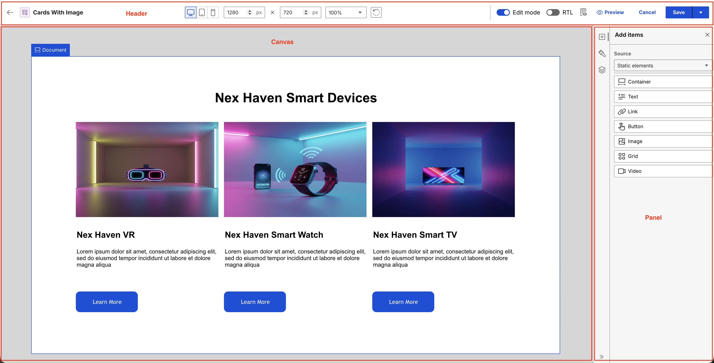

### Toolbar

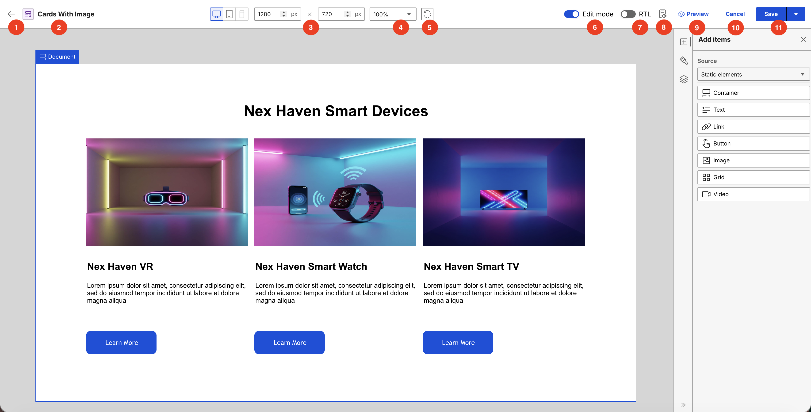

1. **Back** button: Returns you to the source page within the Authoring portlet. The Presentation Designer automatically synchronizes the return URL and preserves your active editing context, language settings, and selected page highlights.
2. **Template Title**: Displays the name of the current presentation template.
3. **[Canvas dimensions](./usage/canvas_settings.md#canvas-dimensions)** settings: Adjusts the width and height properties of the canvas workspace.
4. **[Zoom](./usage/canvas_settings.md#zoom)** selection: Scales the magnification level of the active workspace view.
5. **[Rotate](./usage/canvas_settings.md#rotate)** button: Switches the orientation of the layout canvas between portrait and landscape.
6. **Edit** or **Read** mode toggle: Switches the workspace environment between **Edit** and **Read** modes.
7. **[RTL](./usage/canvas_settings.md#rtl-toggle)** toggle: Switches the canvas orientation between left-to-right (LTR) and right-to-left (RTL) layouts.
8. **[Canvas Context Preview](./usage/context_preview.md#canvas-context-preview)** button: Renders a real-time preview of the template using actual Web Content Manager (WCM) content items to verify data mapping, custom styling, and layouts across different device views before publishing.
9. **[Preview](./usage/context_preview.md#preview)** button: Saves the template and opens a full preview in a separate window with the selected content applied. It automatically detects unsaved changes and prompts you to save the template before generating the file.
10. **Cancel** button: Discards unsaved changes and exits the Presentation Designer to return to the Authoring portlet.
11. **Save** button: Saves the presentation template or opens a dropdown menu to choose **Save and Close**.

### Panel

There are three panels you can use in Presentation Designer: [Add Items](#add-items), [Style Items](#style-items) and [Layers](#layers).

#### Add items

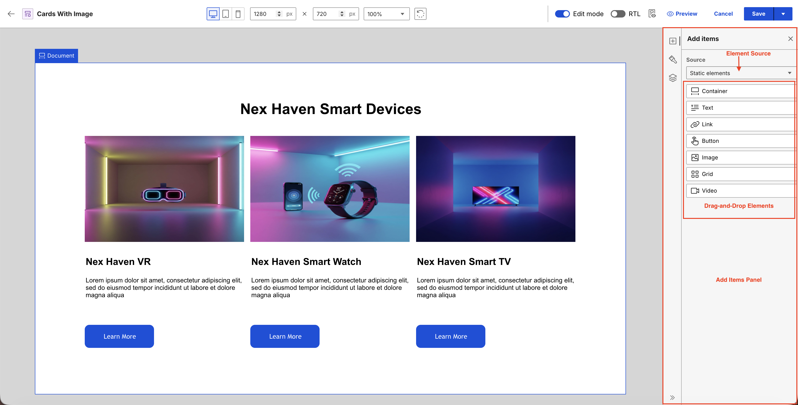

The **Add items** panel contains the user elements that you can drag and drop to the canvas. The **Source** field contains a dropdown menu where you can select an element source. The list of elements you can drag in the **Add items** panel depends on the element source you selected in this field.

#### Style items

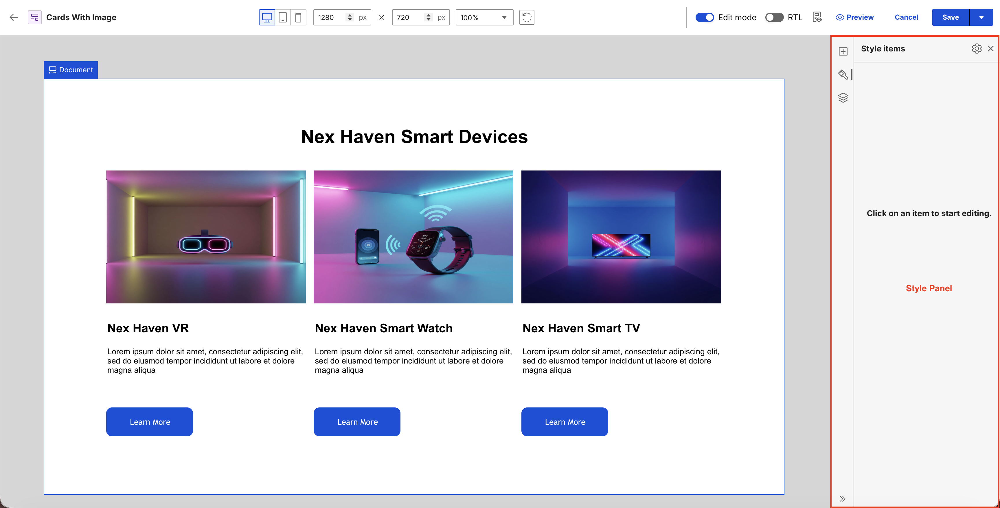

The **Style items** panel contains the different styling options available for the selected element on the canvas. The styling options are updated accordingly based on the selected element on the canvas.

For more information on the user elements and style options, refer to **[Usage of Presentation Designer](./usage/index.md)**.

#### Layers

The **Layers** panel provides a hierarchical tree view of all the elements currently on your canvas, helping you visually navigate and manage complex presentation templates without needing to click through nested layers in the main workspace.

- **Synchronized Selection:** Selecting an element directly on the canvas instantly highlights its corresponding node in the Layers panel, and conversely, clicking an item in the panel selects it on the canvas.
- **Hierarchy Visualization:** Deeply nested elements are clearly mapped out in the tree view; selecting a parent container automatically highlights it and groups its nested contents.
- **Visibility Toggle:** You can easily toggle the visibility of any element on or off using the view icon. Hiding a parent element automatically hides all of its descendants. This visibility state is persistent; the panel modifies both the editor's hidden state and the override stylesheet (`display: none`) to ensure the hidden state survives a save or reload.
- **Element Deletion:** Click the three-dots menu next to an element to safely delete it right from the panel.

### Canvas

The Canvas serves as the central workspace in Presentation Designer. This is where you can build your presentation templates. You can drag and drop elements right onto the canvas, making it simpler to create your layout. Any adjustments you make to the styling appear right away, giving you instant visual feedback as you work. This workspace allows content managers to experiment with different layouts and designs.

Hovering or selecting an element on the canvas displays the element name and the different action buttons available for the element.

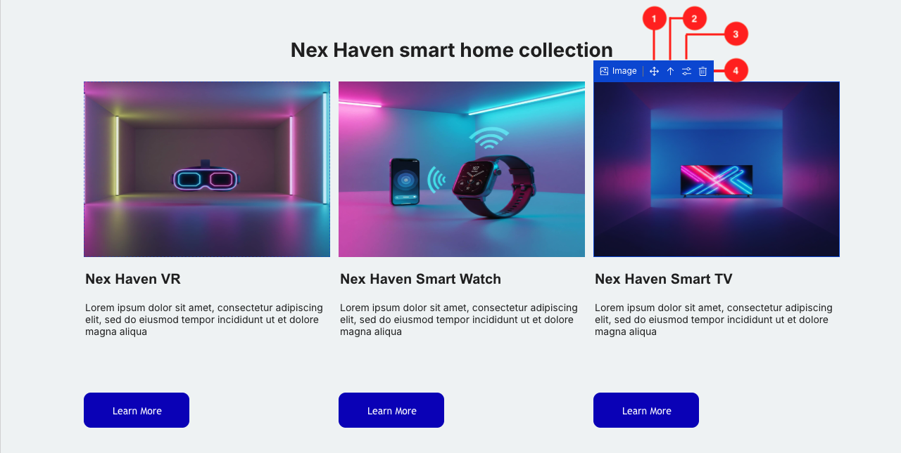

1. **Move** icon: Rearranges elements on the canvas using drag and drop.
2. **Arrow Up** icon: Selects the parent of the current element automatically.
3. **Configure** icon: Displays additional configuration options for the element.
4. **Trash** icon: Deletes the element from the canvas.

#### Notifications

The Presentation Designer uses a stacked notification system to display real-time status updates and operation alerts directly on the workspace.

- Multiple notification snackbars queue up and display vertically in the bottom-left corner of the screen instead of instantly replacing active messages. This lets you track rapid operations without losing sight of previous alerts.

    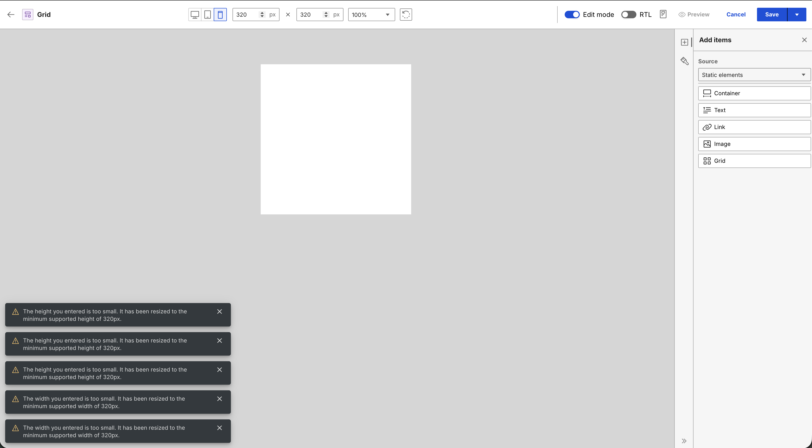

- The system automatically manages these active alerts using a maximum display cap. When a new action triggers an update and the stack reaches its limit, the oldest notification drops off the top of the stack to make room for the incoming message at the bottom.

    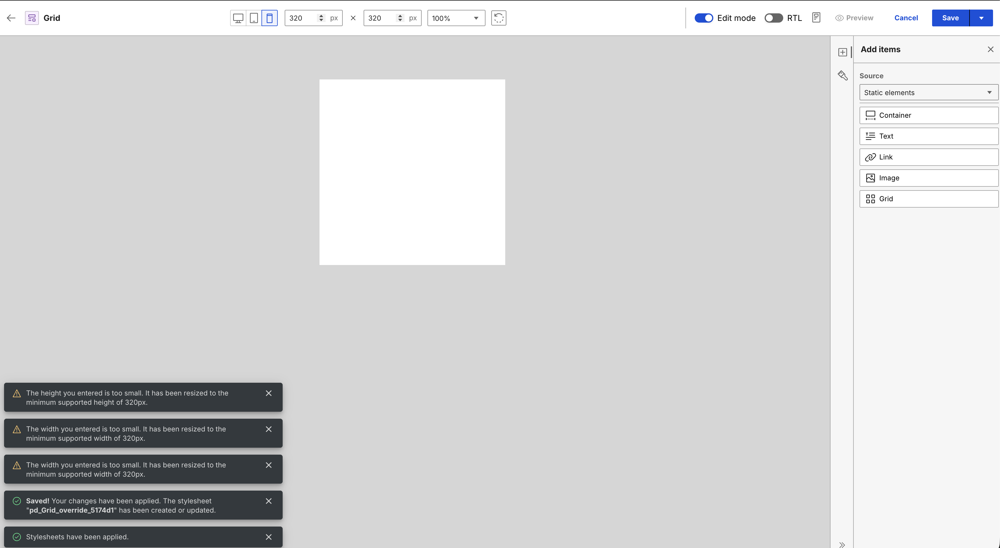
