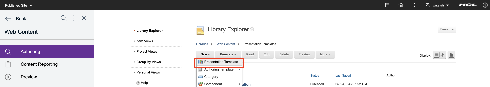
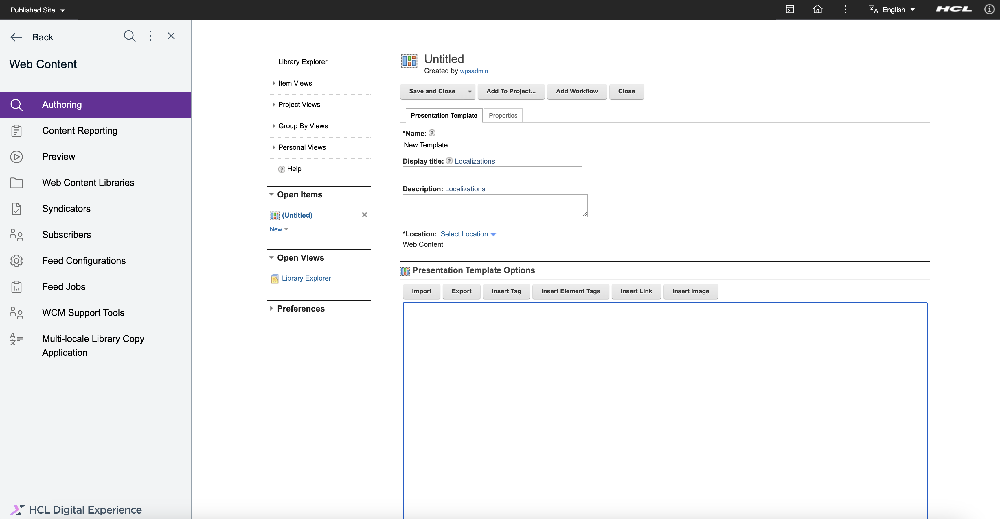
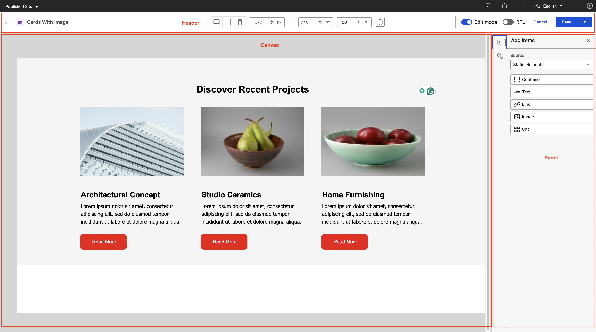
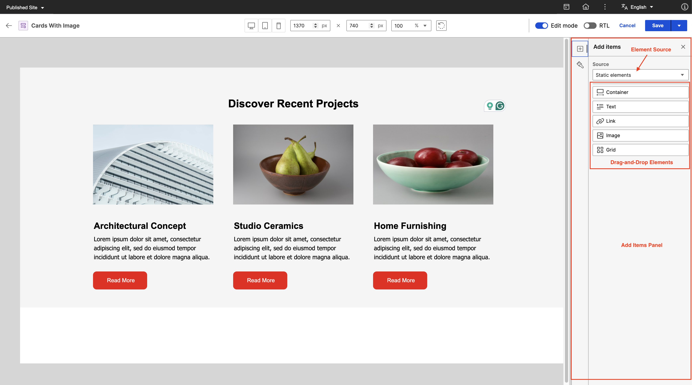
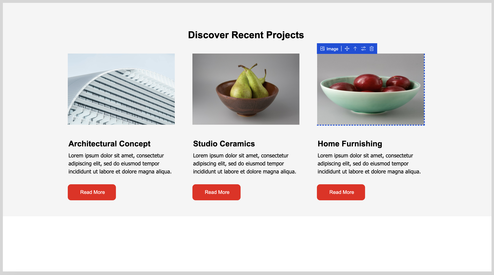
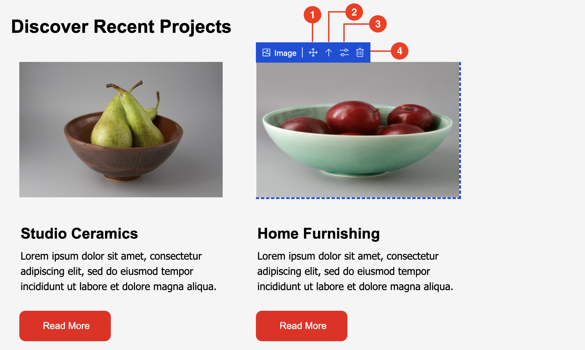

# Accessing the Presentation Designer

This section provides the steps on how to access the Presentation Designer. User interface details of the tool are also available.

## Prerequisites

Presentation Designer is installed and deployed by default as part of the CF update process. You can access Presentation Designer from the Practitioner Studio interface.

To use Presentation Designer, you must have the following minimum set of roles. Note that the roles listed are the minimum; if you have a Manager or Administrator role, you can still access Presentation Designer.

=== "Presentation Designer page"
    The Presentation Designer page requires at least a **User** role to access. Follow the steps below to set this role:

    1. Click the **Administration menu** icon.
    2. Go to **Security** > **Resource Permissions** > **Pages** > **Content Root** > **Practitioner Studio** > **Web Content**.
    3. In the  **Presentation Designer** row, click the **Assign Access** icon to set the **User** role.

=== "Presentation Designer portlet"
    The Presentation Designer portlet requires at least a **User** role to access. Follow the steps below to set this role:

    1. Click the **Administration menu** icon.
    2. Go to **Security** > **Resource Permissions** > **Portlets**.
    3. In the **Presentation Designer portlet** row, click the **Assign Access** icon to set the **User** role.

=== "WCM page"
    The WCM page requires at least a **User** role to access. Follow the steps below to set this role:

    1. Click the **Administration menu** icon.
    2. Go to **Security** > **Resource Permissions** > **Pages** > **Content Root** > **Practitioner Studio**.
    3. In the **Web Content** row, click the **Assign Access** icon to set the **User** role.

=== "WCM Authoring portlet"
    The WCM Authoring portlet requires at least a **User** role to access. Follow the steps below to set this role:

    1. Click the **Administration menu** icon.
    2. Go to **Security** > **Resource Permissions** > **Portlets**.
    3. In the **Web Content Authoring** row, click the **Assign Access** icon to set the **User** role.

=== "WCM_REST_SERVICES"
    WCM_REST_SERVICES requires at least an **Editor** role to access. Follow the steps below to set this role:

    1. Click the **Administration menu** icon.
    2. Go to **Security** > **Resource Permissions** > **Virtual Resources**.
    3. In the **WCM REST SERVICE** row, click the  **Assign Access** icon to set the **Editor** role.

=== "WCM libraries and items"
    WCM libraries and items require at least an **Editor** role to access. Follow the steps below to set this role:

    1. Click the **Web Content menu**.
    2. Go to **Web Content Libraries**.
    3. Click the **Set permissions** icon to set the **Editor** role for any library as needed.

(Optional) To select and pick a library where you are an Editor and display it on the Library Explorer, set the **Privileged User** role on the **WCM Authoring page**. While **Privileged User** access is not needed to use Presentation Designer, this access is still is recommended so users can view and edit presentation templates in specific libraries where they hold Editor permissions.

To set the **Privileged User** role:

1. Navigate to the **Administration menu**.
2. Go to **Security** > **Resource Permissions** > **Pages** > **Content Root** > **Practitioner Studio** > **Web Content** > **Authoring**.
3. Click the **Assign Access** icon to set the **Privileged User** role.

Refer to [Working with resource permissions](../../../../deployment/manage/security/people/authorization/controlling_access/working_with_resource_permission/index.md) for more information.

## Accessing Presentation Designer

Refer to the following instructions to access and navigate to Presentation Designer.

1.  Log in to your HCL Digital Experience 9.5 platform, and select **Web Content** from the Practitioner Studio navigator.

    

2.  In the **Web Content** menu, select **Authoring**. 

    

3.  In the Authoring portlet, select your library and navigate to the **Presentation Templates**.

    

4.  Create a new presentation template by clicking **New** > **Presentation Template**.
    
    

5.  In the Presentation Template, leave the markup blank. This way, you can start with a blank canvas in Presentation Designer. Click **Save and Close**.

    

6. Select the newly created presentation template and go to **More** > **Edit in Presentation Designer**.

    

The Presentation Designer user interface appears. You can also refer to Step 6 to view or edit your existing presentation templates.  

## The Presentation Designer UI

The Presentation Designer user interface is composed of three main sections:

### Header

1. **Back** button. Use this to go back to the Authoring portlet. 
2. Title of the presentation template.
3. Canvas dimensions settings. For more information, see **[Canvas settings](../usage/canvas_settings/#canvas-dimensions)**.
4. **Zoom** selection. For more information, see **[Canvas settings](../usage/canvas_settings/#canvas-zoom)**.
5. **Rotate** button. For more information, see **[Canvas settings](../usage/canvas_settings#canvas-rotate)**.
6. **Edit/Read mode** toggle. Use this to switch from Edit to Read mode or from Read to Edit mode.
7. **RTL** toggle. For more information, see **[Canvas settings](../usage/canvas_settings/#rtl-toggle)**.
8. **Cancel** button. Use this to to cancel editing and go back to the Authoring portlet.
9. **Save** button. Use this to save the presentation template or click the dropdown icon to **Save and Close**.

### Panel

There are two panels you can use in Presentation Designer: [Add Items](#add-items) and [Style](#style).
    
#### Add Items

The **Add Items** panel contains the user elements that you can drag and drop to the canvas. The **Source** field contains a dropdown menu where you can select an element source. The list of elements you can drag in the **Add Items** panel depends on the element source you selected in this field.

#### Style
    

The **Style** panel contains the different styling options available for the selected element on the canvas. The styling options are updated accordingly based on the selected element on the canvas. 

For more information on the user elements and style options, see **[Usage of Presentation Designer](../usage/index.md)**.

### Canvas

The Canvas serves as the central workspace in Presentation Designer. This is where you can build your presentation templates. You can drag and drop elements right onto the canvas, making it simpler to create your layout. Any adjustments you make to the styling appear right away, giving you instant visual feedback as you work. This hands-on area lets content managers play around with different designs and setups.

Hovering or selecting an element on the canvas displays the element name and the different action buttons available for the element. See the following actions you can do:

1. Click the **Move** icon to rearrange the elements on the canvas through drag-and-drop
2. Click the **Arrow Up** icon to automatically select the parent of the current element. 
3. Click the **Configure** icon to display additional configuration options for the element. 
4. Click the **Trash** icon to delete the element from the canvas.