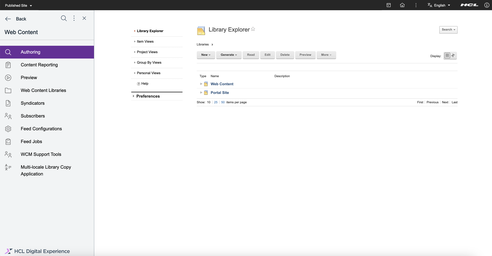
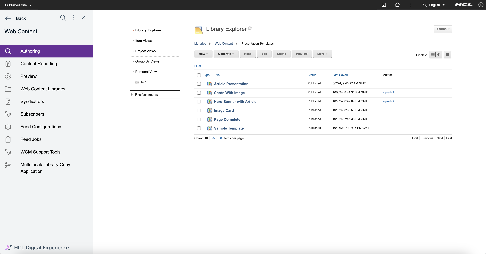
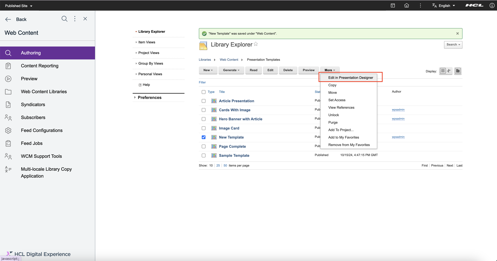
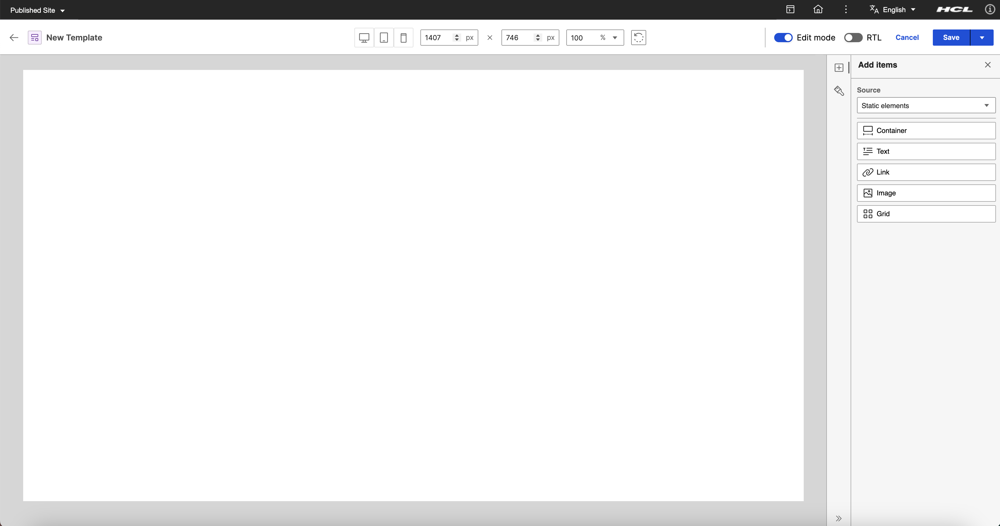
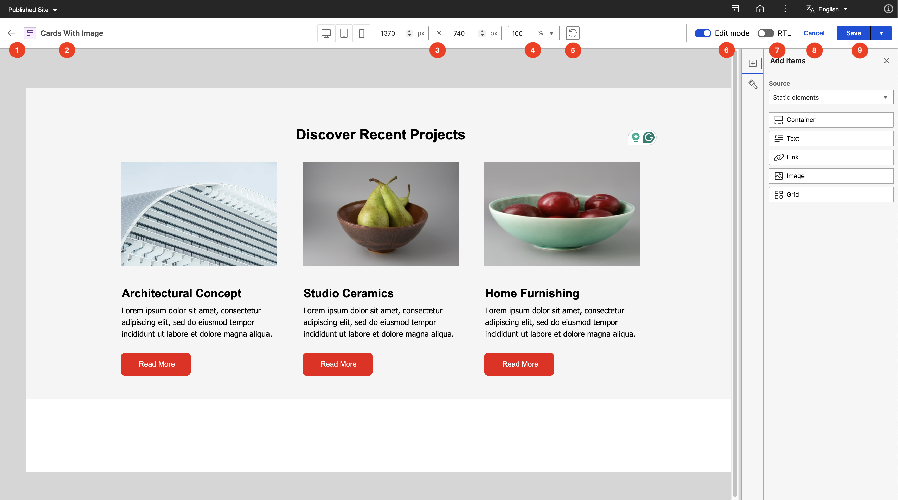

# Accessing the Presentation Designer

This section provides the steps on how to access the HCL Presentation Designer and details on the user interface.

## Prerequisite

In HCL Digital Experience 9.5 CF224, Presentation Designer is installed and deployed by default as part of the CF update process. Presentation Designer is accessible from the Practitioner Studio interface.

!!! note
    You must have **User**, **Editor**, or **Privileged User** access to the following resources to use Presentation Designer. See the details below:

    - **Presentation Designer page** -  Click the **Administration menu** icon. Go to **Security** > **Resource Permissions** > **Pages** > **Content Root** > **Practitioner Studio** > **Web Content** > **Presentation Designer** > Click the **Assign Access** icon to set **User** role.
    - **Presentation Designer portlet** - Click the **Administration menu** icon. Go to **Security** > **Resource Permissions** > **Portlets** > **Presentation Designer portlet** > Click **Assign Access** icon to set **User** role.
    - **WCM page** -  Click the **Administration menu** icon. Go to **Security** > **Resource Permissions** > **Pages** > **Content Root** > **Practitioner Studio** > **Web Content** > Click the **Assign Access** icon to set **User** role.
    - **WCM Authoring portlet** - Click the **Administration menu** icon. Go to **Security** > **Resource Permissions** > **Portlets** > **Web Content Authoring** > Click **Assign Access** icon to set **User** role.
    - **WCM_REST_SERVICES** - Click the **Administration menu** icon. Go to **Security** > **Resource Permissions** > **Virtual Resources** > **WCM REST SERVICE** > Click **Assign Access** icon to set Editor role.
    - **WCM libraries and items** - Click the **Web Content menu**. Go to **Web Content Libraries** > Click the **Assign Access** icon to set the **Editor** role for any library as needed. 

    **Optional:**

    To be able to **select and pick a library** where you are an Editor and display it on the Library Explorer, set the **Privileged User** role on the **WCM Authoring page**. While **Privileged User** access is not needed to use Presentation Designer, it is recommended so users can view specific libraries where they hold Editor permissions and proceed with editing presentation templates within those libraries. To set this role, navigate to the **Administration menu**. Go to **Security** > **Resource Permissions** > **Pages** > **Content Root** > **Practitioner Studio** > **Web Content** > **Authoring** > Click the **Assign Access** icon to set **Privileged User** role.

    Refer to [Working with resource permissions](../../../../deployment/manage/security/people/authorization/controlling_access/working_with_resource_permission/index.md) for more information.

## Accessing Presentation Designer

Refer to the following instructions to access and navigate to Presentation Designer.

1.  Log in to your HCL Digital Experience 9.5 platform, and select **Web Content** from the Practitioner Studio navigator.

    

2.  In the **Web Content** menu, select **Authoring**. 

    

3.  In the Authoring portlet, select your library and navigate to the **Presentation Templates**

    

4.  Create a **new presentation template** and leave the markup blank. In this way, you can start with a blank canvas in Presentation Designer.

    
    

5. Select the newly created presentation template and click the **More** options button and you will see the **Edit in Presentation Designer** option.

    

6. Select the **Edit in Presentation Designer** option to access the Presentation Designer interface. You may also do steps 5 and 6 to view/edit your existing presentation templates in Presentation Designer.

    

## The HCL Presentation Designer UI

The Presentation Designer user interface is composed of three main sections:

1.  **Header**

    

    This section contains the **Back** button to go back to the Authoring portlet. The **display title of the Presentation Template** also appears in this section. It also contains the **Edit/Read mode** toggle which currently enables/disables the **Save** button, which gives the users the options to either Save or Save and Close the presentation template. There is also a **Cancel** button to cancel editing and go back to the Authoring portlet.

2.  **Panel**
    
    

    This section contains the **Add Items** panel which contains the items/elements that you can drag and drop to the canvas. There is also a dropdown selection for the **item source** which will update the list of draggable items depending on the source. 
    
    

    It also contains the **Style** panel where you can edit different **styling options** available for the selected item/element on the canvas. The styling options will update accordingly based on the selected item on the canvas. 
    
    For more information on the items and style options, visit the **[Usage of HCL Presentation Designer](../usage/index.md)**

3.  **Canvas**

    

    The Canvas serves as the central **workspace** in Presentation Designer where you can **visually build your presentation templates**. You can easily **drag and drop** items right onto the canvas, making it simpler to create your layout. Any adjustments you make to the styling appear right away, giving you instant visual feedback as you work. This hands-on area lets content managers play around with different designs and setups.

    

    Hovering or selecting an item on the canvas will display the **name of the item** and different action buttons available for it. In this example, the **Move** icon button can be used to rearrange the items on the canvas via drag and drop. The next icon button is the **Arrow Up**, which, when clicked, automatically selects the parent of the current item. There is also a **Configure** icon button which displays additional configuration options for the item. Lastly, the **Trash** icon button is used to delete the item on the canvas.