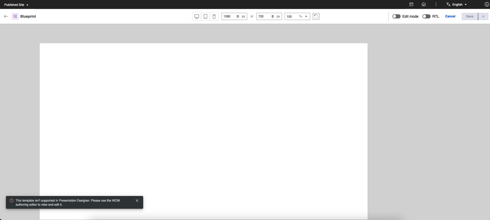

# Presentation Designer limitations

Take note of the following limitations when using Presentation Designer:

- Presentation Designer can only be used to edit presentation templates. For more information, refer to the [Edit Presentation Template in Presentation Designer](../presentation_designer/usage/edit_presentation_template.md) topic.
- You cannot reuse presentation templates. It is required to create a new template for each design.
- The following features are currently not supported:
    - Locking of a presentation template while being edited in Presentation Designer.
    - Using a Virtual Portal.
    - Undoing and redoing changes.
    - Previewing the template in Presentation Designer. Currently, you can only generate a preview through the Authoring portlet.
    - Reusing of styles from a theme.
    - Adding any script or custom markup.
    - Using external CSS. All styles are applied as inline styles and different orientations through breakpoints are not yet supported. For more information, refer to the [Styling Options in Presentation Designer](../presentation_designer/usage/styling_options.md) topic.
    - Blueprint Presentation Templates are not yet supported:

        Add this to the markup `<!-- BluePrint Template -->` and then open the Presentation Designer:

        

- The following features are not fully supported:
    - Right-to-Left layout, with certain elements not fully optimized for languages that require this layout.
    - WCM tags and their attributes. Presentation Designer is currently supporting different user elements. For more information, see the [User Elements in Presentation Designer](../presentation_designer/usage/user_elements.md) topic.
    - Translation to other languages. English is the default language used in Presentation Designer.
    - The fixed position style of the user element may result in overlap with the header under certain conditions, rather than remaining within the intended canvas boundary. This behavior is observed when setting the element's position to fixed with a top value of 10px in the styling properties. The overlap occurs because the canvas utilizes a root div structure integrated with the document's HTML markup, meaning boundaries may not be fully isolated. While using an iframe could more effectively isolate boundaries, this option is currently not implemented.
    - Adding breakpoints for media queries is not yet supported.
    - The Paragraph format and Text decoration are not dynamically set based on media-query due to the structure of these elements and how they are applied in Presentation Designer.
    - An Override stylesheet component should only be used for the presentation template it was created for.
    - The Static Grid Element currently does not support the following styling properties in the override stylesheet:
        - Rows
        - Columns
        - Row span
        - Column span
    - Aside from the Default and Override stylesheets, and other stylesheet components created by the user in Authoring, any other stylesheets imported through the following methods are not fully supported:
        - External stylesheets
        - Style tags
    - The Style Panel is currently designed to only display resolved styles from the Default and Override stylesheets. This means that custom styles from other stylesheet components will render on the canvas but will not be reflected in the style panel's fields.
    - Custom classes cannot be applied using the Presentation Designer interface. They must be added directly to the element's class attribute in the presentation template's markup in Authoring.
    - CSS Selectors or CSS Rules:
        - ID Selectors
        - Universal Selector
        - Combinators
        - Attribute Selectors
        - Pseudo-classes
        - Pseudo-elements
        - At-Rules
        
        Having these selector types in the Default and Override stylesheet components used in the Presentation Template may result in unknown side effects when the Presentation Template is opened and updated using the Presentation Designer.
