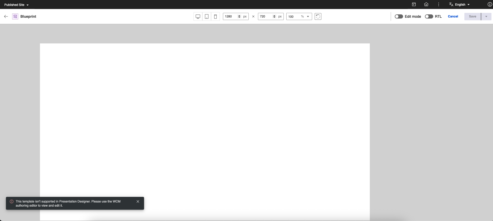

# Presentation Designer limitations

Take note of the following limitations when using Presentation Designer:

## Templates

- Presentation Designer can only be used to view or edit presentation templates. For more information, refer to the [Editing a presentation template](../presentation_designer/usage/edit_presentation_template.md) topic.
- Presentation templates cannot be reused across designs. Create a new template for each design.
- Override stylesheet components must only be used for the presentation template they were created for.
- Blueprint Presentation Templates are not supported:

    Add this to the markup `<!-- BluePrint Template -->` and then open the Presentation Designer:

    

## Interface

- Undoing and redoing changes is not supported.
- Reusing styles from a theme is not supported.
- Adding scripts or custom markup is not supported.
- WCM tags and attributes are not supported. Presentation Designer supports specific user elements. For more information, refer to [User elements](../presentation_designer/usage/user_elements/index.md).

## Localization and preview

- Right-to-left layouts are not supported. Elements are not optimized for languages that require right-to-left layout.
- English is the only supported language.
- Previewing templates requires selecting a content item as context.

## CSS and styling

- Using external CSS is not supported. For details on styling options and stylesheet management, refer to [Styling options](../presentation_designer/usage/styling_options.md), [Default and override stylesheet](../presentation_designer/usage/default_and_override_stylesheet.md) and [Handling multiple stylesheets](../presentation_designer/usage/handle_multiple_stylesheets.md).
- Adding breakpoints for media queries is not supported.
- The **Paragraph** format and **Text** decoration cannot be set dynamically using media queries.
- Static **Grid** elements do not support **Rows**, **Columns**, **Row span**, or **Column span** properties in override stylesheets.
- External stylesheets and style tags imported outside Default and Override stylesheets or Authoring stylesheet components are not supported.
- The **Style items** panel only displays resolved styles from Default and Override stylesheets. Custom styles from other components render on the canvas but do not appear in the **Style items** panel.
- Custom classes cannot be applied in the Presentation Designer interface. Add custom classes directly to the element class attribute in Authoring markup.
- ID selectors, universal selectors, combinators, attribute selectors, pseudo-classes, pseudo-elements, and at-rules in Default and Override stylesheets can cause unexpected behavior when opening or updating templates in Presentation Designer.

## Element positioning

- User elements with a fixed position and a top value of 10px can overlap the header. The canvas uses a root div structure integrated with document markup rather than an isolated iframe.
