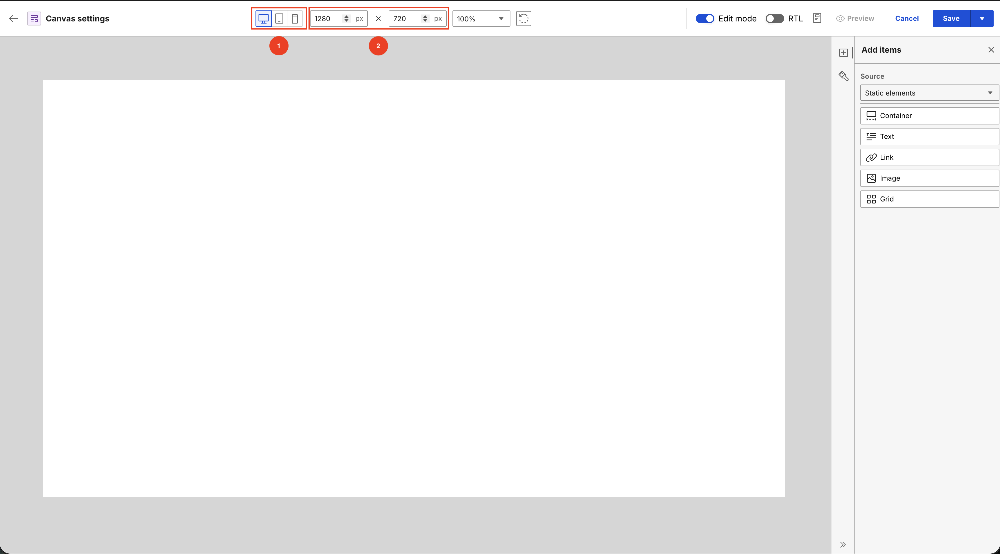
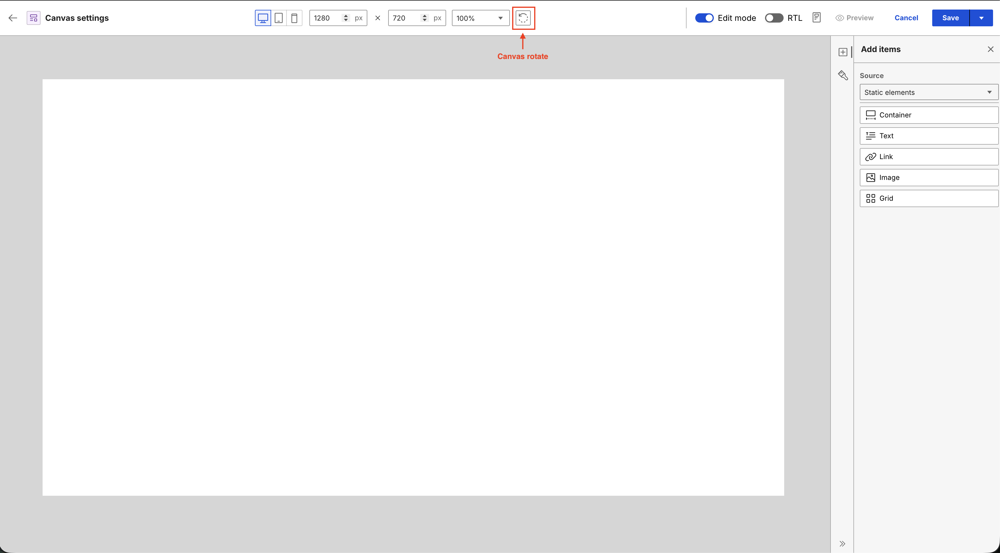
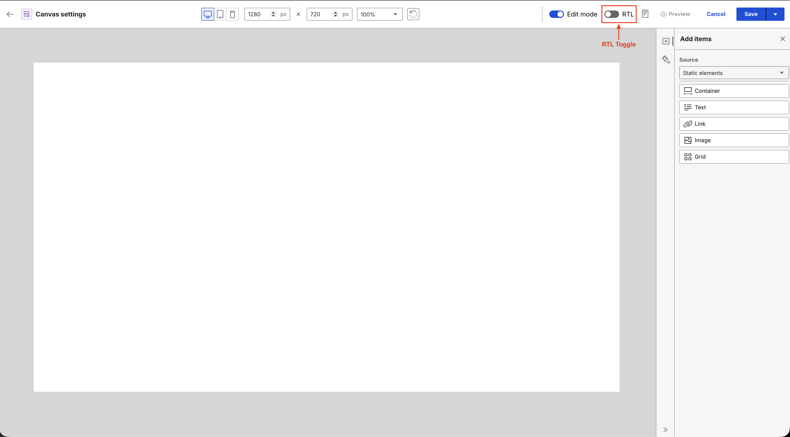
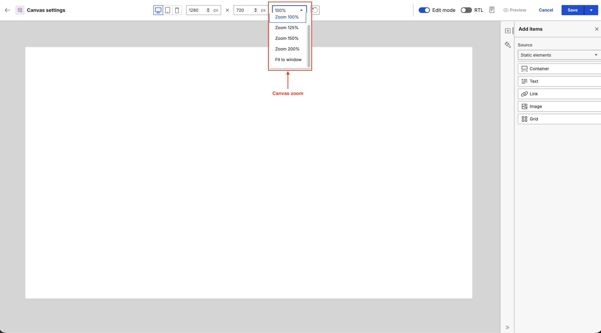
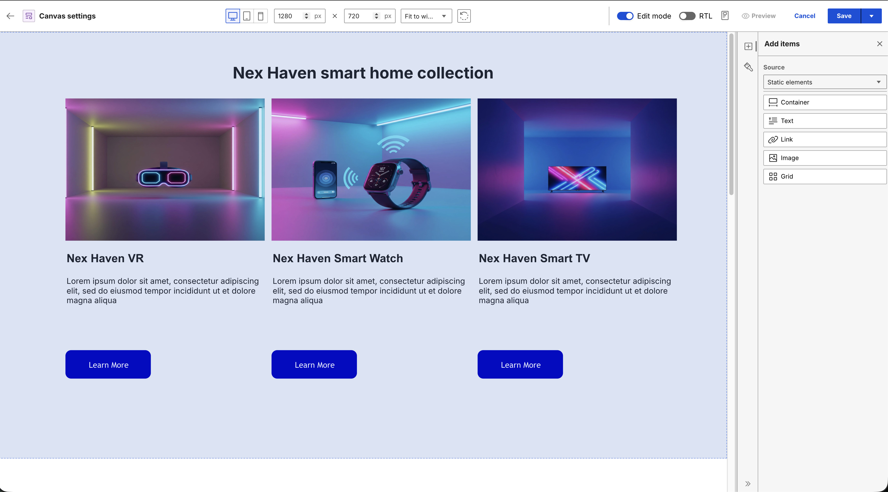
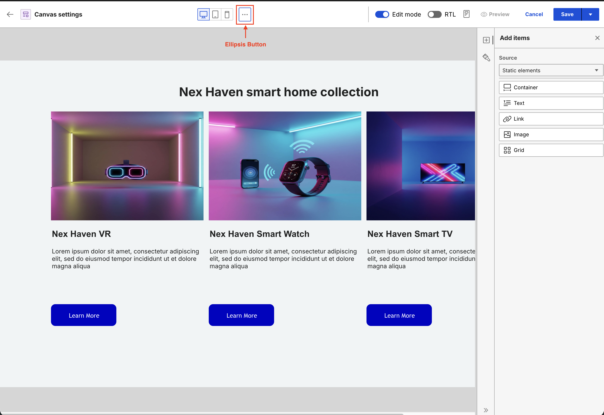
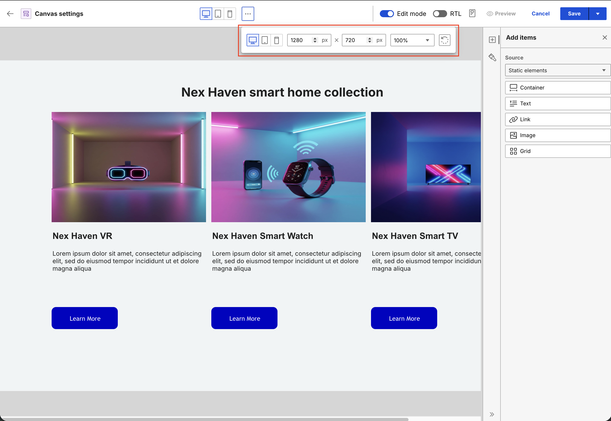
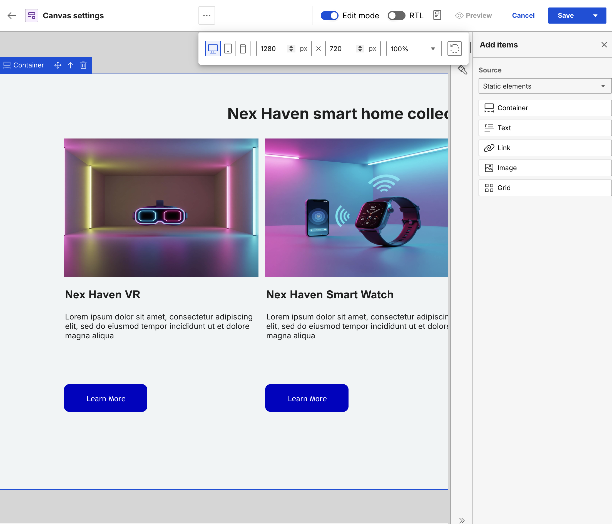
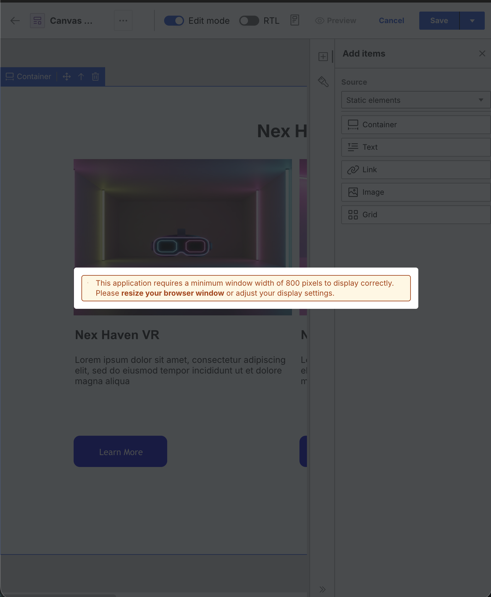

# Canvas settings

Canvas settings configure the width, height, zoom level, orientation, and language direction of the presentation workspace.

To access Presentation Designer and understand its user interface, refer to **[Accessing Presentation Designer](../access.md)**.

To learn how to use the different user elements in Presentation Designer, refer to **[User elements](../usage/user_elements/index.md)**.

## Canvas dimensions

Canvas dimensions adjust the workspace size to meet specific layout requirements. Predefined sizes such as **Desktop**, **Tablet**, and **Mobile** are also available.

1. **Predefined sizes:** Sets the workspace to standard **Desktop**, **Tablet**, or **Mobile** resolutions.
2. **Width and Height:** Sets custom pixel dimensions for the workspace boundaries.

## Rotate

The **Rotate** button switches the canvas layout between portrait and landscape orientations.

## RTL toggle

The **RTL** toggle switches the canvas layout orientation between left-to-right (LTR) and right-to-left (RTL) text paths.

## Zoom

The **Zoom** field scales the workspace magnification level between a minimum of 50% and a maximum of 200%.

The **Fit to window** option automatically scales the active canvas view to match your current browser window boundaries.

## Responsive Canvas setting

The Presentation Designer Header automatically responds to changes in browser window widths to preserve workspace usability.

- For widths below 1280 pixels, an ellipsis button **(...)** replaces individual header controls.

    

    Clicking this button opens a menu containing the width, height, zoom, and rotate parameters.

    

- Predefined **Desktop**, **Tablet**, and **Mobile** resolutions also move inside the ellipsis menu.

    

- For widths below 800 pixels, a modal warning message overlays the screen prompting you to resize the browser window.

    