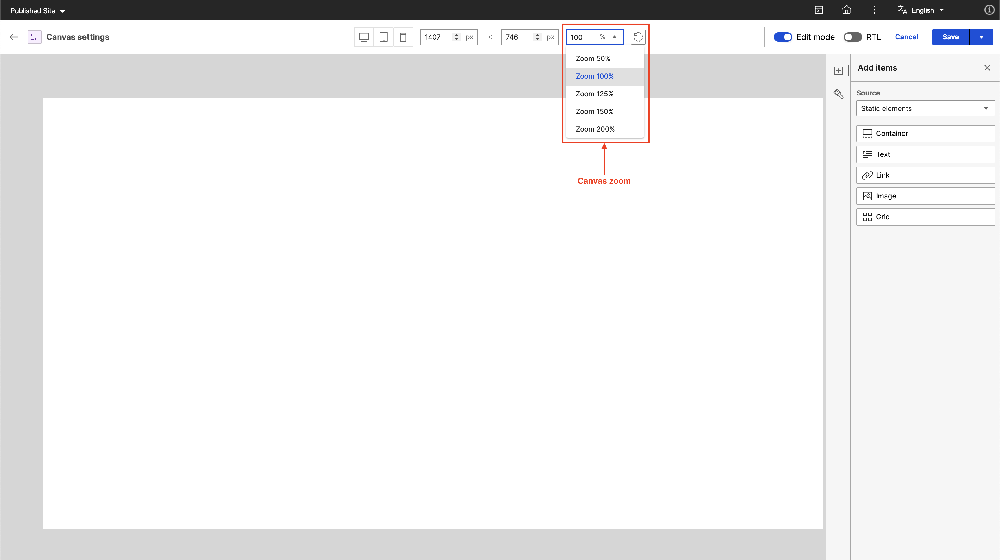

# Canvas settings in Presentation Designer

With Canvas settings, you can configure various aspects of the presentation such as canvas dimensions, direction, zoom level, and orientation. It can also retain the last used canvas settings for the user on that browser (includes: width, height, zoom, RTL toggle). This topic outlines the available settings in the **Header** section of Presentation Designer.

To access Presentation Designer and understand its user interface, refer to the **[Access Presentation Designer](../access/index.md)** topic.

To learn how to use the different user elements in Presentation Designer, refer to the **[User Elements in Presentation Designer](../usage/user_elements.md)** topic. 

## Canvas dimensions

The Canvas dimensions settings in Presentation Designer can set dimensions for width and height to adapt to specified size requirements. You can also use Canvas dimensions to select from predefined sizes such as desktop, tablet, and mobile.

In the following image, you can see the options for selecting predefined sizes (for example, desktop, tablet, or mobile) and for entering specific dimensions for width and height.

1. **Predefined sizes:** Select from the predefined sizes for desktop, tablet, or mobile.
2. **Width and Height:** Enter specific dimensions to adjust the width and height of the canvas.

## Canvas rotate

You can rotate the canvas using the **Canvas rotate** button in Presentation Designer.

The following image shows the **Canvas rotate** button.

## RTL toggle

You can switch the canvas orientation from left-to-right (LTR) to right-to-left (RTL), and vice versa using the **RTL** toggle in Presentation Designer.

The following image shows the **RTL** toggle. Use this to switch from LTR to RTL and vice versa.

## Canvas zoom

With Canvas zoom, you can select how much you want to zoom in or out of the canvas. There is a minimum zoom level of 50% up to a maximum of 200%. You can also select a zoom level to fit your window.

The following image shows the zoom level options in Presentation Designer.

The following image shows an example of a canvas when the **Fit to window** zoom option is selected.

