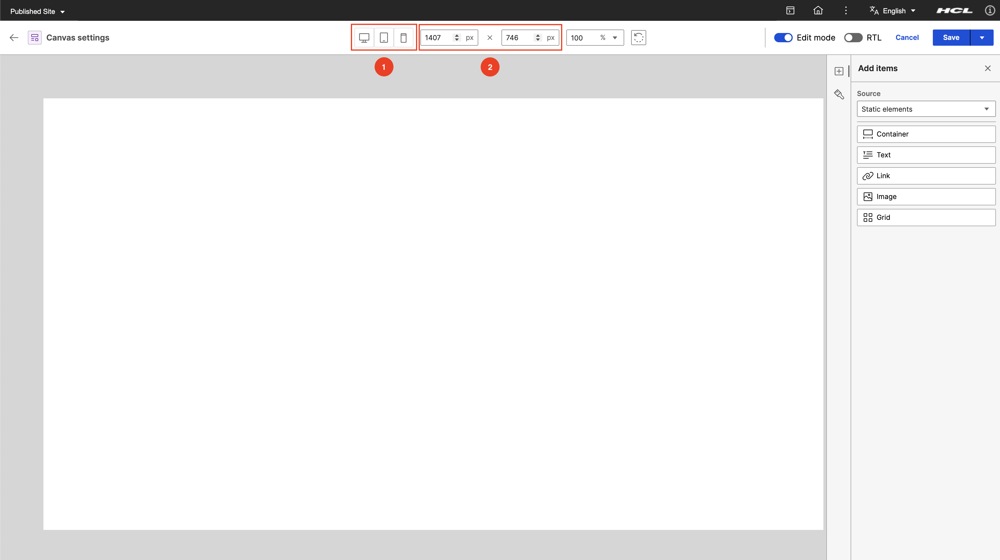

# Canvas settings in Presentation Designer

Canvas settings allow users to configure various aspects of the presentation, including canvas dimensions, direction, zoom and rotate. This topic outlines the available settings in the ***Header*** section of the Presentation Designer.

To access Presentation Designer and understand its user interface, refer to the **[Access Presentation Designer](../access/index.md)** topic.

To learn how to use the different user elements in Presentation Designer, refer to the **[User Elements in Presentation Designer](../usage/user_elements.md)** topic. 

## Canvas dimensions

The Canvas dimensions in the Presentation Designer can set dimensions for width and height to adapt to specified size requirements. They can also select from pre-defined sizes such as desktop, tablet, and mobile.

See the following options featuring text inputs for width and height, along with predefined sizes (desktop, tablet, or mobile).

1. ***Pre-defined sizes:*** Select to desktop, tablet, or mobile view.
2. ***Width and Height:*** Adjust the width and height of the canvas.

## Canvas rotate

The Canvas Rotate in the Presentation Designer allows you to rotate the canvas.

See the following on how rotate canvas using rotate button.

## Canvas direction

The Canvas direction in the Presentation Designer can switch canvas orientation from left-to-right (LTR) to right-to-left (RTL), and vice versa.

See the following option featuring RTL switch toggle for enabling LTR to RTL and vice-versa.

## Canvas zoom

The Canvas zoom in the Presentation Designer that can zoom the canvas from a minimum of 50% up to 200%, or fit it to the window.

See the following option on how to zoom canvas using zoom selection.

