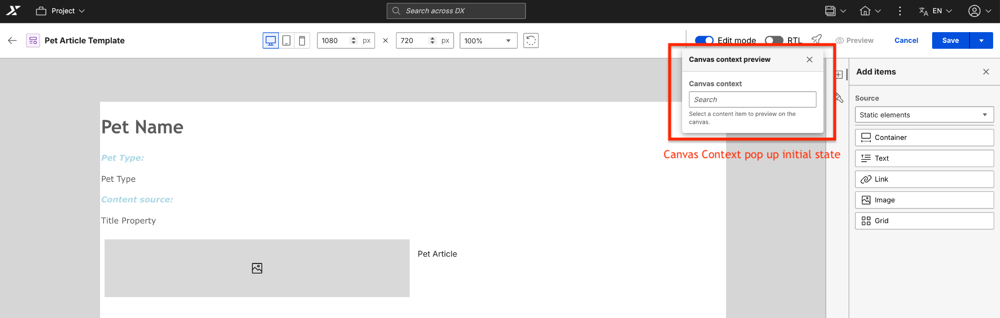
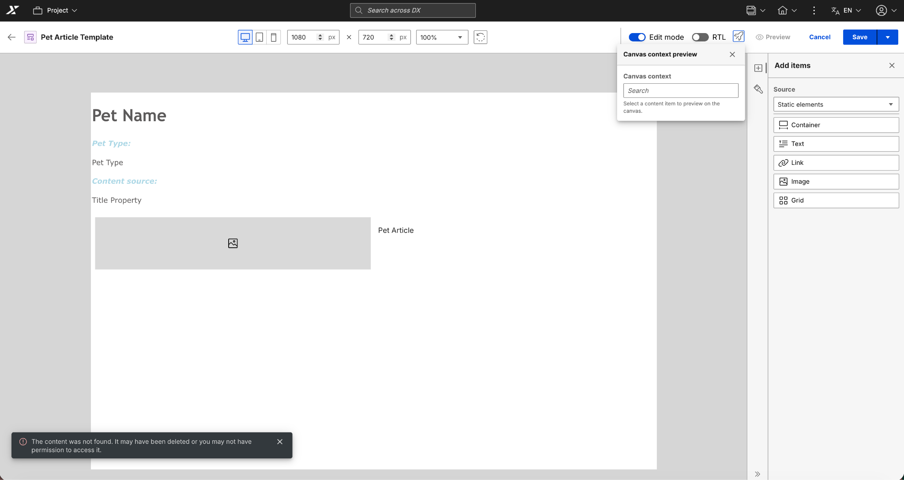
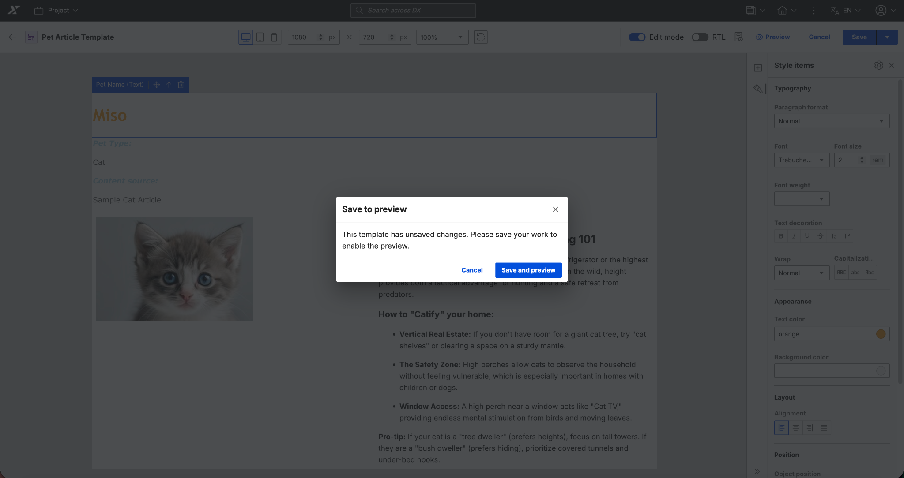

# Canvas Context Preview in Presentation Designer

## Overview

The Canvas Context Preview feature in HCL Digital Experience Presentation Designer enables users to preview how presentation templates will render with actual content from WCM (Web Content Manager) content items. This feature provides real-time visualization of template designs with live data, helping content authors and designers make informed decisions before publishing.

**Key Benefits:**

- **Real-time Preview:** Instantly see how your template renders with actual content
- **Content Mapping:** Automatically maps content elements, property tags, and generic tags to your template
- **Multiple Data Sources:** Supports Content Elements, Property Tags, and Generic Tags
- **Style Preservation:** Maintains custom styling while switching between different content contexts
- **Persistence:** Remembers your selected context across sessions and device view changes

---

## Feature Components

### 1. Canvas Context Button

Located in the header toolbar, the Canvas Context button provides access to the Canvas context preview functionality.


The above image shows the Canvas Context button in the header toolbar.

**Visual Indicators:**

- **Icon:** Context icon button (displays context/database icon)
- **States:**
    - Default: Indicates no context is selected
    - Active: Shows when a context is currently applied
- **Tooltip:** Displays helpful information about the feature

- **Icon:** Preview link
- **States:**
    - Default: Indicates disabled if no context is selected
    - Active: Shows when a context is currently applied

**Keyboard Accessibility:**

- Press `Tab` to focus the button
- Press `Enter` or `Space` to activate

### 2. Context Search Popup

When you click the Canvas Context button, a search popup opens allowing you to:




The image shows the Context Search Popup with search functionality.

#### Method A: Search for Content

1. **Open Canvas Context Preview:** Click the context icon in the header
2. **Search:** Type keywords to search for content items
3. **View Results:** Browse through the list of matching items
4. **Select Context:** Click on your desired content item
5. **Apply:** The canvas updates automatically with the selected context


**Search Features:**

- **Debounced Search:** Typing triggers search after a brief delay (300ms)
- **Real-time Results:** Results update as you type
- **Path Display:** Shows the full path of each content item for context
- **Type Indication:** Displays whether the item is a Content Item

---

## Working with Canvas Context Preview

### Selecting a Context

**Step-by-Step Instructions:**

1. **Open Presentation Designer**
    - Navigate to WCM Authoring
    - Open an existing presentation template or create a new one

2. **Access Canvas Context Preview**
    - Locate the context icon button in the header toolbar
    - Click the button to open the context search popup

3. **Search for Content**
    - Type your search query in the search field
    - Use keywords from the content's title or name
    - Wait for search results to appear

4. **Select a Content Item**
    - Review the search results
    - Click on the desired content item from the list
    - The interface shows the full path and type of each item

5. **View the Preview**
    - The canvas automatically updates with the selected context
    - Content elements display actual values from the selected content
    - Property tags and generic tags are mapped accordingly


The above image shows the canvas with a selected context applied, displaying actual content values.

**Expected Behavior:**

- ✅ Loading indicator appears while fetching content
- ✅ Canvas updates automatically when context is selected
- ✅ Content elements show actual values instead of placeholders
- ✅ The selected context persists across sessions

### Content Element States

After selecting a Canvas Context, content elements on the canvas will display in different states based on the availability and values of the corresponding content from the selected content item.


The above image shows the different states of content elements after a Canvas Context is selected.

**Element States:**

- **With Value:** Elements that have corresponding content display the actual value from the selected content item
- **Empty:** Elements that exist in the content item but have no value show an "[element-name] element [Empty]" placeholder
- **Does Not Exist:** Elements that don't exist in the selected content item show an "[element-name] element does not exist" placeholder

### Content Mapping

The Canvas Context Preview feature automatically maps three types of content bindings:

#### 1. Content Elements

Content elements are automatically bound to corresponding fields in your selected content item.

**Mapping Behavior:**

- **Element Exists & Has Value:** Displays the actual content value
- **Element Exists but Empty:** Shows `[element-name] element [Empty]` placeholder
- **Element Doesn't Exist:** Shows `[element-name] element does not exist` placeholder

**Example:**
```
Template has: Title (Text Element), Image (Image Element), Description (Text Element)
Content has: Title="Welcome", Image=<image-url>, Description=""

Result on Canvas:
- Title: "Welcome" (actual value)
- Image: <displays the image>
- Description: "Description element [Empty]" (placeholder)
```

#### 2. Property Tags

Property tags map to standard WCM content properties.

**Supported Property Tags:**

- `name` - Content item name
- `title` - Content item title
- `description` - Content item description
- `lastModifiedDate` - Last modification timestamp

**Mapping Example:**
```html
<!-- Property Tag in Template -->
<Element context="current" type="content" key="name" />

<!-- Renders on Canvas -->
Sample Article
```

## Styling and Customization

### Applying Styles to Context Elements

**Style Persistence:**

- ✅ Custom styles are preserved when selecting a context
- ✅ Styles remain intact when switching between different contexts
- ✅ Styles are maintained across device view changes
- ✅ Styles persist after saving and reopening the template

### Style Limitations

⚠️ **Important Notes:**

- Styles apply to the element container, not individual content values
- Responsive styles may need adjustment per device view
- Some WCM content may include inline styles that override template styles

---

## Canvas Settings with Canvas Context Preview

### Device Preview Integration

Canvas Context Preview works seamlessly with Presentation Designer's device preview feature.

**Supported Devices:**

- Desktop (default)
- Tablet
- Mobile

**How It Works:**

1. Select a canvas context
2. Switch device views using the device selector
3. The selected context persists across all device views
4. Content values remain mapped correctly

**Responsive Behavior:**
```
Desktop View (1920x1080):
- Context: Article A
- Element Values: Title, Image, Description

Switch to Mobile View (375x667):
- Context: Still Article A (persisted)
- Element Values: Same content, responsive layout
- Styles: Device-specific responsive styles applied
```

### RTL/LTR Support

Canvas Context Preview supports right-to-left (RTL) and left-to-right (LTR) text directions.

**How to Use:**

1. Select a context
2. Toggle the RTL switch in the header
3. Content elements adjust their text direction
4. Layout mirrors appropriately
5. The selected context remains active


**Supported Languages:**

- Arabic, Hebrew (RTL)
- All other languages (LTR)

### Canvas Dimensions and Zoom

**Dimension Controls:**

- Width and Height inputs
- Predefined sizes (Desktop, Tablet, Mobile)
- Rotate button for orientation change

**Context Behavior:**

- ✅ Selected context persists when changing dimensions
- ✅ Content values remain mapped correctly
- ✅ Zoom level does not affect context mapping
- ✅ Rotating the canvas preserves the context

---

## Advanced Features

### Context Validation

When you open Presentation Designer with a previously selected context, the system automatically validates the context.

**Validation Checks:**

- ✅ Content item still exists
- ✅ User has permission to access the content
- ✅ Content has not been moved or deleted

**Validation Outcomes:**

**Success (200 OK):**

- Context is restored automatically
- Canvas displays with the selected content
- Loading indicator shows during validation

**Failure (404 Not Found or 403 Forbidden):**

- Snackbar message: "The content was not found. It may have been deleted or you may not have permission to access it."
- Context is cleared from the canvas
- User can select a new context



The above image shows the error message displayed when context validation fails.

### State Persistence

Canvas Context Preview leverages browser localStorage to persist settings across sessions.

**What Is Saved:**

- Selected content item ID and metadata
- Content item name and display title
- Content item path and type
- Canvas dimensions (width, height)
- Zoom level
- RTL/LTR mode

**Storage Key:**
```javascript
// Format: presentationdesigner_canvas_settings_{template-id}
localStorage.getItem('presentationdesigner_canvas_settings_abc-123-def');
```

**When Settings Are Restored:**

- Opening an existing presentation template
- Navigating back from WCM
- Browser refresh (while in Presentation Designer)

**When Settings Are Cleared:**

- Clicking "Back to Authoring" in header
- Selecting "Cancel" and confirming navigation
- Logging out of HCL DX

### Edit Mode Behavior

Canvas Context Preview works in both Edit and View modes.

**Edit Mode (Default):**

- Full access to styling and layout tools
- Can drag and drop elements
- Can modify element properties
- Context values are displayed

**View Mode (Edit Off):**

- Read-only canvas view
- Cannot modify elements or styles
- Canvas Context Preview still functional
- Can select and change contexts
- Useful for reviewing template with different content

### Triggering Preview with Unsaved changes
The image below shows the prompt if the Preview Link is clicked while there are unsaved changes.


---

## Workflows and Use Cases

### Use Case 1: Template Design with Real Content

**Scenario:** A designer creates a new presentation template and wants to see how it looks with actual article content.

**Steps:**

1. Create a new presentation template
2. Add content elements (Title, Image, Body)
3. Apply basic styling
4. Click the Canvas Context Preview button
5. Search for a sample article
6. Select the article
7. Review how the design looks with real content
8. Adjust styling as needed
9. Test with multiple articles
10. Save the template

**Benefits:**

- Design with real content in mind
- Identify layout issues early
- Ensure content fits within design constraints

### Use Case 2: Multi-Language Content Preview

**Scenario:** A content author needs to verify a template works for both English and Arabic content.

**Steps:**

1. Open the presentation template
2. Select an English content item as context
3. Review the layout and styling
4. Switch to RTL mode using the toggle
5. Select an Arabic content item
6. Verify text direction and layout
7. Adjust styles if needed for RTL support
8. Save the template

**Benefits:**

- Verify internationalization support
- Ensure RTL layouts work correctly
- Test with real multilingual content

### Use Case 3: Responsive Design Validation

**Scenario:** A designer wants to ensure a template is responsive across devices.

**Steps:**

1. Open the template in Presentation Designer
2. Select a content item for preview
3. View in Desktop mode (default)
4. Review layout and content display
5. Switch to Tablet view
6. Verify responsive behavior
7. Switch to Mobile view
8. Check mobile layout
9. Adjust responsive styles as needed
10. Save the template

**Benefits:**

- Test responsive design with real content
- Identify mobile layout issues
- Ensure content is readable on all devices

### Use Case 4: Content Migration Review

**Scenario:** An administrator migrates content and needs to verify all templates still work correctly.

**Steps:**

1. Open each presentation template
2. Previous context is automatically validated
3. If validation fails, select a new content item
4. Verify content elements still map correctly
5. Check for any missing elements
6. Update template if needed
7. Save changes

**Benefits:**

- Quickly identify broken content mappings
- Verify content still exists after migration
- Ensure templates work with new content structure

---

## Error Handling and Troubleshooting

### Common Issues and Solutions

#### Issue 1: Element Shows "Does Not Exist" Placeholder

**Symptom:** Canvas displays `[element-name] element does not exist`.

**Cause:** Selected content item does not have the specified element.

**Solutions:**

1. Verify the content item structure in WCM
2. Check if the element exists in the content template
3. Select a different content item that has the element
4. Update the presentation template to use a different element key

#### Issue 2: Element Shows "Empty" Placeholder

**Symptom:** Canvas displays `[element-name] element [Empty]`.

**Cause:** Element exists but has no value in the selected content item.

**Solutions:**

1. Edit the content item in WCM and add a value
2. Select a different content item with values
3. Use this state to design empty state placeholders

#### Issue 3: Context Validation Failed

**Symptom:** Snackbar message: "The content was not found..."

**Possible Causes:**

- Content item was deleted
- Content item was moved
- User no longer has permission

**Solutions:**

1. Select a new content item for preview
2. Contact content owner if permission issue
3. Verify content still exists in WCM
4. Update template to use available content

#### Issue 4: Styles Not Preserved

**Symptom:** Custom styles disappear when switching contexts.

**Cause:** Typically caused by conflicting inline styles or CSS specificity issues.

**Solutions:**

1. Check if content has inline styles
2. Use more specific CSS selectors
3. Use `!important` sparingly for critical styles
4. Review override stylesheet settings