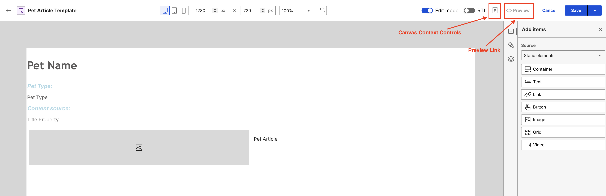
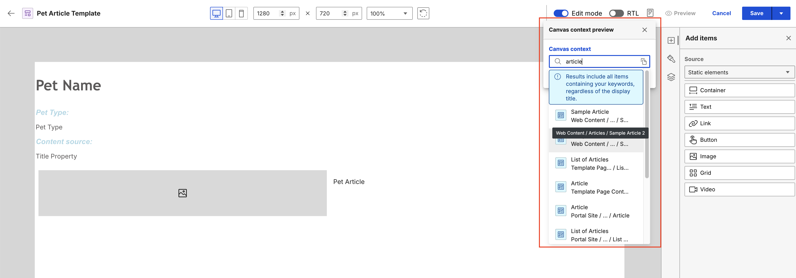
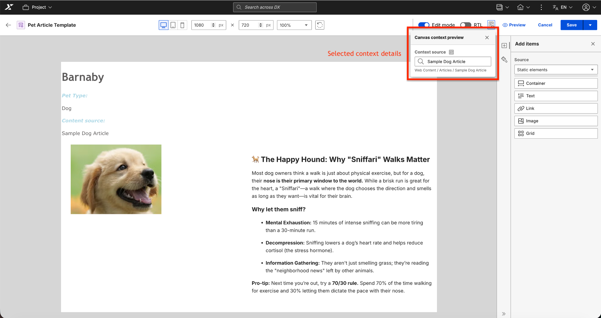
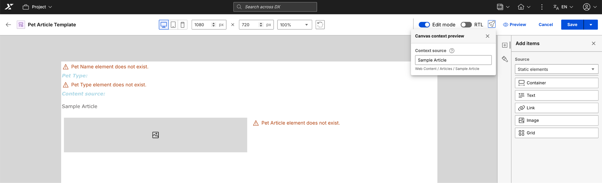
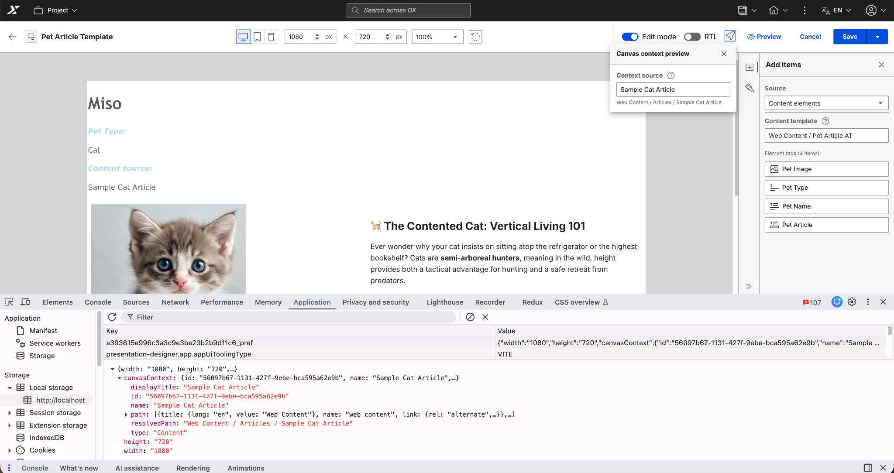

# Canvas Context Preview

The Canvas Context Preview feature in HCL Digital Experience (DX) Presentation Designer lets you preview how presentation templates render with Web Content Manager (WCM) content items. Visualizing templates with real data helps you verify layouts and data mapping across different device views before publishing. This feature allows you to:

- Preview template changes in real time as you map content elements and tags.
- Map content elements and property tags directly to the template structure.
- Preserve custom styling and layouts while switching between different content contexts.
- Retain the selected content context across different device views and sessions.
- Automatically map content elements and property tags to the template.

## Working with Canvas Context Preview

The **Apply canvas context preview** button in the header toolbar opens the context preview.



In the **Canvas context** field that appears, you can search for content items and templates to preview.



Selecting an item from the results automatically updates the canvas with the new context. As you type, the search results update automatically. Each result displays the item type and its full path so you can easily identify the correct content.

### Selecting a context

To select a context:

1. Open an existing **Presentation template** or create a new one.
2. Select the **Apply canvas context preview** icon.
3. In the **Canvas context** field, enter keywords from the title or name of the content item.
4. Select a content item from the results.
5. View the updated canvas to see the selected content and mapped tags.

!!!note
    The selected context persists across sessions.

The following example shows the canvas updated with the selected context and actual content values:



### Content mapping

Canvas Context Preview automatically maps content elements and property tags:

#### Content elements

Content elements map to corresponding fields in your selected content item. After selecting a canvas context, content elements display different states based on the availability and values of the selected content item:

- **With Value:** Elements with corresponding content display the actual value from the selected content item.
- **Empty:** Elements that exist in the content item but have no value display an "\[element-name] element \[Empty]" placeholder.
- **Does Not Exist:** Elements that do not exist in the selected content item display an "\[element-name] element does not exist" placeholder.

For example:

 

#### Property tags

Property tags map to standard WCM content properties. The following property tags are supported:

| Property | Description |
| -------- | ----------- |
| `name` | Content item name |
| `title` | Content item title |
| `description` | Content item description |
| `lastModifiedDate` | Last modification timestamp |

For example:

```html
<!-- Property Tag in Template -->
<Element context="current" type="content" key="name" />

<!-- Renders on Canvas -->
Sample Article
```

## Styling and customization

Custom styles applied to context elements are preserved when you select or switch between different contexts. Your styles also remain intact across device view changes and persist after you save and reopen the template.

### Style limitations

Keep the following in mind when styling context elements:

- Styles apply to the element container, not individual content values
- Responsive styles may need adjustment per device view
- Some WCM content may include inline styles that override template styles

## Canvas Context Preview settings

### Device preview integration

Canvas context preview works with the device preview feature in Presentation Designer. When you select a context, it persists across desktop, tablet, and mobile views. Content values remain correctly mapped while the layout adjusts to the selected device view. Any device-specific responsive styles automatically apply to the active context.

### RTL and LTR support

Canvas context preview supports both right-to-left (RTL) and left-to-right (LTR) text directions. When you toggle the RTL switch in the header, content elements and layouts adjust accordingly while the selected context remains active.

This support includes:

- **RTL languages:** Such as Arabic and Hebrew.
- **LTR languages:** All other supported languages.

### Canvas dimensions and zoom

Canvas context preview remains active as you adjust the canvas dimensions and zoom levels. Whether you manually enter width and height, select a predefined size, or rotate the orientation, the selected context and mapped content values persist.

## Advanced features

### Context Validation

When you open Presentation Designer with a previously selected context, the system validates that the content item still exists, the user has permission to access the content, and the content has not been moved or deleted.

- If the content is successfully validated, the context is restored automatically and the canvas displays the selected content.
- If the content validation fails, a message indicates that the content was not found or access is restricted, the context is cleared, and the user can select a new context.

### State persistence

Canvas context preview saves settings in the local storage of your browser to maintain these settings across sessions.



The system saves the content item ID, metadata, name, display title, path, and type. It also saves canvas dimensions, zoom levels, and the text direction mode (RTL or LTR).

- Settings are restored when you open a template, navigate from WCM, or refresh the browser.
- Settings are cleared when you select **Back to authoring**, select **Cancel**, or log out of HCL DX.

To retrieve settings for a specific template, use the following command in the browser console:

```javascript
// Format: presentationdesigner_canvas_settings_{template-id}
localStorage.getItem('presentationdesigner_canvas_settings_abc-123-def');
```

### Preview
Allows you to save the template and preview it in a separate window. The selected content will be applied to the preview. This button detects if the template has unsaved changes and prompts you to save before generating the preview.

### Edit and View mode

Canvas Context Preview works in both **Edit** (default) and **View** modes.

- **Edit** mode gives you full access to styling and layout tools. You can move elements and modify element properties while context values are displayed.
- **View** mode provides a read-only view of the canvas. You cannot modify elements or styles. You can change contexts to review the appearance of the template with different content.

!!!note
    If you select **Apply canvas context preview** while there are unsaved changes, a prompt appears to **Save and preview**.

## User scenarios

- **Designing with real content**

    Designers use canvas context preview to verify how layouts handle actual data. This identifies layout issues, such as text overflow or image scaling, early in the design process.

- **Multilingual support**

    Authors toggle between LTR and RTL modes to test language support. This confirms that the layout mirrors correctly for languages such as Arabic or Hebrew while the content remains active.

- **Responsive design validation**

    Designers switch between desktop, tablet, and mobile views to ensure the design functions across different screen sizes. This identifies mobile layout issues while using real content.

- **Content migration and permissions**

    Administrators use context validation to ensure templates remain functional after content migrations. The system identifies if a content item was moved, deleted, or if access is restricted.

## Troubleshooting

Refer to the following scenarios when troubleshooting context preview issues.

| Issue | Cause | Solution |
| :--- | :--- | :--- |
| **Element does not exist** | The content item lacks the specified element. | Verify the content structure or select a different item. |
| **Empty placeholder** | The element exists but has no value. | Add a value to the content item or use a different item. |
| **Validation failed** | Content was moved or deleted, or access is restricted. | Select a new content item or verify permissions. |
| **Styles not preserved** | Inline styles or CSS specificity conflicts. | Use more specific selectors and check for inline overrides. |
