# Default and Override stylesheets in Presentation Designer

In Presentation Designer, stylesheets play a crucial role in defining the appearance and behavior of elements within a presentation. There are two types of stylesheets that work together to ensure flexibility and consistency in design: the **Default stylesheet** and the **Override stylesheet**. These stylesheets support the handling of type selectors and class selectors.

## Default stylesheet

The **Default stylesheet** provides a foundational set of styles that are automatically applied to various elements, ensuring a consistent look and feel across the presentation. Default stylesheet support type selectors and class selectors. The default style options in Presentation Designer work as follows:

1. From the initial render of the Presentation Designer, a default style is loaded in the head of the HTML:

    - HTML head for default stylesheet:

        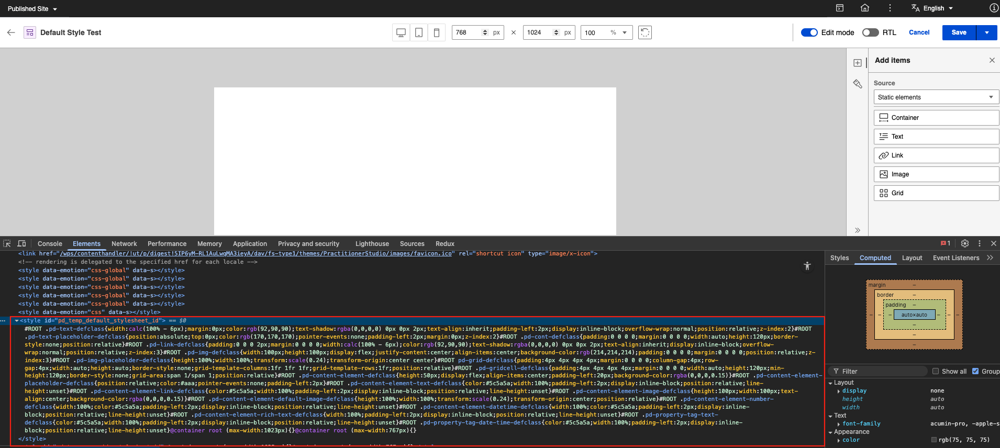

    - Element styles for the default stylesheet:

        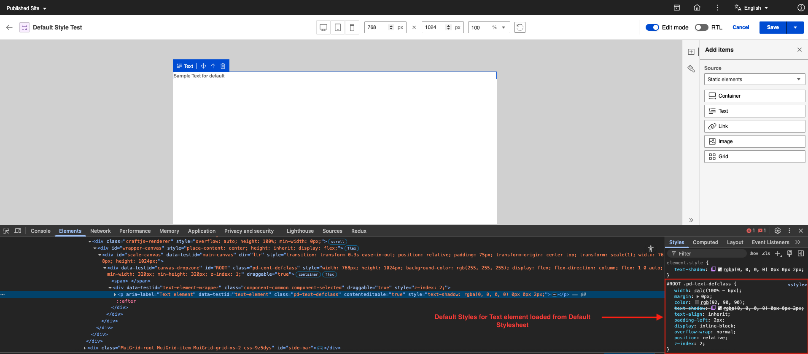

2. Each element has a corresponding classname for the default style.

    | Element                     | Default Classname                  | CSS Values                                                                 |
    |-----------------------------|------------------------------------|----------------------------------------------------------------------------|
    | Container element           | pd-cont-defclass                   | padding: 0 0 0 0;   margin: 0 0 0 0;   width: auto;   height: 120px;   border-style: none;   position: relative; |
    | Text element                | pd-text-defclass                   | width: calc(100% - 6px);   margin: 0px;   color: rgb(92, 90, 90);   text-shadow: rgba(0, 0, 0, 0) 0px 0px 2px;   text-align: inherit;   padding-left: 2px;   display: inline-block;   overflow-wrap: normal;   position: relative;   z-index: 2; |
    | Text placeholder            | pd-text-placeholder-defclass       | position: absolute;   top: 0px;   color: rgb(170, 170, 170);   pointer-events: none;   padding-left: 2px;   margin: 0px;   z-index: 2; |
    | Link element                | pd-link-defclass                   | padding: 0 0 0 2px;   margin: 0 0 0 0;   width: calc(100% - 6px);   color: rgb(92, 90, 90);   text-shadow: rgba(0, 0, 0, 0) 0px 0px 2px;   text-align: inherit;   display: inline-block;   overflow-wrap: normal;   position: relative;   z-index: 3; |
    | Image element               | pd-img-defclass                    | width: 100px;   height: 100px;   display: flex;   justify-content: center;   align-items: center;   background-color: rgb(214, 214, 214);   padding: 0 0 0 0;   margin: 0 0 0 0;   position: relative;   z-index: 3; |
    | Broken image placeholder    | pd-img-placeholder-defclass        | height: 100%;   width: 100%;   transform: scale(0.24);   transform-origin: center center; |
    | Grid element                | pd-grid-defclass                   | display: grid;   padding: 4px 4px 4px 4px;   margin: 0 0 0 0;   column-gap: 4px;   row-gap: 4px;   width: auto;   height: auto;   border-style: none;   grid-template-columns: 1fr 1fr 1fr;   grid-template-rows: 1fr;   position: relative; |
    | Grid cell element           | pd-gridcell-defclass               | padding: 4px 4px 4px 4px;   margin: 0 0 0 0;   width: auto;   height: auto;   min-height: 120px;   border-style: none;   grid-area: span 1 / span 1;   position: relative; |
    | Content element             | pd-content-element-defclass        | height: 50px;   display: flex;   align-items: center;   padding-left: 20px;   background-color: rgba(0, 0, 0, 0.15); |
    | Content element placeholder | pd-content-element-placeholder-defclass | position: relative;   color: #aaa;   pointer-events: none;   padding-left: 2px; |
    | Content text element        | pd-content-element-text-defclass   | color: #5c5a5a;   width: 100%;   padding-left: 2px;   display: inline-block;   position: relative;   line-height: unset; |
    | Content link element        | pd-content-element-link-defclass   | color: #5c5a5a;   width: 100%;   padding-left: 2px;   display: inline-block;   position: relative;   line-height: unset; |
    | Content image element       | pd-content-element-image-defclass  | height: 100px;   width: 100px;   text-align: center;   background-color: rgba(0, 0, 0, 0.15); |
    | Default image placeholder   | pd-content-element-default-image-defclass | height: 100%;   width: 100%;   transform: scale(0.24);   transform-origin: center;   position: relative; |
    | Content number element      | pd-content-element-number-defclass | width: 100%;   color: #5c5a5a;   padding-left: 2px;   display: inline-block;   position: relative;   line-height: unset; |
    | Content datetime element    | pd-content-element-datetime-defclass | width: 100%;   color: #5c5a5a;   padding-left: 2px;   display: inline-block;   position: relative;   line-height: unset; |
    | Content rich text element   | pd-content-element-rich-text-defclass | width: 100%;   padding-left: 2px;   display: inline-block;   position: relative;   line-height: unset; |
    | Property tag text element   | pd-property-tag-text-defclass      | color: #5c5a5a;   width: 100%;   padding-left: 2px;   display: inline-block;   position: relative;   line-height: unset; |
    | Property tag datetime       | pd-property-tag-date-time-defclass | color: #5c5a5a;   width: 100%;   padding-left: 2px;   display: inline-block;   position: relative;   line-height: unset; |

3. After saving the Presentation Designer, it automatically creates a default stylesheet.

    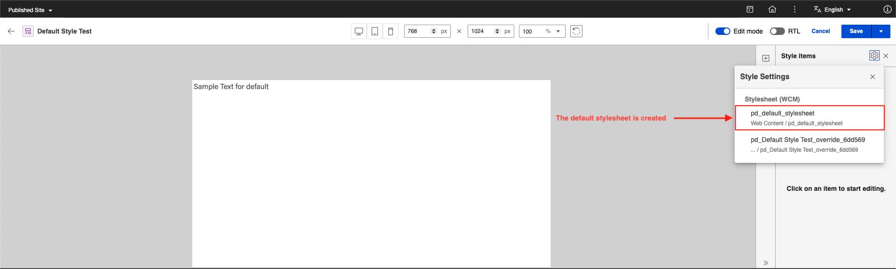

4. The default style is found in the Presentation Designer libraries. Its location is determined based on the location of the presentation template:

    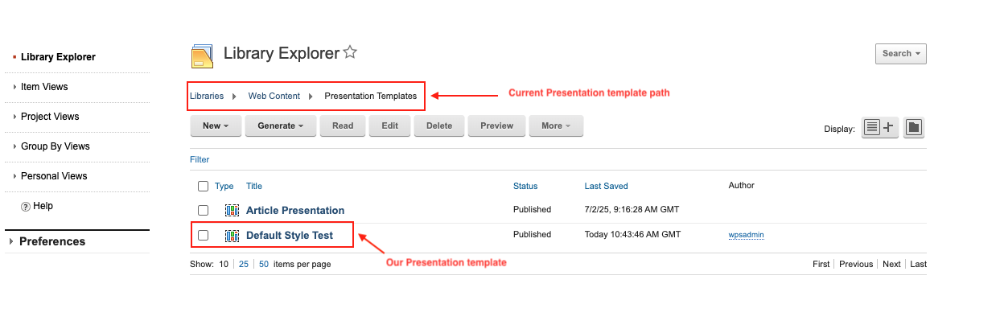

    For example, the default style is located in the following path with the default style name **pd_default_stylesheet**:

    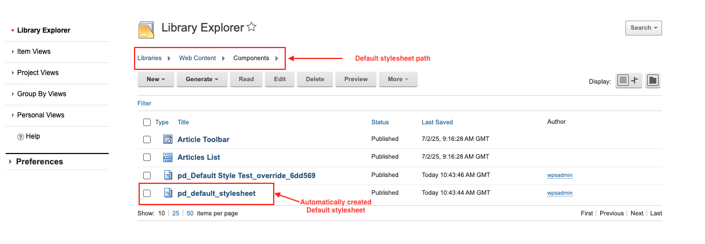

5. To validate the styles set in the default stylesheet:

    1. Select the file and click **Edit**.
    2. Click **pd_default_stylesheet.css** to download the file.

        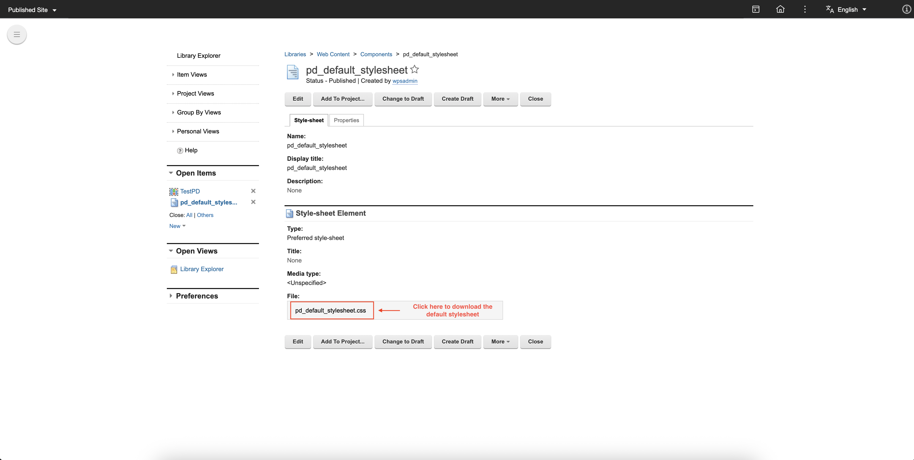

    3. Locate the downloaded file and open it. This contains the CSS data inside the default stylesheet.

        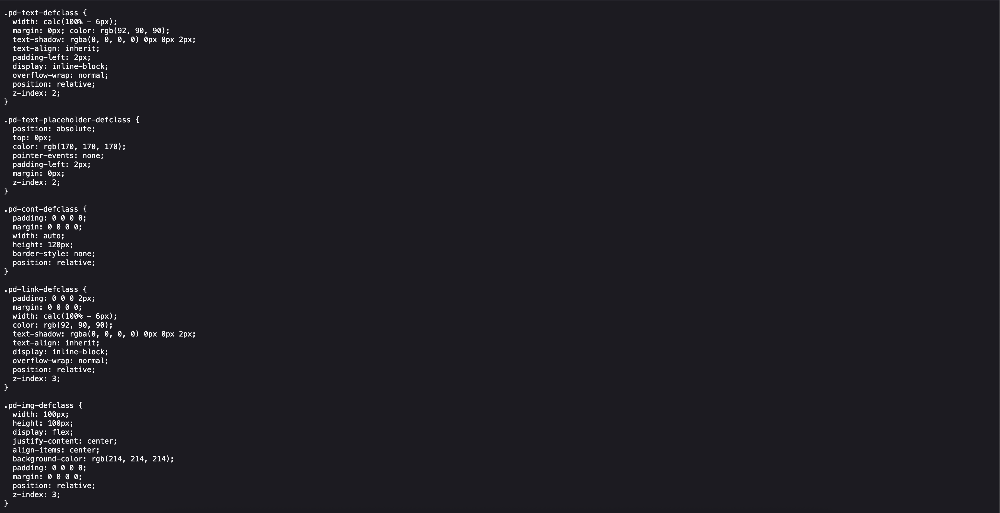

## Override stylesheet

The **Override stylesheet** allows users to customize styles for specific elements, enabling precise adjustments to meet unique design requirements. Together, the Default and Override stylesheets offer a powerful mechanism for managing presentation aesthetics effectively. The override style options in Presentation Designer work as follows:

1. Override styles can be applied to different resolutions, and each resolution has its own style. If the style is set for **Desktop**, it applies the change to all devices. If the style is set for **Tablet**, it applies the change to tablets and mobile devices only. If the style is set for **Mobile**, it applies the change to mobile devices only. If there are specific changes to the style for a particular device, those changes will not take effect on other devices since the specific device already has a defined value for the style.

2. Override styles support direction-specific styling for bidirectional text layouts through the **Canvas direction toggle** in the Presentation Designer header. This allows you to create distinct styles for RTL (Right-to-Left) and LTR (Left-to-Right) text directions.

    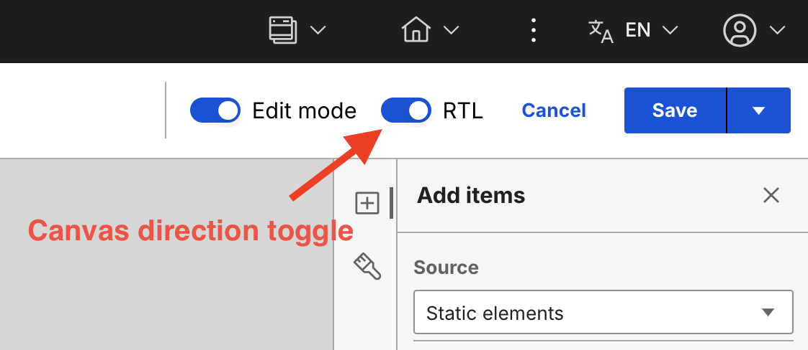

    Override classes follow the naming convention `pd-override-[Element]-[(6)uuid]`, where `[Element]` is the element type and `[(6)uuid]` is a 6-character unique identifier:

    - **LTR classname convention**: `pd-override-[Element]-[(6)uuid]` (for example, `.pd-override-Text-d00c2b`)
  
    - **RTL classname convention**: `pd-override-[Element]-[(6)uuid]:dir(rtl)` (for example, `.pd-override-Text-d00c2b:dir(rtl)`)

    - When the RTL toggle is enabled and style changes are made, the override class includes the `:dir(rtl)` pseudo-class selector. These styles only apply when the page or element is in RTL mode.

    - When the RTL toggle is disabled (LTR mode) and style changes are made, the override class is created without the direction indicator. These base styles apply to both LTR and RTL by default.
  
    - RTL-specific styles (with `:dir(rtl)`) override the base styles only when the document is in RTL mode. If no RTL-specific styles are defined, the base LTR styles apply to both directions. Both sets of styles coexist in the same override stylesheet, allowing the same element to have different appearances based on the document's text direction.

3. Override classes are applied to elements when styles are edited. The following example demonstrates how override classes are created and applied:

    **Step 1**: When you first drop an element on the canvas, only the default class is applied. No override class exists yet:

    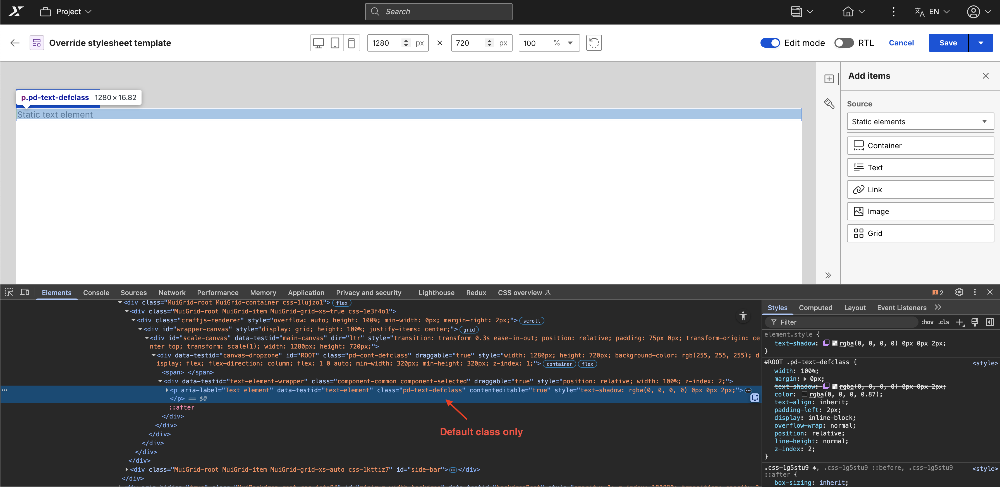

    **Step 2**: After adding style changes to the element (for example, changing font size and background color), you can now see that an override class has been added to the element:

    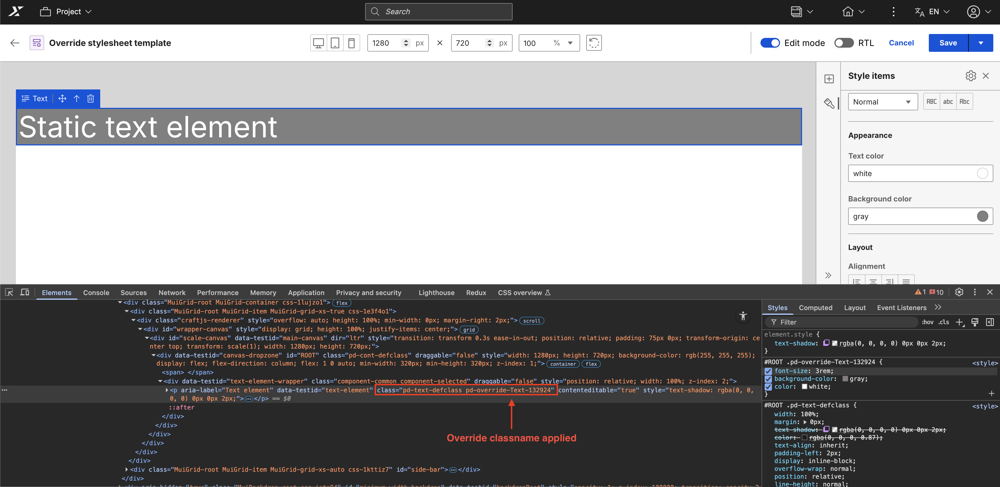

    **Step 3**: You can apply independent styling for RTL by switching to RTL mode using the Canvas direction toggle and adding different style changes (for example, changing background color and text alignment). After applying these changes, the same override class is used but with the `:dir(rtl)` pseudo-class selector added to target RTL mode:

    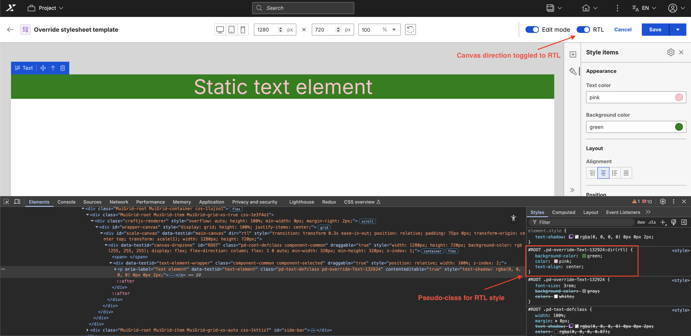

4. After saving the Presentation Designer, it automatically creates an override stylesheet:

    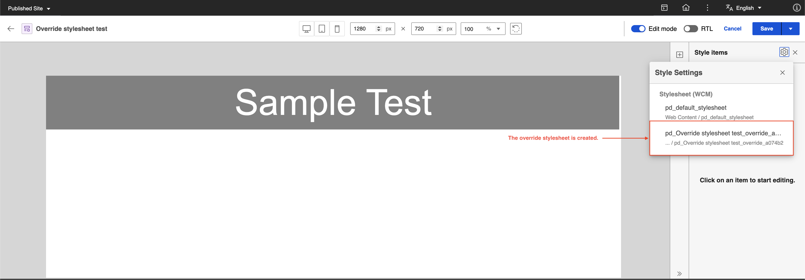

5. To validate the override style, you can inspect and visit the header and the element. For example:

    HTML head for override stylesheet:
    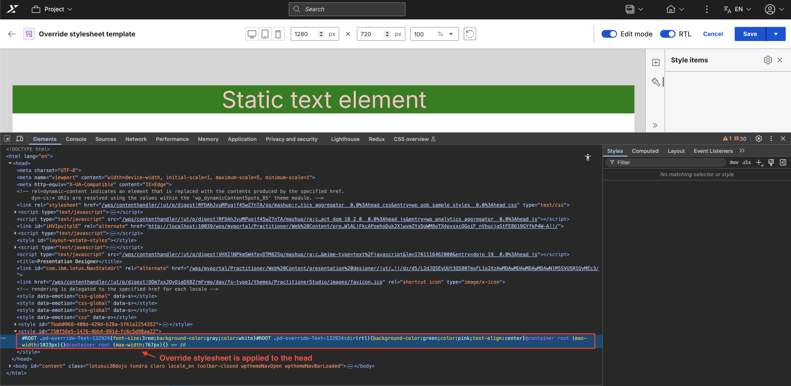

    Element styles for the override stylesheet:

    LTR styles:
    

    RTL styles:
    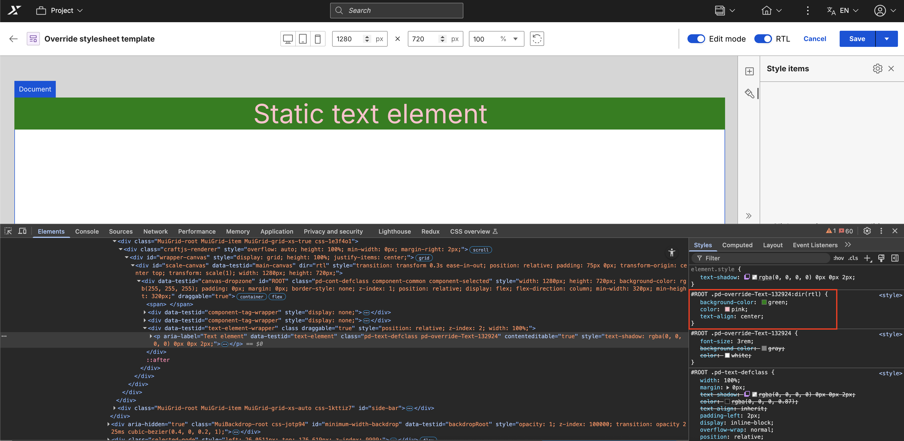

6. The override stylesheet is found in the Presentation Designer libraries. Its location is determined based on presentation template's location:

    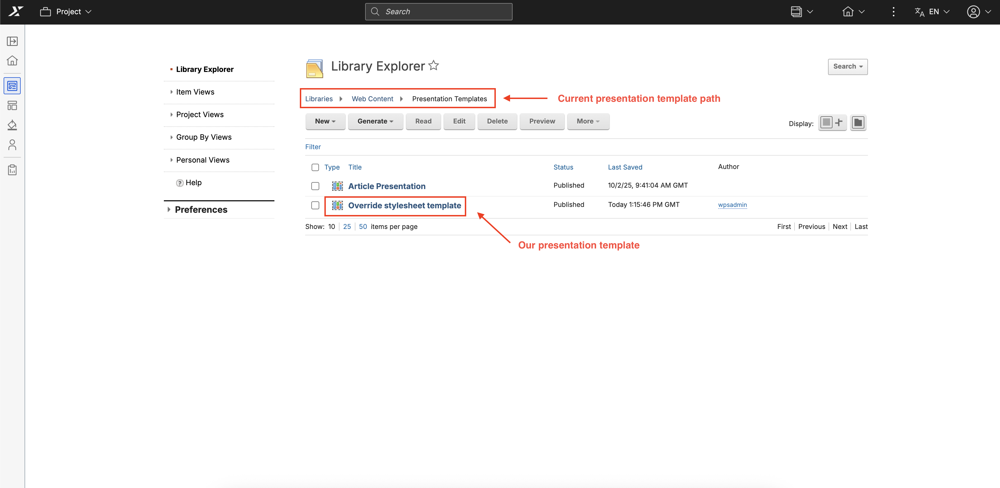

7. The override stylesheet is named based on the following naming convention: `pd_[Presentation template name]_override_[(6)uuid]`. For example:

    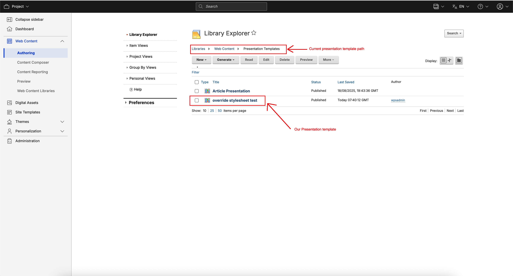

8. To validate the styles set in the override stylesheet:

    1. Select the file and click **Edit**.
    2. Click **pd_Override stylesheet test_override_a074b2.css** to download the file.

        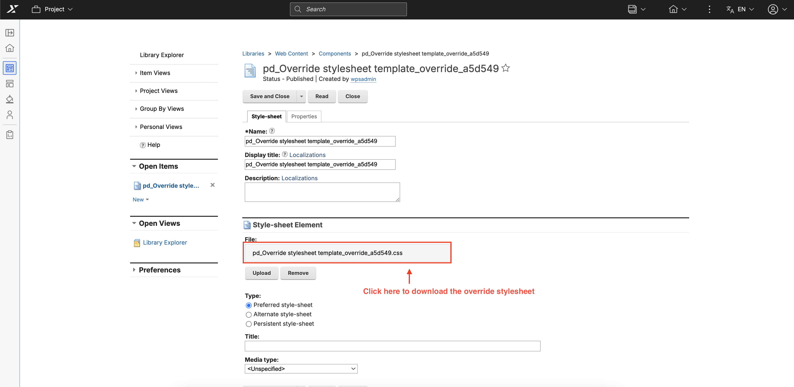

    3. Locate the downloaded file and open it. This contains the CSS data inside the override stylesheet, including both LTR and RTL styles (if RTL-specific styles were applied).

        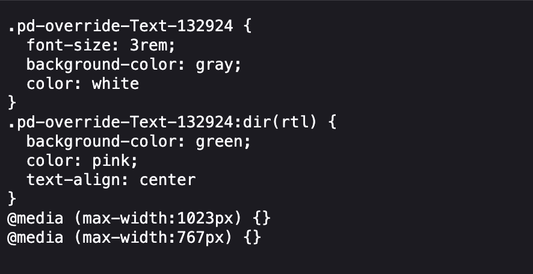
