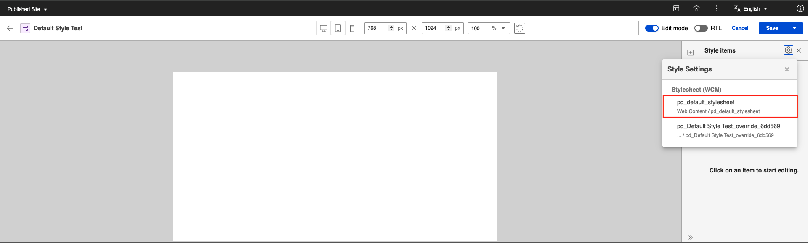

# Default and Override Stylesheets in Presentation Designer

In Presentation Designer, stylesheets play a crucial role in defining the appearance and behavior of elements within a presentation. There are two types of stylesheets that work together to ensure flexibility and consistency in design: the **Default Stylesheet** and the **Override Stylesheet**. 

# Default Stylesheet

The **Default Stylesheet** provides a foundational set of styles that are automatically applied to various elements, ensuring a consistent look and feel across the presentation.

The following image shows how the default style options work in Presentation Designer.

1. From the initial render of the Presentation Designer, a default style is loaded in the head of the HTML.

    

2. For each element, there is a corresponding classname for the default style.

| Element                     | Default Classname                  | CSS Values                                                                 |
|-----------------------------|------------------------------------|----------------------------------------------------------------------------|
| Container element           | pd-cont-defclass                   | padding: 0 0 0 0;   margin: 0 0 0 0;   width: auto;   height: 120px;   border-style: none;   position: relative; |
| Text element                | pd-text-defclass                   | width: calc(100% - 6px);   margin: 0px;   color: rgb(92, 90, 90);   text-shadow: rgba(0, 0, 0, 0) 0px 0px 2px;   text-align: inherit;   padding-left: 2px;   display: inline-block;   overflow-wrap: normal;   position: relative;   z-index: 2; |
| Text placeholder            | pd-text-placeholder-defclass       | position: absolute;   top: 0px;   color: rgb(170, 170, 170);   pointer-events: none;   padding-left: 2px;   margin: 0px;   z-index: 2; |
| Link element                | pd-link-defclass                   | padding: 0 0 0 2px;   margin: 0 0 0 0;   width: calc(100% - 6px);   color: rgb(92, 90, 90);   text-shadow: rgba(0, 0, 0, 0) 0px 0px 2px;   text-align: inherit;   display: inline-block;   overflow-wrap: normal;   position: relative;   z-index: 3; |
| Image element               | pd-img-defclass                    | width: 100px;   height: 100px;   display: flex;   justify-content: center;   align-items: center;   background-color: rgb(214, 214, 214);   padding: 0 0 0 0;   margin: 0 0 0 0;   position: relative;   z-index: 3; |
| Broken image placeholder    | pd-img-placeholder-defclass        | height: 100%;   width: 100%;   transform: scale(0.24);   transform-origin: center center; |
| Grid element                | pd-grid-defclass                   | display: grid;   padding: 4px 4px 4px 4px;   margin: 0 0 0 0;   column-gap: 4px;   row-gap: 4px;   width: auto;   height: auto;   border-style: none;   grid-template-columns: 1fr 1fr 1fr;   grid-template-rows: 1fr;   position: relative; |
| Grid cell element           | pd-gridcell-defclass               | padding: 4px 4px 4px 4px;   margin: 0 0 0 0;   width: auto;   height: auto;   min-height: 120px;   border-style: none;   grid-area: span 1 / span 1;   position: relative; |
| Content element             | pd-content-element-defclass        | height: 50px;   display: flex;   align-items: center;   padding-left: 20px;   background-color: rgba(0, 0, 0, 0.15); |
| Content element placeholder | pd-content-element-placeholder-defclass | position: relative;   color: #aaa;   pointer-events: none;   padding-left: 2px; |
| Content text element        | pd-content-element-text-defclass   | color: #5c5a5a;   width: 100%;   padding-left: 2px;   display: inline-block;   position: relative;   line-height: unset; |
| Content link element        | pd-content-element-link-defclass   | color: #5c5a5a;   width: 100%;   padding-left: 2px;   display: inline-block;   position: relative;   line-height: unset; |
| Content image element       | pd-content-element-image-defclass  | height: 100px;   width: 100px;   text-align: center;   background-color: rgba(0, 0, 0, 0.15); |
| Default image placeholder   | pd-content-element-default-image-defclass | height: 100%;   width: 100%;   transform: scale(0.24);   transform-origin: center;   position: relative; |
| Content number element      | pd-content-element-number-defclass | width: 100%;   color: #5c5a5a;   padding-left: 2px;   display: inline-block;   position: relative;   line-height: unset; |
| Content datetime element    | pd-content-element-datetime-defclass | width: 100%;   color: #5c5a5a;   padding-left: 2px;   display: inline-block;   position: relative;   line-height: unset; |
| Content rich text element   | pd-content-element-rich-text-defclass | width: 100%;   padding-left: 2px;   display: inline-block;   position: relative;   line-height: unset; |
| Property tag text element   | pd-property-tag-text-defclass      | color: #5c5a5a;   width: 100%;   padding-left: 2px;   display: inline-block;   position: relative;   line-height: unset; |
| Property tag datetime       | pd-property-tag-date-time-defclass | color: #5c5a5a;   width: 100%;   padding-left: 2px;   display: inline-block;   position: relative;   line-height: unset; |

2. After saving the Presentation Designer, it will automatically create a default stylesheet.

    

3. The default style can be located within the current libraries of the Presentation Designer.

    1. The default style is determined based on the location of the presentation template.

    

    2. Location of the Default Style and the Default Style Name: pd_default_stylesheet
    

# Override Stylesheet -> dito na

The **Override Stylesheet** allows users to customize styles for specific elements, enabling precise adjustments to meet unique design requirements. Together, these stylesheets offer a powerful mechanism for managing presentation aesthetics effectively.

The following image shows how the override style options work in Presentation Designer.

1. Override styles can be applied to different resolutions, and each resolution has its own style. If the style is set for **Desktop**, it will apply to all devices. If the style is set for **Tablet**, it will apply changes only to tablets and mobile devices. If the style is set for **Mobile**, it will apply changes only to mobile devices.
However, if there are specific changes to the style for a particular device, those changes will not take effect on other devices since the specific device already has a defined value for the style.
2. The classname of the element will apply when there is an edited style.
3. After saving the presentation designer, it will automatically create an override stylesheet.
4. The override style can be located based on the current libraries of the presentation designer.
5. The naming of the override style will be based on the presentation designer: pd_Test2_override_c45455
6. The override style has its own class name naming convention for each element: pd-override-Text-2e7740
7. To validate the override style, you can visit the header.

