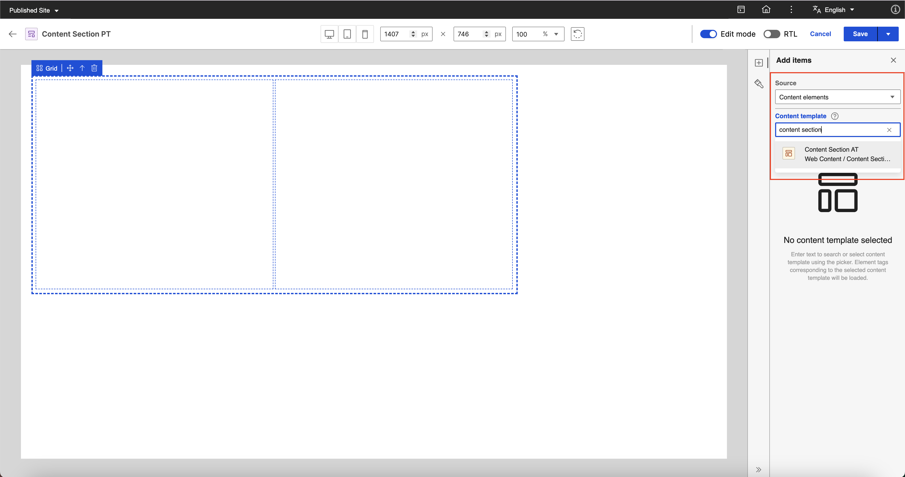
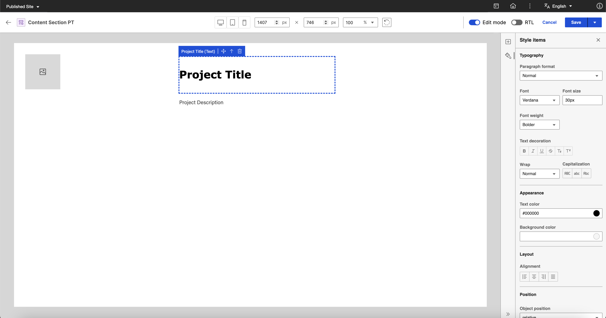
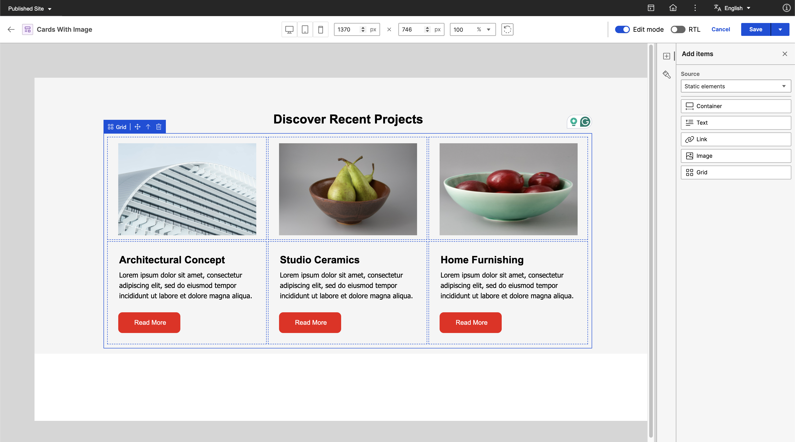

# Editing Presentation Template in Presentation Designer

This section details how to edit a presentation template in Presentation Designer using a sample scenario. 

To provide a comprehensive example, the goal is to have a **Content Section** presentation template for a **project page** which will display an **image of the project**, the **project title**, and **general information** by utilizing the capabilities of Presentation Designer. 

---

## Prerequisite

-   Create a **content template** with image, text, and rich text element. The image element will be for the Project Image, the text element will be for the Project Title, and the rich text element will be for the Project Description. For more information on how to create a content template, see **[Author Content Templates](../../../../manage_content/wcm_authoring/content_composer/usage/author_and_manage_content_templates/author_content_templates.md)**.
    
    ??? note "Click to see sample created content template"
        *Content Section AT*:

        

-   Create 2 or more **content items** using the content template created above and add different content to the image, text, and rich text elements for each content item. For more information on how to create a content item, see **[Author Content Items](../../../../manage_content/wcm_authoring/content_composer/usage/author_and_manage_content_items/author_content_items.md)**.

    ??? note "Click to see sample created content item"
        *Project Content - Home Living Furnishings*:
        
        

        *Image Element*:

        
        

        *Text Elements (Text & Rich Text)*:
        

-   Create a blank **presentation template** in the Authoring portlet. For detailed steps, see **[Access Presentation Designer](../access/index.md)**.

    ??? note "Click to see sample created presentation template"
        *Content Section PT*:

        

---

## Editing a Presentation Template in Presentation Designer

The steps below will show how to edit a Presentation Template in Presentation Designer.

???+ info "Related information"
    - [Presentation Designer UI](../access/index.md#the-hcl-presentation-designer-ui)
    - [User Items / Elements](../usage/user_items.md)
    - [Styling Options](../usage/styling_options.md)

### Edit Presentation Template

1. Edit the newly created presentation template in Presentation designer by **selecting the template** and **clicking More options** then **Edit in Presentation Designer**.

    

2. Drag and drop a **static container element** on the canvas and apply the following styles:
    
    ??? note "Click to view styles"
        **Dimensions**

        - Width: 1015px
        - Height: 565px

        **Spacing**

        - Padding top: 20px
        - Padding right: 20px
        - Padding bottom: 20px
        - Padding left: 20px

    

3. Add a **static grid element** inside the container.

    

4. The content section template will only need a **1x2 grid**. The idea is to display an image on the first column and details on the second column. To do this, apply the following styles to the grid:

    ??? note "Click to view styles"
        **Layout**

        - Rows: 1
        - Columns: 2
        - Row gap: 4px
        - Column gap: 4px

        **Dimensions**

        - Width: 910px
        - Height: 400px

        **Spacing**

        - Padding top: 8px
        - Padding right: 8px
        - Padding bottom: 8px
        - Padding left: 8px

    

5. On the Add Items panel, set the item **source** to **content elements** and **search and select the content template** prepared in [Prerequisites](#prerequisite).

    
    

6. Drag and drop the **Project Image** (Image Content Element) on the **first column** of the **grid** and drag and drop the **Project Title** (Text Content Element) and **Project Description** (Rich Text Content Element) on the **second column** of the **grid**.

    

7. Add a **static container element** inside the **second column** of the **grid**. This will serve as the container for the project details.

    

8. Drag and drop the **Project Title** (Text Content Element) and **Project Description** (Rich Text Content Element) inside the container added in step 7 by utilizing the **Move** icon button for each user item and apply the following styles to their parent container:

    ??? note "Click to view styles"
        **Dimensions**

        - Width: 445px
        - Height: 390px

        **Spacing**

        - Padding top: 5px
        - Padding right: 20px
        - Padding bottom: 20px
        - Padding left: 50px

    ???+ info "Related information"
        - [Item Actions](../usage/user_items.md#item-actions)

    

9. Select the **Project Title** (Text Content Element) and apply the following styles:

    ??? note "Click to view styles"
        **Typography**

        - Paragraph Format: Normal
        - Font: Verdana
        - Font size: 30px
        - Font weight: Bolder

        **Appearance**

        - Text color: #000000

    

10. Drag and drop a **static text element** in between the **Project Title** (Text Content Element) and **Project Description** (Rich Text Content Element).

    

11. **Input text content** "General Information" for the **static text element** and apply the following styles:
    
    ??? note "Click to view styles"
        **Typography**

        - Paragraph Format: Normal
        - Font: Verdana
        - Font size: 20px
        - Font weight: 500

        **Appearance**

        - Text color: #EF1212

    

12. In the **Add Items** panel, set the item **source** to **Property tag** and drag and drop the **Last modified date** property tag under the **Project Description** (Rich Text Content Element).

    

13. **Save** the changes to the presentation template by clicking the **Save** button. A snackbar with message "Presentation Template saved successfully." will appear on the screen. 

    

    ??? note "Click to view the markup generated after saving."
        *View from Authoring portlet:*

        

14. Go back to the Authoring portlet by clicking the back button to get ready for [Preview](#preview).

    

---

### Preview

To see the **actual output** of the presentation template edited in Presentation designer, you can use the **Preview** feature from the **Authoring portlet**.

1. From the Authoring Portlet, select the **Content Section PT** and click the **Preview** button.

    

2. Select any **content item** created in [Prerequisites](#prerequisite) to use it as **rendering context** when previewing then click the **OK** button.

    

3. See the preview generated on the **new tab**:

    *Project Content - Living Home Furnishings*:

    

4. Preview **other content items** by following steps 1-3.

    *Project Content - Architectural Concept*:

    

    *Project Content - Classic Studio Ceramics*:

    

---

### Sample Presentation Templates

With Presentation Designer, users can easily create a wide range of custom designs and template layouts, all tailored to their specific needs. The intuitive drag-and-drop interface, combined with real-time styling, empowers content managers to take full control of their designs. Below, you'll find some screenshots showcasing the creative possibilities and diverse templates that have been built using Presentation Designer.

-   **Hero Banner**

    

---

-   **Cards with Image**

    

---

- **Content Section**

    

    *Preview:*
    

---

-   **Recent Items Template**

    

    *Preview:*
    