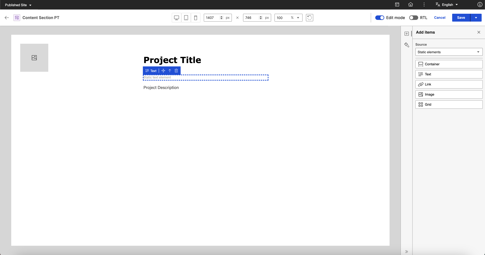
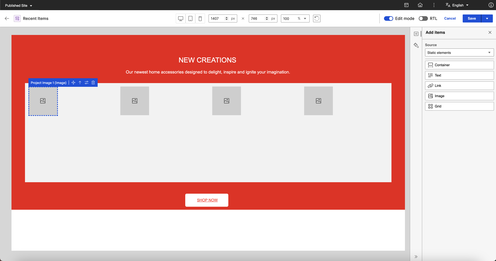

# Editing a presentation template in Presentation Designer

This section describes how to edit a presentation template in Presentation Designer using a sample scenario. 

To provide a comprehensive example, the goal is to have a **Content Section** presentation template for a **project page** which displays an **image of the project**, the **project title**, and **general information** by utilizing the capabilities of Presentation Designer.

## Prerequisites

-   Create a **content template** with image, text, and rich text elements. The image element is for the Project Image, the text element is for the Project Title, and the rich text element is for the Project Description. For more information on how to create a content template, see [Author Content Templates](../../../../manage_content/wcm_authoring/content_composer/usage/author_and_manage_content_templates/author_content_templates.md).
    
    
      See the following sample content template:

       

-   Create two or more **content items** using the created content template and add different content to the image, text, and rich text elements for each content item. For more information on how to create a content item, see [Author Content Items](../../../../manage_content/wcm_authoring/content_composer/usage/author_and_manage_content_items/author_content_items.md).

      See the following sample content item:
        
       

       *Image element*:

       
       

       *Text elements (Text and Rich Text)*:
       

-   Create a blank **presentation template** in the Authoring portlet. For detailed steps, see [Accessing Presentation Designer](../access/index.md).

       See the following sample presentation template:

       

## Editing a presentation template

Refer to the following steps to edit a presentation template in Presentation Designer.

1. From the **Authoring portlet**, select the newly created presentation template then click **More > Edit in Presentation Designer**.

    

2. Drag and drop a **static container element** on the canvas then enter the following values in the **Style** panel.
    
      **Dimensions**

      - **Width**: 1015px
      - **Height**: 565px

      **Spacing**

      - **Padding top**: 20px
      - **Padding right**: 20px
      - **Padding bottom**: 20px
      - **Padding left**: 20px

    

3. Add a **static grid element** inside the container.

    

4. Click the **Style** panel and enter the following values to create a **1 x 2 grid**. The content section template needs a **1 x 2 grid** to display an image on the first column and the details on the second column.

      **Layout**

      - **Rows**: 1
      - **Columns**: 2
      - **Row gap**: 4px
      - **Column gap**: 4px

      **Dimensions**

      - **Width**: 910px
      - **Height**: 400px

      **Spacing**

      - **Padding top**: 8px
      - **Padding right**: 8px
      - **Padding bottom**: 8px
      - **Padding left**: 8px

    

5. Click the **Add Items** panel and set the element **Source** to **Content elements**.

    

6.  In the **Content template** field, search and select the content template prepared in [Prerequisites](#prerequisites).

    

7. Drag and drop the following elements on the **grid**: 
    1. The **Project Image** (Image Content Element) in the first column. 
    2. The **Project Title** (Text Content Element) in the second column.
    3. The **Project Description** (Rich Text Content Element) in the second column.

    

8. Add a **static container element** inside the second column of the **grid**. This will serve as the container for the project details.

    

9. Drag and drop the **Project Title** (Text Content Element) and **Project Description** (Rich Text Content Element) inside the **static container element**.

    

    ???+ info "Related information"
        - [Element Actions](../usage/user_elements.md#element-actions)

10. Select the **static container element** and enter the following values in the **Style** panel:

      **Dimensions**

      - **Width**: 445px
      - **Height**: 370px

      **Spacing**

      - **Padding top**: 5px
      - **Padding right**: 20px
      - **Padding bottom**: 20px
      - **Padding left**: 50px

    

11. Select the **Project Title** (Text Content Element) and enter the following values in the **Style** panel:

      **Typography**

      - **Paragraph format**: Normal
      - **Font**: Verdana
      - **Font size**: 30px
      - **Font weight**: Bolder

      **Appearance**

      - **Text color**: #000000

    

12. Drag and drop a **static text element** in between the **Project Title** (Text Content Element) and **Project Description** (Rich Text Content Element).

    

13. Enter "General Information" in the **static text element** then add the following values in the **Style** panel:
    
      **Typography**

      - **Paragraph format**: Normal
      - **Font**: Verdana
      - **Font size**: 20px
      - **Font weight**: 500

      **Appearance**

      - **Text color**: #EF1212

    

14. In the **Add Items** panel, set the element **source** to **Property tag** then drag and drop the **Last modified date** property tag under the **Project Description** (Rich Text Content Element).

    

15. Click **Save** to confirm your changes to the presentation template. The message "Presentation Template saved successfully." appears on the screen.

    

    The following image shows the markup generated after saving, as seen from the Authoring portlet. 

    

16. Click the **Back** button to return to the Authoring portlet and [preview the presentation template](#previewing-the-presentation-template).

    

## Previewing the presentation template

Use the **Preview** feature from the **Authoring portlet** to check the presentation template you edited in Presentation Designer.

1. From the Authoring portlet, select the **Content Section PT** checkbox then click **Preview**.

    

2. Select any **content item** created in [Prerequisites](#prerequisites) that you want to preview then click **OK**.

    

3. See the preview generated in a new tab.

    The following is a sample preview for **Project Content - Living Home Furnishings**:

    

    See the following sample previews for other content items:

    **Project Content - Architectural Concept**:

    

    **Project Content - Classic Studio Ceramics**:

    

### Sample presentation templates

With Presentation Designer, you can create a wide range of custom designs and template layouts tailored to your needs. The intuitive drag-and-drop interface, combined with real-time styling, helps content managers take full control of their designs. This section contains images showing possible presentation templates you can build using Presentation Designer.

-   **Hero Banner**

    

-   **Cards with Image**

    

- **Content Section**

    

    *Preview:*
    

-   **Recent Items Template**

    

    *Preview:*
    

???+ info "Related information"
    - [Presentation Designer UI](../access/index.md#the-presentation-designer-ui)
    - [User Elements](../usage/user_elements.md)
    - [Styling Options](../usage/styling_options.md)
