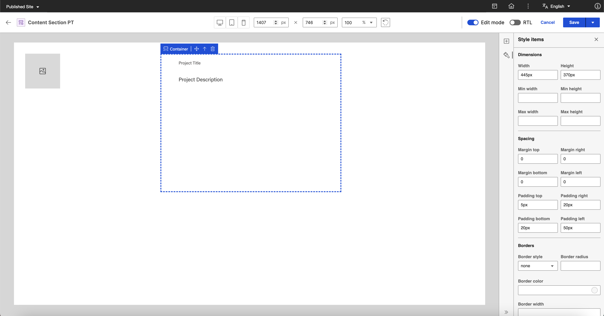
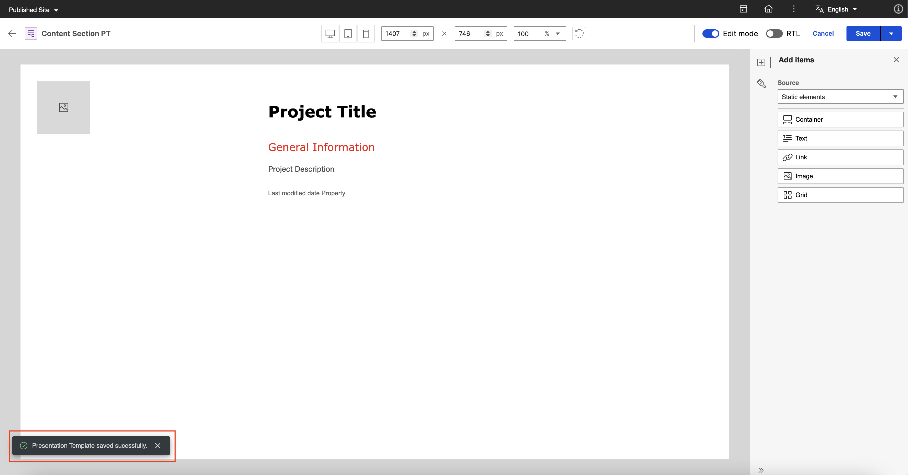
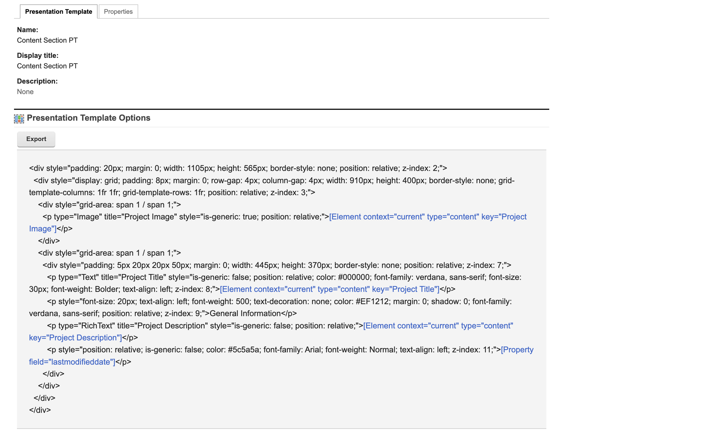
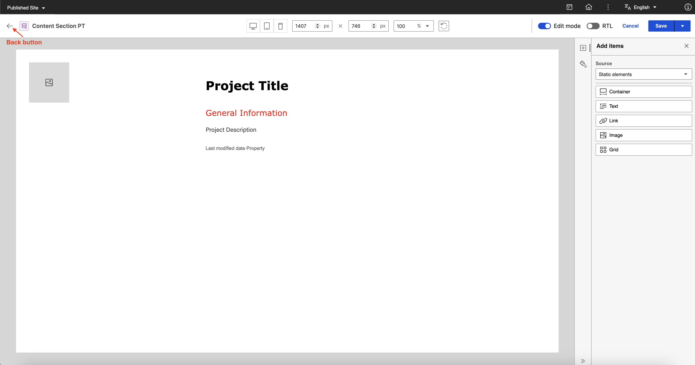
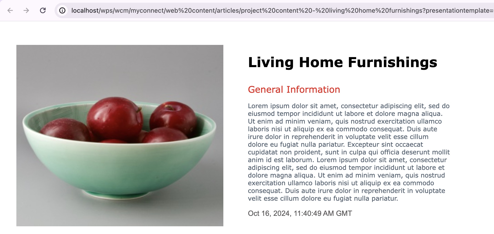
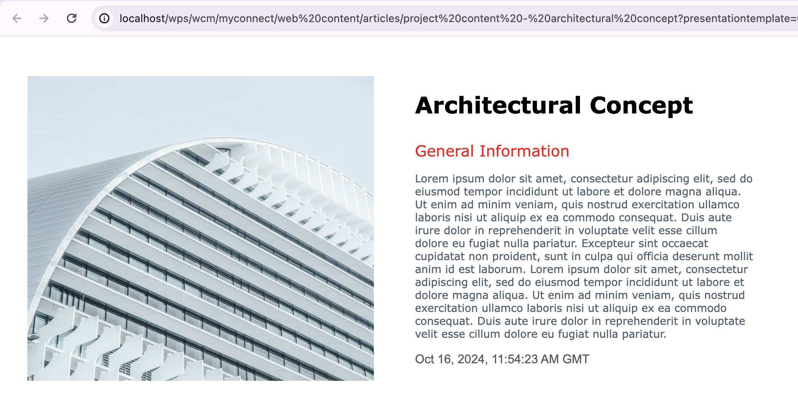
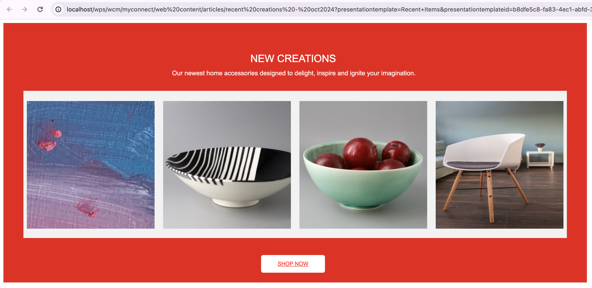

# Editing Presentation Template in Presentation Designer

This section describes how to edit a presentation template in Presentation Designer using a sample scenario. 

To provide a comprehensive example, the goal is to have a **Content Section** presentation template for a **project page** which displays an **image of the project**, the **project title**, and **general information** by utilizing the capabilities of Presentation Designer.

## Prerequisites

-   **Create a content template with image, text, and rich text elements.** The image element is for the Project Image, the text element is for the Project Title, and the rich text element is for the Project Description. For more information on how to create a content template, see [Author Content Templates](../../../../manage_content/wcm_authoring/content_composer/usage/author_and_manage_content_templates/author_content_templates.md).
    
    ??? note "Click to see sample created content template"
        *Content Section AT*:

        

-   **Create two or more content items using the created content template and add different content to the image, text, and rich text elements for each content item.** For more information on how to create a content item, see [Author Content Items](../../../../manage_content/wcm_authoring/content_composer/usage/author_and_manage_content_items/author_content_items.md).

    ??? note "Click to see sample created content item"
        *Project Content - Home Living Furnishings*:
        
        

        *Image Element*:

        
        

        *Text Elements (Text and Rich Text)*:
        

-   **Create a blank presentation template in the Authoring portlet**. For detailed steps, see [Access Presentation Designer](../access/index.md).

    ??? note "Click to see sample created presentation template"
        *Content Section PT*:

        

## Editing a Presentation Template in Presentation Designer

Refer to the following steps to edit a presentation template in Presentation Designer.

### Editing the Presentation Template

1. Select the the newly created presentation template and click **More > Edit in Presentation Designer**.

    

2. Drag and drop a **static container element** on the canvas and apply the following styles:
    
    ??? note "Click to view styles"
        **Dimensions**

        - Width: 1015px
        - Height: 565px

        **Spacing**

        - Padding top: 20px
        - Padding right: 20px
        - Padding bottom: 20px
        - Padding left: 20px

    

3. Add a **static grid element** inside the container.

    

4. The content section template only needs a **1 x 2 grid**. The idea is to display an image on the first column and details on the second column. To do this, apply the following styles to the grid:

    ??? note "Click to view styles"
        **Layout**

        - Rows: 1
        - Columns: 2
        - Row gap: 4px
        - Column gap: 4px

        **Dimensions**

        - Width: 910px
        - Height: 400px

        **Spacing**

        - Padding top: 8px
        - Padding right: 8px
        - Padding bottom: 8px
        - Padding left: 8px

    

5. On the **Add Items** panel, set the element **Source** to **Content elements**. In the **Content template** field, search for and select the content template prepared in [Prerequisites](#prerequisites).

    
    

6. Drag and drop the **Project Image** (Image Content Element) on the first column of the **grid**. Then, drag and drop the **Project Title** (Text Content Element) and **Project Description** (Rich Text Content Element) on the second column of the grid.

    

7. Add a **static container element** inside the second column of the **grid**. This will serve as the container for the project details.

    

8. Drag and drop the **Project Title** (Text Content Element) and **Project Description** (Rich Text Content Element) inside the container added in Step 7. Use the **Move** icon for each user element and apply the following styles to their parent container:

    ??? note "Click to view styles"
        **Dimensions**

        - Width: 445px
        - Height: 390px

        **Spacing**

        - Padding top: 5px
        - Padding right: 20px
        - Padding bottom: 20px
        - Padding left: 50px

    ???+ info "Related information"
        - [Element Actions](../usage/user_elements.md#element-actions)

    

9. Select the **Project Title** (Text Content Element) and apply the following styles:

    ??? note "Click to view styles"
        **Typography**

        - Paragraph Format: Normal
        - Font: Verdana
        - Font size: 30px
        - Font weight: Bolder

        **Appearance**

        - Text color: #000000

    

10. Drag and drop a **static text element** in between the **Project Title** (Text Content Element) and **Project Description** (Rich Text Content Element).

    

11. Enter "General Information" in the **static text element** and apply the following styles:
    
    ??? note "Click to view styles"
        **Typography**

        - Paragraph Format: Normal
        - Font: Verdana
        - Font size: 20px
        - Font weight: 500

        **Appearance**

        - Text color: #EF1212

    

12. In the **Add Items** panel, set the element **source** to **Property tag** and drag and drop the **Last modified date** property tag under the **Project Description** (Rich Text Content Element).

    

13. Click the **Save** button to save the changes to the presentation template by clicking the **Save** button. The message "Presentation Template saved successfully." appears on the screen.

    

    ??? note "Click to view the markup generated after saving."
        *View from Authoring portlet:*

        

14. Click the **Back** button to return to the Authoring portlet and [preview the presentation template](#previewing-the-presentation-template).

    

### Previewing the Presentation Template

To see the output of the presentation template edited in Presentation Designer, you can use the **Preview** feature from the **Authoring portlet**.

1. From the Authoring Portlet, select the **Content Section PT** and click **Preview**.

    

2. Select any **content item** created in [Prerequisites](#prerequisites) to use as the rendering context during preview then click **OK**.

    

3. See the preview generated in a new tab:

    The following is a sample preview for **Project Content - Living Home Furnishings**:

    

    See the following sample previews for other content items:

    *Project Content - Architectural Concept*:

    

    *Project Content - Classic Studio Ceramics*:

    

### Sample Presentation Templates

With Presentation Designer, you can can create a wide range of custom designs and template layouts tailored to your specific needs. The intuitive drag-and-drop interface, combined with real-time styling, helps content managers to take full control of their designs. This section contains screenshots showing possible presentation templates you can build using Presentation Designer.

-   **Hero Banner**

    

-   **Cards with Image**

    

- **Content Section**

    

    *Preview:*
    

-   **Recent Items Template**

    

    *Preview:*
    

???+ info "Related information"
    - [Presentation Designer UI](../access/index.md#the-presentation-designer-ui)
    - [User Elements](../usage/user_elements.md)
    - [Styling Options](../usage/styling_options.md)