# Handle multiple stylesheets in Presentation Designer

In Presentation Designer, multiple stylesheet components can be applied to a presentation template for more advanced control and structured styling. While Presentation Designer automatically manages a **Default stylesheet** and an **Override stylesheet**, adding other stylesheet components gives users the freedom to define styles beyond the limitations of the Presentation Designer interface.

To learn about Default stylesheet and Override stylesheet in Presentation Designer, refer to the **[Default and override stylesheet](../usage/default_and_override_stylesheet.md)** topic.

## Prerequisites

1. Prepare a custom **Cascading Style Sheet (CSS)**. This is a plain text file containing all design rules, saved with a ```.css``` extension. The file should contain standard CSS rules to define the appearance of content. A rule consists of a selector (to target an element) and style properties. This can include new custom classes or styles targeting default Presentation Designer classes.

      See the following sample css file:

       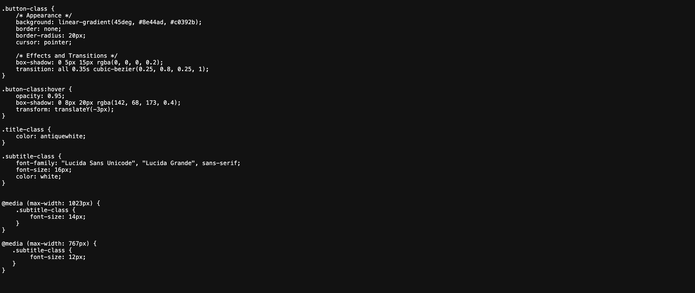

2. Create a **stylesheet component** in Authoring and upload the custom css file. It should be located in the same library as the presentation template. For more information on stylesheet component, see [Using a style sheet element](../../../../manage_content/wcm_authoring/authoring_portlet/content_management_artifacts/elements/stylesheet_element/index.md).

      See the following sample stylesheet component:

       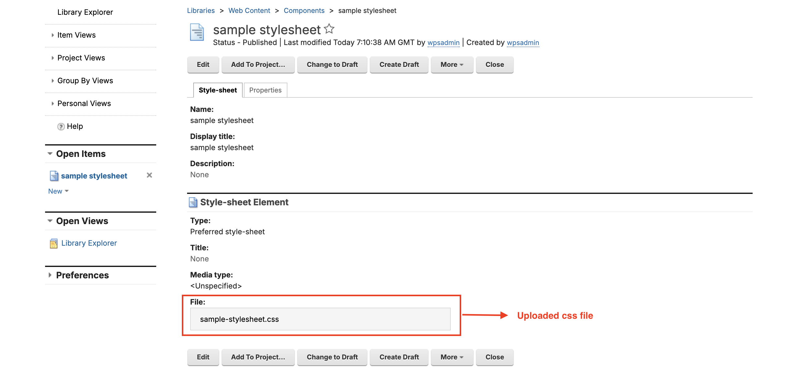

3. Any existing **Presentation Template** where the stylesheet component will be added. It should be located in the same library as the stylesheet component.

      See the following sample presentation template:

       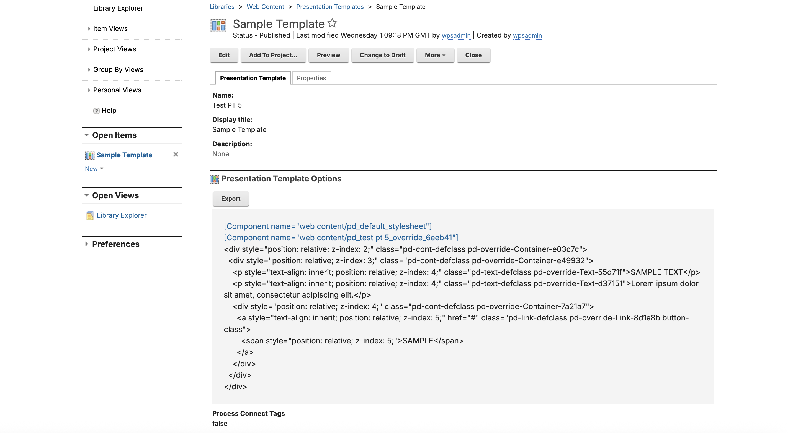

       *When viewed in Presentation Designer*:
       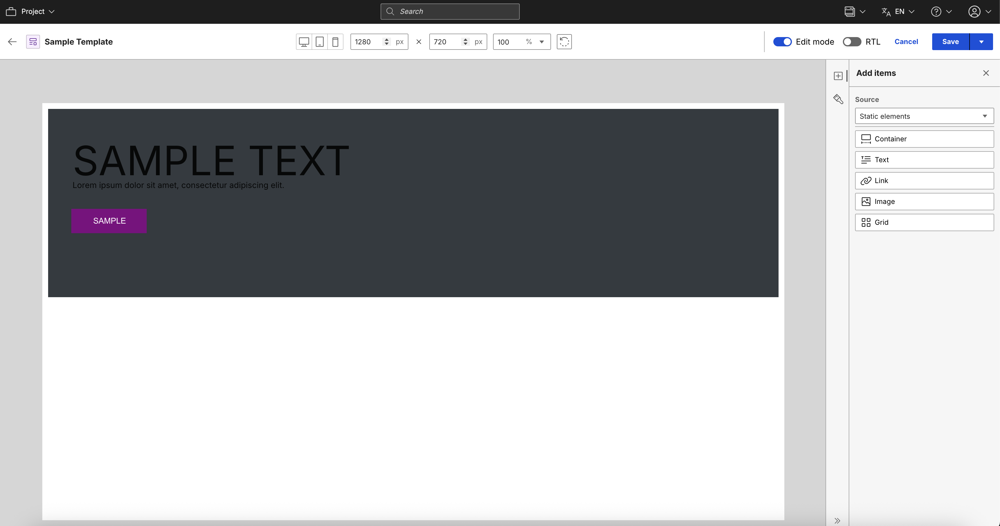

## Adding the stylesheet component

Refer to the following steps to add a stylesheet component to a presentation template.

1. From the **Authoring portlet**, select the presentation template then click **Edit**

    

2. In the presentation template markup, place the cursor in the desired location and from the Authoring menu, select **Insert Tag**. Select the stylesheet component from the list of library components. It is recommended to insert the new stylesheet component after the default stylesheet but before the override stylesheet. This ensures the custom styles correctly override the defaults.

    Insert stylesheet component tag:
    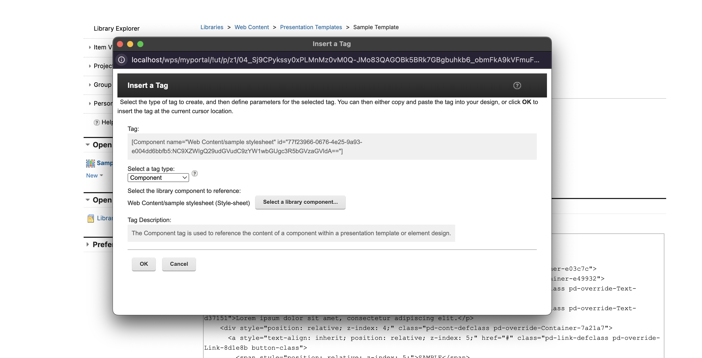

    Newly added stylesheet component tag in the presentation template markup:
    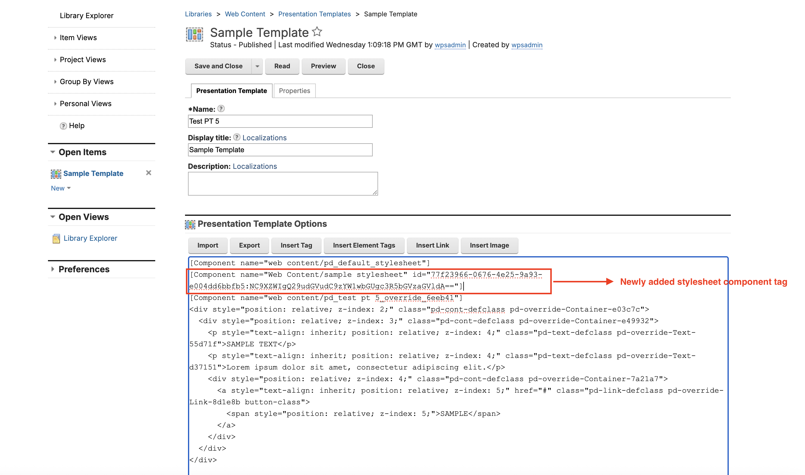

3. Add the **custom classes** from the sample stylesheet to the desired elements and save the presentation template.

    Presentation Template with custom classes:
    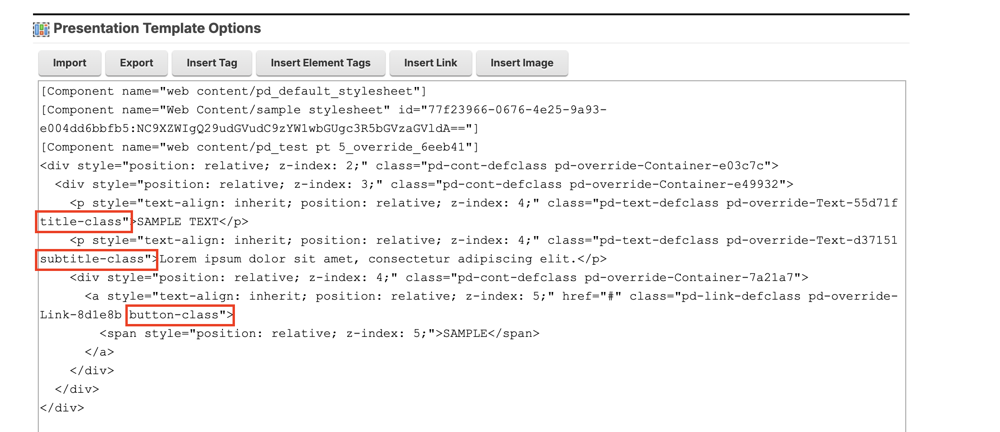

## Handle multiple stylesheets in Presentation Designer

Presentation Designer will automatically load the stylesheets and apply styles to the elements on the canvas. The stylesheets are loaded in a specific order to determine which styles take precedence. 

1. From the initial render of Presentation Designer, the stylesheets are loaded in the HTML ```head``` in the same order they are declared in the markup. However, override stylesheet is always loaded last, regardless of its position, to enable the users to continue with overriding the styles declared from the default and other stylesheets in Presentation Designer.

    There is a snackbar notification when a presentation template with stylesheet component/s is loaded in Presentation Designer:
    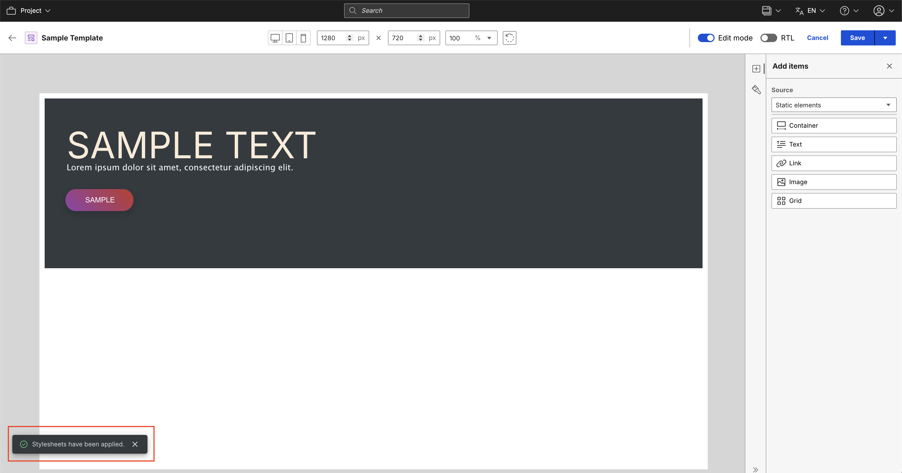

    HTML ```head``` with multiple stylesheets loaded:
    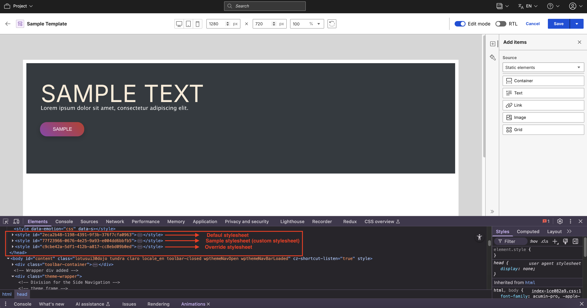

    HTML ```head``` with custom stylesheet loaded:
    

    The applied stylesheets can also be viewed from the style panel then click the **gear icon** to display the style settings:
    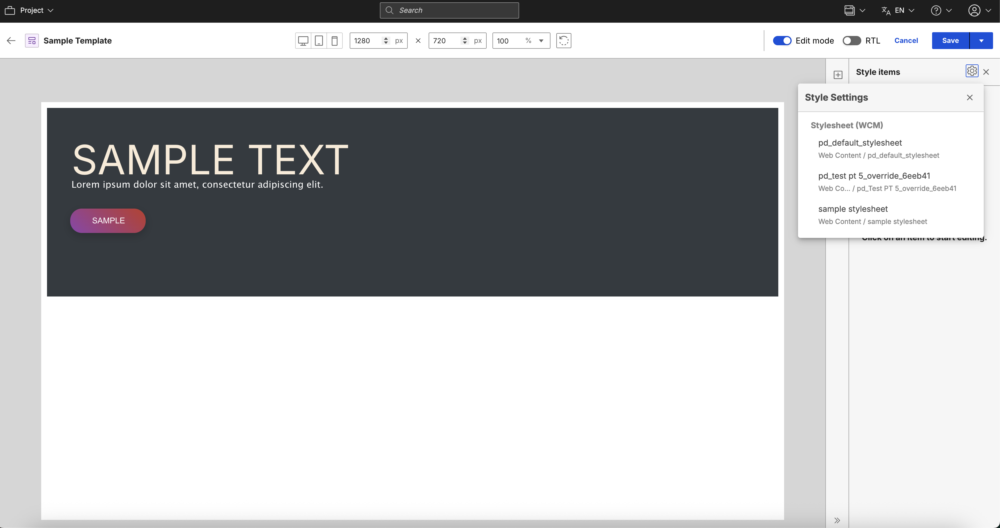

2. The canvas renders the elements with the **default class**, **override class**, and **custom class**, showing the computed styles. Any rules defined in the CSS file will be visible on the corresponding elements.

    Text element with multiple classes and styles applied:
    

    Link element with multiple classes and styles applied:
    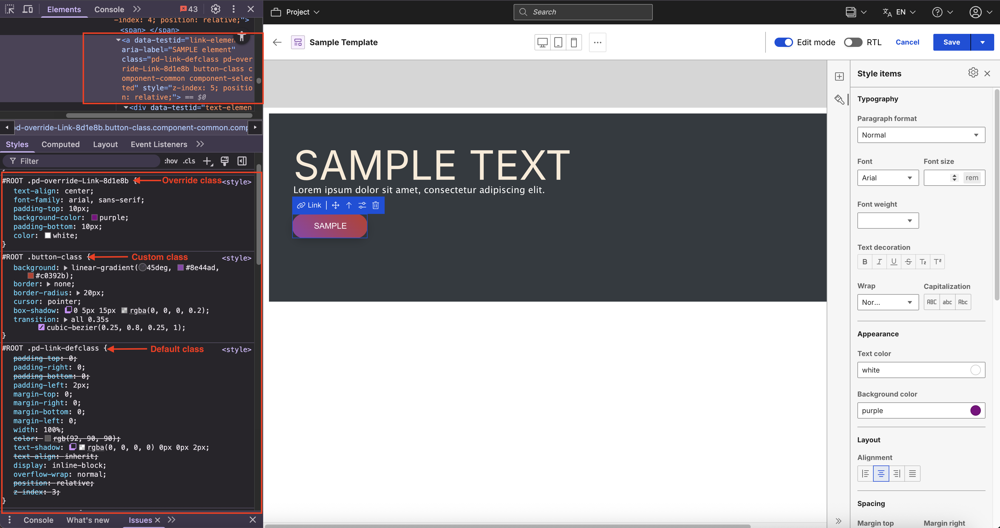

3. Users can still proceed with styling the elements with the available styling options in Presentation Designer, this will be stored in override stylesheet and will override the value from the sample stylesheet.

    Text element with only default and custom styles applied:
    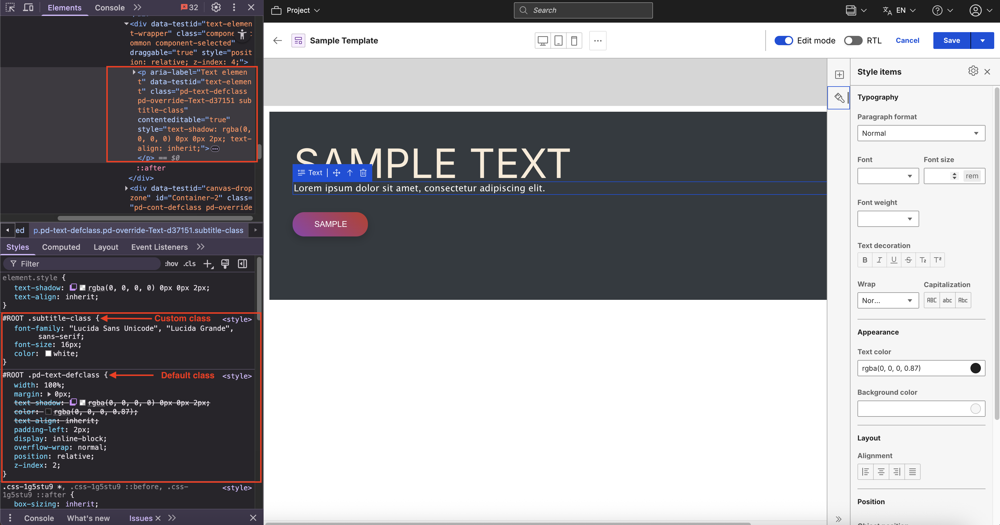

    Text element with new override styles applied (Desktop):
    

    Text element with new override styles applied (Tablet):
    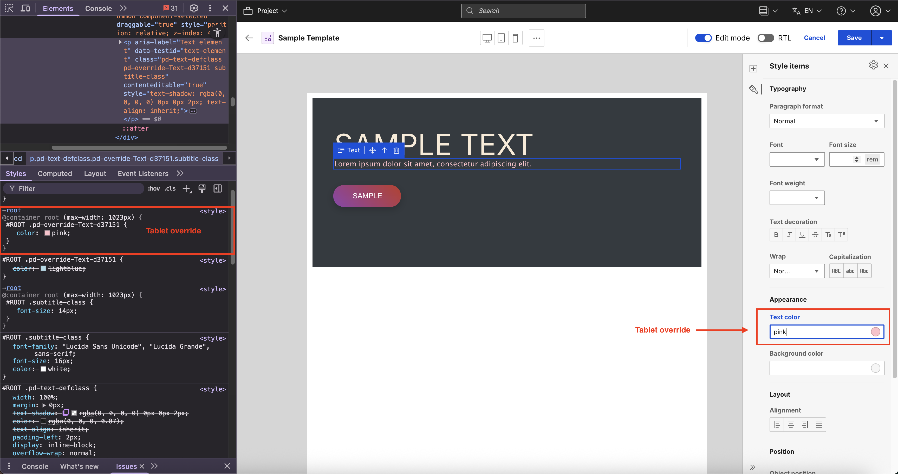

    Text element with new override styles applied (Mobile):
    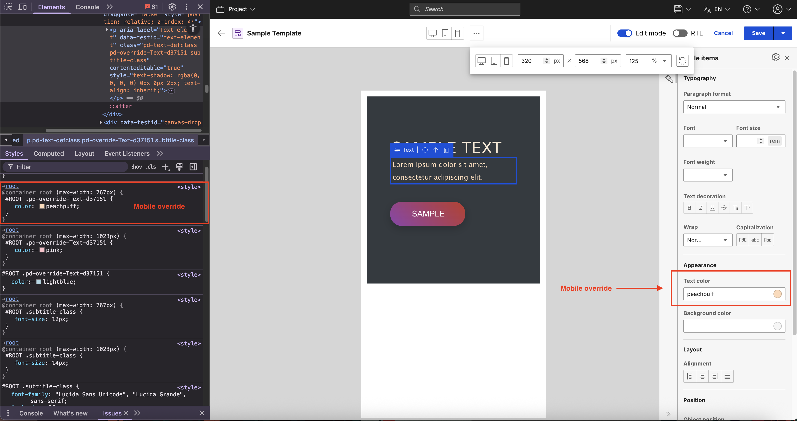
