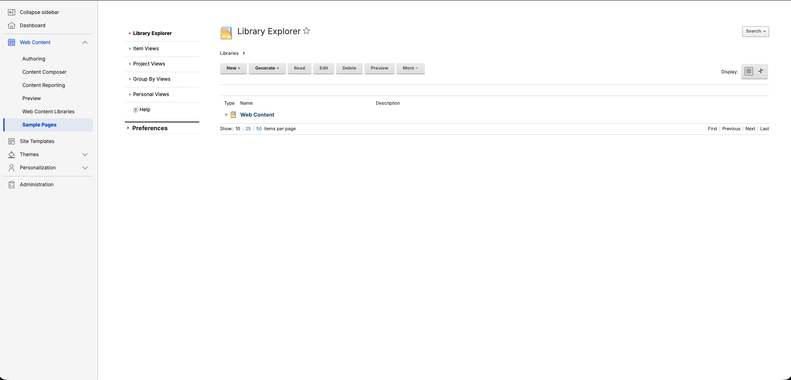
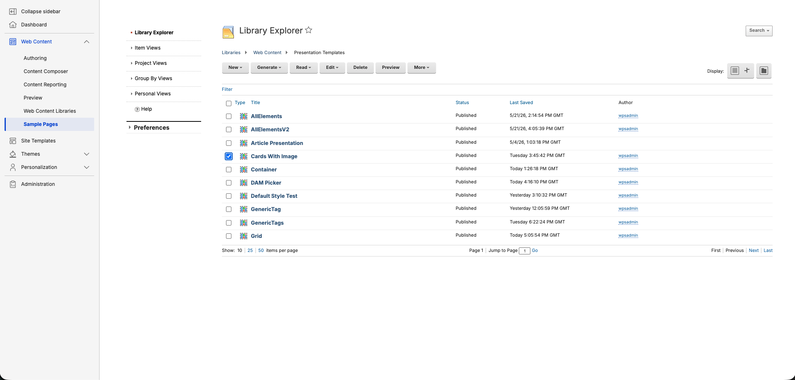
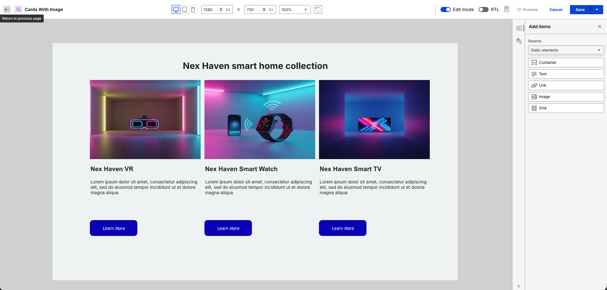
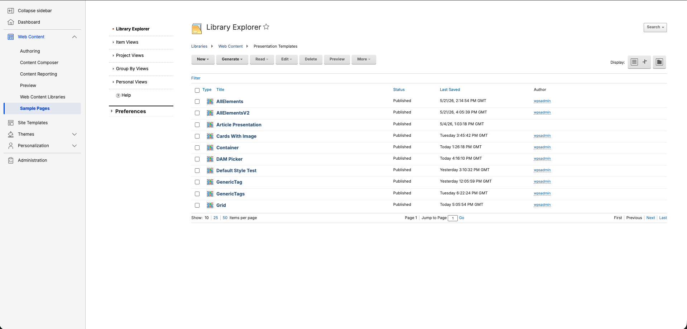
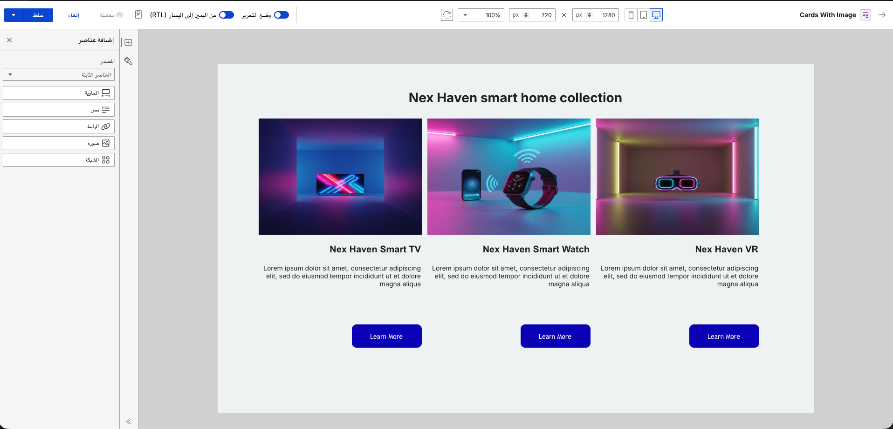

# Feature updates for intuitive design and editing experience

Presentation Designer introduces several improvements to make the design and editing experience more intuitive. This topic summarizes the behavior and usage of the latest feature updates under epic DXQ-44699.

The updates include:

- Image selection from HCL Digital Asset Management (DAM)
- Responsive grid controls by device context
- Correct back-button navigation to the authoring page
- Stackable in-app notifications

## Prerequisites

Before using these feature updates, ensure the following:

- You can open and edit a presentation template in Presentation Designer.
- You have access to required content and asset libraries.
- The target environment is configured with the latest Presentation Designer updates.

## Select images from DAM

Presentation Designer now supports selecting images from DAM directly in image configuration.

### What changed

- The image source includes an HCL DAM option.
- DAM picker integration allows selecting an asset from the DAM dialog.
- Selected image metadata can populate image fields such as title and alternate text.
- Source switching prevents stale DAM values from persisting when switching back to URL mode.

### Behavior

1. In image configuration, **Asset source** includes **HCL DAM** as an available source.

    

2. After selecting **HCL DAM**, the Select image button is shown.

    

3. Clicking the Select image button opens the DAM picker dialog, where users can browse and select an image asset.

    

4. Select an image from the DAM picker dialog, and then click Select.

    

5. After selecting an image, the dialog closes and the selected image is applied to the canvas.

    

6. You can also apply a style to the selected image.

    

7. When you return to the image configuration, the selected image name appears under **Asset source**.

    

8. If you switch the source back to URL, DAM-specific values are cleared to prevent stale data.

    

### Notes

- If DAM picker is unavailable in the environment, the DAM source option appears disabled.
- The selected image label appears only for DAM-compatible image URLs.

## Responsive grid controls by device context

Responsive grid controls now support per-device layout behavior.

### What changed

- Grid responsive layout controls can override rows and columns for active device context.
- Grid auto-flow settings are configurable by device context.
- Responsive overrides are applied through device-specific stylesheet media blocks.

### Behavior

1. Drag a Grid element onto the canvas and configure its style. Enter the following values in the **Styles** section:

    

    **Layout**

    - **Rows**: 3
    - **Columns**: 3

    **Dimensions**

    - **Height**: 500px

    **Spacing**

    - **Padding top**: 4px
    - **Padding right**: 4px
    - **Padding bottom**: 4px
    - **Padding left**: 4px

2. Add static text to each cell so you have a visual representation of how Auto flow and Area layout work.

    

3. In the Style panel for the Grid element, there are new sections called **Auto-flow** and **Area layout**.

    

    - **Auto Flow** controls how grid elements are distributed within the grid. Possible values include `row`, `column`, and `row or column dense`.
    - **Area Layout** is a count-based layout override that automates responsiveness for Tablet and Mobile viewports. It dynamically balances rows and columns based on the specified track count, eliminating manual calculations while keeping all grid cells equal and uniform.

#### Desktop view

The Area layout is disabled in Desktop view because Desktop is the baseline and matches the rows and columns you set.

The Area flow is set to `row`, so the sequence runs from left to right.

The Area flow can also be set to `column`, which changes the sequence from top to bottom.

#### Tablet view

When you switch to Tablet view, Area layout is enabled and starts with the same values as the rows and columns you set.

After changing Rows to 2, the Area layout is recalculated automatically. The Columns value changes to 5.

After changing Auto flow to Row, the Area layout updates to Row.

After changing Columns to 4, Rows updates to 3.

#### Phone view

When you change the view from Tablet to Phone, the tablet styling is not carried over because the baseline is Desktop.

After changing Columns to 1, Rows updates to 9. By using Area layout and Auto flow, you can achieve the expected result for each device view.

### Notes

- Area layout values are calculated from the device-specific row and column settings.
- In Tablet and Mobile contexts, **Area layout** can override rows and columns without changing the Desktop baseline.
- After you save changes in one device view, they are retained without affecting the other views.

## Back button returns to the correct authoring page

Back navigation has been improved so users return to the expected authoring context.

### What changed

- Authoring return URL handling is synchronized during app initialization.
- Return context is retained during editing transitions.
- The back action now prioritizes the stored authoring return URL and falls back to browser history when needed.

### Behavior

- After you create pages and add them to the Authoring Portlet, select the pages you created in Web Content.

    

- Select a Presentation Template.

    

- Click the Back button.

    

- Back navigation should return to the Authoring page, and the selected page should be highlighted.

    

- Open the Presentation Template again, change the language to Arabic, and click the Back button. It should return to the Authoring page with the selected pages.

    

### Notes
- Selecting **Back to authoring** returns users to the correct source authoring page.
- Navigation remains consistent during typical editing and language-change workflows.

## Stackable notifications

Presentation Designer now supports stacked notifications instead of immediately replacing active messages. This allows multiple snackbars to appear in order rather than showing only the latest message.

### What changed

- Notifications are queued and rendered as multiple stacked messages.
- Notification lifecycle supports add, remove, and clear actions.
- The maximum simultaneous notification stack size is capped.

### Behavior

- Rapid operations can show multiple messages in order.

    

- The oldest message is removed when the queue exceeds the configured cap.

    

## Troubleshooting

| Issue | Possible cause | Recommended action |
| :--- | :--- | :--- |
| DAM source is disabled | DAM picker is unavailable or not loaded | Verify environment configuration and picker availability |
| Selected DAM image details do not appear | Selected asset metadata is missing or source URL is not DAM-compatible | Confirm selected asset data and URL pattern |
| Back navigation goes to an unexpected page | Source authoring return URL is missing or invalid | Reopen from authoring entry point and retry |
| Multiple notifications are not visible | Queue cap reached or notification timing overlap | Trigger actions again and verify queue behavior |
| Grid layout differs by device unexpectedly | Responsive overrides or fallback values conflict | Re-check per-device settings and save again |

## Related topics

- [Editing a presentation template in Presentation Designer](edit_presentation_template.md)
- [Styling options](styling_options.md)
- [Canvas settings](canvas_settings.md)
- [Handle multiple stylesheets](handle_multiple_stylesheets.md)
