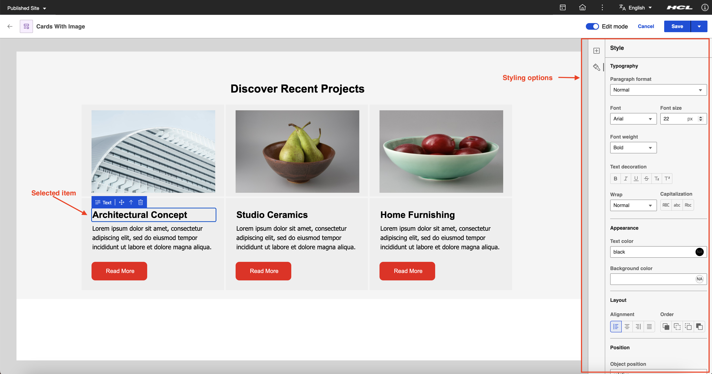
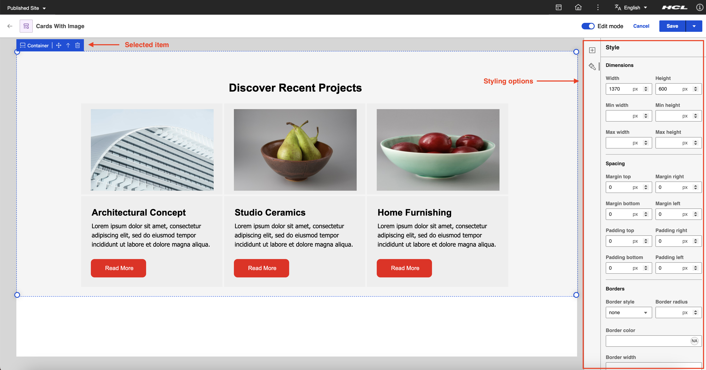
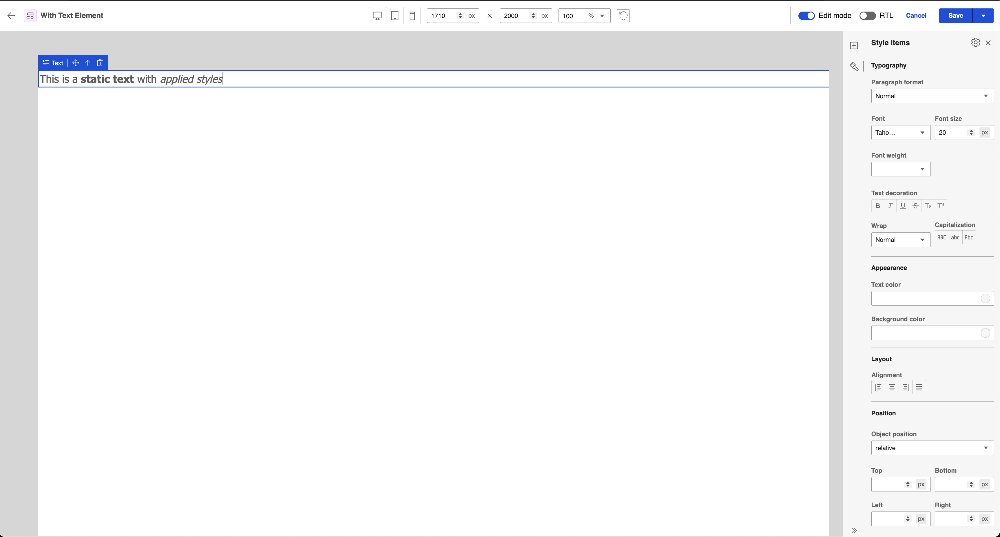
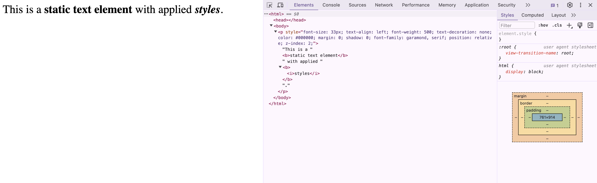

# Styling options in Presentation Designer

Styling options provide users the ability to make the elements on the canvas presentable. Styles are integral in Presentation Designer because they enable an interactive design experience. Users do not have to preview the final output separately, as the style changes are reflected on the canvas. This topic outlines the different styling options you can do in the **Style** panel of Presentation Designer.

To access Presentation Designer and understand its user interface, see the **[Access Presentation Designer](../access/index.md)** topic. 

To know how to use the different user elements in Presentation Designer, see the **[User Elements in Presentation Designer](../usage/user_elements.md)** topic. 

## Style panel

The styling options change based on the specific user element selected on the canvas. To see the available styling options for each element on your canvas, click on an element and check the rendered style options in the **Style** panel.

See the following sample styling options for a static text element:

See the following sample styling options for a static container element:

## Inline styles

In Presentation Designer, styling options are applied directly to the selected elements through inline styles. 

See the following sample static text element with styles applied in Presentation Designer:

See the following sample markup generated after saving the presentation template:

See the following sample preview displayed in a browser:

## Style sections

Style sections in Presentation Designer refer to categorized areas where users can adjust specific style properties of the selected user element on the canvas. Each section focuses on a different aspect of the element's design and helps users navigate the **Style** panel and apply the adjustments they need for each element.

### Dimensions
The **Dimensions** properties allow users to control the size and scaling of elements within the design. These settings ensure that elements fit well within their container and across various screen sizes.

- **Width**: Adjusts the width of the selected element.
- **Height**: Adjusts the height of the selected element.
- **Min width**: Defines the minimum width the element can be resized to.
- **Min height**: Defines the minimum height the element can be resized to.
- **Max width**: Defines the maximum width the element can be resized to.
- **Max height**: Defines the maximum height the element can be resized to.

### Spacing
**Spacing** properties control the space around and within elements, ensuring proper layout structure and breathing room for each element.

- **Margin**: Controls the space outside the element, affecting how far the element is from adjacent ones.
- **Padding**: Controls the space inside the element, between its content and its border.

### Borders
**Border** settings allow customization of the border around elements, enhancing their appearance and creating a clear visual structure.

- **Border style**: Specifies the type of border (for example, solid, dashed, dotted).
- **Border radius**: Controls the roundness of the element's corners.
- **Border color**: Allows users to choose the color of the element’s border.
- **Border width**: Sets the thickness of the border.

### Appearance
The **Appearance** settings focus on the visual aspects, allowing users to style the colors of elements to make them stand out or blend into the overall design.

- **Background color**: Changes the background color of the selected element.
- **Text color**: Changes the color of any text within the element.

### Layout
Layout controls the structural positioning and setup of the element relative to other elements on the canvas, ensuring proper arrangement and organization.

- **Grid setup (Rows and Columns)**: Defines the structure for grid layouts, allowing users to specify how content is arranged into rows and columns. The layout uses the **fr (fractional unit)** to proportionally distribute space within the grid.
  - **Rows**: Specifies the number of horizontal sections (rows) in the grid, with each row's height defined using the **fr** unit (for example, 1fr, 2fr).
  - **Columns**: Specifies the number of vertical sections (columns) in the grid, with each column's width defined using the **fr** unit (for example, 1fr, 3fr).
  - **Column gap**: Sets the space between columns, defining the separation between elements in different columns.

### Position
The **Position** settings allow users to precisely control the placement of elements on the canvas to ensure accurate positioning based on the layout's needs.

- **Order of elements (Z-Index)**: Defines the stacking order of elements, determining which elements appear in front of or behind others.
- **Position**: Sets the element’s position (for example, static, relative, absolute, sticky, or fixed).
- **Top**: Specifies the top position of the element relative to its parent.
- **Bottom**: Specifies the bottom position of the element relative to its parent.
- **Left**: Specifies the left position of the element relative to its parent.
- **Right**: Specifies the right position of the element relative to its parent.

### Typography

**Typography** properties let users customize text-based elements, giving full control over the font, size, and styling of text to ensure readability and alignment with design standards.

- **Paragraph format**: Defines the paragraph style to be used (for example, headings, body text).
- **Font**: Defines the font family used for the text.
- **Font size**: Adjusts the size of the font.
- **Font weight**: Controls the boldness of the text.
- **Text decoration**: Adds text formatting (for example, underlines, strikethroughs, overlines).
- **Wrap**: Controls whether long lines of text wrap or remain on a single line.
- **Capitalization**: Adjusts text to be uppercase, lowercase, or sentence case.
