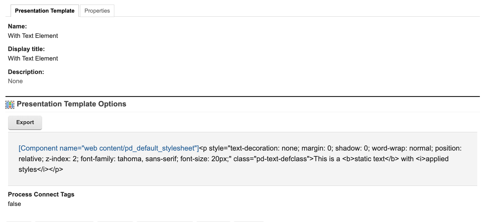

# Styling Options in Presentation Designer

Styling options give the users the ability to make the user items or elements on the canvas presentable. The **styles** are integral part of Presentation Designer as it enables an interactive design experience, minimizing the need for users to preview the final output separately, as the style changes **reflect visibly on the canvas**.

!!! note
    To access Presentation Designer and gain an understanding of its user interface, see the **[Access Presentation Designer](../access/index.md)** topic. 
    
    To know how to use the different user items or elements in Presentation Designer, see the **[User items or elements in Presentation Designer](../usage/user_items.md)** topic. 

---
## Style Panel

The **style options** adjust based on the **specific user item or element** that has been **selected** on the **canvas**. To see the available styling options for each user item or element on your canvas, **click on an item** and **check the rendered style options** in the **style panel**. 

*Sample styling options for static text element:*

*Sample styling options for static container element:*

---

## Inline Styles

In **Presentation Designer**, styling options are applied directly to the selected elements via **inline styles**. 

*Sample static text element with styles applied in Presentation Designer:*

*Sample markup generated after saving the presentation template:*

*Sample preview generated on browser:*

---
## Style Sections

Style sections in Presentation Designer refer to the **categorized areas** where users can adjust **specific style properties** of the selected user item or element on the canvas. Each section focuses on a different aspect of the item's design and makes it simple for users to navigate the style panel and apply the adjustments they need for each item.

### Dimensions
The **Dimensions** properties allow users to control the size and scaling of elements within the design. These settings ensure that elements fit well within their container and across various screen sizes.

- **Width**: Adjusts the width of the selected element.
- **Height**: Adjusts the height of the selected element.
- **Min Width**: Defines the minimum width the element can be resized to.
- **Min Height**: Defines the minimum height the element can be resized to.
- **Max Width**: Sets a maximum limit for the width.
- **Max Height**: Sets a maximum limit for the height.

---

### Spacing
**Spacing** properties control the space around and within elements, ensuring proper layout structure and breathing room for each element.

- **Margin**: Controls the space outside the element, affecting how far the element is from adjacent ones.
- **Padding**: Controls the space inside the element, between its content and its border.

---

### Borders
**Border** settings allow customization of the border around elements, enhancing their appearance and creating a clear visual structure.

- **Border Style**: Specifies the type of border (solid, dashed, dotted, etc.).
- **Border Radius**: Controls the roundness of the element's corners.
- **Border Color**: Allows users to choose the color of the element’s border.
- **Border Width**: Sets the thickness of the border.

---

### Appearance
The **Appearance** settings focus on the visual aspects, allowing users to style the colors of elements, making them stand out or blend into the overall design.

- **Background Color**: Changes the background color of the selected element.
- **Text Color**: Changes the color of any text within the element.

---

### Layout
**Layout** controls the structural positioning and setup of the element relative to other elements on the canvas, ensuring proper arrangement and organization.

- **Order of Elements (Z-Index)**: Defines the stacking order of elements, determining which elements appear in front of or behind others.
- **Grid Setup (Rows & Columns)**: Defines the structure for grid layouts, allowing users to specify how content is arranged into rows and columns. The layout uses the **fr (fractional unit)** to proportionally distribute space within the grid.
  - **Rows**: Specifies the number of horizontal sections (rows) in the grid, with each row's height defined using the **fr** unit (e.g., 1fr, 2fr).
  - **Columns**: Specifies the number of vertical sections (columns) in the grid, with each column's width defined using the **fr** unit (e.g., 1fr, 3fr).
  - **Row Gap**: Sets the space between rows, ensuring adequate spacing within the grid.
  - **Column Gap**: Sets the space between columns, defining the separation between elements in different columns.

---

### Position
The **Position** settings allow users to precisely control the placement of elements on the canvas, ensuring accurate positioning based on the layout's needs.

- **Position**: Sets the element’s position (static, relative, absolute, sticky, or fixed).
- **Top**: Specifies the top position of the element relative to its parent.
- **Bottom**: Specifies the bottom position of the element relative to its parent.
- **Left**: Specifies the left position of the element relative to its parent.
- **Right**: Specifies the right position of the element relative to its parent.

---

### Typography

**Typography** properties let users customize text-based elements, giving full control over the font, size, and styling of text to ensure readability and alignment with design standards.

- **Paragraph Format**: Allows for choosing between paragraph styles like headings, body text, etc.
- **Font**: Defines the font family used for the text.
- **Font Size**: Adjusts the size of the font.
- **Font Weight**: Controls the boldness of the text.
- **Text Decoration**: Adds underlines, strikethroughs, overlines, etc. to the text.
- **Wrap**: Controls whether long lines of text wrap or remain on a single line.
- **Capitalization**: Adjusts text to be uppercase, lowercase, or capitalized.
