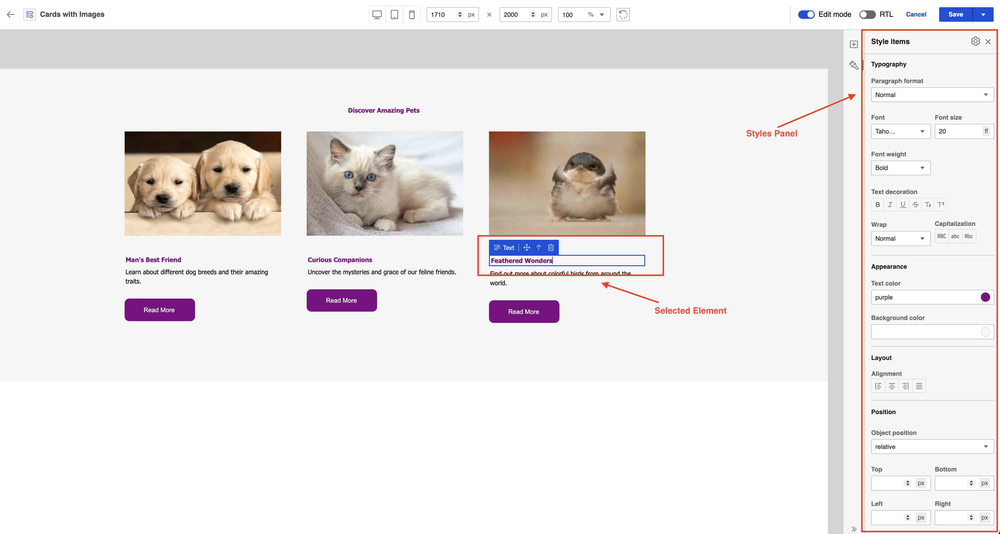
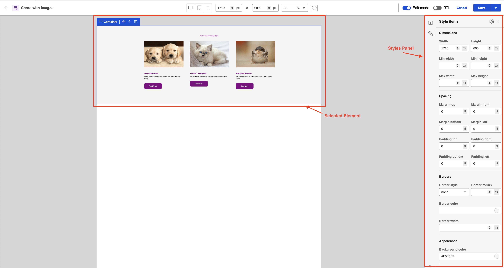

# Styling options in Presentation Designer

Styling options allow users to make the elements on the canvas presentable. Styles enable an interactive design experience that lets users see their style changes reflected on the canvas in real-time. This topic outlines the different styling options you can do in the **Style** panel of Presentation Designer.

To access Presentation Designer and understand its user interface, refer to the **[Access Presentation Designer](../access/index.md)** topic.

To learn how to use the different user elements in Presentation Designer, refer to the **[User Elements in Presentation Designer](../usage/user_elements.md)** topic. 

## Style panel

The styling options change based on the specific user element selected on the canvas. To check the available styling options for each element on your canvas, click an element and check the rendered style options in the **Style** panel.

See the following sample styling options for a static text element:

See the following sample styling options for a static container element:

## Inline styles

In Presentation Designer, styling options are applied directly to the selected elements through inline styles. 

See the following sample static text element with styles applied in Presentation Designer:

See the following sample markup generated after saving the presentation template:

See the following sample preview displayed in a browser:

## Style sections

Style sections in Presentation Designer refer to categorized areas where users can adjust specific style properties of the selected user element on the canvas. Each section focuses on a different aspect of an element's design, helping users navigate the **Style** panel and apply the adjustments they need for each element.

### Dimensions
The **Dimensions** section allows users to control the size and scaling of elements within the design, ensuring they fit well within their containers and across various screen sizes.

- **Width**: Adjusts the width of the selected element.
- **Height**: Adjusts the height of the selected element.
- **Min width**: Defines the minimum width the element can be resized to.
- **Min height**: Defines the minimum height the element can be resized to.
- **Max width**: Defines the maximum width the element can be resized to.
- **Max height**: Defines the maximum height the element can be resized to.

**Supported Units**: `px`, `vh`, `vw`, `%`, `calc()`  
**Sample Values**: `200px`, `100vh`, `25%`, `calc(50vh - 10px)`, `auto`, `inherit`

### Spacing
**Spacing** properties allow users to control the space around and within elements, ensuring proper layout structure and distance between each element.

- **Margin**: Controls the space outside the element, determining how far an element is from adjacent ones.
- **Padding**: Controls the space between the content and its border inside the element.

**Supported Units**: `px`, `em`, `rem`, `vh`, `vw`, `%`, `calc()`  
**Sample Values**: `10px`, `1em`, `2rem`, `5%`, `calc(10px + 2vw)`, `auto`

### Borders
The **Border** section allows users to customize the border around elements, enhancing their appearance and creating a clear visual structure.

- **Border style**: Specifies the element's border type. Possible values include solid, dashed, and dotted.

- **Border radius**: Controls the roundness of an element's corners.
    -  **Supported Units**: `px`, `em`, `rem`, `%`
    -  **Sample Values**: `5px`, `10px`, `1rem`, `50%`, `inherit`

- **Border color**: Specifies an element's border color.
    - **Sample Values**: `#FFFFFF`, `rgba(255, 99, 71, 0.2)`, `red`

- **Border width**: Sets the thickness of an element's border.
    - **Supported Units**: `px`, `em`, `rem`  
    - **Sample Values**: `1px`, `3em`, `0.1rem`

### Appearance
The **Appearance** section allows users to change the colors of elements to make them stand out or blend into the overall design.

- **Background color**: Changes the background color of the selected element.
    - **Sample Values**: `#FFFFFF`, `rgba(255, 255, 255, 0.5)`, `blue`

- **Text color**: Changes the color of any text within the element.
    - **Sample Values**: `#000000`, `rgba(0, 0, 0, 0.8)`, `green`

### Layout
The **Layout** section allows users to control the structural positioning and setup of the grid element, ensuring proper arrangement and organization of content within rows and columns.

- **Rows**: Specifies the number of horizontal sections (rows) in the grid, with a minimum of 1 row.  
    - **Sample Values**: `1`, `2`, `3`

- **Columns**: Specifies the number of vertical sections (columns) in the grid, with a minimum of 1 column.  
    - **Sample Values**: `1`, `2`, `3`

- **Row Gap**: Defines the space between rows in the grid.  
    - **Supported Units**: `px`  
    - **Sample Values**: `10px`, `20px`

- **Column Gap**: Defines the space between columns in the grid.  
    - **Supported Units**: `px`  
    - **Sample Values**: `15px`, `25px`

- **Grid (Column and Row Setup)**: Defines how space is distributed within the grid by using fractional units (`fr`) for both rows and columns. This allows for flexible layouts where the size of each section is proportionally based on available space.

- **Grid Cell (Columns)**: Specifies the number of columns the grid cell will occupy.  
    - **Sample Values**: `1`, `2`, `3`

- **Grid Cell (Rows)**: Specifies the number of rows the grid cell will occupy.  
    - **Sample Values**: `1`, `2`, `3`

### Position
The **Position** section allows users to precisely control the placement of elements on the canvas, ensuring accurate positioning based on the layout's needs.

- **Object position**: Sets an element’s position relative to its parent or containing element. Possible values include static, relative, absolute, sticky, and fixed.

- Under the **Object position** property, you can also specify the exact placement of an element with the following properties:
    - **Top**: Specifies the distance between the top edge of the element and the top edge of its containing element.
    - **Bottom**: Specifies the distance between the bottom edge of the element and the bottom edge of its containing element.
    - **Left**: Specifies the distance between the left edge of the element and the left edge of its containing element.
    - **Right**: Specifies the distance between the right edge of the element and the right edge of its containing element.
  
    **Supported Units**: `px`, `vh`, `vw`, `%`, `calc()`  
    **Sample Values**: `20px`, `10vh`, `15%`, `calc(10% + 5px)`, `auto`, `inherit`

- **Order of Elements**: Controls the stacking order of elements, determining which elements appear in front or behind other elements on the canvas. There are four options available:
    - **Bring Forward**: Moves the selected element one layer up in the stacking order.
    - **Bring to Front**: Moves the selected element to the topmost layer in the stacking order.
    - **Send Backward**: Moves the selected element one layer down in the stacking order.
    - **Send to Back**: Moves the selected element to the bottommost layer in the stacking order.

    *These actions adjust the `z-index` style property to change the stacking order of the elements.*

### Typography

The **Typography** section allows users to customize text-based elements, giving them full control over the font, size, and styling of text. This ensures readability and alignment with design standards.

- **Paragraph format**: Defines the paragraph style to be used such as headings and body text.
- **Font**: Defines the font family used for the text.
- **Font size**: Adjusts the size of the font.
    - **Supported Units**: `px`, `em`, `rem`, `%`  
    - **Sample Values**: `16px`, `1em`, `1.5rem`, `10%`, `large`
- **Font weight**: Controls the boldness of the text.
- **Text decoration**: Adds text formatting such as underlines, overlines, and strikethroughs.
- **Wrap**: Controls whether long lines of text wrap or remain on a single line.
- **Capitalization**: Adjusts text to be uppercase, lowercase, or sentence case.

!!! note
    - **Use `px`** for fixed and precise measurements, such as button widths or border thickness.
    - **Use `em` and `rem`** for scalable layouts, allowing text sizes to adjust proportionally while maintaining consistency.
    - **Use `%`, `vw`, and `vh`** for responsive designs, enabling elements to adapt based on screen size or parent container dimensions.
    - **Use `calc()`** for complex layouts that require dynamic calculations, like combining fixed and flexible measurements.
    - **Use unitless values** (e.g., `none`, `inherit`, `auto`) for properties that don't require a specific unit.
    - **Use color values like `hex`, `rgba`, `rgb`, and named colors** to specify colors in various formats:
        - **`hex`**: Common for precise color definition (e.g., `#FFFFFF` for white).
        - **`rgb`**: Defines colors with red, green, and blue values (e.g., `rgb(255, 99, 71)`).
        - **`rgba`**: Adds alpha transparency to colors (e.g., `rgba(255, 99, 71, 0.5)` for a semi-transparent color).
        - **Named colors**: Simple and intuitive way to use common color names (e.g., `red`, `blue`, `green`).

