# User elements

User elements are components that you can drag, drop, and edit directly on the canvas. This section covers the available element types and how to use them in Presentation Designer.

## Element source

By default, the **Add items** panel displays static elements. To change the component source, select your preference from the **Source** dropdown menu.

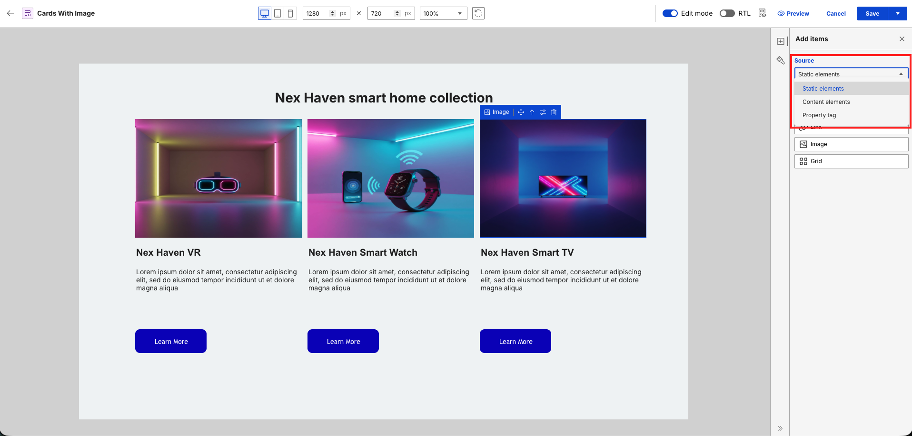

## Element actions

Hover over or select an element on the canvas to view its name and available actions:


1. **Move** icon: Rearrange the elements on the canvas through drag-and-drop.
2. **Arrow Up** icon: Automatically select the parent of the current element.
3. **Configure** icon: Display additional configuration options for the element.
4. **Trash** icon: Delete the element from the canvas.

## Element types

In Presentation Designer, user elements are divided into five categories:

- [Static elements](#static-elements)
- [Content elements](#content-elements)
- [Property tags](#property-tags)
- [Generic element tags](#generic-element-tags)
- [Generic tags](#generic-tags)

Each category serves a different purpose and each user element comes with its own set of styling and configuration options.

### Static elements

Static elements are predefined elements that display content exactly as it looks, ensuring a What You See Is What You Get (WYSIWYG) experience. After you add these elements in your presentation template, they will not change, even if you apply them to different content items. This consistency helps users create organized layouts with confidence, knowing that the design remains the same regardless of the content.

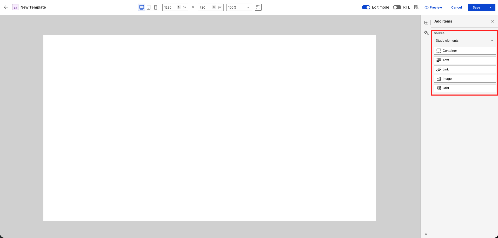

**Container**

The container element (```<div>...</div>```) serves as a foundational block for organizing and structuring content. This element allows users to group elements together. You can resize the container through the **Style items** panel by setting its width and height to fit different design needs. You can also apply other styling options to a container and add other user elements inside it.

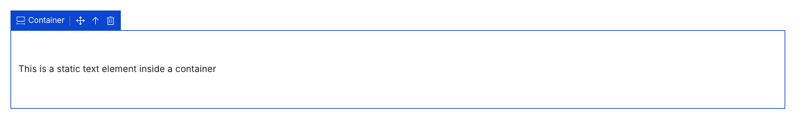
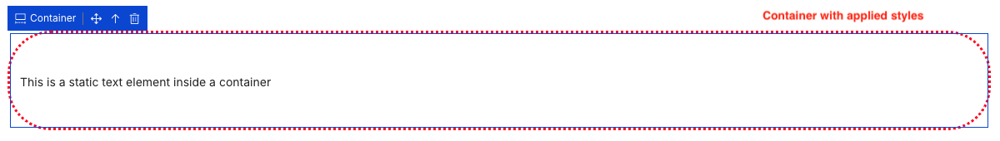

**Text**

Static text elements (for example, ```<p>Content goes here</p>```) are used to display text content which you can also edit on the canvas itself. These elements can include headers, paragraphs, and any other textual information. You can apply formatting and styling from the **Style items** panel to enhance readability and visual appeal. To edit the text content, click the text element and enter your desired text.

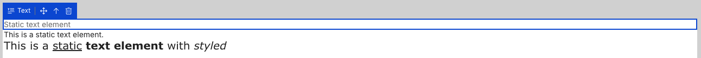

- The first line of text shows the placeholder text that appears when you drag and drop a static text element on the canvas. 
- The second line of text is a static text element with actual text content after user input. 
- The third line of text is a static text element with actual text content and applied styles.

!!! note
    Placeholder text for the static text element is only a visual representation in Presentation Designer. It represents an empty value for the text content. The words "Static text element" is not saved in the actual markup.

**Links**

Static links (for example, ```<a href="https://example.com">Click Here</a>```) enable users to create clickable hyperlinks to other websites or resources. You can edit the display text for the link element the same way as editing a text element. Different styling options are also available.

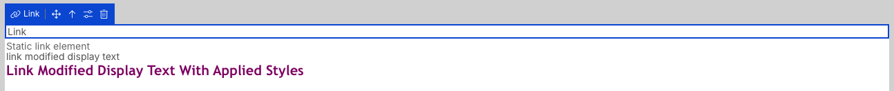

- The first line of text shows the default display text that appears when you drag and drop a static link element on the canvas.
- The second line of text shows the placeholder text that appears when you remove the default display text of the link element.
- The third line of text is a static link element with modified display text content after user input.
- The fourth line of text is a static link element with modified display text content and applied styles.

To set the `href` attribute, click the **Configure** button and enter the URL.

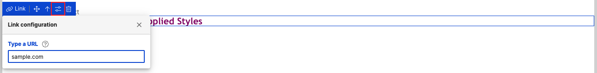

!!! note
    When you click a static link element on the canvas, you will not be redirected to the configured URL. To test the link, preview the presentation template in the Authoring portlet.

**Images**

Static images (for example, ``````) are used to render visuals from various sources. You can add images in Presentation Designer using a URL, or using the Digital Asset Management (DAM) feature of HCL DX:

1. Drag an **Image** element onto the canvas.
2. Select **Configure** on the element toolbar.
3. Select an option from the **Asset source** dropdown:

    - **Import from URL:** Enter the image path directly in the Add URL field. For example: `https://picsum.photos/id/106/300/200`.

    - **HCL DAM:**

        !!!note
            If the DAM picker is not configured or available in the environment, the **HCL DAM** source option appears disabled.

        1. Choose the **Select image** button that appears.

            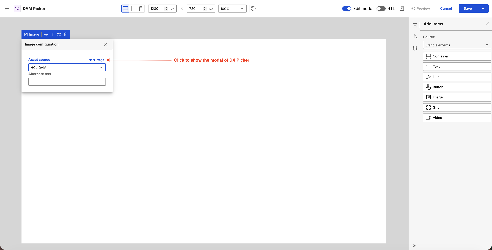

        2. Browse and select an asset inside the DAM Picker dialog.

            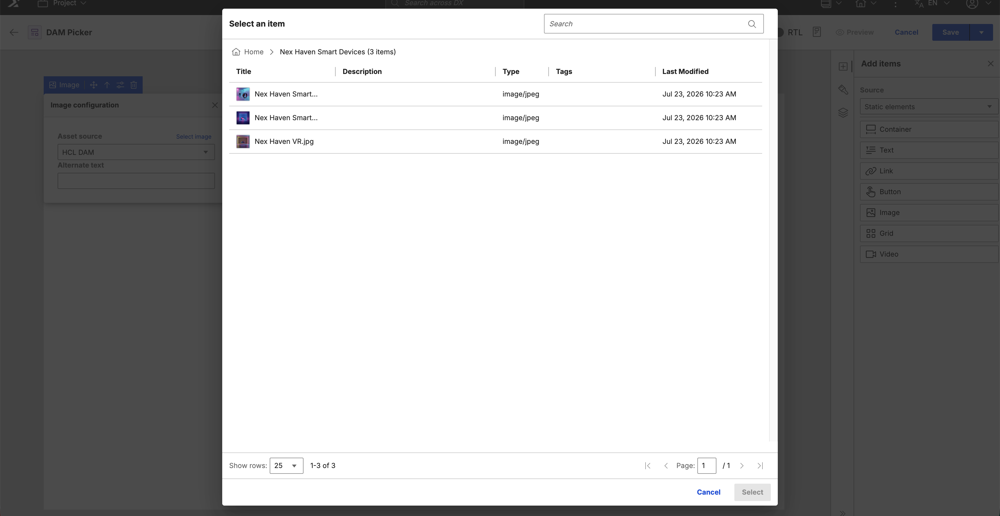

        3. Choose **Select** to apply the image to the canvas.

4. (Optional) Enter an alternate text for the image in the **Alternate text** field.

!!! note
    - The static image element displays a placeholder image icon when there is no image URL set. This placeholder is only a visual representation in Presentation Designer and no image source is saved.
    - Switching the asset source back to URL clears DAM-specific values to prevent stale data.
    - The selected image label displays only for DAM-compatible image URLs.
    - Custom styles can be applied to DAM images through the **Style items** panel after selection.

**Grid**

The **Grid** element (for example, ```<div class="grid">...</div>```) allows for a structured layout of multiple elements in rows and columns. This element is useful for organizing content in a visually appealing way, enabling practitioners to customize the grid structure to fit their content needs.

To manage responsive layouts, you can customize row and column counts for each device context, configure **Auto flow** settings to control how content wraps on smaller screens, and apply layout changes dynamically using device-specific stylesheet media blocks (`@media` rules).

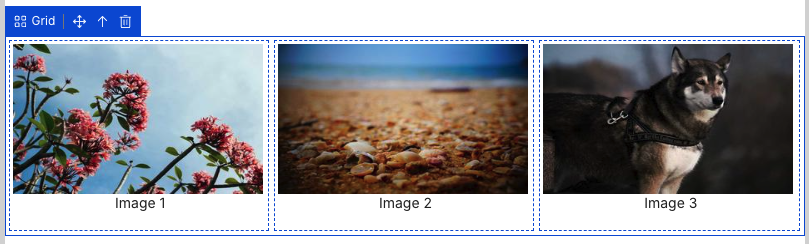{: style="display: block; margin: 0 auto;"}

!!! note
    The **Grid** element displays a 1 x 3 grid by default. You can adjust the number of rows and column in the **Style items** panel. Different styling options for the grid element are also available.

1. Drag a **Grid** element onto the canvas.
2. Enter the following values in the **Style items** panel:

    

    **Layout**

    - **Rows**: 3
    - **Columns**: 3

    **Dimensions**

    - **Height**: 500px

    **Spacing**

    - **Padding top**: 4px
    - **Padding right**: 4px
    - **Padding bottom**: 4px
    - **Padding left**: 4px

3. Add static text to each cell.

    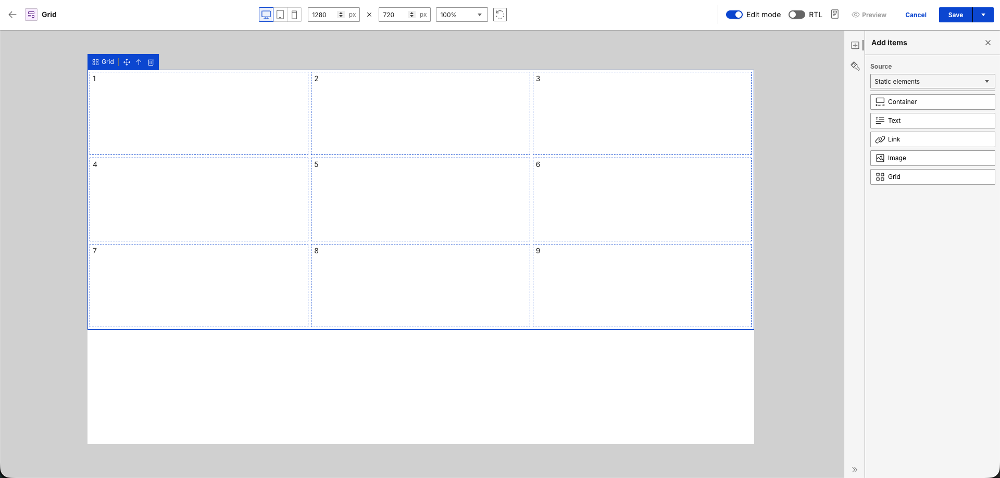

4. Configure the **Auto flow** and **Area layout** sections.

    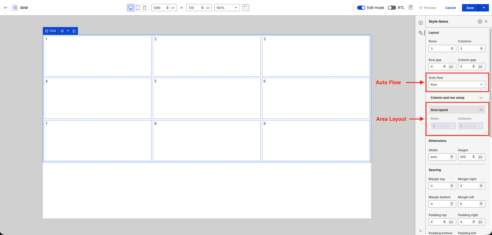

    - **Auto flow:** Controls how grid elements are distributed within the layout. Options include **Row**, **Column**, **Row dense**, and **Column dense**.
    - **Area Layout:** Provides a count-based layout override that automates responsiveness for **Tablet** and **Mobile**. It dynamically balances rows and columns based on the specified track count to keep cells uniform without manual calculations.

    **Device viewports**

    **Grid** properties adapt dynamically to the active device context. Use the viewport switcher at the top of the canvas to configure and preview how these settings behave across different screen sizes:

    **Desktop**

    This view serves as the baseline layout. It disables the **Area layout** option and uses your primary **Rows** and **Columns** settings. Changing the **Auto flow** direction alters the sequence flow. For example:

    **Row** sequences elements from left to right.

    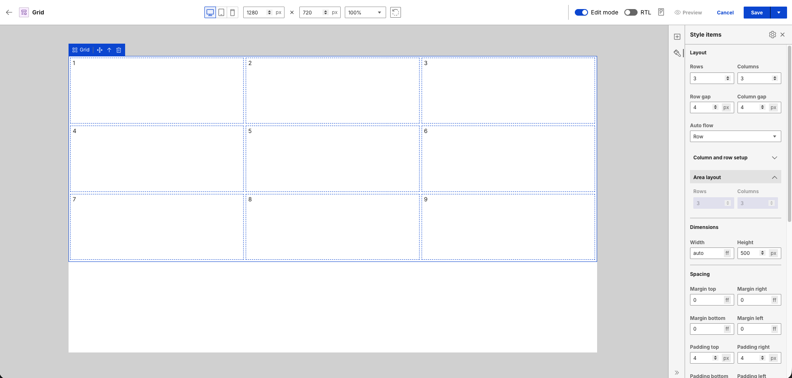

    **Column** sequences elements from top to bottom.

    

    **Tablet**

    Switching to **Tablet** view enables **Area layout**, which initially inherits your baseline settings.

    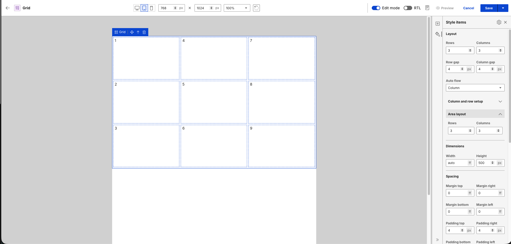

    Changing either the **Rows** or **Columns** count automatically recalculates the opposite value to maintain a uniform layout balance. For example, reducing **Rows** to `2` automatically scales **Columns** to `5` to balance the remaining cells uniformly.

    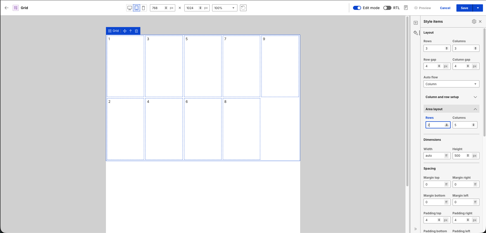

    **Mobile**

    Switching to **Mobile** view resets properties to the **Desktop** baseline. Adjustments made in **Tablet** view do not carry over.

    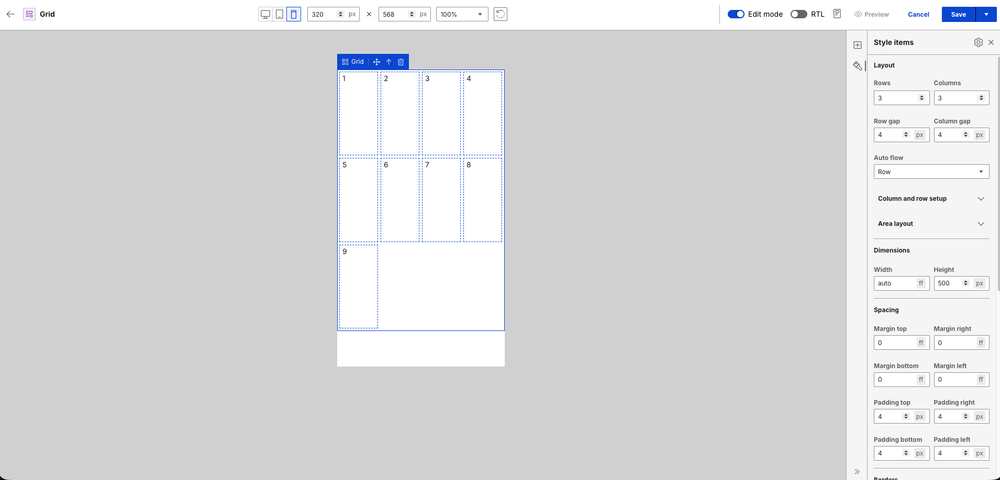

    Reducing the **Columns** count forces the grid tracks to recalculate and stack content vertically for smaller screens. For example, changing **Columns** to `1` automatically updates **Rows** to `9`.

    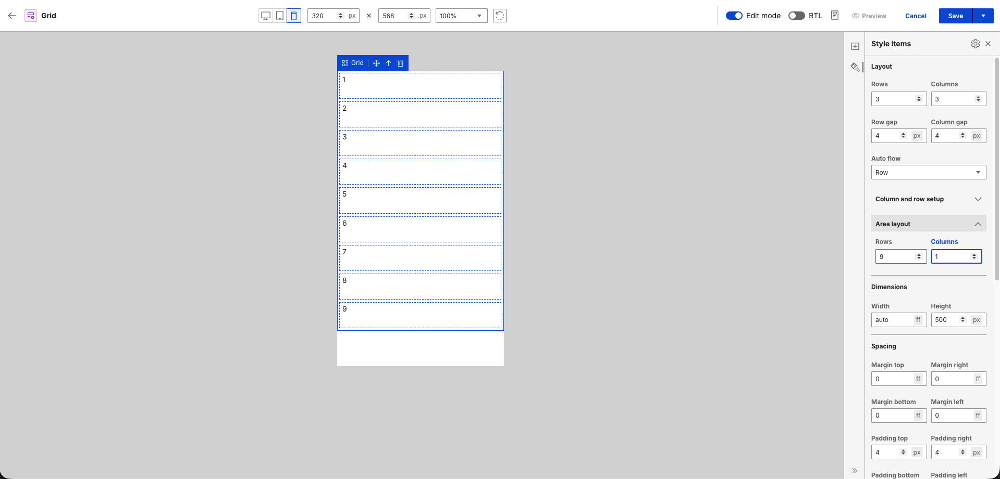

!!!note
    - **Area layout** values calculate automatically from device-specific row and column settings.
    - In **Tablet** and **Mobile** views, **Area layout** overrides rows and columns without modifying the baseline **Desktop** configuration.
    - Layout modifications saved within a specific device context persist independently without affecting other viewports.

**Button**

The Button element functions as a pre-styled link element designed to look like a button out-of-the-box. It is ideal for quickly deploying Call-To-Action (CTA) links without needing to manually build standard link elements from scratch.

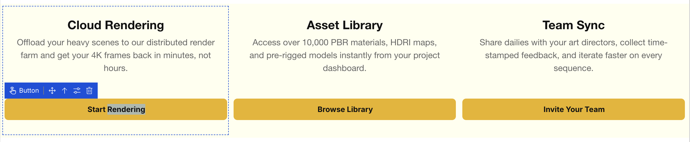

- By clicking the button directly on the canvas, you can enable inline editing of its text content.
- The destination URL or `href` is easily supplied via the button configuration menu.
- You can easily adjust button styles based on your preference using the available options in the style panel.
- The element generates clean, standardized markup (for example, `<a href="..." class="pd-button-defclass">`).

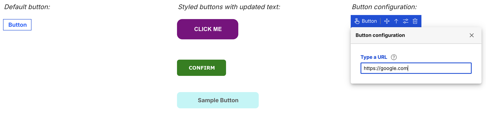

!!! note
    When you click the button element on the canvas, you will not be redirected to the configured URL. To test the provided URL, preview the presentation template.

**Video**

The Video element enables users to seamlessly add video elements to presentation templates without any manual HTML coding. You can quickly integrate product demos or tutorial videos by simply dragging, dropping, and supplying the URL via the Video configuration.

The element automatically generates clean HTML based on the source, outputting a standard `<video>` tag with `<source>` and fallback text, or an `<iframe>` for YouTube embeds. You can easily configure extensive customizations for the video, such as width, height, margins, paddings, and borders, via the style panel to fit any presentation layout.

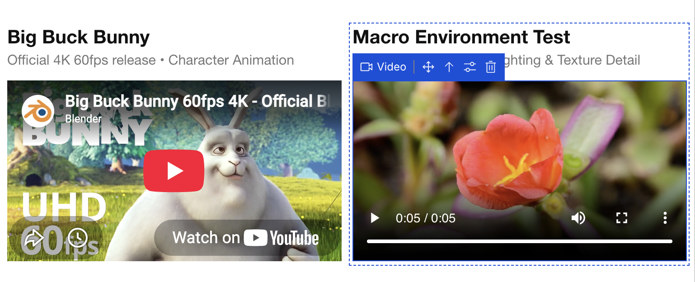

The Video element operates in three distinct render states on the canvas:

- **Initial Placeholder:** An initial placeholder appears upon drag-and-drop. It displays as a 300x200px grey box with a video icon when sources are empty or if the Broken Video flag is set, and it resets on new URL input.
- **Non-YouTube Native Video:** This state supports formats such as an MP4 supplied via an external URL or from HCL DAM video asset URL.
- **Auto-detected YouTube iframe embed:** This state supports YouTube embeds through auto-detection. Pattern matching supports `youtube.com/watch?v=`, `youtube.com/embed/`, and `youtu.be/` formats.

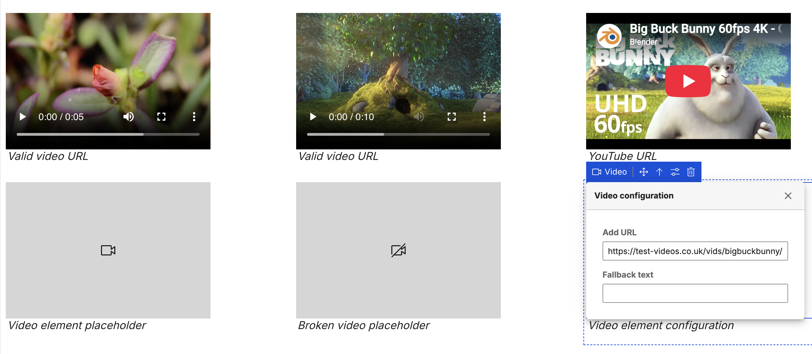

!!! note
    YouTube Shorts URLs (`youtube.com/shorts/`) are not supported. They are treated as unrecognized and rendered as the placeholder state.

### Content elements

Content elements (for example, ```[Element context="current" type="content" key="Element name"]```) are elements from a content template. You can search for a content template from which you want to pick elements from. Placeholders are rendered on the canvas in place of the elements.

After setting the element source to **Content elements**, no elements are initially loaded because no content template has been selected yet.

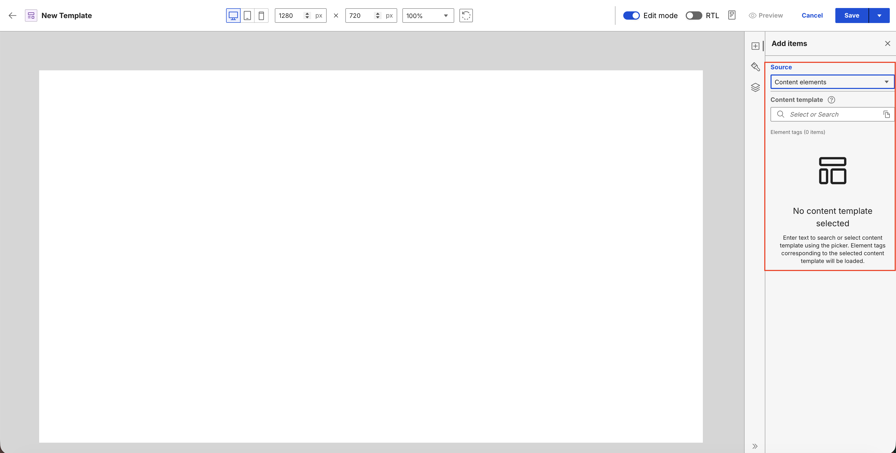

To load the elements, you can use the dual-mode selection available in the **Content template** field to find and select your desired template. You can search by typing for autocomplete, or click the DX Picker icon to the right of the "Select or Search" field to open a rich browser dialog for discovery and selection. The integrated DX Picker enables you to browse and select content templates without manual typing. It improves discoverability by allowing you to visually browse content templates in a dedicated picker UI instead of relying on autocomplete search alone.

!!! note
    If the DX picker is not configured or available in the environment, the picker icon appears disabled.


**Content templates loaded from search field:**

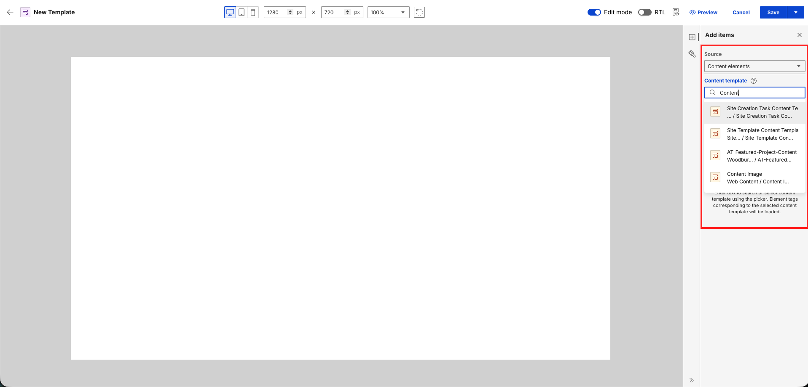

**Content templates loaded from DX Picker:**

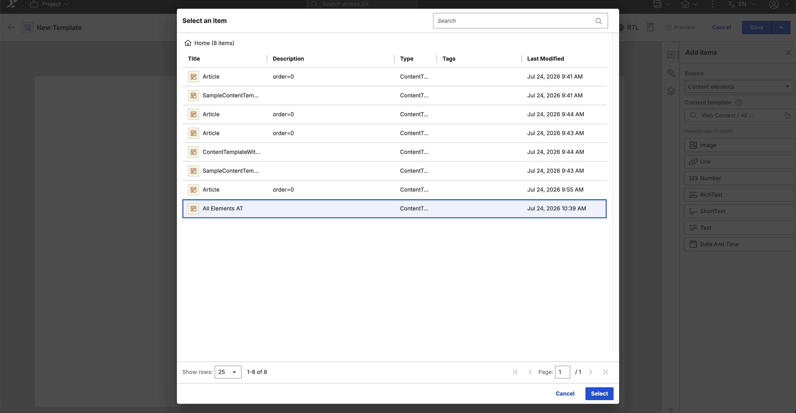

After selecting a content template, it automatically pulls the supported elements from the content template. Each element tag uses the element's display title that is set from the content template.

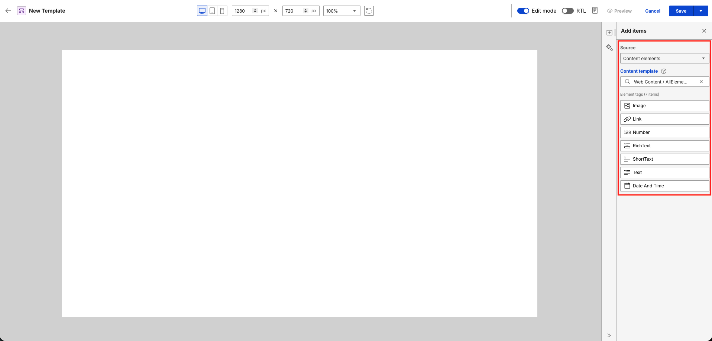

After you drag and drop an element on the canvas, a placeholder representing the element appears. You cannot edit placeholders in Presentation Designer as the actual display value comes from the content item.

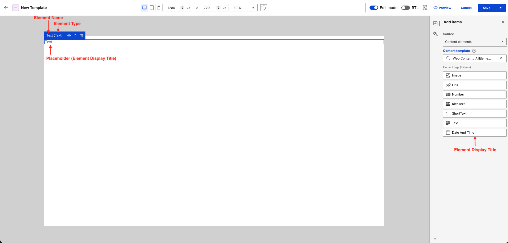

In Presentation Designer, the ```<p></p>``` tag wrapper for the element tag is added with the type attribute to determine the element type. Element tags (for example, ```[Element context="current" type="content" key="Element name"]```) use the element name as `key` and authors can set any element name in a content template. This could produce inconsistencies if Presentation Designer needs to rely on the element tag to determine the element type.

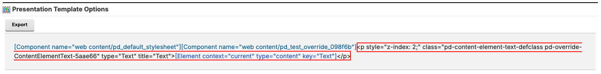

For more information on element tags in the Authoring portlet, refer to [Element tag](../../../../manage_content/wcm_authoring/authoring_portlet/content_management_artifacts/tags/creating_web_content_tags/wcm_dev_referencing_elements.md).

Presentation Designer supports the following content elements:

- **Text elements**

    Text elements (**Text, Rich Text, Short Text, Date and Time, Number**) represent text content and the value changes based on the content item. In Presentation Designer, the element’s display title from the content template is the placeholder text that appears on the canvas except for **Date and Time** and **Number** elements that have their own assigned placeholder value.

    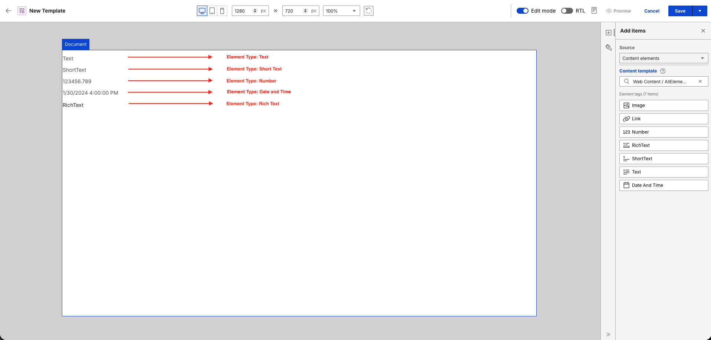

    You can apply different styling options to the placeholder of the text elements except for **Rich Text**. **Rich Text** elements are set with their own styling in the content item.

    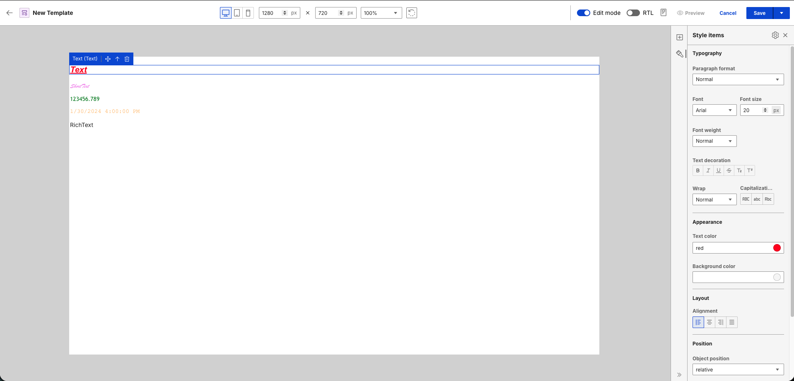

    These styles are stored in the ```<p></p>``` tag style attribute. See the styled placeholder **Short Text** element and the markup generated after saving in the following images:

    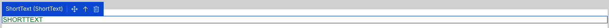
    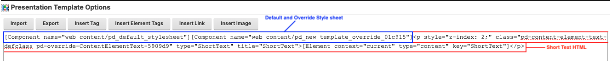

    Formatting options are also available for **Number** and **Date and Time elements**. The format is visually reflected on the placeholder value and is stored in the format parameter for the Element tag after saving.

    | Number Format   | Date and Time Format  |
    |-----------------|-----------------------|
    | 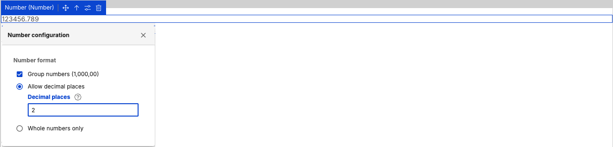 |  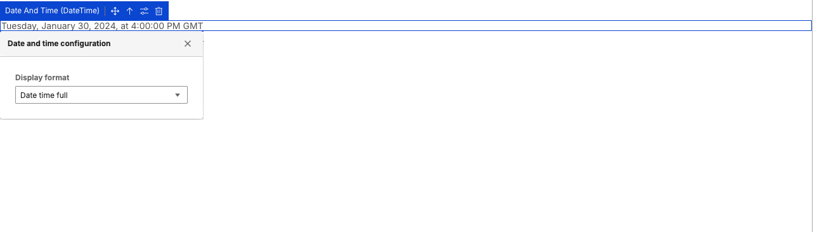 |

    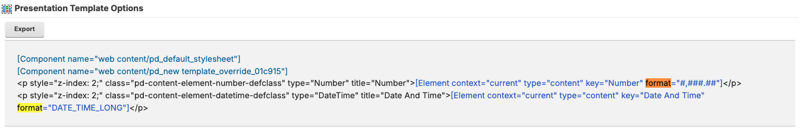

- **Image elements**

    An image content element represents an actual image. A placeholder image icon is displayed in Presentation Designer and the image source and image attributes (for example, width and height) set in the content item are followed in the preview.

    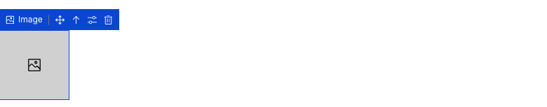

- **Link elements**

    A link content element represents a hyperlink, which is a connection or reference to another resource depending on what is set on the content item. In Presentation Designer, a placeholder text using the element's display title is shown. You can apply styling options to the placeholder text through the **Style items** panel, similar to text content elements.

    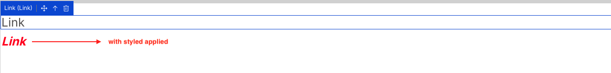

### Property tags

Property tags (for example, ```[Property context="current" type="content" field="title"]```) are used to display metadata from content items such as **Title**, **Name**, **Description**, and **Last modified date**. In Presentation Designer, placeholders are rendered on the canvas for property tags with different styling options available. The actual value changes depending on the content item.

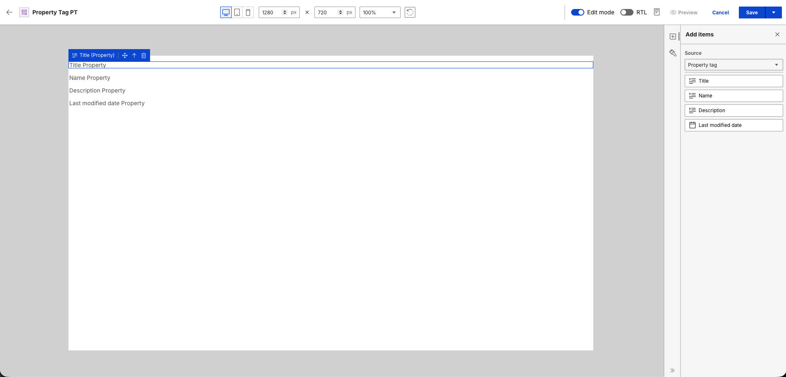

These styles are stored in the ```<p></p>``` tag style attribute. See the styled placeholder **Property tags**:

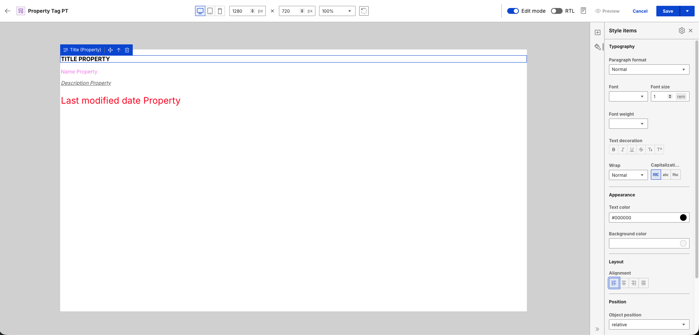

See the following sample markup generated after saving:

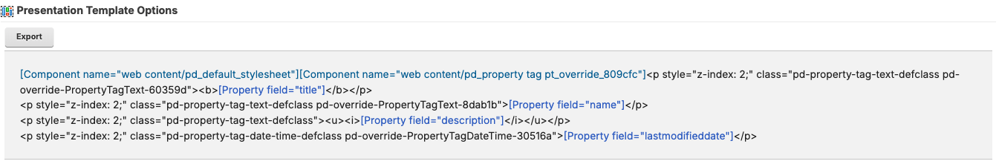

For more information on property tags in the Authoring portlet, refer to [Property tag](../../../../manage_content/wcm_authoring/authoring_portlet/content_management_artifacts/tags/creating_web_content_tags/wcm_dev_item-details_property.md).

### Generic element tags

Generic element tags are element tags added in a presentation template using the **Insert Element Tags** from the Authoring portlet. 


When editing a presentation template that has a generic element tag in Presentation Designer, a placeholder text of the element name is rendered on the canvas.


You can configure the element and assign an element type. Click the **Configure** button to see the dropdown selection for the element type:


In the following example, **Text** is selected as an element type, converting the generic element to a **Text Content Element**.


With the generic element converted into a **Text Content Element**, you can now apply styling options to the placeholder text from the **Style items** panel.


See the markup generated after saving:


For more information on element tags in the Authoring portlet, refer to [Element tag](../../../../manage_content/wcm_authoring/authoring_portlet/content_management_artifacts/tags/creating_web_content_tags/wcm_dev_referencing_elements.md).

### Generic tags

Generic tags are any other web content tags that are added in a presentation template using the **Insert Tag** from the Authoring portlet.

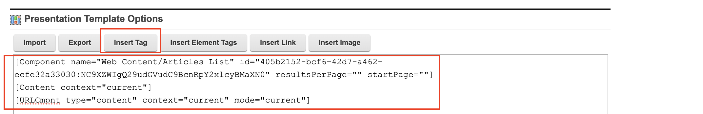

When editing a presentation template that has a generic tag in Presentation Designer, a placeholder is rendered on the canvas to represent each tag. This makes users aware that there are other tags present when editing the presentation template in Presentation Designer.

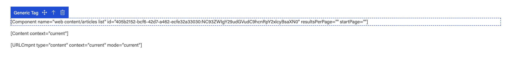

For more information on web content tags in the Authoring portlet, refer to [Creating web content tags](../../../../manage_content/wcm_authoring/authoring_portlet/content_management_artifacts/tags/creating_web_content_tags/index.md).