# User elements in Presentation Designer

User elements refer to any element that you can edit or drag and drop onto the canvas. This section provides information on the different element types and how to use them in Presentation Designer


To access Presentation Designer and understand its user interface, refer to the **[Access Presentation Designer](../access/index.md)** topic.

To know the different styling options available in Presentation Designer, refer to the **[Styling Options in Presentation Designer](../usage/styling_options.md)** topic.


## Element source

You can change the source of the user elements that you can select from the **Add Items** panel. To change the source, go to the **Add Items** panel and select your preferred source from the **Source** dropdown menu. Static elements are loaded by default. 


## Element actions

Hovering or selecting an element on the canvas displays the element name and the different action buttons available for the element. See the following actions you can do:


1. Click the **Move** icon to rearrange the elements on the canvas through drag-and-drop.
2. Click the **Arrow Up** icon to automatically select the parent of the current element. 
3. Click the **Configure** icon to display additional configuration options for the element. 
4. Click the **Trash** icon to delete the element from the canvas.


## Element types

In Presentation Designer, user elements are divided into five types: 

- [Static elements](#static-elements)
- [Content elements](#content-elements)
- [Property tags](#property-tags)
- [Generic element tags](#generic-element-tags)
- [Generic tags](#generic-tags)

Each type serves a different purpose and each user element comes with its own set of styling and configuration options.

### Static elements

Static elements are predefined elements that display content exactly as it looks, ensuring a What You See Is What You Get (WYSIWYG) experience. After you add these elements in your presentation template, they will not change, even if you apply them to different content items. This consistency helps users create organized layouts with confidence, knowing that the design remains the same regardless of the content.

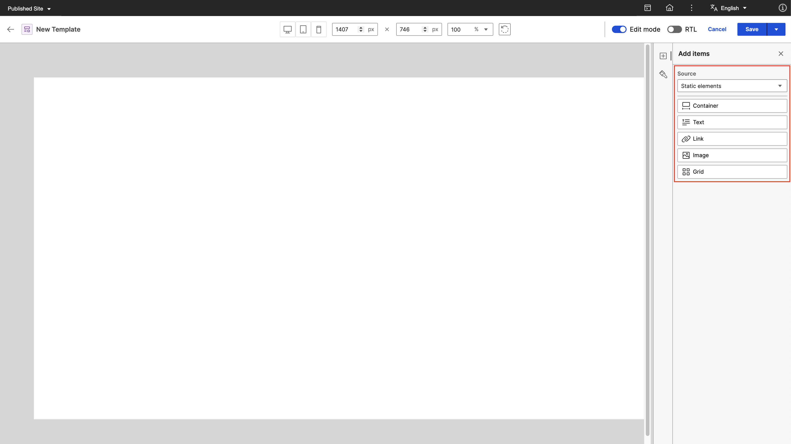

- **Container**

    The container element (```<div>...</div>```) serves as a foundational block for organizing and structuring content. This element allows users to group elements together. You can resize the container through the **Style** panel by setting its width and height to fit different design needs. You can also apply other styling options to a container and add other user elements inside it.

    
    


- **Text**

    Static text elements (for example, ```<p>Content goes here</p>```) are used to display text content which you can also edit on the canvas itself. These elements can include headers, paragraphs, and any other textual information. You can apply formatting and styling from the **Style** panel to enhance readability and visual appeal. To edit the text content, click the text element and enter your desired text.

    See the following sample static text elements:

    

    - The first line of text shows the placeholder text that appears when you drag and drop a static text element on the canvas. 
    - The second line of text is a static text element with actual text content after user input. 
    - The third line of text is a static text element with actual text content and applied styles.

    !!! note
        Placeholder text for the static text element is only a visual representation in Presentation Designer. It represents an empty value for the text content. The words *Static text element* is not saved in the actual markup.


- **Link**

    Static links (for example, ```<a href="https://example.com">Click Here</a>```) enable users to create clickable hyperlinks to other websites or resources. You can edit the display text for the link element the same way as editing a text element. Different styling options are also available.

    See the following sample static text elements:

    

    - The first line of text shows the default display text that appears when you drag and drop a static link element on the canvas.
    - The second line of text shows the placeholder text that appears when you remove the default display text of the link element.
    - The third line of text is a static link element with modified display text content after user input. 
    - The fourth line of text is a static link element with modified display text content and applied styles.

    To set the `href` attribute, click the **Configure** button and enter the URL.

    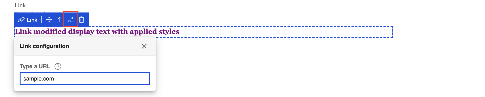

    !!! note
        When you click a static link element on the canvas, you will not be redirected to the configured URL. To test the link, preview the presentation template in the Authoring portlet.


- **Image**

    Static images (for example, ``````) are used to render visuals from various sources. You can manually set the `src` attribute by clicking the **Configure** button. In the **Add URL** field, enter an image URL or copy and paste the URL of image assets from Digital Asset Management (DAM). (Optional) Enter an alternate text for the image in the **Alternate text** field. 
    
    Styling options for this element are also available in the **Style** panel.

    

    !!! note
        The static image element displays a placeholder image icon when there is no image URL set. This placeholder is only a visual representation in Presentation Designer and no image source is saved.

        


- **Grid**

    The grid element (for example, ```<div class="grid">...</div>```) allows for a structured layout of multiple elements in rows and columns. This element is useful for organizing content in a visually appealing way, enabling practitioners to customize the grid structure to fit their content needs.

    

    !!! note
        The grid element displays a 1 x 3 grid by default. You can adjust the number of rows and column in the **Style** panel. Different styling options for the grid element are also available.

        


### Content elements

Content elements (for example, ```[Element context="current" type="content" key="Element name"]```) are elements from a content template. You can search for a content template from which you want to pick elements from. Placeholders are rendered on the canvas in place of the elements.

After setting the element source to **Content elements**, no elements are initially loaded because no content template has been selected yet.


To load the elements, search for a content template in the **Content template** field and select your desired template.


After selecting a content template, it automatically pulls the supported elements from the content template. Each element tag uses the element's display title that is set from the content template.

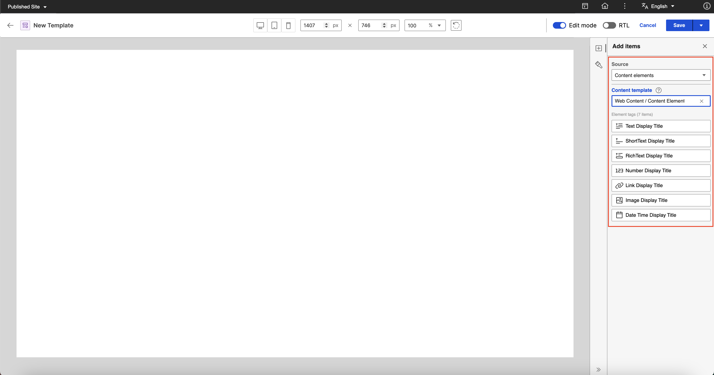

After you drag and drop an element on the canvas, a placeholder representing the element appears. You cannot edit placeholders in Presentation Designer as the actual display value comes from the content item. See the following content element structure:

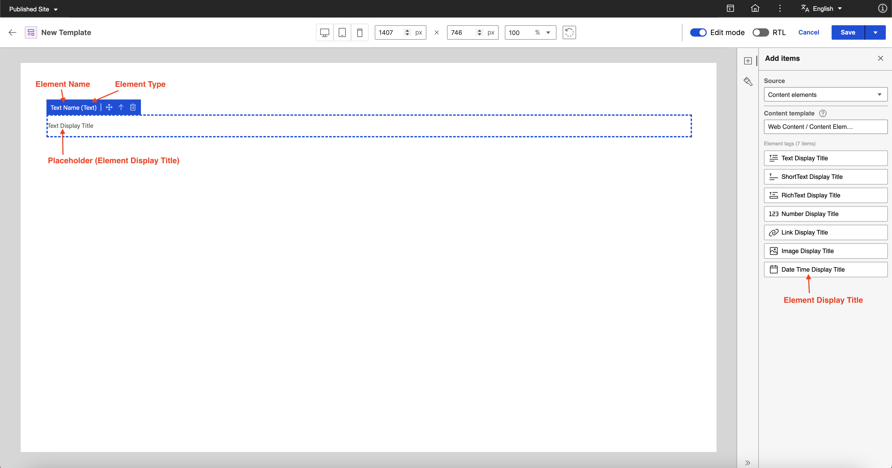

In Presentation Designer, the ```<p></p>``` tag wrapper for the element tag is added with the type attribute to determine the element type. Element tags (for example, ```[Element context="current" type="content" key="Element name"]```) use the element name as `key` and authors can set any element name in a content template. This could produce inconsistencies if Presentation Designer needs to rely on the element tag to determine the element type. See the following sample after saving a presentation template in Presentation Designer with a text content element:

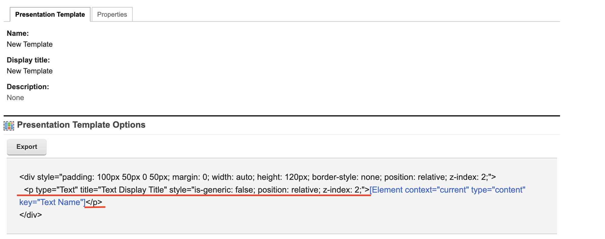


For more information on element tags in the Authoring portlet, refer to [Element tag](../../../../manage_content/wcm_authoring/authoring_portlet/content_management_artifacts/tags/creating_web_content_tags/wcm_dev_referencing_elements.md).


**Presentation Designer supports the following content elements:**

- **Text Elements**

    Text elements (**Text, Rich Text, Short Text, Date and Time, Number**) represent text content and the value changes based on the content item. In Presentation Designer, the element’s display title from the content template is the placeholder text that appears on the canvas except for **Date and Time** and **Number** elements that have their own assigned placeholder value.

    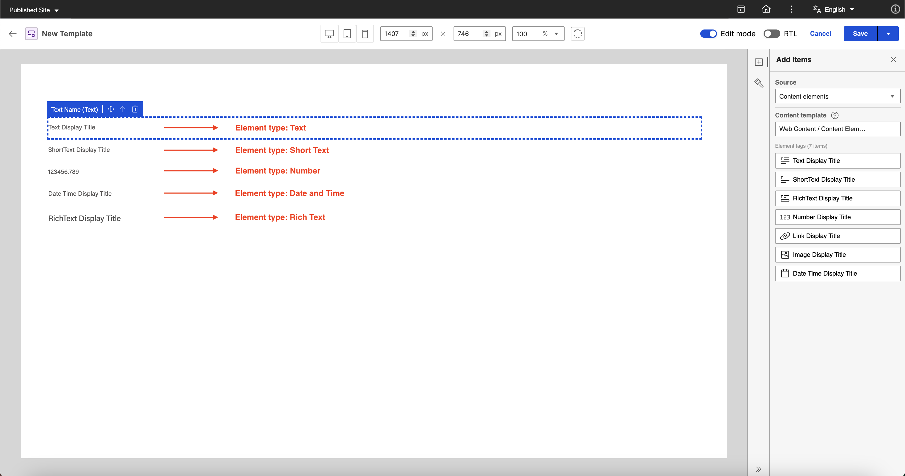

    You can apply different styling options to the placeholder of the text elements except for **Rich Text**. **Rich Text** elements are set with their own styling in the content item. See the following sample style options for placeholders of text elements:

    
    

    These styles are stored in the ```<p></p>``` tag style attribute. See the styled placeholder **Short Text** element and the markup generated after saving in the following images:

    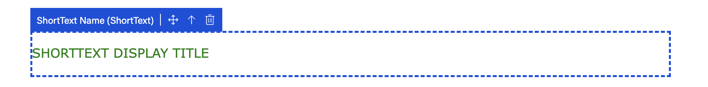
    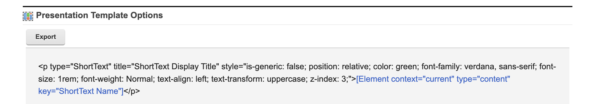
    

    Formatting options are also available for **Number** and **Date and Time elements**. The format is visually reflected on the placeholder value and is stored in the format parameter for the Element tag after saving. See the following samples:

    | Number Format   | Date and Time Format  |
    |-----------------|-----------------------|
    | 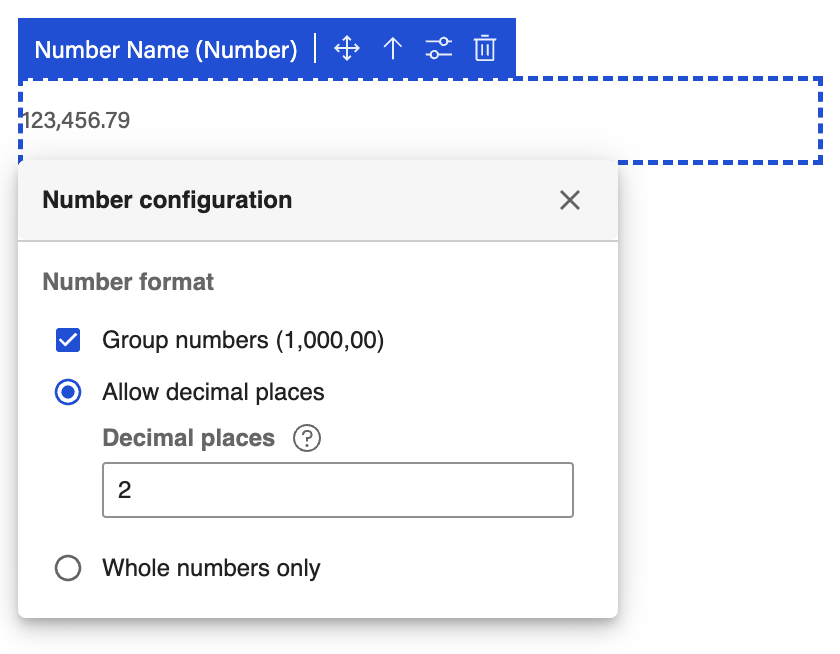 |   |

    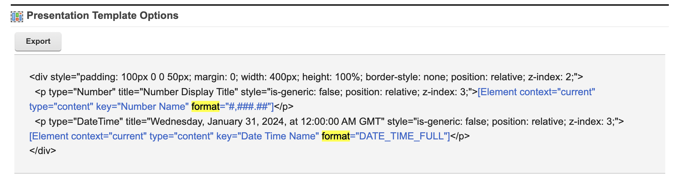


- **Image Element**

    An image content element represents an actual image. A placeholder image icon is displayed in Presentation Designer and the image source and image attributes (for example, width and height) set in the content item are followed in the preview.

    

- **Link Element**
    
    A link content element represents a hyperlink, which is a connection or reference to another resource depending on what is set on the content item. In Presentation Designer, a placeholder text using the element's display title is shown. You can apply styling options to the placeholder text through the **Style** panel, similar to text content elements.

    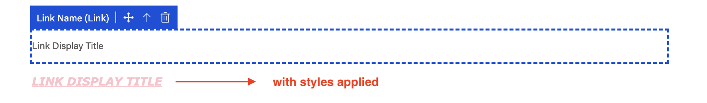


### Property tags

Property tags (for example, ```[Property context="current" type="content" field="title"]```) are used to display metadata from content items such as **Title**, **Name**, **Description**, and **Last modified date**. In Presentation Designer, placeholders are rendered on the canvas for property tags with different styling options available. The actual value changes depending on the content item.

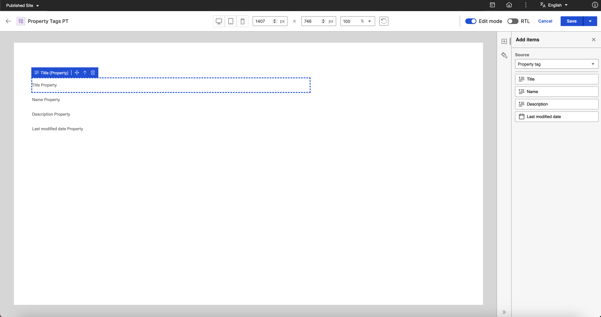

These styles are stored in the ```<p></p>``` tag style attribute. See the styled placeholder **Property tags**:

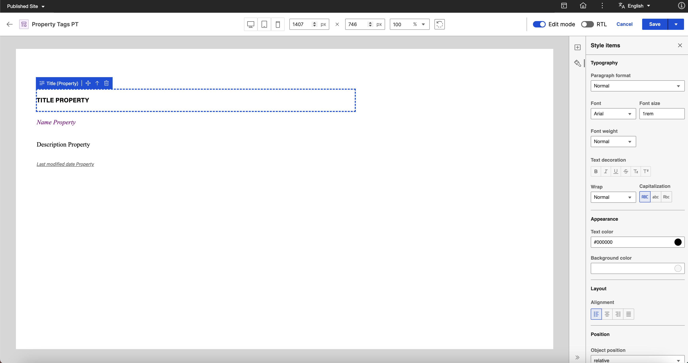

See the following sample markup generated after saving:

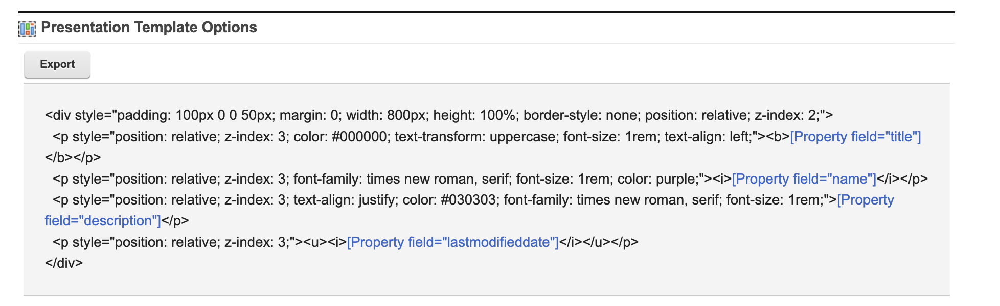

For more information on property tags in the Authoring portlet, refer to [Property tag](../../../../manage_content/wcm_authoring/authoring_portlet/content_management_artifacts/tags/creating_web_content_tags/wcm_dev_item-details_property.md).


### Generic element tags

Generic element tags are element tags added in a presentation template using the **Insert Element Tags** from the Authoring portlet. 

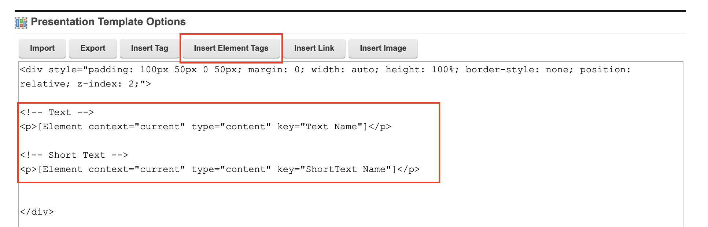

When editing a presentation template that has a generic element tag in Presentation Designer, a placeholder text of the element name is rendered on the canvas.


You can configure the element and assign an element type. Click the **Configure** button to see the dropdown selection for the element type:


In the following example, **Text** is selected as an element type, converting the generic element to a **Text Content Element**.


With the generic element converted into a **Text Content Element**, you can now apply styling options to the placeholder text from the **Style** panel.

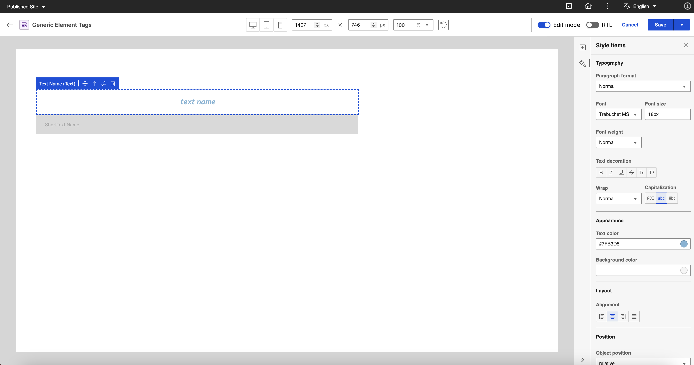

See the markup generated after saving:


For more information on element tags in the Authoring portlet, refer to [Element tag](../../../../manage_content/wcm_authoring/authoring_portlet/content_management_artifacts/tags/creating_web_content_tags/wcm_dev_referencing_elements.md).


### Generic tags
   
Generic tags are any other web content tags that are added in a presentation template using the **Insert Tag** from the Authoring portlet.

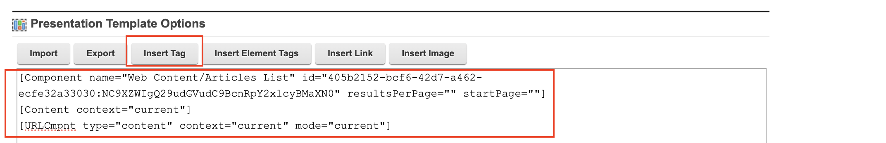

When editing a presentation template that has a generic tag in Presentation Designer, a placeholder is rendered on the canvas to represent each tag. This makes users aware that there are other tags present when editing the presentation template in Presentation Designer.

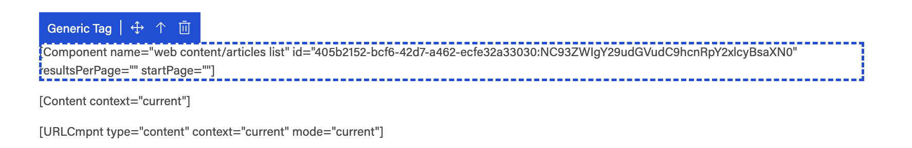
 
For more information on web content tags in the Authoring portlet, refer to [Creating web content tags](../../../../manage_content/wcm_authoring/authoring_portlet/content_management_artifacts/tags/creating_web_content_tags/index.md).