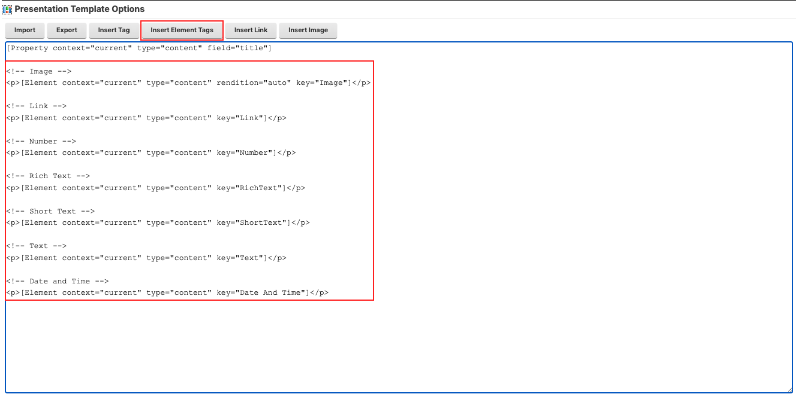
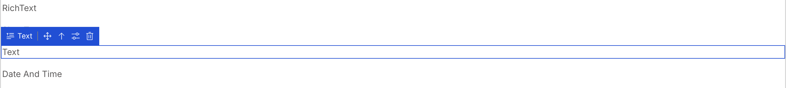
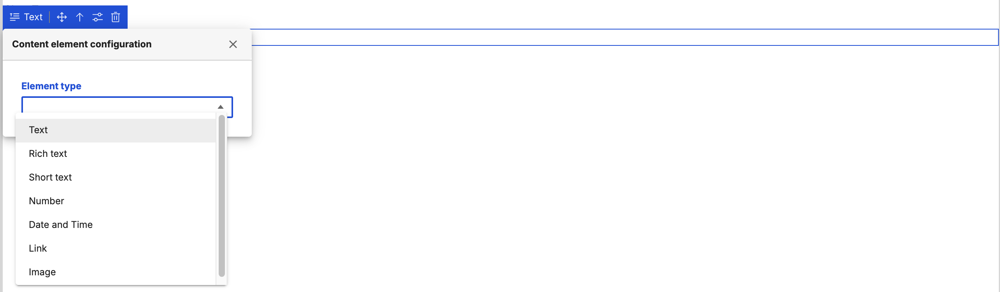
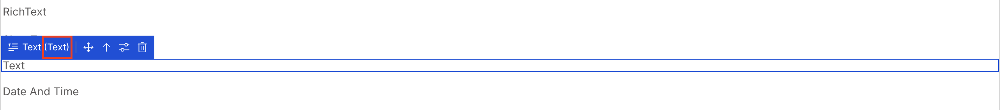
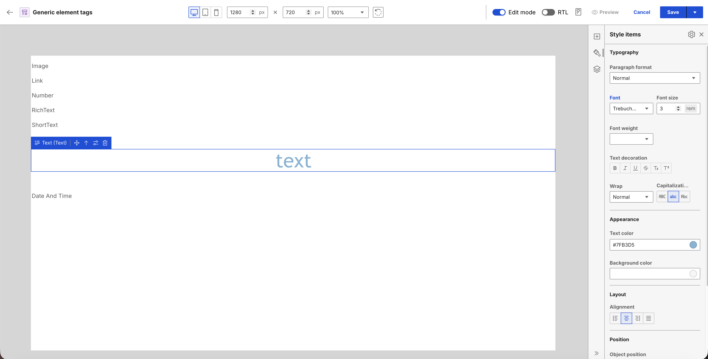
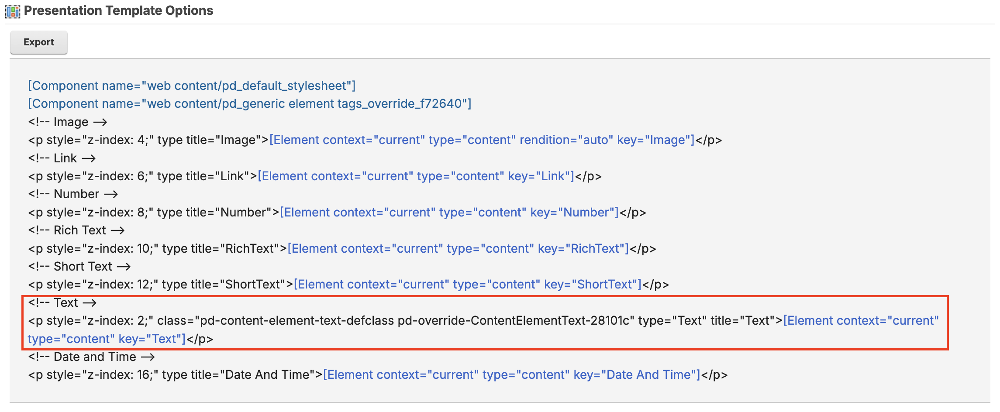

# Generic element tags

Generic element tags are element tags added in a presentation template using the **Insert Element Tags** from the Authoring portlet. 

When editing a presentation template that has a generic element tag in Presentation Designer, a placeholder text of the element name is rendered on the canvas.

You can configure the element and assign an element type. Click the **Configure** button to see the dropdown selection for the element type:

In the following example, **Text** is selected as an element type, converting the generic element to a **Text Content Element**.

With the generic element converted into a **Text Content Element**, you can now apply styling options to the placeholder text from the **Style items** panel.

See the markup generated after saving:

For more information on element tags in the Authoring portlet, refer to [Element tag](../../../../../manage_content/wcm_authoring/authoring_portlet/content_management_artifacts/tags/creating_web_content_tags/wcm_dev_referencing_elements.md).
