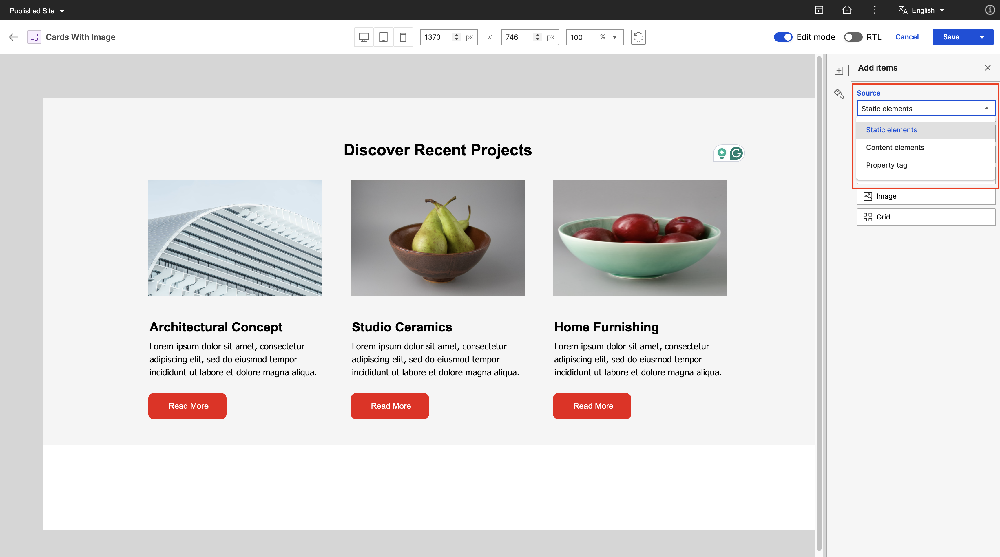
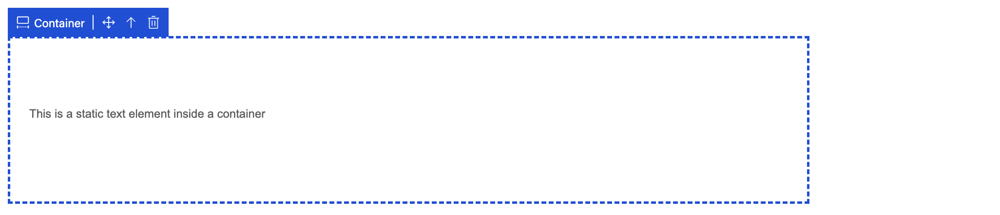
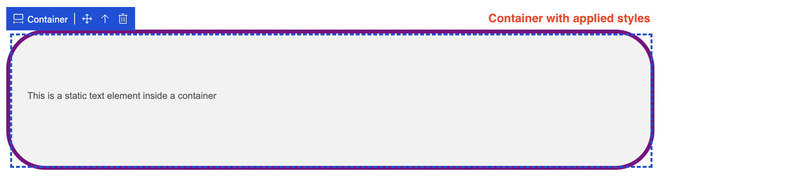
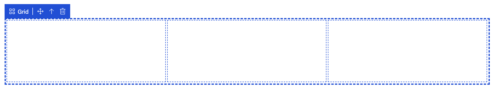
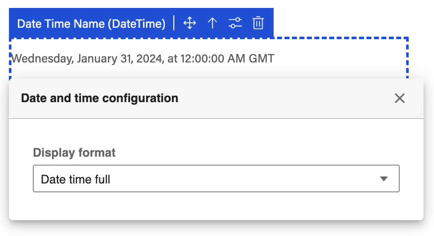
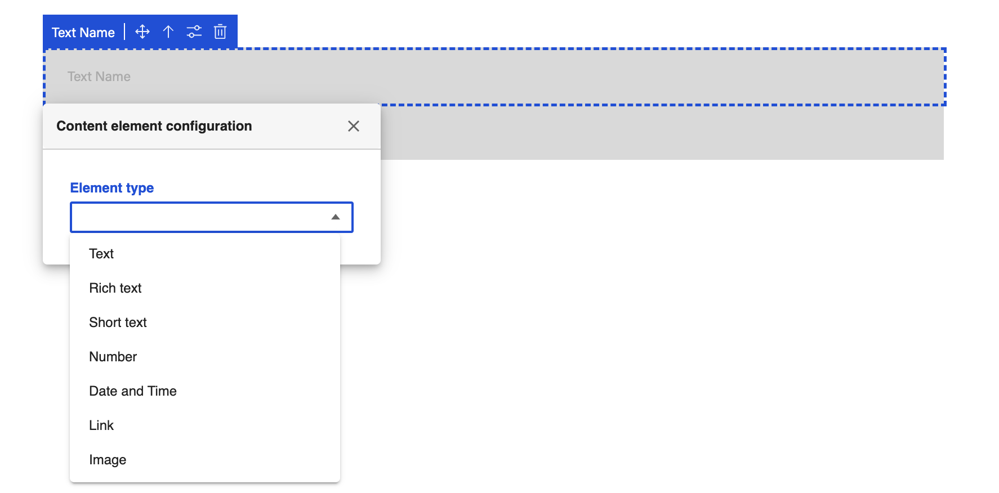
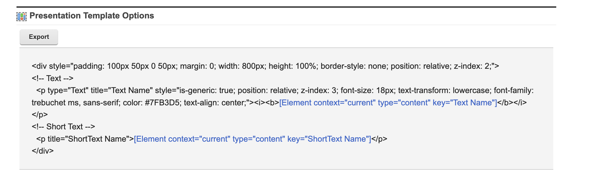

# User items / elements in Presentation Designer

User items / elements refers to any element that users can edit or drag and drop onto the canvas. This section provides information on the different item types and how to use them in Presentation Designer.

!!! note
    To access Presentation Designer and gain an understanding of its user interface, see the **[Access Presentation Designer](../access/index.md)** topic.

    To familiarize with the different styling options available in Presentation Designer, see the **[Styling Options in Presentation Designer](../usage/styling_options.md)** topic.

---

## Item Source

To change the **source** of the user items / elements, click on the dropdown selection on the **Add Items panel** and select your prefered source. Static elements are loaded by default. 



---

## Item Actions

Hovering or selecting an item on the canvas will display the **name of the item** and different action buttons available for it. In this example, the **Move** icon button can be used to rearrange the items on the canvas via drag and drop. The next icon button is the **Arrow Up**, which, when clicked, automatically selects the parent of the current item. There is also a **Configure** icon button which displays additional configuration options for the item. Lastly, the **Trash** icon button is used to delete the item on the canvas.


---

## Item Types

In Presentation Designer, user items/elements are divided into **five types**: static elements, content elements, property tags, generic element tags, and generic tags. Each type serves a different purpose and each user item/element comes with its own set of styling and configuration options.

### Static Elements

Static elements are predefined elements that display content exactly as it looks, ensuring a "what you see is what you get" experience. Once you have these elements in your presentation template, they won’t change, even if you apply them to different content items. This consistency helps users create organized layouts with confidence, knowing that the design will remain the same regardless of the content.


- **Container**

    The container element (e.g. ```<div>...</div>```) serves as a foundational block for organizing and structuring content. It allows users to **group elements together** and can be resized to fit different design needs. Any other user item/element can be added inside a container. To resize, click on the container element on the canvas. The selected container will be highlighted and circular resize handles will appear on the borders of the container, indicating that it is ready for editing. Click and hold the mouse button on the desired resizing handle and drag the handle in the direction you want to resize the container. Another option to resize a container is from the style panel by setting its width and height. Other styling options can be applied on the container as well.

    
    

---

- **Text**

    Static text elements (e.g. ```<p>Content goes here</p>```) are used to **display text content** which can also be edited on the canvas itself. These elements can include headers, paragraphs, and any other textual information. Formatting/styling options can be applied from the Style panel to enhance readability and visual appeal. To edit the text content, click on the text element for the cursor to appear and prcoeed with entering your desired text.

    When you drag and drop a static text element on the canvas, it will display a **placeholder text** as seen on the first line of text on the sample below. The second line of text below is a static text element with actual text content after user input. The third line of text below is a static text element with actual text content and applied stylings.
    

    !!! note
        Placeholder text for the static text element is only a visual representation in Presentation Designer. It represents an empty value for the text content. The words *Static text element* you see will not be saved in the actual markup.

---

- **Link**

    Static links (e.g. ```<a href="https://example.com">Click Here</a>```) enable users to create clickable **hyperlinks** to other websites or resources. The display text for the link element can also be edited the same way as text element and different styling options are also available.

    

    To set the href attribute, click the Configure icon button and input the URL.
    

    !!! note
        Clicking on a static link element on the canvas will not redirect to the URL configured to it. To test the redirect, you may do so in the Preview feature of presentation templates in the Authoring portlet.

---

- **Image**

    Static images (e.g. ```) are **used to render visuals** from various sources. Users can manually set the src attribute by clicking the Configure icon button then input an image URL or copy and paste the URL of image assets from HCL DAM, enriching the visual aspect of the presentation template. Styling options for this element are also available in the Style panel.

    

    !!! note
        The static image element also displays a placeholder image icon when there is no image URL set. This placeholder is only a visual representation in Presentation Designer and no image source will be saved.

        

---

- **Grid**

    The grid element (e.g. ```<div class="grid">...</div>```) allows for a **structured layout of multiple elements** in **rows and columns**. This element is essential for organizing content in a visually appealing way, enabling practitioners to customize the grid structure to fit their content needs.

    

    !!! note
        The grid element displays a 1x3 grid by default. To adjust the number of rows and column, this can be done on the style panel. Different styling options for the Grid are also available.

        

---

### Content Elements

Content elements (e.g. ```[Element context="current" type="content" key="Element name"]```) are **elements from a content template**. Practitioners can search a content template from which they want to pick elements from. Placeholders will be rendered on the canvas in place of the elements.

After setting the item source to **Content elements**, no elements are initially loaded since there is no selected content template yet.


To load the elements, **enter text to search** for a content template and **select the content template** from the results.


Once a content template is selected, it will automatically pull the **supported elements** from the content template. Each element tag uses the element's **display title** that is set from the content template.


Once you drag and drop an element on the canvas, you will see a **placeholder** representing the element. The placeholders are **non-editable** in Presentation Designer as the actual display value will be coming from a content item. See the content element structure below:


In Presentation Designer, the ```<p></p>``` tag wrapper for the **element tag** is added with the **type** attribute to determine the **element type**. Element tags (e.g. ```[Element context="current" type="content" key="Element name"]```) use the **element name** as **key** and authors have the freedom to set any element name in a content template which could produce inconsistencies if Presentation Designer would rely on it to determine the element type. See sample below after saving a presentation template in Presentation Designer with a text content element:


!!! note
    For more information on element tags in the Authoring portlet, refer to [Element tag](../../../../manage_content/wcm_authoring/authoring_portlet/content_management_artifacts/tags/creating_web_content_tags/wcm_dev_referencing_elements.md).

---

**Presentation Designer supports the following content elements:**

- **Text Elements**

    Text elements (**Text, Rich Text, Short Text, Date and Time, Number**) represents **textual content** and the value will change based on the content item. In Presentation Designer, the **element’s display title** from the content template will be the **placeholder text** that will appear on the canvas except for **Date and Time and Number** elements that have their own **assigned placeholder value**.

    

    Different **styling options** can also be applied to the placeholder of the textual content elements except Rich Text as it is set with its own styling in the content item.

    
    
    !!! note
        These styles are stored in the ```<p></p>``` tag **style** attribute. See sample styled placeholder short text element below and the markup generated once saved:

        
        
    

    **Formatting options** are also available for **Number and Date and Time elements**. The format will visually reflect on the placeholder value and will be stored in the format parameter for the Element tag once saved. See sample below:

    | Number Format   | Date and Time Format  |
    |-----------------|-----------------------|
    |  |   |

    

---

- **Image Element**

    An image content element represents an actual image. A **placeholder image icon** is displayed in Presentation Designer and the image source and image attributes (e.g. width and height) set in the content item will be followed in the actual preview.

    

- **Link Element**
    
    A link content element represents a **hyperlink**, which is a connection or reference to another resource depending on what is set on the content item. In Presentation Designer, a **placeholder text** is displayed which is the **element’s display title**. Styling options can also be applied to the placeholder text same as the textual content elements.

    

---

### Property Tags

Property tags (e.g. ```[Property context="current" type="content" field="title"]```) are used to display **metadata** from content items like Title, Name, Description, and Last modified date. In Presentation Designer, **placeholders** are also rendered in the canvas for property tags and no styling or formatting options are currently available. The actual value will change depending on the content item.


Sample markup generated after saving:


!!! note 
    For more information on property tags in the Authoring portlet, refer to [Property tag](../../../../manage_content/wcm_authoring/authoring_portlet/content_management_artifacts/tags/creating_web_content_tags/wcm_dev_item-details_property.md).

---

### Generic Element Tags

Generic element tags are element tags that are added in a presentation template using the **Insert Element Tags** from the Authoring portlet. 


When editing a presentation template that has generic element tag in Presentation Designer, a **placeholder** text of element name will be rendered on the canvas and there is an option to **configure** this element and **assign an element type**. See sample below:

Click the **Configure** icon button to see the dropdown selection for the element type:



Assign **Text** as element type:


After saving the presentation template, the generic element is now **converted** to a **Text Content Element**.




!!! note
    For more information on element tags in the Authoring portlet, refer to [Element tag](../../../../manage_content/wcm_authoring/authoring_portlet/content_management_artifacts/tags/creating_web_content_tags/wcm_dev_referencing_elements.md).

---

### Generic Tags
   
Generic tags are any other **web content tags** that are added in a presentation template using the **Insert Tag** from the Authoring portlet. 


When editing a presentation template that has generic tag in Presentation Designer, a **placeholder** will be rendered on the canvas to **represent each tag**. This makes the user aware that there are other tags present when editing the presentation template in Presentation Designer.


!!! note 
    For more information on web content tags in the Authoring portlet, refer to [Creating web content tags](../../../../manage_content/wcm_authoring/authoring_portlet/content_management_artifacts/tags/creating_web_content_tags/index.md).