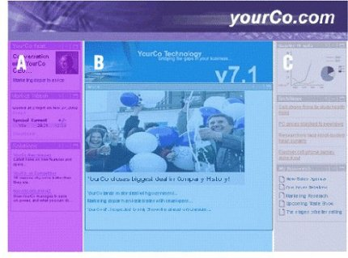

# User experience

Customizing the user's experience is one of the main goals of HCL Digital Experience. User and administrative portlets are provided for customizing content and the look and layout of pages. In addition, tools are provided that allow subject matter experts to personalize content to the needs and interests of each site visitor.

## Customizing pages

Users can have one or more custom pages and access each one through a different page. A page can contain a group of pages that is organized for a specific purpose. Each page can have a different set of portlets. Depending on authorizations, users can change the look and feel of their pages by using skins and page layouts. Also, page navigation hierarchy is tree-based, allowing any depth of nested pages.

The user or an administrator can set up the contents of each page. Administrators can specify that certain portlets be required, so that users are unable to move them or to remove them from the pages. Each page can have its own color scheme and column layout.

## Cascading authorization

An administrator can grant or revoke access to customize a page or portion of a page to other administrators or users. The administrator can determine user's rights to modify a page. Administrators can control the edit authority that other administrators have on a page and its contents. This is designed to help organizations enforce policies and consistency, and create region-specific portals with some centrally managed content. This control is best explained through an example.

The first administrator can determine that a page will have three columns and not allow the column layout to be modified by any other administrators. A second administrator with lesser access cannot modify the column layout but can add portlets to these columns. The following figure shows a page split into three columns. Administrators can add portlets to these columns.

The second administrator adds a stock portlet to column one and a company news portlet to column two. This administrator wants these portlets to be available to everyone and does not want them to be removed. However, the administrator can add portlets to the columns. Therefore, the portlets are locked and cannot be removed by other administrators with lesser access. The following figure shows an example of how cascading authorization from one administrator to another would look.

## Skins and themes

The product uses Java Server Page \(JSP\) templates, cascading style sheets, and images to define the look of pages. You can modify these templates to control visual aspects, perhaps to add company-specific brand elements or to achieve a different color scheme and visual style. The system for defining color themes and skins supports multiple skins per theme, additional branding elements, navigation styles, and dynamic, browser-independent cascading style sheets.

The product uses html, cascading style sheets, images, and other standard web design artifacts to define the look of pages. Java Server Pages \(JSP\) and other server-side dynamic techniques can also be used to help define the look of a site. You can add or modify elements to control visual aspects, perhaps to add company-specific brand elements or to achieve a different color scheme and visual style. The system for defining color themes and skins supports multiple skins per theme, additional branding elements, navigation styles, and dynamic, browser-independent cascading style sheets.

You can apply skins and themes to a page, not only to the overall product. You can apply different skins individually to portlets as well, so that the appearance of a portal can be fine-tuned to meet any user need. By using a different theme for each page, a single installation can give the appearance of supporting many virtual portals.

## Branding elements

You can change all visual elements, including the masthead, the navigation areas, graphics, portlet title areas, and style sheets, to give a custom look. You can use standard file formats, such as JPEG, GIF, CSS, and JSP files, to define the look and layout.

The structure of the component installation folder contains folders named "skin" and "theme," with folders "html," "wml," and "chtml." These folders contain most of the files that are used for defining the basic structure of the home page, its color schemes, and portlet decorations. Portal designers can copy these folders and modify their contents to create a custom look and feel. The theme administration portlet registers the new files.

## Changing portlet layout

You can change the placement of individual portlets on a page by using the drag-and-drop feature. To rearrange a portlet on a page, click the title bar of the portlet and then drag the portlet to a new location on the page. You can also add portlets to the page for quick and easy page customization by dragging portlets from the Portlet Palette to the page.

## Personalization

The Personalization component selects content for users, based on information in their profiles and on business logic. With Personalization facilities, subject matter experts can select content that is suited to the needs and interests of each site visitor. These web-based tools help companies quickly and easily use content that is created by business and subject matter experts. Personalization involves three basic personalization components:

-   User Profile: information about users of the site, including user attributes

-   Content Model: defines attributes about content, such as product descriptions, articles, and other information

-   Matching Technology: engines that match users to the correct content; includes filtering, rules, recommendation engines, or combinations of all three.

The Personalization and HCL Portal components share a common user profile and content model. The model is based on the WebSphere resource framework interfaces classes. This means that personalization rules can easily be added to portlets to select content and target it to registered users.

Personalization classifies site visitors into segments and then targets relevant content to each segment. Business experts create the rules for classifying users and selecting content, using web-based tools.

Personalization also includes a recommendation engine that provides collaborative filtering capabilities. Collaborative filtering uses statistical techniques to identify groups of users with similar interests or behaviors. Inferences can be made about what a particular user might be interested in, based on the interests of the other members of the group.

New campaign management tools are also included with Personalization. *Campaigns* are sets of business rules that work together to accomplish a business objective. For example, an HR manager might want to run a campaign to encourage employees to enroll in a stock purchase plan. The HR manager would define a set of rules that are shown to accomplish this business objective. Campaigns have start and stop dates and times and can be email- and web-page based. Several campaigns can run simultaneously and can be prioritized.

Implicit profiling services can collect real-time information about site visitor actions and then construct personalization business rules using this data. To analyze the effectiveness of the site and its personalization strategies, the server provides reports for the business owner of the site. This helps the company measure the effectiveness of the business rules and campaigns in achieving its objectives.

## Universal access

The system of page templates, themes, skins, and portlet rendering is fully enabled for internationalization and accessibility by people with disabilities. For globally accessible portals, the product searches for and selects the proper JSP pages, based on the target browser and its settings for language and country.

**Parent topic:**[Versatile framework](../overview/fea_vf.md)

