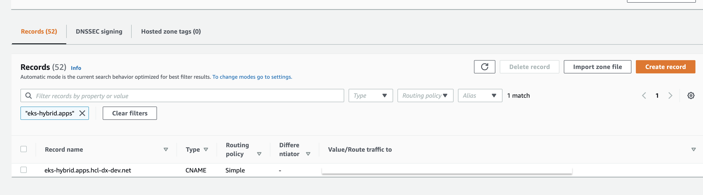

# Install

The following are install commands that are used to deploy or uninstall HCL Digital Experience 9.5 Helm Charts.

## Install command

!!!important
    Modification to any files \(chart.yaml, templates, crds\) in hcl-dx-deployment-vX.X.X\_XXXXXXXX-XXXX.tar.gz, except custom-values.yaml or values.yaml, is not supported.

To run the installation of your prepared configurations using Helm, use the following command:

```
# Helm install command
helm install -n my-namespace -f path/to/your/custom-values.yaml your-release-name path/to/hcl-dx-deployment-vX.X.X_XXXXXXXX-XXXX.tar.gz
```

-   The `my-namespace` is the namespace where your HCL Digital Experience 9.5 deployment is installed to.
-   The `-f path/to/your/custom-values.yaml` must point to the custom-values.yaml you have created, which contains all deployment configuration.
-   `your-release-name` is the Helm release name and prefixes all resources created in that installation, such as Pods, Services, and others.
-   path/to/hcl-dx-deployment-vX.X.X\_XXXXXXXX-XXXX.tar.gz is the HCL Digital Experience 9.5 Helm Chart that you have extracted as described earlier in the planning and preparation steps.

After a successful deployment, Helm responds with the following message:

```
    NAME: dx
    LAST DEPLOYED: Thu Jun 17 14:27:58 2021
    NAMESPACE: my-namespace
    STATUS: deployed
    REVISION: 1
    TEST SUITE: None
```

## Hybrid deployment configuration

If you are installing in a Hybrid deployment<!-- [Hybrid deployment](https://help.hcltechsw.com/digital-experience/9.5/containerization/hybrid_deployment_helm.html)(../../hybrid/hybrid_deployment_helm.md) --> pattern, after successfully running the Helm deployment, you need to configure services in DX Core to be aware of the `external host name` of your hybrid DX environment. To complete these steps, log on to the DX Core Server and run the following Config Engine tasks to enable other DX applications.

In the following examples, replace <host-url\> with your corresponding external host name.

-   Content Composer:

    ```
        <Path to wp_profile>/ConfigEngine/ConfigEngine.sh enable-headless-content 
        -Dstatic.ui.url=https://<host-url>/dx/ui/content-ui/static -DWasPassword=<was-
        password> -DPortalAdminPwd=<admin-password>
    ```

-   Digital Asset Manager:

    ```
        <Path to wp_profile>/ConfigEngine/ConfigEngine.sh enable-media-library 
        -Dstatic.ui.url=https://<host-url>/dx/ui/dam/static -DWasPassword=<was-
        password> -DPortalAdminPwd=<admin-password>
    ```

-   Design Studio \(Beta\):

    ```
        <Path to wp_profile>/ConfigEngine/ConfigEngine.sh enable-content-sites 
        -Dcontentsites.static.ui.url=https://<host-url>/dx/ui/site-manager/static 
        -DWasPassword=<was-password> -DPortalAdminPwd=<admin-password>
    ```


## Default URLs post installation

During the configuration process, you might need the following URLs to access different administration user interfaces.

Use the following default URLs to access HCL Digital Experience \(Portal and WCM\), the WebSphere® Integrated Solutions Console, and the Configuration Wizard:

-   **HCL Digital Experience \(Portal and WCM\)**

    https://yourserver/wps/portal

-   **IBM WebSphere® Integrated Solutions Console**

    https://yourserver/ibm/console

-   **IBM WebSphere® Integrated Solutions Console for Remote Search**

    https://yourserver:9043/ibm/console

-   **HCL Digital Experience Configuration Wizard**

    https://yourserver/hcl/wizard


## \(Optional\) External DNS configuration

After a successful Helm deployment in a hybrid deployment, you can add a load balancer or an external IP to the DNS registry.

-   Run the following command to get a load balancer external IP:

    ```
    kubectl get services -n <your-namespace>
    ```

-   For Amazon EKS, you must add the external IP to route53.

    


## \(Optional\) Automated host extraction

As described in the [Configure networking](preparation/prepare_configure_networking.md) topic, there are instances wherein you do not know the resulting external IP or FQDN for your deployment and the host value is empty. In that case, run a Helm upgrade command, and it automatically polls HAProxy and extracts the IP or FQDN values. The Helm Chart logic then populates all application configurations with the correct settings.

An example is provided below. You may use the following Helm upgrade command to trigger the automated host extraction:

```
# Helm upgrade command
helm upgrade -n my-namespace -f path/to/your/custom-values.yaml your-release-name path/to/hcl-dx-deployment-vX.X.X_XXXXXXXX-XXXX.tar.gz
```

## Additional reference

Step by Step Guide: [How to deploy HCL DX Container Update CF197 and higher to Microsoft Azure Kubernetes Service \(AKS\) using Helm](https://support.hcltechsw.com/csm?id=kb_article&sysparm_article=KB0091344)
