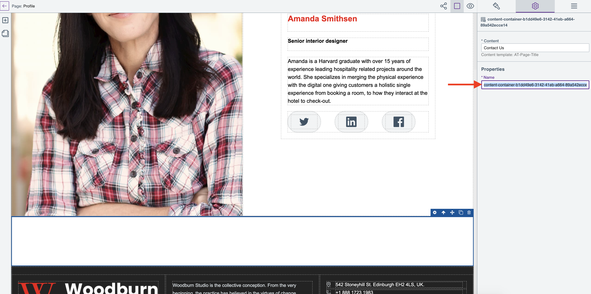

# Use content containers

This section details how you can use content containers on pages created and managed with HCL Design Studio (Beta).

## Rename a content container

In HCL Digital Experience 9.5 CF200, you can rename content containers to make it readable. CSS rules defined in a site's baseline stylesheet applies to all of the pages under the site. This enables authorized users to write the styles externally and still be able to use them with Design Studio (Beta) sites. Neither the stylesheet component nor the CSS file in it cannot be updated using the Design Studio (Beta) Page editor.

CSS rules with class selectors defined in the baseline stylesheet are also applied to elements when such a class is assigned to an element in the page. In case of conflicts, style changes made through the Page editor takes precedence over those defined in the baseline stylesheet.

Follow the steps in renaming a content container:

1.  On the **Sites** overview, select the site or page to open in the Page editor.
2.  From the Page editor, click the plus (+) icon to open the **Add elements** panel.
3.  Drag the WCM content container to the canvas.

    

4.  Set the WCM Content Item reference. In the example below, user types `Contact` to find and select the right Content Item reference for the Content Container.

    

5.  Rename the WCM content container. In the example below, the WCM content container is renamed as `Designer Contact Me`.

     
    

6.  Your changes are automatically saved. To confirm and view the change, you can also click the Settings icon on the **Layers** panel on the top right.

    

## How to present your feedback on HCL Design Studio (Beta)

HCL Digital Experience welcomes your feedback and suggestions on Design Studio (Beta), and encourages you to present your input through cases and discussions with HCL Support DX leaders.
